# Kaypoh Architecture Pivot - 24 May 2026

> Last revised 2026-06-10. Title date refers to the original pivot decision; the body is kept current as items ship.

## Decision

Kaypoh should be treated as a pre-send document safety layer first, not as a raw MNPI classifier. The core workflow is:

1. Extract inline text or text/DOCX/PDF content locally.
2. Detect PII and MNPI evidence with deterministic rules, jurisdiction packs, and optional LLM reasoning.
3. Return review findings, remediation suggestions, and scores.
4. For safe downstream analysis, choose the legally distinct rewrite operation explicitly: `POST /pseudonymize` for reversible placeholders with mapping + `/reidentify`, `POST /anonymize` for irreversible placeholder-only output with no mapping, or `POST /redact` for irreversible opaque markers with no mapping and no entity-type signal.

`POST /review`, `POST /pseudonymize`, `POST /anonymize`, and `POST /redact` are the primary product surfaces. `POST /classify` is retained as a compatibility shim; the legacy `lexicon → embedding → clustering → model1 → model2 → mosaic → regression` pipeline is no longer the product wedge and the team does not invest in further training of that classifier stack. Investment goes into the deterministic engine, LLM-assisted reasoning, and — for accuracy recovery on the LLM tier — targeted distillation and preference-tuning (expansion-sequence items 29–32).

## Dataflow

High-level view of the layers a piece of text flows through, from caller input to response. Each subgraph is a phase; module pointers in the legend below.

```mermaid
flowchart TD
    A[Raw input: text / DOCX / PDF / XLSX / PPTX / EML / image / archive]

    subgraph S1["1. API surface"]
        B[POST /review, /pseudonymize, /anonymize, /redact, /reidentify, /classify]
    end

    subgraph S2["2. Auth and tenant resolution"]
        C[API key / JWT / local-daemon token<br/>tenant_id, roles, reviewer identity]
    end

    subgraph S3["3. Ingest and extraction"]
        D[Format gate and fail-closed checks<br/>magic bytes, encryption, polyglot, zip-bomb]
        E[Container scan<br/>DOCX/PDF/XLSX/PPTX/EML/ZIP/HTML]
        F[Text extraction + metadata findings]
        G[Image OCR<br/>Tesseract / OpenAI / Google / AWS / Azure]
    end

    subgraph S4["4. Session and matter context"]
        H[Session-scoped + matter-scoped defined terms<br/>inheritance across linked docs]
    end

    subgraph S5["5. Deterministic detection engine"]
        I[Universal PII recognizers<br/>NRIC, UEN, email, phone, named-person, DOB, IP, MRN, ...]
        J[Jurisdiction packs<br/>SG / SEA / HK / AU / JP / KR / US / UK / EU / IN / CN / AE / SA]
        K[MNPI lexicons<br/>codename, definitive agreement, MAC, embargo, tipping, Reg FD, ESG, cyber, crypto]
        L[Defined-term suppression<br/>contract self-references]
    end

    subgraph S6["6. Post-passes"]
        M[Severity overrides per doc_type]
        N[Co-occurrence amplifiers<br/>contingent, tipping, insider-list, pseudonymised-linkable]
        O[Quasi-identifier combination<br/>k-anonymity seed]
        P[Entity-relative materiality<br/>SAB99 / ASX GN8 tier ladders]
        Q[Layer-2 conjunctive MNPI<br/>+ blackout-window calendrical check]
    end

    subgraph S7["7. LLM tier — audit_grade only, opt-in"]
        R[Score-band gate<br/>25 ≤ mnpi_score &lt; 70]
        SS[Privacy Guard<br/>raw_text vs structured_tokens]
        T[LLM defined-term extractor]
        U[LLM adjudicator<br/>local / vLLM / Ollama / OpenAI / distilled]
        V[LLM coverage audit<br/>'what did we miss']
    end

    subgraph S8["8. Public-evidence verification"]
        W[Tinyfish / Exa retrieval<br/>source_verification per finding]
    end

    subgraph S9["9. Findings assembly"]
        X[Findings + suggestions + statute citations<br/>per-tenant citation overrides]
        Y[Scores: pii_score, mnpi_score<br/>coverage_warnings, degraded_modes]
    end

    subgraph S10["10. Anonymisation surface"]
        Z[Deterministic placeholder substitution<br/>end-to-start exact-span replacement]
        AA[Pseudonymise: mapping table returned + persisted<br/>+ /reidentify round-trip]
        AB[Anonymise: placeholder-only<br/>no mapping, no persistence]
        AC[Redact: opaque markers<br/>no mapping, no matched-text return]
    end

    subgraph S11["11. Persistence"]
        AD[Mapping store<br/>Fernet-encrypted, per-tenant, doc-hash keyed]
        AE[Subject reverse-index<br/>HMAC for erasure / item 59]
        AF[HMAC-chained journal<br/>review, decision, key-rotation]
    end

    subgraph S12["12. Observability"]
        AG[Privacy ledger]
        AH[SIEM export]
        AI[Latency SLO metrics<br/>p95 budgets per profile]
    end

    AJ[Response to caller<br/>findings + scores + privacy-operation output<br/>+ source_verification + warnings + degraded_modes]

    A --> B --> C --> D --> E --> F
    F --> G --> H --> I
    H --> I & J & K
    I & J & K --> L --> M --> N --> O --> P --> Q
    Q --> R
    R -- "in band" --> SS --> T --> U --> V --> W
    R -- "out of band" --> X
    V --> W --> X
    Q --> X
    X --> Y --> Z
    Z --> AA
    Z --> AB
    Z --> AC
    AA --> AD --> AE
    AA & AB & X --> AF
    AF --> AG --> AH --> AI --> AJ
```

Module pointers (1→12): `backend/main.py` for the API surface and auth wiring (1–2); `review/container_scan.py` + `review/document.py` + `review/image_scan.py` for ingest/extraction (3); `review/session_store.py` + `review/matter_store.py` for session/matter context (4); `review/engine.py` for the deterministic engine and post-passes (5–6); `workflow/layer8_llm_adjudicator/` + `workflow/privacy_guard.py` + `review/llm_defined_terms.py` + `review/llm_coverage_audit.py` for the LLM tier (7); `workflow/layer7_public_evidence/` for source verification (8); `review/citations.py` for findings assembly (9); `anonymize/engine.py` + `anonymize/mapping_store.py` for the anonymisation surface (10); `anonymize/mapping_store.py` + `review/subject_index.py` + `review/journal.py` for persistence (11); `backend/observability.py` + `backend/siem.py` for the observability tier (12).

## Positioning and ICP

Kaypoh is a *narrow, defensible* pre-send safety layer for legal-corporate workflows where client/issuer confidentiality is a procurement blocker for GenAI adoption. It is **not** a horizontal DLP replacement. Microsoft Purview, Google Sensitive Data Protection, Netskope, and Nightfall already compete on detector breadth + infrastructure coverage; matching them is a multi-year investment with no defensible wedge. Kaypoh wins where those tools are weakest: SG/SEA-native local-ID + legal-MNPI detection, explicit pseudonymize / anonymize / redact rewrite operations, an HMAC-sealed reviewer-attributed audit trail, and an offline-default desktop SKU that survives an air-gapped review-board demo.

Initial ICP (priority-ordered):

- Singapore / SEA law firms experimenting with GenAI but blocked by client-confidentiality duty under PDPA + Legal Profession Act.
- Listed-company in-house legal and corporate-secretarial teams subject to SGX / Bursa / IDX / SET / PSE / HOSE continuous-disclosure rules.
- M&A, capital-markets, and PE deal teams pre-announcement.
- Investor-relations functions managing embargo windows.
- Corporate legal departments where ABA Formal Opinion 512 (or non-US equivalents) is being cited as a GenAI-adoption blocker.

The reviewer persona at the other end of the audit trail is **dual**, not single. Two design-target reviewers coexist across the ICP:

- **Low-volume / high-sophistication.** In-house counsel, M&A / capital-markets deal-team partners, corporate-secretarial leads, IR heads. Volume ~tens of documents per day. Capable of consuming "evidence not determination" framing (the anti-positioning bullet below) and exercising legal judgement on contingent / probabilistic / public-status findings.
- **High-volume / compliance-queue.** Paralegal-staffed review queues at large in-house functions, DPO offices triaging DSARs, compliance teams running pre-clearance gates. Volume ~hundreds to thousands of documents per day. Cannot be assumed to exercise the same legal judgement on every finding; depends on the surfacing lane to route only the findings their sophistication / time budget supports.

The product serves both via the per-tenant surfacing lane (item 123); the lane is the configured routing primitive, never a detection-suppression primitive (see § Target Runtime → Detection / Surfacing / Audit separation). The "evidence not determination" framing remains the architectural truth, but the lane must not assume a sophistication level that a given tenant's reviewer population does not have.

Anti-positioning (claims kaypoh deliberately does **not** make):

- *Not* a general DLP. Endpoint coverage, network egress control, file-share scanning, SaaS posture management are out of scope.
- *Not* a legally conclusive MNPI classifier. Reg FD / MAR / SFA materiality is contextual; kaypoh surfaces *evidence* of MNPI for human review, not a regulatory determination.
- *Not* a public-status oracle. Public-status verification requires `audit_grade` + a configured public-evidence provider + sufficient entity context.
- *Not* a substitute for legal review. Reviewer attribution + maker-checker controls are scaffolding for human judgement, not a replacement for it.

### Why now / demand signals

The market timing is not "AI is popular"; it is that unsanctioned GenAI use has become a measurable data-loss vector while regulators are moving from principles into supervisory expectations. Evidence to keep current before external use:

- LayerX's 2025 GenAI reporting says organisations lacked visibility into 89% of enterprise GenAI usage, while its later Enterprise AI and SaaS Data Security Report says 77% of GenAI users pasted data into tools and about 40% of file uploads to GenAI sites contained PII/PCI. Sources: [LayerX Enterprise GenAI Security Report 2025](https://layerxsecurity.com/blog/layerxs-enterprise-genai-security-report-2025-exposing-hidden-ai-security-blind-spots/) and [LayerX Enterprise AI and SaaS Data Security Report 2025](https://go.layerxsecurity.com/hubfs/LayerX_Enterprise_AI_and_SaaS_Data_Security_Report.pdf).
- Cyberhaven's 2025 AI Adoption and Risk Report put sensitive data at 34.8% of enterprise data shared with AI tools, up from 10.7% two years earlier. Source: [Cyberhaven 2025 AI Adoption and Risk Report](https://www.cyberhaven.com/resources/lp-eb-ai-adoption-risk-report-2025).
- Netskope's 2026 Cloud and Threat Report says GenAI data-policy violations doubled year over year, with the average organisation seeing 223 incidents per month. Source: [Netskope Cloud and Threat Report 2026](https://www.netskope.com/resources/cloud-and-threat-reports/cloud-and-threat-report-2026).
- Gartner predicted in February 2025 that by 2027 more than 40% of AI-related data breaches would be caused by improper cross-border GenAI use. Source: [Gartner press release, 17 Feb 2025](https://www.gartner.com/en/newsroom/press-releases/2025-02-17-gartner-predicts-forty-percent-of-ai-data-breaches-will-arise-from-cross-border-genai-misuse-by-2027).
- Regulator posture is tightening in kaypoh's target jurisdictions: IMDA / AI Verify finalised the Model AI Governance Framework for Generative AI on 30 May 2024; OAIC guidance from 21 Oct 2024 recommends not entering personal information, especially sensitive information, into publicly available GenAI tools; APRA's 30 Apr 2026 AI letter calls for stronger AI risk management across regulated entities; MAS issued a Nov 2025 consultation on AI Risk Management Guidelines for financial institutions. Sources: [IMDA / AI Verify](https://www.imda.gov.sg/resources/press-releases-factsheets-and-speeches/factsheets/2024/gen-ai-and-digital-foss-ai-governance-playbook), [OAIC commercial AI guidance](https://www.oaic.gov.au/privacy/privacy-guidance-for-organisations-and-government-agencies/guidance-on-privacy-and-the-use-of-commercially-available-ai-products), [APRA AI letter](https://www.apra.gov.au/apra-letter-to-industry-on-artificial-intelligence-ai), [Baker McKenzie summary of MAS consultation](https://insightplus.bakermckenzie.com/bm/financial-services-regulatory/singapore-mas-publishes-consultation-paper-on-proposed-guidelines-on-ai-risk-management-for-financial-institutions).

## Accuracy-First Shape

The detection engine is layered (full framing under § First-Principles Statutory Analysis → three-layer detection model). Layer 1 is identifier / marker extraction — what today's deterministic engine catches. Layer 2 is deterministic relational / contextual evaluation (item 119) — the conjunctive MNPI post-pass (item 120) and the singling-out / linkability layer (items 70 / 121 / 122), both inside the `strict` profile. Layer 3 is LLM as capped recall-raiser (item 54), tagged `origin=llm`, severity-clamped so it cannot displace deterministic-high findings. Identifier and marker detection (below) are *inputs* to the statutory test; Layer 2 is where the test is evaluated; Layer 3 raises recall further at capped severity. The product surface for re-writing text exposes three legally-distinct operations — **pseudonymisation** (reversible, mapping persisted), **anonymisation** (irreversible, no mapping, deterministic placeholders), and **redaction** (irreversible, no mapping, opaque markers that hide entity-type) — see § Target Runtime and items 116–118, 127.

PII is the first product wedge because it is span-local and more measurable than MNPI. The system optimises recall before automation convenience. The legal PII test (GDPR Recital 26 / UK GDPR identical wording; PDPA SG s2 "or is likely to have access"; A29WP Opinion 05/2014 enumerating singling-out, linkability, inference) turns on identifiability by *means reasonably likely to be used*, not on the presence of an identifier token. Identifier detection (Layer 1) is necessary but insufficient: a document with no identifier tokens can still single an individual out via a quasi-identifier combination (Sweeney 2000: DOB + 5-digit ZIP + gender uniquely identifies ~87% of US adults). The singling-out / linkability / inference layer (Layer 2, items 70 / 121 / 122) operationalises that test deterministically against population-prior frequency tables; the original item-101 structural ≥3-rule proxy now remains as an `audit_grade` fallback when no validated frequency table is available.

Layer 1 PII surface as shipped:

- SG-first recognizers for NRIC/FIN, UEN (ACRA), passport-like identifiers, postal-address signals, phone, email, named-person markers, and bank/account references.
- Legal-contract defined-term suppression so tokens like `Purchaser`, `Vendor`, `Schedule 1`, and `the Company` do not false-positive as named persons. The suppression list is parsed from the contract's own defined-terms block per document. Defined-term inheritance across linked documents within a review session is wired: pass `session_id` to `/review`, `/pseudonymize`, `/anonymize`, or `/redact` and the SPA's `the "Purchaser"` definition is automatically inherited by a paired disclosure schedule reviewed in the same session.
- Fuzzy entity linking so `ACME Pte. Ltd.`, `Acme`, and `the Company` resolve to the same anonymisation key within a document, and `Dr Jane Tan` / `Jane Tan` / `Tan` collapse to one `[PERSON_1]`.
- Deterministic placeholders such as `[PERSON_1]`, `[NRIC_FIN_1]`, and `[EMAIL_1]`.
- Exact-span replacement from end to start so offsets remain stable.
- Local mapping table returned only under the reversible pseudonymisation surface (`POST /pseudonymize`), with a first-class `POST /reidentify` and optional persistent per-document mapping store keyed by SHA-256 of the extracted text. `POST /anonymize` is now irreversible placeholder-only output: no mapping in the response, no mapping-store write, no subject-index write, and `/reidentify` returns 404 for that document hash. `POST /redact` is irreversible and type-hiding: no mapping, no original matched text in the response, no re-identification material persisted, and sensitive spans replaced with opaque markers (`█████` or `[REDACTED]`). The three operations correspond to legally distinct data-states: pseudonymous (still personal data of the controller holding the mapping), placeholder-anonymous (kaypoh-side anonymous but type-revealing), and redacted (kaypoh-side anonymous with type-hiding suppression).
- Human-review fields preserved through `findings`, `suggestions`, scores, and offsets.
- Per-document-type severity overrides: `named_person` is `low` in casual prose but `high` for counterparty principals in a definitive agreement. The same per-doc-type lens applies to MNPI rules — a `transaction_codename` is `medium` in casual prose, `high` in an external memo or research note.

MNPI is reviewed differently because materiality and public status are contextual. Broad MNPI passages are flagged and scored, not automatically rewritten. Kaypoh anonymises exact MNPI scalars (monetary amounts, percentages) while keeping material-event passages as review findings.

MNPI is legally defined as **materiality ∧ non-public** — *Basic v. Levinson* "substantial likelihood + reasonable shareholder" + magnitude × probability for contingent events; SFA s215 + MAR Art 7 + SFO Part XIV "not generally known" parallel constructions. Layer 1's lexicon detects substrate (`material_event`, `nonpublic_marker`, `transaction_codename`, …) and sums lexical proxies into `mnpi_score`; that is not a conjunctive scorer. The acknowledged score-0 hole (implied materiality + named target + quiet-period reference) scores zero because materiality was implied, not lexicalised. The Layer-2 conjunctive post-pass (item 120) emits a `conjunctive_mnpi` finding when three elements co-occur in the same document: a **materiality element**, a **non-public element**, and an **entity element**. The materiality element carries a state ∈ `{lexicalised, quantitative, implied, undetermined}`:

- `lexicalised` — `material_event` / `material_adverse_change` / `transaction_codename` fires directly.
- `quantitative` — `financial_amount` or `financial_percentage` fires AND `EntitySizeLookup` resolves AND the SAB 99 / GN8 ladder (item 73) escalates severity.
- `implied` — contingent / forward-looking / tipping language (items 95–97 family) fires under a co-occurrence amplifier.
- `undetermined` — none of the above fires but non-public + entity elements are present. **This is the expected production state in most real pilots**: `EntitySizeLookup` is operator-injected and usually not configured (no Bloomberg / Refinitiv / SGX feed), so quantitative materiality degrades to `materiality_lookup_not_configured`; implied materiality is the residual category. In `strict`, item 120 still emits a medium review-required finding with `materiality_state="undetermined"`. Any qualitative LLM materiality read stays behind the existing `audit_grade` / LLM-adjudication wiring and is not invoked in no-cost runs.

The non-public element is derived deterministically as a first-class boolean from `(nonpublic_marker fires in doc) ∨ (source_verification ≠ public_source_matched on any MNPI substrate finding)`. Both signals are available today; item 120 exposes the boolean as a finding field rather than leaving it derivable-but-unexposed. The entity element is satisfied by any direct identifier finding (named_person + counterparty / issuer context) or by a registered issuer code (`sg_sgx_counter`, ticker references).

Legal-contract MNPI surface is distinct from finance-comms MNPI and is detected separately:

- `transaction_codename` — `Project <CapitalizedName>` patterns, the canonical "before announcement" tell in deal memos. Intra-line regex so a stray newline does not pull adjacent paragraphs into the matched_text.
- `definitive_agreement` — Share Purchase Agreement / SPA / Shareholders Agreement / SHA / APA / MOU / LOI / Term Sheet. Existence of a binding deal document is itself MNPI pre-announcement.
- `material_adverse_change` — MAC clauses, MAE, "material adverse change". Price-sensitive.
- `embargo_marker` — Signing Date / Closing Date / Effective Date / Embargoed / Press Hold.

Defined-term suppression extends to MNPI for abbreviation-style rules (`definitive_agreement`, `material_adverse_change`) so a contract abbreviating itself as `"SPA"` or `"MAC"` does not trip its own meta-reference. `transaction_codename` and `embargo_marker` are not suppressed because the defined term is the substantive risk.

SG legal/finance coverage should keep expanding in the wedge direction, not into generic DLP breadth. Shipped slices now cover court citations, PayNow identifiers, MAS licence numbers, SGX stock codes, IPOS trade-mark numbers, ACRA/Bizfile transaction numbers, HDB matter references, SLA lot/title-plan references, URA planning references, insurance policy numbers, labelled crypto wallet references, non-SAL tribunal references, and contract-commercial terms such as unit pricing, discounts, volume commitments, royalty rates, and total contract value. The 2026-06-09 no-key fixture follow-up added hand-authored real-world/adversarial address, relation, and HK/AU/JP/KR MNPI phrase coverage; the 2026-06-10 fixture follow-up added another SG wedge default/adversarial fixture pair and HK/AU/JP/KR MNPI phrase variants. Deeper real-world SG wedge fixture growth remains backlog before broadening beyond labelled or anchored forms. These are first-class because they appear in the documents the ICP actually wants to send into LLMs.

### Evaluation corpus posture

Synthetic data is a first-class artefact. `test/fixtures/legal-corpus/` is the default legal-contract corpus (147 fixtures as of 2026-06-10). `test/fixtures/legal-corpus-adversarial/` is the obfuscated / negative-prose / multilingual corpus (134 fixtures). `test/fixtures/legal-corpus-sea/` and `test/fixtures/legal-corpus-hk-au-jp-kr/` are seed jurisdiction corpora for MY / ID / TH / PH / VN and HK / AU / JP / KR respectively. `docs/accuracy.md` is generated from the committed lock files and is the public accuracy disclosure.

Adversarial and multilingual coverage matter because SG contracts mix English with Mandarin, Bahasa Melayu, and Tamil names, and PDF inputs come with OCR ligature artefacts and broken DOCX runs. The generation tooling at `scripts/generate_legal_fixture.py`, `scripts/generate_legal_fixture_batch.py`, `scripts/autolabel_fixture.py`, and `scripts/autolabel_batch.py` wraps OpenAI-compatible or Azure OpenAI APIs for build-time synthetic inputs only. Candidate labels now carry two tiers: `must_detect` is detector-aligned strict-mode benchmark truth, while `ideal_must_detect` preserves broader statutory/legal relevance for gap discovery. Hand spot-checking remains mandatory before any model-derived label baseline is treated as procurement-grade.

The HK / AU / JP / KR seed corpus is **one fixture per jurisdiction** as of 2026-05-26 (4 fixtures total); recall/precision at 1.0 is trivially achievable at that volume and should not be read as population-level coverage. SEA seed corpus is similarly one fixture per jurisdiction (5 fixtures total). The 2026-06-08 item 86 follow-up added hand-authored HK/AU/JP/KR MNPI variants to the default/adversarial corpora, but the dedicated jurisdiction corpus remains seed-scale. Item 90/91 discipline grows each toward the 30-doc-per-jurisdiction target before the coverage claim hardens.

Candidate corpus growth now runs through the quarantined `test/fixtures/legal-corpus-candidates/` path rather than directly into the locked corpora. The generator and auto-labeler use independent prompts over the statutory taxonomy in `scripts/fixture_taxonomy.py`; generated labels remain `_human_review_status: "pending"` and cannot promote into recall locks until human spot-check / promotion records exist. Staged Azure-mini runs are the operating plan:

- **Stage A — jurisdiction scout:** 21 candidates per jurisdiction = 7 statutory concepts × `memo` × 3 variants (`default`, `adversarial`, `negative`) × count 1. Purpose: provider sanity, label quality, detector-gap shape, and early cost/latency read.
- **Stage B — jurisdiction coverage:** 84 candidates per jurisdiction = 7 statutory concepts × 4 default document types (`memo`, `term_sheet`, `privacy_notice`, `incident_report`) × 3 variants × count 1. Purpose: broad jurisdiction coverage before any procurement-grade claim.
- **Stage C — saturation:** 252 candidates per jurisdiction total = Stage B matrix × count 3; 4,284 candidates globally across all 17 in-scope jurisdiction packs. Purpose: stable benchmark depth, not immediate lock promotion.

Stage advancement heuristic: finish each jurisdiction's Stage A loop before expanding that same jurisdiction to Stage B. A Stage A loop means generate, auto-label, evaluate, inspect strict-label misses/unexpected findings, move demonstrably bad strict labels into `must_not_detect` or `ideal_must_detect`, add narrow detector fixes only for evidence-backed gaps, rerun the candidate gate, and record owner/legal-review provenance. If strict recall and precision are both 1.0 with zero missed, zero unexpected, and zero must-not violations, move to the next priority jurisdiction rather than over-optimising that jurisdiction. `ideal_must_detect` misses are backlog signals, not Stage A blockers, unless they expose a commercially important detector hole for the ICP. Project-owner approval based on Codex/GPT-assisted review may mark a candidate set as usable for internal benchmarking, but it must not be described as external legal advice or procurement-grade human review.

Progress is tracked here until the candidate corpus has its own generated report. Status values: `next`, `pending`, `ready`, `running`, `generated`, `labeled`, `evaluated`, `reviewed`, `promoted`, or `blocked`.

Stage B readiness checkpoint as of 2026-06-01: all 17 in-scope jurisdiction packs have reviewed Stage A candidate sets under `test/fixtures/legal-corpus-candidates/`, and the project owner has manually reviewed the generated tests across jurisdictions and marked all 357 labels as `stage_b_ready` via `_stage_readiness`. `scripts/check_candidate_review_status.py --require-stage-b-ready` gates this marker. The global candidate report `/tmp/kaypoh-candidates-after-eu-reviewed.json` covers 357 docs and 4,295 strict labels with strict recall 1.0, strict precision 1.0, zero missed labels, zero unexpected findings, and zero must-not violations. The aggregate ideal-tier recall is 0.401, so the candidate corpus is useful for internal benchmarking and roadmap gap discovery, but it is not a procurement-grade legal opinion and none of the candidate sets has been promoted into locked recall baselines.

SG Stage B first pass as of 2026-06-01: SG was expanded to 84 candidate docs across the full Stage B matrix and auto-labeled with the Azure-mini path. Codex/GPT strict reconciliation aligned the strict tier to deterministic review findings while preserving broader labels in `ideal_must_detect`; the SG Stage B report `/tmp/kaypoh-sg-stage-b-approved.json` covers 1,177 strict labels at strict recall 1.0 and strict precision 1.0, with zero misses, zero unexpected findings, and zero must-not violations. SG ideal-tier recall is 0.4958. The expanded SG labels are now project-owner approved for internal benchmarking (`84 approved`, `0 pending`) and pass `scripts/check_candidate_stage_gate.py --target-stage stage_b --require-promotion-ready`; this is still not legal advice, procurement-grade legal review, or recall-lock promotion. The post-SG global report `/tmp/kaypoh-candidates-after-sg-stage-b-approved.json` covers 420 docs and 5,155 strict labels globally at strict recall 1.0 / precision 1.0; aggregate ideal-tier recall is 0.4165.

HK Stage B first pass as of 2026-06-02: HK was expanded to 84 candidate docs across the full Stage B matrix and auto-labeled with the Azure-mini path. Codex/GPT strict reconciliation aligned the strict tier to deterministic review findings while preserving broader labels in `ideal_must_detect`; the HK Stage B report `/tmp/kaypoh-hk-stage-b-eval-reconciled.json` covers 1,047 strict labels at strict recall 1.0 and strict precision 1.0, with zero misses, zero unexpected findings, and zero must-not violations. HK ideal-tier recall is 0.4495. HK Stage B is now project-owner approved for internal benchmarking (`84 approved`, `0 pending`) and passes `scripts/check_candidate_stage_gate.py --target-stage stage_b --require-promotion-ready`; this is not legal advice, procurement-grade legal review, or recall-lock promotion. Narrow precision fixes from this pass covered HK public enquiry hotlines, negated data-subject request receipt, generic MNPI category mentions, SPA/MAC clause disclaimers, and negated material-adverse-change inference. The post-HK global report `/tmp/kaypoh-candidates-after-hk-stage-b-reconciled.json` covers 483 docs and 5,914 strict labels globally at strict recall 1.0 / precision 1.0; aggregate ideal-tier recall is 0.4204.

AU Stage B first pass as of 2026-06-02: AU was expanded to 84 candidate docs across the full Stage B matrix and auto-labeled with the Azure-mini path. Codex/GPT strict reconciliation aligned the 63 expanded pending labels to deterministic review findings while preserving broader labels in `ideal_must_detect`; the AU Stage B report `/tmp/kaypoh-au-stage-b-eval-reconciled.json` initially covered 1,045 strict labels at strict recall 1.0 and strict precision 1.0, with zero misses, zero unexpected findings, zero must-not violations, and zero remaining auto-label QA warnings. After the MY negative-disclaimer precision guard, one AU negative privacy-notice span moved from strict `must_detect` to `must_not_detect`; current AU strict coverage is 1,044 labels with ideal-tier recall 0.4483. AU Stage B is now project-owner approved for internal benchmarking (`84 approved`, `0 pending`) and passes `scripts/check_candidate_stage_gate.py --target-stage stage_b --require-promotion-ready`; this is still not legal advice, procurement-grade legal review, or recall-lock promotion. Narrow precision fixes from this pass covered template email aliases, `servicedesk` / `hr-notify` role mailboxes, quoted MNPI definitions, generic MNPI / insider-list policy wording, negated material-adverse-change language, and non-binding definitive-agreement bait. The post-AU global report `/tmp/kaypoh-candidates-after-au-stage-b-reconciled.json` covers 546 docs and 6,687 strict labels globally at strict recall 1.0 / precision 1.0; aggregate ideal-tier recall is 0.4245.

MY Stage B first pass as of 2026-06-02: MY was expanded to 84 candidate docs across the full Stage B matrix and auto-labeled with the Azure-mini path. Codex/GPT strict reconciliation aligned the 63 expanded pending labels to deterministic review findings while preserving broader labels in `ideal_must_detect`; the MY Stage B report `/tmp/kaypoh-my-stage-b-eval-reconciled.json` covers 959 strict labels at strict recall 1.0 and strict precision 1.0, with zero misses, zero unexpected findings, zero must-not violations, and zero remaining auto-label QA warnings. MY ideal-tier recall is 0.4214. MY Stage B is now project-owner approved for internal benchmarking (`84 approved`, `0 pending`) and passes `scripts/check_candidate_stage_gate.py --target-stage stage_b --require-promotion-ready`; this is still not legal advice, procurement-grade legal review, or recall-lock promotion. Narrow precision fixes from this pass covered negative disclaimers such as `contains no ... material non-public information`, `does not contain material non-public information`, and `does not specify ... insider lists`; the same guard required one AU negative privacy-notice strict label to be moved to `must_not_detect`. The post-MY global report `/tmp/kaypoh-candidates-after-my-stage-b-reconciled.json` covers 609 docs and 7,395 strict labels globally at strict recall 1.0 / precision 1.0; aggregate ideal-tier recall is 0.4249.

ID Stage B first pass as of 2026-06-03: ID was expanded to 84 candidate docs across the full Stage B matrix and auto-labeled with the Azure-mini path. Codex/GPT strict reconciliation aligned the 63 expanded pending labels to deterministic review findings while preserving broader labels in `ideal_must_detect`; the ID Stage B report `/tmp/kaypoh-id-stage-b-eval-reconciled.json` covers 680 strict labels at strict recall 1.0 and strict precision 1.0, with zero misses, zero unexpected findings, zero must-not violations, and zero remaining auto-label QA warnings. ID ideal-tier recall is 0.3417. After project-owner manual review on 2026-06-03, ID Stage B passes `scripts/check_candidate_stage_gate.py --target-stage stage_b --require-promotion-ready` for internal benchmarking (`84 approved`, `0 pending`). Narrow precision fixes from this pass covered Indonesian definition-training insider-list / information-barrier bait and generic public-channel `info@...` mailbox bait while preserving real transaction legal-contact mailboxes. This is not legal advice, procurement-grade legal review, or recall-lock promotion.

TH Stage B first pass as of 2026-06-03: TH was expanded to 84 candidate docs across the full Stage B matrix and auto-labeled with the Azure-mini path. Codex/GPT strict reconciliation aligned the 63 expanded pending labels to deterministic review findings while preserving broader labels in `ideal_must_detect`; the TH Stage B report `/tmp/kaypoh-th-stage-b-eval-reconciled.json` covers 1,060 strict labels at strict recall 1.0 and strict precision 1.0, with zero misses, zero unexpected findings, zero must-not violations, and zero remaining auto-label QA warnings. TH ideal-tier recall is 0.4659. After project-owner manual review on 2026-06-03, TH Stage B passes `scripts/check_candidate_stage_gate.py --target-stage stage_b --require-promotion-ready` for internal benchmarking (`84 approved`, `0 pending`). Narrow precision fixes from this pass covered e-learning / generic compliance insider-list and information-barrier bait plus negated definitive-agreement wording. The post-ID/TH global report `/tmp/kaypoh-candidates-after-id-th-stage-b-reconciled.json` covers 735 docs and 8,729 strict labels globally at strict recall 1.0 / precision 1.0; aggregate ideal-tier recall is 0.4235. This is not legal advice, procurement-grade legal review, or recall-lock promotion.

PH Stage B first pass as of 2026-06-03: PH was expanded to 84 candidate docs across the full Stage B matrix and auto-labeled with the Azure-mini path. Codex/GPT strict reconciliation aligned the 63 expanded pending labels to deterministic review findings while preserving broader labels in `ideal_must_detect`; the PH Stage B report `/tmp/kaypoh-ph-stage-b-eval-reconciled.json` covers 1,015 strict labels at strict recall 1.0 and strict precision 1.0, with zero misses, zero unexpected findings, zero must-not violations, and zero remaining auto-label QA warnings. PH ideal-tier recall is 0.4369. After project-owner manual review on 2026-06-03, PH Stage B passes `scripts/check_candidate_stage_gate.py --target-stage stage_b --require-promotion-ready` for internal benchmarking (`84 approved`, `0 pending`). This is not legal advice, procurement-grade legal review, or recall-lock promotion.

VN Stage B first pass as of 2026-06-03: VN was expanded to 84 candidate docs across the full Stage B matrix and auto-labeled with the Azure-mini path. Codex/GPT strict reconciliation aligned the 63 expanded pending labels to deterministic review findings while preserving broader labels in `ideal_must_detect`; the VN Stage B report `/tmp/kaypoh-vn-stage-b-eval-reconciled.json` covers 926 strict labels at strict recall 1.0 and strict precision 1.0, with zero misses, zero unexpected findings, zero must-not violations, and zero remaining auto-label QA warnings. VN ideal-tier recall is 0.4171. After project-owner manual review on 2026-06-03, VN Stage B passes `scripts/check_candidate_stage_gate.py --target-stage stage_b --require-promotion-ready` for internal benchmarking (`84 approved`, `0 pending`). The post-PH/VN global report `/tmp/kaypoh-candidates-after-ph-vn-stage-b-reconciled.json` covers 861 docs and 10,200 strict labels globally at strict recall 1.0 / precision 1.0; aggregate ideal-tier recall is 0.4256. This is not legal advice, procurement-grade legal review, or recall-lock promotion.

JP/KR Stage B first pass as of 2026-06-04: JP and KR were expanded to 84 candidate docs each across the full Stage B matrix and auto-labeled with the Azure-mini path. Codex/GPT strict reconciliation aligned the 126 expanded pending labels to deterministic review findings while preserving broader labels in `ideal_must_detect`; JP report `/tmp/kaypoh-jp-stage-b-approved.json` covers 1,182 strict labels with ideal-tier recall 0.4436, and KR report `/tmp/kaypoh-kr-stage-b-approved.json` covers 1,078 strict labels with ideal-tier recall 0.4107. Both have strict recall 1.0, strict precision 1.0, zero misses, zero unexpected findings, zero must-not violations, and zero active auto-label QA warnings. After project-owner manual review on 2026-06-04, both pass `scripts/check_candidate_stage_gate.py --target-stage stage_b --require-promotion-ready` for internal benchmarking (`84 approved`, `0 pending` per jurisdiction). The post-JP/KR global report `/tmp/kaypoh-candidates-after-jp-kr-stage-b-approved.json` covers 987 docs and 11,936 strict labels globally at strict recall 1.0 / precision 1.0; aggregate ideal-tier recall is 0.4264. This is not legal advice, procurement-grade legal review, or recall-lock promotion.

IN Stage B first pass as of 2026-06-04: IN was expanded to 84 candidate docs across the full Stage B matrix and auto-labeled with the Azure-mini path. Codex/GPT strict reconciliation aligned the 63 expanded labels to deterministic review findings while preserving broader labels in `ideal_must_detect`; the IN Stage B report `/tmp/kaypoh-in-stage-b-eval-final.json` covers 977 strict labels at strict recall 1.0 and strict precision 1.0, with zero misses, zero unexpected findings, and zero must-not violations. IN ideal-tier recall is 0.3493. After project-owner manual review on 2026-06-04, IN Stage B passes `scripts/check_candidate_stage_gate.py --target-stage stage_b --require-promotion-ready` for internal benchmarking (`84 approved`, `0 pending`). Narrow precision fixes from this pass covered India CIN/date/reference/account fragments and DSAR-hotline phone bait, plus negated MAC/MAE wording such as `does not include any MAC-like clause` and `MAC clause ... does not by itself signal a material adverse change`. The current post-IN global report `/tmp/kaypoh-in-stage-b-eval-final.json` covers 1,050 docs and 12,672 strict labels globally at strict recall 1.0 / precision 1.0; aggregate ideal-tier recall is 0.4210, with 1,050 approved labels and zero pending labels. This is not legal advice, procurement-grade legal review, or recall-lock promotion.

CN/AE Stage B first pass as of 2026-06-05: CN and AE were expanded to 84 candidate docs each across the full Stage B matrix and auto-labeled with the Azure-mini path. Codex/GPT strict reconciliation aligned the 126 expanded labels to deterministic review findings while preserving broader labels in `ideal_must_detect`; the shared CN/AE report `/tmp/kaypoh-cn-ae-stage-b-eval-clean.json` covers CN at 1,198 strict labels with ideal-tier recall 0.4017 and AE at 1,158 strict labels with ideal-tier recall 0.4450. Both jurisdictions have strict recall 1.0, strict precision 1.0, zero misses, zero unexpected findings, and zero must-not violations. After project-owner manual review on 2026-06-05, both pass `scripts/check_candidate_stage_gate.py --target-stage stage_b --require-promotion-ready` for internal benchmarking (`84 approved`, `0 pending` per jurisdiction). Narrow precision fixes from this pass covered AE/CN service-line and form-label phone bait, placeholder/public-service mailboxes, educational insider-list/webinar bait, negated material-adverse-change and genetic-data wording, benign `not a term sheet` / `does not modify any definitive agreement` wording, and lowercase wellness `spa` bait. The same guard changes required an eight-fixture post-fix label realignment across AU/JP/KR/SG/VN where existing strict labels had become stale false-positive bait. The current post-CN/AE global report `/tmp/kaypoh-cn-ae-stage-b-eval-clean.json` covers 1,176 docs and 14,501 strict labels globally at strict recall 1.0 / precision 1.0; aggregate ideal-tier recall is 0.4216, with 1,176 approved labels and zero pending labels. This is not legal advice, procurement-grade legal review, or recall-lock promotion.

SA/US Stage B first pass as of 2026-06-05: SA and US were expanded to 84 candidate docs each across the full Stage B matrix and auto-labeled with the Azure-mini path. Codex/GPT strict reconciliation aligned the 126 expanded labels to deterministic review findings while preserving broader labels in `ideal_must_detect`; the shared SA/US report `/tmp/kaypoh-sa-us-stage-b-approved.json` covers SA at 994 strict labels with ideal-tier recall 0.4097 and US at 1,033 strict labels with ideal-tier recall 0.4422. Both jurisdictions have strict recall 1.0, strict precision 1.0, zero misses, zero unexpected findings, zero must-not violations, and no active SA/US auto-label QA warnings after warning queues were superseded by strict-tier reconciliation. After project-owner manual review on 2026-06-05, both pass `scripts/check_candidate_stage_gate.py --target-stage stage_b --require-promotion-ready` for internal benchmarking (`84 approved`, `0 pending` per jurisdiction). Narrow precision fixes from this pass covered Saudi public regulator/call-centre helpline bait, Unicode-hyphen role-only legal mailboxes, closed `no open DSARs` wording, generic/public-stale transaction codenames such as `Project Code`, self-defined curly-apostrophe `Shareholders’ Agreement (SHA)` abbreviations, and US/SA generic MNPI training/materials wording. The same guard changes required a ten-fixture post-fix strict-label realignment across AE/AU/CN/HK/ID/IN/MY/VN where older strict labels had become stale false-positive bait. The post-SA/US global report `/tmp/kaypoh-sa-us-stage-b-approved.json` covered 1,302 docs and 16,022 strict labels globally at strict recall 1.0 / precision 1.0; aggregate ideal-tier recall was 0.4223, with 1,302 approved labels and zero pending labels. This is not legal advice, procurement-grade legal review, or recall-lock promotion.

UK/EU Stage B first pass as of 2026-06-06: UK and EU were expanded to 84 candidate docs each across the full Stage B matrix and auto-labeled with the Azure-mini path. Codex/GPT strict reconciliation aligned the strict tier to deterministic review findings while preserving broader labels in `ideal_must_detect`; the final shared report `/tmp/kaypoh-uk-eu-stage-b-final.json` covers UK at 1,050 strict labels with ideal-tier recall 0.4553 and EU at 1,045 strict labels with ideal-tier recall 0.4074. Both jurisdictions have strict recall 1.0, strict precision 1.0, zero misses, zero unexpected findings, and zero must-not violations. After project-owner manual review on 2026-06-06, both pass `scripts/check_candidate_stage_gate.py --target-stage stage_b --require-promotion-ready` for internal benchmarking (`84 approved`, `0 pending` per jurisdiction). Narrow precision fixes from this pass covered EU public UIFN hotline bait, generic placeholder email (`name@example.com`), UK functional/project/role mailboxes, closed or negated DSAR/erasure/consent-withdrawal contexts, non-attributive DOB/device-serial examples, negated genetic-data processing, negated MAC/MAE wording, and educational insider-list references. The same guard changes required a fourteen-fixture post-fix strict-label realignment across AE/AU/CN/HK/IN/JP/KR/MY/PH/SG/US where older strict labels had become stale false-positive bait. The current global report `/tmp/kaypoh-uk-eu-stage-b-final.json` covers 1,428 docs and 17,552 strict labels globally at strict recall 1.0 / precision 1.0; aggregate ideal-tier recall is 0.4234, with 1,428 approved labels and zero pending labels. This is not legal advice, procurement-grade legal review, or recall-lock promotion.

Stage B candidate recall-lock promotion shipped 2026-06-09: `scripts/reconcile_candidate_strict_labels.py` reconciled all 1,428 owner-approved candidate labels against current strict runtime output, promoting 2,535 strict runtime findings into `must_detect` and moving 24 stale strict labels into `ideal_must_detect` with provenance. `scripts/evaluate_candidate_corpus.py --update-lock --require-human-reviewed --reason "candidate human-reviewed Stage B strict runtime baseline reconciliation"` wrote `test/fixtures/legal-corpus-candidates/candidate_recall.lock.json` and `candidate_recall.lock.history.jsonl`. The locked candidate report `/tmp/kaypoh-stage-b-reconciled.json` covers 1,428 docs / 20,063 strict labels at strict recall 1.0, strict precision 1.0, zero misses, zero unexpected findings, zero must-not violations, and ideal-tier recall 0.4277. All 17 jurisdictions pass `stage_b` promotion-ready against that report (`84 approved`, `0 pending` each). This remains internal benchmarking support only, not procurement-grade legal advice.

Items 1-3 deterministic breadth reconciliation shipped 2026-06-10: new no-cost detector slices for appositive DOB/age, person-linked free-form addresses, appositive inferred attributes, deeper special-category anchors, and sector MNPI packs required a strict-label reconciliation pass over the same 1,428 owner-approved candidate docs. `scripts/reconcile_candidate_strict_labels.py --require-human-reviewed` promoted 545 current strict runtime findings into `must_detect` and moved 209 stale strict labels into `ideal_must_detect`; `scripts/evaluate_candidate_corpus.py --update-lock --require-human-reviewed --reason "candidate human-reviewed items 1-3 deterministic detector breadth strict-label reconciliation"` refreshed `candidate_recall.lock.json`. The report `/tmp/kaypoh-candidates-after-items-1-3-reconciled.json` covers 1,428 docs / 20,399 strict labels at strict recall 1.0, strict precision 1.0, zero misses, zero unexpected findings, zero must-not violations, and ideal-tier recall 0.4256. The slight ideal-recall drop is expected because stale strict labels were moved into the ideal denominator; the ideal gap is still not closed. `scripts/promote_candidate_fixtures.py --force` then promoted the reconciled labels into `test/fixtures/legal-corpus-reviewed-candidates/`, and `scripts/recall_gate.py --corpus test/fixtures/legal-corpus-reviewed-candidates --require-human-reviewed --update` created the first reviewed-candidate recall/precision lock surfaced in `docs/accuracy.md`. This remains internal benchmarking support only, not procurement-grade legal advice.

Candidate status reporting is now scriptable via `scripts/candidate_corpus_report.py`: it scans `test/fixtures/legal-corpus-candidates/`, groups doc count / review status / Stage A-B-C posture by jurisdiction, and can attach per-jurisdiction strict and ideal metrics from one or more candidate eval JSON files. Use this report before deciding whether a jurisdiction is merely generated, evaluated, owner-reviewed, or promotion-ready.

Stage advancement and promotion readiness are now separately gated by `scripts/check_candidate_stage_gate.py`. All 17 in-scope jurisdictions currently report `promotion_ready` for internal benchmarking because their Stage B evals are clean and all 84 labels per jurisdiction are owner-approved. Any command path that intends to treat a Stage B candidate set as promotion-ready should require `--require-promotion-ready`, which checks target matrix size, clean strict eval, and owner-reviewed labels instead of allowing a partial approved subset to masquerade as a locked baseline.

Auto-label QA is now scriptable via `scripts/autolabel_qa_report.py`. It groups `_label_warnings` into reviewable buckets such as invalid rules, non-verbatim spans, category normalisations, and `must_not_detect` conflicts with valid SG identifiers; when passed candidate eval and bucket reports it also surfaces missed/unexpected/must-not counts, unexpected triage, and ideal-miss buckets. Use it after every generation/autolabel pass before doing manual strict-tier reconciliation.

Candidate run ledgers are now emitted by `scripts/run_candidate_corpus_pipeline.py` through `scripts/candidate_run_ledger.py`. The ledger persists generation/autolabel manifest summaries, provider/deployment names, file counts, errors, warnings, elapsed seconds, the candidate eval summary when present, and a lower-bound text/label token estimate. It does not claim billing-grade cost accounting until provider request/response token usage is captured in the manifests.

| Priority | Jurisdiction | Stage A | Stage B | Stage C | Notes |
|---:|---|---|---|---|---|
| 1 | SG | reviewed | reviewed | pending | Stage B first pass generated, auto-labeled, Codex/GPT-reconciled, and project-owner approved for internal benchmarking: 84 docs; 1,177 strict labels; strict recall 1.0, strict precision 1.0; ideal recall 0.4958; 0 missed, 0 unexpected, 0 must-not violations. Stage B added `term_sheet`, `privacy_notice`, and `incident_report` coverage beyond the reviewed Stage A memo set. Narrow precision fixes from this pass covered public/generic/role mailbox suppression, SG-country-code toll-free public contact lines, and negated or label-only genetic-data bait; four non-SG public-mailbox labels were realigned globally after the same fix. Approval metadata is owner/project approval based on manual review plus Codex/GPT-assisted reconciliation, not legal advice or procurement-grade legal approval. Candidate strict baseline promoted 2026-06-09 for internal benchmarking only. SG run: `/tmp/kaypoh-sg-stage-b-approved.json`; global run: `/tmp/kaypoh-candidates-after-sg-stage-b-approved.json`. |
| 2 | MY | reviewed | reviewed | pending | Stage B first pass generated, auto-labeled, Codex/GPT-reconciled, and project-owner approved for internal benchmarking: 84 docs; 959 strict labels; strict recall 1.0, strict precision 1.0; ideal recall 0.4214; 0 missed, 0 unexpected, 0 must-not violations, and 0 auto-label QA warnings after cleanup. Stage B added `term_sheet`, `privacy_notice`, and `incident_report` coverage beyond the reviewed Stage A memo set. Narrow precision fixes from this pass covered negative MNPI disclaimers (`contains no ... material non-public information`, `does not contain material non-public information`) and `does not specify ... insider lists`; one AU negative privacy-notice strict label was realigned globally after the same guard change. MY Stage B passes `--require-promotion-ready` for internal benchmarking (`84 approved`, `0 pending`). Candidate strict baseline promoted 2026-06-09 for internal benchmarking only. MY run: `/tmp/kaypoh-my-stage-b-eval-reconciled.json`; global run: `/tmp/kaypoh-candidates-after-my-stage-b-reconciled.json`. |
| 3 | ID | reviewed | reviewed | pending | Stage B first pass generated, auto-labeled, Codex/GPT-reconciled, and project-owner approved for internal benchmarking: 84 docs; 680 strict labels; strict recall 1.0, strict precision 1.0; ideal recall 0.3417; 0 missed, 0 unexpected, 0 must-not violations, and 0 auto-label QA warnings after cleanup. Stage B added `term_sheet`, `privacy_notice`, and `incident_report` coverage beyond the reviewed Stage A memo set. Narrow precision fixes from this pass covered Indonesian definition-training insider-list / information-barrier bait and generic public-channel `info@...` mailbox bait while preserving real transaction legal-contact mailboxes. ID Stage B passes `--require-promotion-ready` for internal benchmarking (`84 approved`, `0 pending`). Candidate strict baseline promoted 2026-06-09 for internal benchmarking only. ID run: `/tmp/kaypoh-id-stage-b-eval-reconciled.json`; global run: `/tmp/kaypoh-candidates-after-id-th-stage-b-reconciled.json`. |
| 4 | TH | reviewed | reviewed | pending | Stage B first pass generated, auto-labeled, Codex/GPT-reconciled, and project-owner approved for internal benchmarking: 84 docs; 1,060 strict labels; strict recall 1.0, strict precision 1.0; ideal recall 0.4659; 0 missed, 0 unexpected, 0 must-not violations, and 0 auto-label QA warnings after cleanup. Stage B added `term_sheet`, `privacy_notice`, and `incident_report` coverage beyond the reviewed Stage A memo set. Narrow precision fixes from this pass covered e-learning / generic compliance insider-list and information-barrier bait plus negated definitive-agreement wording. TH Stage B passes `--require-promotion-ready` for internal benchmarking (`84 approved`, `0 pending`). Candidate strict baseline promoted 2026-06-09 for internal benchmarking only. TH run: `/tmp/kaypoh-th-stage-b-eval-reconciled.json`; global run: `/tmp/kaypoh-candidates-after-id-th-stage-b-reconciled.json`. |
| 5 | PH | reviewed | reviewed | pending | Stage B first pass generated, auto-labeled, Codex/GPT-reconciled, and project-owner approved for internal benchmarking: 84 docs; 1,015 strict labels; strict recall 1.0, strict precision 1.0; ideal recall 0.4369; 0 missed, 0 unexpected, 0 must-not violations, and 0 auto-label QA warnings after cleanup. Stage B added `term_sheet`, `privacy_notice`, and `incident_report` coverage beyond the reviewed Stage A memo set. PH Stage B passes `--require-promotion-ready` for internal benchmarking (`84 approved`, `0 pending`). Candidate strict baseline promoted 2026-06-09 for internal benchmarking only. PH run: `/tmp/kaypoh-ph-stage-b-eval-reconciled.json`; global run: `/tmp/kaypoh-candidates-after-ph-vn-stage-b-reconciled.json`. |
| 6 | VN | reviewed | reviewed | pending | Stage B first pass generated, auto-labeled, Codex/GPT-reconciled, and project-owner approved for internal benchmarking: 84 docs; 926 strict labels; strict recall 1.0, strict precision 1.0; ideal recall 0.4171; 0 missed, 0 unexpected, 0 must-not violations, and 0 auto-label QA warnings after cleanup. Stage B added `term_sheet`, `privacy_notice`, and `incident_report` coverage beyond the reviewed Stage A memo set. VN Stage B passes `--require-promotion-ready` for internal benchmarking (`84 approved`, `0 pending`). Candidate strict baseline promoted 2026-06-09 for internal benchmarking only. VN run: `/tmp/kaypoh-vn-stage-b-eval-reconciled.json`; global run: `/tmp/kaypoh-candidates-after-ph-vn-stage-b-reconciled.json`. |
| 7 | HK | reviewed | reviewed | pending | Stage B first pass generated, auto-labeled, Codex/GPT-reconciled, and project-owner approved for internal benchmarking: 84 docs; 1,047 strict labels; strict recall 1.0, strict precision 1.0; ideal recall 0.4495; 0 missed, 0 unexpected, 0 must-not violations. Stage B added `term_sheet`, `privacy_notice`, and `incident_report` coverage beyond the reviewed Stage A memo set. Narrow precision fixes from this pass covered HK public enquiry hotlines, negated data-subject request receipt, generic MNPI category mentions, SPA/MAC clause disclaimers, and negated material-adverse-change inference; the prior Stage A direct-identifier tuning for checksum-valid HKID and HK CR No coverage remains. HK Stage B passes `--require-promotion-ready` for internal benchmarking (`84 approved`, `0 pending`). Approval metadata is owner/project approval based on manual review plus Codex/GPT-assisted reconciliation, not legal advice or procurement-grade legal approval. Candidate strict baseline promoted 2026-06-09 for internal benchmarking only. HK run: `/tmp/kaypoh-hk-stage-b-eval-reconciled.json`; global run: `/tmp/kaypoh-candidates-after-hk-stage-b-reconciled.json`. |
| 8 | AU | reviewed | reviewed | pending | Stage B first pass generated, auto-labeled, Codex/GPT-reconciled, and project-owner approved for internal benchmarking: 84 docs; 1,044 current strict labels after the MY negative-disclaimer guard; strict recall 1.0, strict precision 1.0; ideal recall 0.4483; 0 missed, 0 unexpected, 0 must-not violations, and 0 auto-label QA warnings after cleanup. Stage B added `term_sheet`, `privacy_notice`, and `incident_report` coverage beyond the reviewed Stage A memo set. Narrow precision fixes from this pass covered template email aliases, `servicedesk` / `hr-notify` role mailboxes, quoted MNPI definitions, generic MNPI / insider-list policy wording, negated material-adverse-change language, and non-binding definitive-agreement bait; five PH/SA/VN strict labels plus one AU negative privacy-notice strict label were realigned globally after related guard changes. AU Stage B passes `--require-promotion-ready` for internal benchmarking (`84 approved`, `0 pending`). Candidate strict baseline promoted 2026-06-09 for internal benchmarking only. AU run: `/tmp/kaypoh-au-after-my-precision-reconciled.json`; global run: `/tmp/kaypoh-candidates-after-my-stage-b-reconciled.json`. |
| 9 | JP | reviewed | reviewed | pending | Stage B first pass generated, auto-labeled, Codex/GPT-reconciled, and project-owner approved for internal benchmarking: 84 docs; 1,182 strict labels; strict recall 1.0, strict precision 1.0; ideal recall 0.4436; 0 missed, 0 unexpected, 0 must-not violations, and 0 active auto-label QA warnings after cleanup. Stage B added `term_sheet`, `privacy_notice`, and `incident_report` coverage beyond the reviewed Stage A memo set. JP Stage B passes `--require-promotion-ready` for internal benchmarking (`84 approved`, `0 pending`). Candidate strict baseline promoted 2026-06-09 for internal benchmarking only. JP run: `/tmp/kaypoh-jp-stage-b-approved.json`; global run: `/tmp/kaypoh-candidates-after-jp-kr-stage-b-approved.json`. |
| 10 | KR | reviewed | reviewed | pending | Stage B first pass generated, auto-labeled, Codex/GPT-reconciled, and project-owner approved for internal benchmarking: 84 docs; 1,078 strict labels; strict recall 1.0, strict precision 1.0; ideal recall 0.4107; 0 missed, 0 unexpected, 0 must-not violations, and 0 active auto-label QA warnings after cleanup. Stage B added `term_sheet`, `privacy_notice`, and `incident_report` coverage beyond the reviewed Stage A memo set. KR Stage B passes `--require-promotion-ready` for internal benchmarking (`84 approved`, `0 pending`). Candidate strict baseline promoted 2026-06-09 for internal benchmarking only. KR run: `/tmp/kaypoh-kr-stage-b-approved.json`; global run: `/tmp/kaypoh-candidates-after-jp-kr-stage-b-approved.json`. |
| 11 | IN | reviewed | reviewed | pending | Stage B first pass generated, auto-labeled, Codex/GPT-reconciled, and project-owner approved for internal benchmarking: 84 docs; 977 strict labels; strict recall 1.0, strict precision 1.0; ideal recall 0.3493; 0 missed, 0 unexpected, 0 must-not violations. IN passes `--require-promotion-ready` with `84 approved`, `0 pending`. Stage B added `term_sheet`, `privacy_notice`, and `incident_report` coverage beyond the reviewed Stage A memo set. Narrow precision fixes from this pass covered India CIN/date/reference/account fragments and DSAR-hotline phone bait, plus negated MAC/MAE wording. Approval metadata is owner/project approval based on manual review plus Codex/GPT-assisted reconciliation, not legal advice or procurement-grade legal approval. Candidate strict baseline promoted 2026-06-09 for internal benchmarking only. IN run: `/tmp/kaypoh-in-stage-b-eval-final.json`. |
| 12 | CN | reviewed | reviewed | pending | Stage B first pass generated, auto-labeled, Codex/GPT-reconciled, and project-owner approved for internal benchmarking: 84 docs; 1,198 strict labels; strict recall 1.0, strict precision 1.0; ideal recall 0.4017; 0 missed, 0 unexpected, 0 must-not violations. Stage B added `term_sheet`, `privacy_notice`, and `incident_report` coverage beyond the reviewed Stage A memo set. Narrow precision fixes from this pass covered CN form-label/service-line phone bait, placeholder/public-service mailboxes, educational insider-list/information-barrier bait, `not a term sheet` wording, and negated material-adverse-change prose. CN Stage B passes `--require-promotion-ready` for internal benchmarking (`84 approved`, `0 pending`). Approval metadata is owner/project approval based on manual review plus Codex/GPT-assisted reconciliation, not legal advice or procurement-grade legal approval. Candidate strict baseline promoted 2026-06-09 for internal benchmarking only. CN run: `/tmp/kaypoh-cn-ae-stage-b-eval-clean.json`. |
| 13 | AE | reviewed | reviewed | pending | Stage B first pass generated, auto-labeled, Codex/GPT-reconciled, and project-owner approved for internal benchmarking: 84 docs; 1,158 strict labels; strict recall 1.0, strict precision 1.0; ideal recall 0.4450; 0 missed, 0 unexpected, 0 must-not violations. Stage B added `term_sheet`, `privacy_notice`, and `incident_report` coverage beyond the reviewed Stage A memo set. Narrow precision fixes from this pass covered AE service-line phone bait, placeholder/public-service mailboxes, educational insider-list/webinar bait, negated genetic-data and material-adverse-change wording, benign `does not modify any definitive agreement` wording, and lowercase wellness `spa` bait. AE Stage B passes `--require-promotion-ready` for internal benchmarking (`84 approved`, `0 pending`). Approval metadata is owner/project approval based on manual review plus Codex/GPT-assisted reconciliation, not legal advice or procurement-grade legal approval. Candidate strict baseline promoted 2026-06-09 for internal benchmarking only. AE run: `/tmp/kaypoh-cn-ae-stage-b-eval-clean.json`. |
| 14 | SA | reviewed | reviewed | pending | Stage B first pass generated, auto-labeled, Codex/GPT-reconciled, and project-owner approved for internal benchmarking: 84 docs; 994 strict labels; strict recall 1.0, strict precision 1.0; ideal recall 0.4097; 0 missed, 0 unexpected, 0 must-not violations, and no active SA auto-label QA warnings after strict reconciliation. Stage B added `term_sheet`, `privacy_notice`, and `incident_report` coverage beyond the reviewed Stage A memo set. Narrow precision fixes from this pass covered public regulator/call-centre helpline bait, Unicode-hyphen role-only legal mailboxes, generic/public-stale transaction codename bait, self-defined `Shareholders’ Agreement (SHA)` abbreviations, and educational/marketing insider-list / information-barrier wording. SA Stage B passes `--require-promotion-ready` for internal benchmarking (`84 approved`, `0 pending`). Candidate strict baseline promoted 2026-06-09 for internal benchmarking only; not legal advice or procurement-grade legal review. Run: `/tmp/kaypoh-sa-us-stage-b-approved.json`. |
| 15 | US | reviewed | reviewed | pending | Stage B first pass generated, auto-labeled, Codex/GPT-reconciled, and project-owner approved for internal benchmarking: 84 docs; 1,033 strict labels; strict recall 1.0, strict precision 1.0; ideal recall 0.4422; 0 missed, 0 unexpected, 0 must-not violations, and no active US auto-label QA warnings after strict reconciliation. Stage B added `term_sheet`, `privacy_notice`, and `incident_report` coverage beyond the reviewed Stage A memo set. Narrow precision fixes from this pass covered `no open DSARs` closed-request wording, generic MNPI training-context wording, role/legal mailbox precision, and public/generic material-event/codename bait while preserving Reg FD selective-disclosure substrate in the ideal tier. US Stage B passes `--require-promotion-ready` for internal benchmarking (`84 approved`, `0 pending`). Candidate strict baseline promoted 2026-06-09 for internal benchmarking only; not legal advice or procurement-grade legal review. Run: `/tmp/kaypoh-sa-us-stage-b-approved.json`. |
| 16 | UK | reviewed | reviewed | pending | Stage B first pass generated, auto-labeled, Codex/GPT-reconciled, and project-owner approved for internal benchmarking: 84 docs; 1,050 strict labels; strict recall 1.0, strict precision 1.0; ideal recall 0.4553; 0 missed, 0 unexpected, 0 must-not violations. UK passes `--require-promotion-ready` (`84 approved`, `0 pending`). Stage B added `term_sheet`, `privacy_notice`, and `incident_report` coverage beyond the reviewed Stage A memo set. Narrow precision fixes from this pass covered functional/project/role mailbox bait, closed rights-request contexts, non-attributive DOB/device examples, negated MAC/MAE wording, and educational insider-list references. Candidate strict baseline promoted 2026-06-09 for internal benchmarking only; not legal advice or procurement-grade legal review. Run: `/tmp/kaypoh-uk-eu-stage-b-final.json`. |
| 17 | EU | reviewed | reviewed | pending | Stage B first pass generated, auto-labeled, Codex/GPT-reconciled, and project-owner approved for internal benchmarking: 84 docs; 1,045 strict labels; strict recall 1.0, strict precision 1.0; ideal recall 0.4074; 0 missed, 0 unexpected, 0 must-not violations. EU passes `--require-promotion-ready` (`84 approved`, `0 pending`). Stage B added `term_sheet`, `privacy_notice`, and `incident_report` coverage beyond the reviewed Stage A memo set. Narrow precision fixes from this pass covered public UIFN hotline bait, placeholder email bait, non-attributive DOB examples, negated genetic-data processing, and negated MAC/MAE wording. Full EU member-state national-ID breadth and broader semantic GDPR special-category coverage remain ideal-tier gaps. Candidate strict baseline promoted 2026-06-09 for internal benchmarking only; not legal advice or procurement-grade legal review. Run: `/tmp/kaypoh-uk-eu-stage-b-final.json`. |

All 17 in-scope jurisdiction packs now have Stage B candidate sets generated, cleanly evaluated, project-owner approved, strict-runtime reconciled, and promoted into `test/fixtures/legal-corpus-candidates/candidate_recall.lock.json` for internal benchmarking. The immediate Stage B matrix follow-up under item 40 is closed: every jurisdiction passes `scripts/check_candidate_stage_gate.py --target-stage stage_b --require-promotion-ready`. Item 40's procurement-grade corpus-depth target remains open, and this is still not procurement-grade legal advice.

### Statute citations

Suggestion rationales are statute-cited and lead with the matched text in quotes — for example, `"S1234567D" detected → PDPA s13 and PDPC NRIC Advisory (effective 31 Dec 2026): NRIC/FIN must not be ...`. Reviewers can forward the rationale verbatim to internal audit. Customers needing internal policy citations instead of the built-in PDPA/SFA/GDPR/MAR/Reg-FD references use the `KAYPOH_CITATIONS_OVERRIDE` hook, keyed by `(rule, jurisdiction)`, consulted before the built-in lookup.

## LLM and Retrieval Policy

Local/open-weight LLMs improve MNPI adjudication; cloud LLMs and cloud retrieval are allowed when they materially improve specificity or accuracy. The desktop SKU's offline-default applies only to the runtime path. Two scopes are intentionally separate:

**Build-time scope** (no privacy concerns; used aggressively): synthetic legal-contract corpus generation, adversarial PII fixtures, negative-prose fixtures, multilingual SG fixtures, deal-codename diversity. The OpenAI API is used here against synthetic / public inputs only; no customer data involved. As a corollary, LLM-discovered defined-term patterns are baked into the deterministic regex so the runtime stays offline-capable even when the build pipeline uses cloud reasoning.

**Runtime scope** (privacy-gated; opt-in per tenant on the server SKU): cloud LLM calls go through the same `PrivacyGuard.check_external_query` gate and every decision is recorded in the privacy ledger. The desktop SKU is untouched by any of this.

The defensible runtime pattern is structured adjudication:

- The review engine emits findings and sanitized public-evidence summaries.
- External retrieval providers receive only sanitized entity/ticker/event/date queries, never private document text, exact offending spans, emails, phone numbers, NRIC/FIN/UEN values, or exact private financial values.
- Tinyfish and Exa are first-class public-source retrieval targets behind the same gate. Provider switching is via `KAYPOH_PUBLIC_EVIDENCE_PROVIDER`; the API key env (`TINYFISH_API_KEY` or `EXA_API_KEY`) and default endpoint resolve per provider in `configs/runtime.py`.
- Local LLMs may receive private document text when served on loopback/private infrastructure. Remote LLM endpoints (including OpenAI) are allowed when explicitly opted in via `allow_remote_base_url`, with the same sanitisation discipline and ledger entry. OpenAI is a first-class provider alongside vLLM / Ollama; provider selection is via `KAYPOH_LLM_PROVIDER` and the same `LocalLLMAdjudicator` interface.
- The API exposes chain-of-evidence: findings, legal basis, suggestions, public evidence, matched sources, unverified claims, confidence, and privacy ledger.
- The API must not expose raw chain-of-thought. If a model is used, it returns short structured rationale fields.

### Runtime LLM reasoning surfaces

When the server SKU has a remote-LLM provider configured and the tenant has opted in, the following LLM-assisted steps are available. Each step is optional, gated, and never overrides a deterministic-high finding. Standing principle #1 (deterministic engine = source of truth; LLM advisory) is preserved by a structural severity cap, not by a downgrade-only asymmetry rule: any finding the LLM emits or modifies is clamped against `SEVERITY_SCORE` such that `origin=llm` findings cannot exceed deterministic-medium and cannot displace or suppress an existing deterministic-high finding (the engine continues to cap any LLM-driven overall-risk label change at `max(pii_score, mnpi_score) < 85.0`). Under that cap, the LLM tier operates as a **capped recall-raiser** (item 54): it may both *raise* findings the deterministic engine missed and *downgrade* findings the deterministic engine flagged, with both directions reviewer-adjudicated and journaled.

- **MNPI materiality adjudication** via the cloud-LLM provider in `layer8_llm_adjudicator`. The adjudicator returns structured JSON (`risk_label`, `public_status`, `materiality_reason`, `matched_public_sources`, `unverified_claims`). LLM verdicts can downgrade deterministic medium findings when public evidence supports public status, and — under item 54 — raise new capped-severity findings; the structural cap means neither direction can suppress a deterministic-high. The conjunctive MNPI path (item 120) narrows the LLM's runtime scope further: when materiality is `undetermined`, the LLM is asked only for a qualitative materiality estimate on the materiality element, with non-public and entity elements resolved deterministically.
- **LLM-assisted defined-term extraction.** Preamble-only pre-pass (first ~500 tokens) catches `Acme (hereinafter referred to as "the Seller")`, `we will use "X" to refer to Y`, and other looser patterns the regex misses. Output is the defined-term list; raw doc body is not sent. Cached by document hash.
- **Severity calibration on ambiguous findings.** The matched span ± 200 char window is shipped for a structured severity adjustment. LLM can only soften severity; it cannot tighten beyond the deterministic floor.
- **"What did we miss?" inverse audit.** Sends deterministic findings + a hash of the rest. Output journaled as `coverage_warning` events. Advisory only; never auto-acted-on.
- **Rationale composition.** Optional LLM-generated rationale on accepted findings, quoting the matched span and the surrounding clause. Bounded by the post-review path.
- **Two-tier engine.** Deterministic engine is the hot path and source of truth. The LLM tier runs only on documents in an ambiguous score band (PII findings present but MNPI score between thresholds). Keeps p95 latency bounded for the 90% case.

### Review profiles

Two profiles ship:

- `strict` (default; offline-desktop and server alike): deterministic engine only, no outbound LLM calls.
- `audit_grade` (server SKU, opt-in): engages the LLM adjudicator, LLM-assisted defined-term extraction, and LLM rationale composition. Cost is per-audit-grade call; recorded in the privacy ledger.

### Privacy hardening for regulated tenants

A **structured-tokens-in/out** runtime LLM mode is offered: instead of sending raw text fragments to the LLM, the server sends `{entity_id, body_hash, findings_summary, public_evidence_summary}` plus per-finding `context_window_hash` values, over a constrained vocabulary the server has already validated. Stronger privacy guarantee than redact-then-send. Activated by setting `llm.llm_input_mode = "structured_tokens"` (env `KAYPOH_LLM_INPUT_MODE`); local/private LLM endpoints keep `raw_text` as the default, while remote endpoints default to `structured_tokens`. Remote `raw_text` now requires both `KAYPOH_LLM_ALLOW_REMOTE_BASE_URL=1` and `KAYPOH_LLM_ALLOW_REMOTE_RAW_TEXT=1`. In structured mode the server clamps the LLM's response against a closed `STRUCTURED_REASONS` vocabulary, strips `matched_public_sources` and `unverified_claims` (potential leak channels), and surfaces `output_clamped: bool` on the adjudication response so an auditor can see how often the model attempted to emit free-form prose. Module: `src/kaypoh/workflow/layer8_llm_adjudicator/structured_query.py`.

### Distillation and feedback training

Two training tracks are admitted as accuracy-recovery levers on top of the deterministic + LLM stack. Both preserve the deterministic-high invariant — training can move medium / low / SAFE labels but cannot teach the LLM tier to suppress a deterministic-high finding.

- **Cloud-adjudicator distillation → local student.** Trains a small (1–3B param) model from cloud-LLM verdicts over the synthetic + adversarial legal corpora (build-time scope; no customer text). Goal: ship `audit_grade` on the offline-default `kaypoh-local` SKU without a cloud round-trip. Drops in as a new `KAYPOH_LLM_PROVIDER` value behind the existing `LocalLLMAdjudicator` interface.
- **Journal-driven preference tuning.** The HMAC-chained decision journal already pairs each finding with a reviewer action ∈ `{accept, reject, rewrite}`. Treat `accept` vs `reject` as a DPO/IPO preference signal over the LLM tier's verdicts. Hard prerequisite: per-tenant sanitisation of rationales before any journal export, gated by the `PrivacyGuard` ledger.

Expansion-sequence items 29–32 break these into shippable units. The recall + precision gates (`scripts/recall_gate.py`) and the adversarial corpus are the evaluation harness for both tracks: a trained artefact ships only when it meets or beats the locked baselines.

## Target Runtime

Active endpoints:

- `POST /review`: same evidence stack without text rewriting.
- `POST /pseudonymize`: reversible pre-processing endpoint for documents that must round-trip after downstream analysis. Returns placeholders, findings, `privacy_operation="pseudonymize"`, `mapping`, `document_hash`, and `mapping_persisted`; writes the local mapping store and subject reverse-index only when persistence is enabled and configured.
- `POST /anonymize`: irreversible placeholder-only endpoint for documents leaving the customer environment. Returns placeholders, findings, `privacy_operation="anonymize"`, `anonymization_mode="placeholder_only"`, and `document_hash`; returns no mapping, writes no mapping store, writes no subject reverse-index, and is not re-identifiable by document hash.
- `POST /redact`: irreversible type-hiding endpoint. Returns opaque-marker text, findings stripped of original matched text, `privacy_operation="redact"`, `redaction_style`, and `document_hash`; returns no mapping and persists no re-identification material.
- `POST /reidentify`: deterministic inverse only of `/pseudonymize` output, using either a caller-supplied `mapping` or a `document_hash` referencing the local persistent pseudonymization store. `/anonymize` and `/redact` document hashes return 404.
- `POST /documents/scrub`: metadata scrubber for supported DOCX / PDF / JPEG / PNG payloads. Returns scrubbed base64, metadata findings found before scrubbing, scrub actions, and any remaining warnings.
- `POST /review/{review_id}/decision`: per-finding `accept | reject | rewrite` review-state mutations, persisted to the append-only HMAC-chained journal at `${KAYPOH_JOURNAL_DIR:-./kaypoh-journal}/journal.jsonl`. Gated by `KAYPOH_REVIEW_PERSIST=1`. Decisions carry `reviewer_id` resolved from the authenticated JWT/API-key principal; `X-Reviewer-ID` is accepted only when `KAYPOH_DEV_AUTH=1`.
- `GET /review/{review_id}`: replay the journal for a session and return findings merged with their latest decision; surfaces `decisions_recorded`, `decision_reviewer_id`, `decision_reviewer_identity_source` per finding, and audit-export references.
- `POST /classify` and `POST /classify/batch`: programmatic compatibility surface over `engine.review()`; legacy classifier fields remain `null`.
- `GET /health`, `/ready`, `/diagnostics`, `/metrics`: operational surfaces.

Audit-pack tooling: `scripts/export_audit_pack.py` produces HMAC-sealed ZIPs; verification via `scripts/verify_audit_pack.py` and whole-journal integrity via `scripts/verify_journal.py`. Shipped extensions: reviewer roll-up in the manifest (decisions by reviewer X: accept N, reject M, rewrite K — surfaces maker-checker violations), the optional `KAYPOH_AUDIT_MIN_WAIT_SECONDS` gate that surfaces batch-approval red flags (exit code `2` on violation, pack still HMAC-sealed), and per-organisation `KAYPOH_JOURNAL_KEYS_FILE` rotation: each entry serialises with its `key_version`, `verify_chain` resolves keys per-entry, and `rotate_journal_key(to_version, reason)` writes a `journal_key_rolled` sentinel sealed under the new active key. Recall-baseline changes (`recall.lock.json`) are similarly attributable: actor + commit SHA + diff summary committed alongside the lock so an auditor can reconstruct *why* recall expectations changed.

### Format gate posture

Document ingest fails closed when the PDF extractor cannot prove it has a reliable text layer. Scanned PDFs, image-only PDFs, and uncertain PDFs are rejected with conversion guidance instead of best-effort OCR. The gate uses text-layer density, empty-page ratio, embedded-image signals, and scanner/producer metadata. Text-layer PDFs still pass, but image-bearing PDFs surface extraction warnings because only the text layer has been reviewed. False confidence is worse than a blocked upload in this category.

### Distribution shape

- `kaypoh-local` (`pip install kaypoh[local]`): offline-default desktop SKU. Deterministic engine + Presidio + spaCy + extractors only. No `torch`, `transformers`, `sentence-transformers`, `redis`, `xgboost`, `scikit-learn`, `pandas`, or `accelerate`. Bundles `en_core_web_sm` via the PyInstaller spec at `packaging/kaypoh-local.spec`. The entrypoint at `packaging/kaypoh_local_entrypoint.py` binds 127.0.0.1:8765 by default. Browser extensions, mail plugins, and Slack/Outlook hooks are thin clients of the local daemon on `127.0.0.1`.
- `kaypoh-server` (`pip install kaypoh[server]`): deterministic API server plus opt-in public-evidence retrieval (Exa, Tinyfish, Serper, SerpAPI) and local/remote LLM adjudication (vLLM, Ollama, OpenAI). Cloud opt-in flows live here. The legacy classifier and mosaic stack are archived, not part of the active server runtime. Runtime packaging is UV-first (`uv.lock`) and Docker-capable (`Dockerfile`, `docker-compose.yml`).
- Enterprise `kaypoh-server` deployment modes are future packaging shapes, not replacements for the desktop wedge. Default enterprise posture is a customer-managed appliance: VM/container deployed inside the customer's own environment, operated by the customer's platform team, with customer-held keys and no kaypoh access to content. A later premium BYOC managed-service option may let kaypoh operate the appliance health/upgrade plane only; the customer still owns root credentials, data keys, content, vault, and audit logs. For accuracy-first managed deployments where Kaypoh supplies the LLM/search keys, `docker-compose.managed-llm.yml` enables `public_evidence,llm_adjudicator` with remote `structured_tokens` and still requires a tenant opt-in flag before any provider key is used.
- Both SKUs share `src/kaypoh/` and the same wire contracts. Splitting is a packaging concern, not a fork. `test/test_local_sku_runtime.py` blocks every server-only module via `sys.modules[name] = None` and proves the local SKU still boots and round-trips through `pseudonymize → reidentify`.

The browser-extension thin client (planned) is an MV3 service worker hooking `paste` / `beforesend` events on chatgpt.com, claude.ai, gemini.google.com. Rewrites the textarea via `POST http://127.0.0.1:8765/pseudonymize` when the user wants one-click in-place re-identification after the LLM round-trip; irreversible modes call `/anonymize` or `/redact` and do not retain a re-identifiable document hash.

### Detection / Surfacing / Audit separation

Layer 2 and the ungated singling-out layer (items 119 / 120 / 121) raise the surfaced-findings load. The product is designed so detection, surfacing, and audit are three separated concerns — not collapsed into one "what the reviewer sees" object:

- **Detection (Layers 1–3) is tenant-invariant.** `engine.review()` runs the full legal logic for every document, regardless of tenant configuration. Detection is definitionally complete; it is not a precision knob.
- **Surfacing (the review lane) is tenant-configured.** The lane governs *what reaches the human reviewer and how* — direct queue, batched digest, secondary review queue, threshold-gated suppression-from-default-view. The lane MAY govern presentation; it **MUST NEVER suppress detection** at the engine level. Item 123 implements this as a per-tenant routing config layered on top of `engine.review()` output, never replacing it.
- **Audit (the HMAC journal) records detection, not surfacing.** The journal captures every finding the engine emitted, every decision recorded, and every coverage_warning event, regardless of whether the surfacing lane routed it to a human. An auditor reconstructs what the system *knew* independent of what any tenant chose to *show*. Findings that the surfacing lane suppressed from the reviewer's default view are journaled with a `lane_routing` tag so the auditor can distinguish "engine missed this" from "engine caught this, tenant configured it out of the default view."
- **Per-tenant surfacing thresholds are an auditable compliance artifact, not a UI preference.** Threshold changes are journaled with `actor + reason + diff` under the same HMAC + recall-lock discipline as `recall.lock.json` (item 16 pattern). An aggressively-thresholded tenant is configuring how much evidence their reviewers don't see, and "you configured the tool to hide findings" is a worse legal position than "the tool didn't detect it." Item 123 owns the journaling primitive.

### Deprecated product assumptions

- Archived HTML demo frontends are not active runtime surfaces.
- The old classifier-only framing is not the product architecture. `/classify` and `/classify/batch` are compatibility-only; investment goes into the deterministic engine, LLM-assisted reasoning, and LLM-tier distillation / preference-tuning.
- Model confidence alone is not sufficient for a defensible MNPI decision.
- "Strict offline, full stop" is not the platform stance. Offline-default applies to the desktop SKU; cloud is allowed elsewhere when it improves specificity or accuracy and the privacy guard permits it.

### Known gaps as of 2026-06-10

The current `/review` path is deliberately conservative and deterministic. PII coverage is not yet a general semantic personal-data engine: broad racial/ethnic-origin inference beyond explicit fields, broad medical/biometric semantic detection, full EU member-state ID breadth, unlabelled name detection outside an opt-in local NER fallback, and broad cookie/device/address semantics are not fully implemented. Anchored DOB/adult-age, localized DOB labels, IP/MAC/IMEI, cookie/ad-ID/device-serial, US ITIN, all-50-state US driver-license shape, checksum-backed EU ID slices (ES/NL/PL/FR/DE/IT/BE/PT/SE/FI/IE/AT/CZ/SK/RO plus DK CPR date-shape), label-gated UK company-number and EU VAT/company-ID shapes, explicit racial/ethnic-origin fields, conservative UK/US/HK/AU/JP/KR/EU/MY/ID/TH/PH/VN/IN/CN/AE/SA address slices, universal label-anchored `postal_address` fallback, a conservative broad unlabelled address fallback for line-window address blocks, an env-gated semantic fallback (`KAYPOH_SEMANTIC_PII_FALLBACK`) for names/DOB/adult age including birth-year, DOB-unknown/age context, and bare named-person sentence DOB/age context, and an env-gated local NER name fallback (`KAYPOH_LOCAL_NER_FALLBACK`) are shipped, but remain format/conservative slices rather than general semantic PII. Jurisdiction-local direct identifiers now cover all 17 in-scope packs at seed depth (SG, MY, ID, TH, PH, VN, HK, AU, JP, KR, IN, CN, AE, SA, US, UK, EU/SEA baseline), and US SSN / EIN / ITIN / driver-license + UK NIN are shipped, but the newer packs are not population-level coverage and local postal-address recognizers remain seed/conservative rather than broad parsers. SG legal/finance sensitive-data coverage now covers court citations, PayNow/MAS/SGX, IPOS/ACRA/HDB/SLA/URA refs, insurance policy numbers, labelled crypto wallet refs, non-SAL tribunal refs, and contract-commercial terms; adversarial negatives now cover fake wallet docs, marketing "policy number" prose, generic tribunal references, cookie preference text, EU-ID-shaped invoice numbers, invalid CNP-as-phone/large-number bait, invalid UK/EU company-ID bait, HK/AU/JP/KR MNPI bait, org-only address blocks, relation/department baits, SG wedge bait, and address / multilingual sensitive-PI bait. Broader real-world corpus depth remains backlog.

MNPI coverage detects evidence of material events, non-public markers, legal-contract signals, exact scalars, contingent / probabilistic language, tipping language, US-gated selective-disclosure markers, v1 blackout-window references, HK market-known public-status semantics, and HK/AU/JP/KR jurisdiction lexicon variants. The 2026-06-09 no-key slice adds not-generally-known / not-generally-available semantics, JP/KR unpublished labels, Listing Committee / SEHK / ASIC / J-FSA / FSC / FSS contingent variants, and jurisdiction insider-list variants. It still does not prove legal materiality or public status by default. Public-status verification requires the `audit_grade` tier plus configured public-evidence provider credentials and enough entity context to form a privacy-approved query. Remaining MNPI gaps are sector-specific packs, paid/provider earnings-calendar lookup, richer public-status adjudication, and wider jurisdiction-specific securities lexicons outside the shipped HK/AU/JP/KR slice.

LLM-defined-term extraction and inverse coverage audit are production-wired audit-grade helper components. They can be enabled independently through `llm_helpers.defined_terms_enabled` / `KAYPOH_LLM_DEFINED_TERMS_ENABLED` and `llm_helpers.coverage_audit_enabled` / `KAYPOH_LLM_COVERAGE_AUDIT_ENABLED`, or required as named pipeline layers `llm_defined_term_extractor` and `llm_coverage_auditor`. `/ready` and `/diagnostics` surface their dependency state. Their outbound decisions are copied into the privacy ledger. `strict` remains deterministic and never invokes them. Rationale composition and journal-trained severity calibration are roadmap items. Remote raw-text LLM mode can still send document text, but only after the explicit remote-URL gate and explicit remote-raw-text gate are enabled; remote endpoints otherwise default to `structured_tokens`. The defined-term helper sends only the capped preamble and therefore requires the remote raw-text gate for remote endpoints; the inverse coverage audit sends only structured finding summaries plus a body hash.

Evaluation is broader but still not a locked procurement baseline for non-SG jurisdictions: `docs/accuracy.md` publishes locked baselines over 147 default, 134 adversarial, 5 SEA, and 4 HK/AU/JP/KR fixtures, while the Stage B candidate corpus now covers 1,428 docs across all 17 in-scope jurisdictions. All 17 Stage B sets are owner-approved for internal benchmarking and pass `--require-promotion-ready`; they remain quarantined candidate material and locked candidate baselines, not procurement-grade legal review. Persistence remains confidentiality-sensitive: HMAC protects journal integrity, mapping records can be Fernet-encrypted when `KAYPOH_MAPPING_STORE_KEY` is configured, and matched-text journal payloads remain plaintext unless the deployment adds separate encryption, access control, and retention policy. Mapping persistence now fails closed under `KAYPOH_REVIEW_PERSIST=1`; persisted review / pseudonymize writes require `KAYPOH_SUBJECT_INDEX_KEY` so subject-erasure lookups cannot silently miss new PII, while `/anonymize` and `/redact` deliberately write no re-identification index. Production preflight now fails strict mode when persistence lacks mapping encryption, a subject-index key, journal key rotation, API/tenant auth, or a complete retention manifest for journal/mapping/log/SIEM/backup controls. Item 65 shipped 2026-05-28 after the runtime swallowed-exception audit; remaining persistence hardening is deployment-policy work, not a silent-pass detector gap.

Document metadata leakage review/scrub now exists for DOCX core/app/custom properties, DOCX comments, DOCX track-change author/date/initials, PDF info metadata, and JPEG/PNG EXIF when optional dependencies are installed. Image OCR now covers supported DOCX/PDF/JPEG/PNG paths with typed OCR metadata, per-tenant cloud opt-in, readiness diagnostics, redacted image artifacts, and redacted source-document outputs for standalone images, DOCX media, and flattened PDF page renders. Container traversal now covers common hidden Office/email/archive/HTML/SVG/RTF/Markdown surfaces with fail-closed security caps. Remaining document-safety gaps are higher-fidelity parsers for PDF XFA/signed-region semantics, native MSG, 7z, and richer Office embedded-object rewrite semantics.

**Layer-2 / contextual-detection gap (item 119 family).** Layer 1 (identifier + lexical-marker detection) is necessary but does not fully evaluate statutory tests, which are relational/contextual. Conjunctive MNPI scoring (item 120) now ships in `strict`: it emits `conjunctive_mnpi` with materiality / non-public / entity metadata and converts non-public + entity + undetermined materiality into medium review-required evidence instead of a clean SAFE. Singling-out / linkability detection (items 70 / 121 / 122) now has a strict-profile v2 path for SG bundled tables plus bundled licence-cleared UK/AU postal-population, UK/AU name-frequency proxies, SG broad role-frequency aliases, JP/KR area-population, and US surname-frequency tables; optional generated `name_frequency` and `role_frequency` tables can tighten name-density / role-rarity estimates when operators supply validated manifests, and `scripts/build_frequency_tables.py --source-clearance` now reports SG/JP/KR name/role source-clearance status without generating unverified data. The v2 scorer now records component spans and locality evidence for exact-span fixture/candidate promotion. The item-101 structural ≥3-rule-in-500-char-window proxy remains as the `audit_grade` fallback when no validated population table is available. Remaining Layer-2 work is licence-cleared bundled SG name-density, bundled JP/KR name/role sourcing, candidate-corpus promotion beyond the hand-authored locked fixtures, and richer locality beyond the current text/Markdown/DOCX/PDF/XLSX/PPTX/EML structure primitive.

**Single-tenant-desktop trust boundary (mapping-store threat model).** The `kaypoh-local` desktop SKU persists the reversible `/pseudonymize` mapping store at `${KAYPOH_JOURNAL_DIR}/mappings/{document_hash}.json`, Fernet-encrypted iff `KAYPOH_MAPPING_STORE_KEY` is configured (plaintext otherwise). The mapping lives on the same host as the source document. Under GDPR Recital 26's "means reasonably likely to be used… by the controller or another person," an attacker (or insider) with local user rights can re-identify pseudonymised output trivially by reading the mapping file. This is the **intended** single-tenant-desktop trust boundary — the desktop SKU is not a multi-user-host hardened deployment — but the doc has previously framed this implicitly rather than explicitly. Multi-user hosts, shared workstations, and managed-fleet deployments should treat `/anonymize` (no mapping persisted) or `/redact` (no mapping and type-hiding) as the safer default rather than `/pseudonymize`.

**Reviewer persona framing.** The product is consumed by *both* low-volume/high-sophistication reviewers (in-house counsel, M&A deal-team partners, corporate-secretarial leads — tens of documents per day) and high-volume/compliance-queue reviewers (paralegal-staffed queues at listed-company in-house functions or DPO offices — hundreds to thousands per day). The "evidence not determination" framing under § Positioning anti-positioning assumes legal-judgement-capable reviewers; that assumption does not hold for every tenant's surfacing lane. Item 123 resolves this as a routing problem (per-tenant lanes) rather than a precision problem, and the lane's surfacing posture is itself an auditable artifact (see § Detection / Surfacing / Audit separation).

### Enterprise readiness self-assessment (2026-05-26)

Honest scoring across procurement-relevant dimensions. Each row maps to expansion items that close the gap; refusing to score a dimension is dishonest, and the 2/10 line is on purpose.

| Dimension | Rating | Closing items / posture |
|---|:---:|---|
| Narrow legal/finance pilot value (SG/APAC) | 8/10 | SG/SEA + HK/AU/JP/KR direct-ID seed packs, explicit pseudonymize/anonymize/redact rewrite states, metadata scrub, accuracy disclosure; corpus depth and integrations still limit scale (1, 40, 44, 45) |
| Broad enterprise DLP replacement | 2/10 | **out of scope** — see anti-positioning |
| Compliance-grade PII accuracy | 5/10 | direct-ID and special-category seed coverage materially improved; anchored DOB/age, IP/device, US ITIN/DLN slices shipped; semantic/appositive DOB-age and free-form address slices improved recall; broad PII, EU IDs, and richer semantic special-category inference remain (33, 34, 35, 40, 70, 71, 79) |
| MNPI decision reliability | 6/10 | deterministic legal-MNPI rules + source-verification states are useful; contingent, tipping, US-gated selective-disclosure, v1 blackout, crypto/ESG/cyber, and first sector packs are shipped; HK not-generally-known semantics and richer public-status adjudication remain (72–85) |
| Auditability | 7/10 | shipped (14–18, 36, 46, 57); bounded rationale (38) and defensibility export (89) lift this further |
| Security / procurement readiness | 6/10 | mapping encryption/retention, tenant isolation/RBAC, reviewer identity binding, local-daemon Origin/token ACL, deployment hardening, SIEM, OCR diagnostics/tenant opt-in, subject-erasure reverse index, per-tenant citations, and runtime fail-closed audit shipped (41–43, 57–60, 64, 65); full extension pairing UX remains with item 22 |
| Distribution / integration coverage | 4/10 | Docker/Compose server path exists (51 partial); browser extension / Office add-in templates, a neutral DMS scanner, and CLI watch fallback now exist, but signed browser/Office distribution, native DMS connectors, native tray/installer, macOS notarisation, and Windows build remain (22–24, 44, 45, 47) |
| Pre-send document safety completeness | 7/10 | metadata review/scrub, fail-closed PDF ingest, image OCR, redacted document outputs, runtime fail-closed audit, and safe container-recursion seed shipped (49, 50, 61 partial, 64, 65); SG wedge pack depth remains (48) |
| Enterprise appliance / BYOC operability | 5/10 | deterministic Docker image and managed-LLM overlay exist (51 partial); no full appliance runbook, upgrade/backup story, external KMS integration, or customer-held ops-plane separation yet |
| Product differentiation | 8/10 | reversible local pseudonymisation, irreversible anonymisation/redaction options, APAC legal-MNPI/direct-ID angle, and HMAC audit trail hold; breadth remains intentionally narrower than DLP incumbents |

The 2/10 on "broad enterprise DLP replacement" is intentional. The 8/10 on "narrow legal/finance pilot value" is the wedge; it is not a claim of general compliance-grade coverage.

## Jurisdiction Coverage

Snapshot of detection capabilities by jurisdiction as of 2026-06-10. ✓ = available today; △ = partially available or available only under explicit configuration / opt-in; ✗ = not yet implemented. Universal rules fire regardless of jurisdiction pack; jurisdiction-specific rules and statute citations require a curated pack.

| Capability | SG | SEA | MY | ID | TH | PH | VN | HK | AU | JP | KR | IN | CN | AE | SA | US | UK | EU |
|---|:---:|:---:|:---:|:---:|:---:|:---:|:---:|:---:|:---:|:---:|:---:|:---:|:---:|:---:|:---:|:---:|:---:|:---:|
| Curated jurisdiction pack registered | ✓ | ✓ | ✓ | ✓ | ✓ | ✓ | ✓ | ✓ | ✓ | ✓ | ✓ | ✓ | ✓ | ✓ | ✓ | ✓ | ✓ | ✓ |
| Statute-cited suggestion rationales | ✓ | ✓ | ✓ | ✓ | ✓ | ✓ | ✓ | ✓ | ✓ | ✓ | ✓ | ✓ | ✓ | ✓ | ✓ | ✓ | ✓ | ✓ |
| Local personal/government-ID detector | ✓ | ✗ | ✓ | ✓ | ✓ | ✓ | ✓ | ✓ | ✓ | ✓ | ✓ | ✓ | ✓ | ✓ | ✓ | ✓ | ✓ | △ |
| Local company/tax-ID detector | ✓ | ✗ | ✗ | ✗ | ✗ | ✓ | ✗ | ✓ | ✓ | ✓ | ✓ | ✓ | ✓ | ✓ | ✓ | ✓ | △ | △ |
| Local postal-address format | ✓ | ✗ | △ | △ | △ | △ | △ | △ | ✓ | ✓ | △ | △ | △ | △ | △ | △ | △ | △ |
| Broad postal-address parser (multi-line / free-form) | △ | △ | △ | △ | △ | △ | △ | △ | △ | △ | △ | △ | △ | △ | △ | △ | △ | △ |
| SG legal/finance sensitive-data pack | △ | ✗ | ✗ | ✗ | ✗ | ✗ | ✗ | ✗ | ✗ | ✗ | ✗ | ✗ | ✗ | ✗ | ✗ | ✗ | ✗ | ✗ |
| **Universal PII rules** | | | | | | | | | | | | | | | | | | |
| `passport_number` | ✓ | ✓ | ✓ | ✓ | ✓ | ✓ | ✓ | ✓ | ✓ | ✓ | ✓ | ✓ | ✓ | ✓ | ✓ | ✓ | ✓ | ✓ |
| `email_address` | ✓ | ✓ | ✓ | ✓ | ✓ | ✓ | ✓ | ✓ | ✓ | ✓ | ✓ | ✓ | ✓ | ✓ | ✓ | ✓ | ✓ | ✓ |
| `phone_number` | ✓ | ✓ | ✓ | ✓ | ✓ | ✓ | ✓ | ✓ | ✓ | ✓ | ✓ | ✓ | ✓ | ✓ | ✓ | ✓ | ✓ | ✓ |
| `bank_account` / IBAN [^bank-adv] | ✓ | ✓ | ✓ | ✓ | ✓ | ✓ | ✓ | ✓ | ✓ | ✓ | ✓ | ✓ | ✓ | ✓ | ✓ | ✓ | ✓ | ✓ |
| `named_person` (honorific-anchored + linked variants) | ✓ | ✓ | ✓ | ✓ | ✓ | ✓ | ✓ | ✓ | ✓ | ✓ | ✓ | ✓ | ✓ | ✓ | ✓ | ✓ | ✓ | ✓ |
| General semantic PII model / NER fallback in `/review` | △ | △ | △ | △ | △ | △ | △ | △ | △ | △ | △ | △ | △ | △ | △ | △ | △ | △ |
| DOB / age detector | ✓ | ✓ | ✓ | ✓ | ✓ | ✓ | ✓ | ✓ | ✓ | ✓ | ✓ | ✓ | ✓ | ✓ | ✓ | ✓ | ✓ | ✓ |
| IP / device / online identifier detector | ✓ | ✓ | ✓ | ✓ | ✓ | ✓ | ✓ | ✓ | ✓ | ✓ | ✓ | ✓ | ✓ | ✓ | ✓ | ✓ | ✓ | ✓ |
| Health / biometric/genetic/sex-life/racial-origin special-category seed | △ | △ | △ | △ | △ | △ | △ | △ | △ | △ | △ | △ | △ | △ | △ | △ | △ | △ |
| US SSN / EIN / ITIN / driver-license detector | ✗ | ✗ | ✗ | ✗ | ✗ | ✗ | ✗ | ✗ | ✗ | ✗ | ✗ | ✗ | ✗ | ✗ | ✗ | ✓ | ✗ | ✗ |
| UK NI / EU member-state national-ID detector | ✗ | ✗ | ✗ | ✗ | ✗ | ✗ | ✗ | ✗ | ✗ | ✗ | ✗ | ✗ | ✗ | ✗ | ✗ | ✗ | ✓ | △ |
| **Universal MNPI rules** | | | | | | | | | | | | | | | | | | |
| `material_event` | ✓ | ✓ | ✓ | ✓ | ✓ | ✓ | ✓ | ✓ | ✓ | ✓ | ✓ | ✓ | ✓ | ✓ | ✓ | ✓ | ✓ | ✓ |
| `nonpublic_marker` | ✓ | ✓ | ✓ | ✓ | ✓ | ✓ | ✓ | ✓ | ✓ | ✓ | ✓ | ✓ | ✓ | ✓ | ✓ | ✓ | ✓ | ✓ |
| `transaction_codename` | ✓ | ✓ | ✓ | ✓ | ✓ | ✓ | ✓ | ✓ | ✓ | ✓ | ✓ | ✓ | ✓ | ✓ | ✓ | ✓ | ✓ | ✓ |
| `definitive_agreement` | ✓ | ✓ | ✓ | ✓ | ✓ | ✓ | ✓ | ✓ | ✓ | ✓ | ✓ | ✓ | ✓ | ✓ | ✓ | ✓ | ✓ | ✓ |
| `material_adverse_change` | ✓ | ✓ | ✓ | ✓ | ✓ | ✓ | ✓ | ✓ | ✓ | ✓ | ✓ | ✓ | ✓ | ✓ | ✓ | ✓ | ✓ | ✓ |
| `embargo_marker` | ✓ | ✓ | ✓ | ✓ | ✓ | ✓ | ✓ | ✓ | ✓ | ✓ | ✓ | ✓ | ✓ | ✓ | ✓ | ✓ | ✓ | ✓ |
| `financial_amount` | ✓ | ✓ | ✓ | ✓ | ✓ | ✓ | ✓ | ✓ | ✓ | ✓ | ✓ | ✓ | ✓ | ✓ | ✓ | ✓ | ✓ | ✓ |
| `financial_percentage` | ✓ | ✓ | ✓ | ✓ | ✓ | ✓ | ✓ | ✓ | ✓ | ✓ | ✓ | ✓ | ✓ | ✓ | ✓ | ✓ | ✓ | ✓ |
| `large_number` | ✓ | ✓ | ✓ | ✓ | ✓ | ✓ | ✓ | ✓ | ✓ | ✓ | ✓ | ✓ | ✓ | ✓ | ✓ | ✓ | ✓ | ✓ |
| Source-verified public-status adjudication by default | ✗ | ✗ | ✗ | ✗ | ✗ | ✗ | ✗ | ✗ | ✗ | ✗ | ✗ | ✗ | ✗ | ✗ | ✗ | ✗ | ✗ | ✗ |
| `audit_grade` public-evidence adjudication | △ | △ | △ | △ | △ | △ | △ | △ | △ | △ | △ | △ | △ | △ | △ | △ | △ | △ |

[^bank-adv]: `bank_account` is shipped as a universal recognizer in `engine.py` (`BANK_ACCOUNT_RE`), but its adversarial-corpus recall is locked at 0.0 ("not locked") in `recall_adversarial.lock.json` as of 2026-05-26. Detector is available; adversarial precision/recall baselines have not been hand-locked yet. Item 40 corpus discipline closes this.

When a customer specifies a jurisdiction without a curated pack, the runtime falls through to a synthesised baseline pack named `{CODE}_PERSONAL_DATA_BASELINE` and `{CODE}_MNPI_BASELINE`. Universal rules still fire; jurisdiction-specific local-ID detection and statute-cited rationales do not. As of 2026-06-01, SG / SEA / MY / ID / TH / PH / VN / HK / AU / JP / KR / IN / CN / AE / SA / US / UK / EU ship curated packs. The fall-through case mostly applies to bespoke customer codes. Non-SG packs are useful but seed-scale unless promoted by item 40: they ship direct personal/company identifiers and statutes, not full local address or jurisdiction-specific MNPI language coverage. The US / UK packs ship direct government-ID recognizers (SSN + EIN + NIN) added 2026-05-26 with checksum/prefix validators; EU ID validation now covers checksum-backed ES/NL/PL/FR/DE/IT/BE/PT/SE/FI/IE/AT/CZ/SK/RO slices, while full member-state breadth remains item 33 backlog.

**Layer-2 singling-out coverage burden (item 121).** The Layer-2 singling-out / linkability layer (items 70 / 121 / 122) requires per-jurisdiction **population-prior frequency data** — name-frequency tables, surname density by region, NRIC issuance density by birth-year cohort, role-rarity within company-size bands, postal-code population density. The codebase now ships SG seed frequency data (`population_by_area_age.csv`, `postal_sector_population.csv`), SG broad role-frequency aliases derived from MOM occupation counts, bundled licence-cleared UK/AU postal-population, UK/AU name-frequency proxy tables, JP/KR area-population CSV tables, and a U.S. Census 2010 surname-frequency table under `src/kaypoh/data/frequency/`, all with manifest checksum, source, licence, retrieval, and refresh metadata. Operator-built generated-table support remains available through `scripts/build_frequency_tables.py` and `KAYPOH_FREQUENCY_DATA_DIR` for refreshes or local tables that cannot ship; generated manifests now also accept optional `name_frequency.csv` (`name,population`) and `role_frequency.csv` (`role,population`) tables, and the builder can produce operator-supplied SG/JP/KR name/role tables when source/licence/attribution/redistribution metadata is supplied. `scripts/build_frequency_tables.py --source-clearance` reports the current SG/JP/KR name/role clearance posture. SG name-density plus JP/KR name/role rarity remain unbundled until redistribution/source licensing is cleared. Item 121 is a recurring data-sourcing project, not a one-shot ship:

- Frequency tables go stale (population shifts, naming conventions evolve, new postal codes minted). Annual refresh cadence is the baseline; per-jurisdiction may require faster.
- Some national statistical offices restrict redistribution (e.g. licensing terms on Singapore SingStat name-frequency exports, KOSIS Korean naming statistics, NBS China name density). Sourcing must be cleared per jurisdiction before any frequency table ships in `[local]` extras.
- The bottom-tier jurisdictions on ideal-tier statutory recall (IN ~0.30, CN ~0.37, EU ~0.38, SA ~0.41 per § Evaluation corpus posture) suggest the gap is *also* on a separate axis — sensitive-PI multilingual semantic overlays. The 2026-06-09 Mandarin/Arabic/Japanese/Korean label-anchor slice improves explicit trade-union, political, treatment, diagnosis, genetic, sexual-orientation, and sex-life fields, but broader semantic sensitive-PI detection remains tracked separately under items 71 / 86 follow-up.
- The data build stays within the `kaypoh-local` dependency ban: frequency tables ship as shipped data inside `[local]` extras, not as ML models. No torch / transformers / sklearn / pandas required.

Operational hardening coverage as of 2026-05-28:

| Capability | Status |
|---|:---:|
| HMAC-chained review journal integrity | ✓ |
| Journal key rotation | ✓ |
| Encrypted local mapping-store option | ✓ |
| Mapping retention / purge tooling | ✓ |
| Mapping-store ACL / at-rest encryption guidance | ✓ |
| Multi-tenant request isolation (server SKU) | ✓ |
| JWT/API-key tenant auth + RBAC | ✓ |
| SSO / production IdP packaging (Okta / Azure AD / SAML) | △ |
| SIEM export (JSON-over-syslog) | ✓ |
| Per-detector recall + precision published in `docs/accuracy.md` | ✓ |
| Document metadata leakage review/scrub | ✓ |
| Fail-closed scanned-PDF / uncertain-format gate | ✓ |
| Workflow-wide `degraded_modes` / fail-closed all layers | ✓ |
| Enterprise appliance / BYOC deployment posture | △ |
| Reviewer identity bound to authenticated principal | ✓ |
| Local-daemon production ACL v1 (Origin allowlist + local token) | ✓ |
| Subject-erasure reverse index | ✓ |
| Per-tenant citation override files | ✓ |

### Coverage gaps → expansion-item map

The map below distinguishes product-critical gaps with explicit closing items from breadth gaps that stay out of scope until promoted into the roadmap.

| Capability gap | Closing item(s) |
|---|---|
| Remaining local personal/government-ID breadth for EU member states | 33 — US SSN, UK NIN, and checksum-backed ES/NL/PL/FR/DE/IT/BE/PT/SE/FI/IE/AT/CZ/SK/RO slices shipped; full member-state breadth remains |
| Local company/tax-ID parity outside shipped packs | 33 — US EIN, label-gated UK company-number shapes, and label-gated EU VAT/company-ID shapes shipped; registry / beneficial-owner lookup, existence validation, and deeper non-US local company/tax-ID parity remain |
| HK / KR postal-address breadth beyond conservative slices | 86 follow-up + 34 — JP postal code, AU state+postcode, conservative UK/US/HK/AU/JP/KR/EU postcode-street slices, universal label-anchored `postal_address` fallback, and broad line-window unlabelled fallback shipped; jurisdiction-deep free-form parsing remains |
| Broad postal-address parser (multi-line / free-form) | 34 — universal label-anchored `postal_address` fallback, AU/EU multi-line fixtures, broad unlabelled line-window fallback, care-of/attention anchors, and person-linked free-form address fallback shipped; broad parser remains conservative by design |
| General semantic PII / NER fallback in `/review` | 35 — label-anchored fallback shipped; opt-in local NER fallback shipped with `degraded_modes` when requested model is unavailable; broad semantic PII remains open |
| SG wedge follow-up: IPOS / ACRA filing / HDB strata / URA refs / insurance / crypto-wallet / tribunal / contract-commercial terms | 48 / 100 — PayNow / MAS licence / SGX counter first slice shipped 2026-05-26; IPOS / ACRA / HDB / SLA / URA second slice shipped 2026-05-28; insurance / crypto-wallet / tribunal / contract-commercial terms polish shipped 2026-05-28; 2026-06-09 hand-authored default/adversarial fixture growth shipped; deeper real-world fixture growth remains |
| Pseudonymised-but-linkable IDs (employee / customer / patient / internal session / bank customer / insurance member) | 99 seed shipped 2026-05-26; item 78 completion shipped 2026-05-28 |
| Quasi-identifier combination reasoning | 101 shipped 2026-05-26 (seed; audit_grade only); item 70 v2 owns the full k-anonymity probability estimate |
| Contingent / forward-looking MNPI | 95 seed shipped 2026-05-26; item 80 polish shipped 2026-05-28 |
| Tipping-language MNPI | 96 shipped 2026-05-26 |
| Reg FD selective-disclosure | 97 shipped 2026-05-26 (US-gated) |
| DOB / age detector | 33 mini-slice shipped 2026-05-28 (`date_of_birth`, adult `age_reference`; broader semantic DOB/age remains item 35/33 remainder) |
| IP / device / online identifier detector | 33 mini-slice shipped 2026-05-28 (`ip_address`, `mac_address`, `imei`; broader cookie/ad-ID/device-serial coverage remains) |
| Health / biometric/genetic/sex-life/racial-origin special-category seed | 105/106/108 shipped 2026-05-28; explicit racial/ethnic-origin + Mandarin/Arabic anchor slices shipped 2026-06-08; 2026-06-10 added bounded Parkinson/Alzheimer/stroke/ADHD/COPD/MS/sickle-cell/thalassaemia/dengue/endometriosis/lupus, medication, HLA/LDLR/CFTR/PALB2/TP53/MLH1/MSH2, and possessive ethnicity anchors; item 71 remains open for broad medical/special-category NER and multilingual overlays |
| US driver-license / ITIN detector | 33 mini-slice shipped 2026-05-28 (`us_itin`, `us_driver_license`; state-DLN shape registry + audit_grade issuer warnings) |
| EU member-state national-ID detector breadth | 33 — checksum-backed ES/NL/PL/FR/DE/IT/BE/PT/SE/FI/IE/AT/CZ/SK/RO slices shipped; full member-state breadth remains |
| Procurement-grade statutory-coverage artefact | 93 shipped 2026-05-26 (`docs/statutory-coverage.md` + 17-test drift gate) |
| MNPI jurisdiction-suffix wiring guarantee | 94 shipped 2026-05-26 (audit confirms suffix lands on every (rule × juris) pair) |
| Source-verified public-status adjudication by default | 36 shipped explicit proof states; default-on retrieval remains intentionally off outside `audit_grade` |
| SSO/Okta/Azure AD/SAML packaging on top of JWT/RBAC primitive | 42 |
| Enterprise appliance / BYOC deployment posture | 51 |
| Reviewer identity binding | 57 |
| Local-daemon ACL | 58 |
| Subject-erasure reverse index | 59 |
| Per-tenant citation overrides | 60 |
| Binary/container coverage | 61 |
| Image OCR / recognition | 64 |
| Workflow-wide fail-closed / degraded-mode audit | 65 |

## First-Principles Statutory Analysis

The deterministic engine's defensibility derives from anchoring every detector to a statutory or regulatory concept. This section enumerates each in-scope jurisdiction's PII and MNPI / insider-information definitions, maps current detector coverage against them, and surfaces gaps as actionable expansion items. Treat this as the authoritative source for the planned `docs/statutory-coverage.md` (item 69).

Citations below are sourced from official statutes, regulator guidance, and authoritative commentary as of 2026-05-26. Item 53 keeps these citations current before any external use.

> [Unverified] Statute section numbers in the tables below (notably SG SFA s215/s218/s219/s221, HK SFO Cap. 571 Part XIV s270-281, JP FIEA Art 166-167, KR FSCMA Art 174-179) are reproduced from public commentary and not re-checked against the primary statute text on every doc edit. Before any external use of these citations (procurement pack, defensibility report, customer-facing rationale), re-verify against the official statute revision in force as of the use date. Item 53 owns this cadence; item 88 (regulator-update watcher) automates it.

### PII / personal data — by jurisdiction

| Jurisdiction | Statute / source | Definition pivot | Reach |
|---|---|---|---|
| **Singapore (SG)** | PDPA 2012 s2(1); PDPC Advisory Guidelines on Key Concepts (rev 2024) | "data, whether true or not, about an individual who can be identified from that data; or from that data and other information to which the organisation has or is likely to have access" | Very wide: "or is likely to have access" pulls in quasi-identifiers and contextual combinations |
| **Malaysia (MY)** | Personal Data Protection Act 2010 s4 (as amended 2024) | "any information that relates directly or indirectly to a data subject, who is identified or identifiable" | "Directly or indirectly" + statutory list of sensitive personal data |
| **Indonesia (ID)** | UU PDP No. 27/2022 Art 1, Art 4 | "data about an identified or identifiable natural person, alone or combined with other information" | General + 7-category specific personal data (health, biometric, genetic, etc.) |
| **Thailand (TH)** | PDPA B.E. 2562 (2019) s6 | "any information relating to a Person, which enables the identification of such Person, whether directly or indirectly" | Sensitive personal data per s26 (race, religion, biometric, health) requires explicit consent |
| **Philippines (PH)** | Data Privacy Act 2012 (RA 10173) s3(g)(h) | "any information from which the identity of an individual is apparent or can be reasonably and directly ascertained, or when put together with other information would directly and certainly identify an individual" | Distinguishes personal information from sensitive personal information (s3(l)) |
| **Vietnam (VN)** | Decree 13/2023/ND-CP Art 2 | "information in the form of symbols, letters, numbers, images, sounds or similar forms in electronic environment that is associated with a specific person or helps to identify a specific person" | Basic + sensitive (10 categories including health, sex life, financial accounts) |
| **Hong Kong (HK)** | Personal Data (Privacy) Ordinance (Cap. 486) s2(1); PCPD guidance | Data relating directly or indirectly to a living individual, where identity is directly or indirectly ascertainable and access/processing is practicable | "Practicable" narrows the reach versus GDPR-style "reasonably likely" tests, but HKID and matter/counterparty records are plainly covered |
| **Australia (AU)** | Privacy Act 1988 (Cth) s6(1); OAIC APP guidance | "information or an opinion about an identified individual, or an individual who is reasonably identifiable" | Broad and context-dependent; includes opinions, inferred facts, TFNs, health, credit, employee-record contexts, and sole-trader/business overlap |
| **Japan (JP)** | APPI Art 2; My Number Act | Information about a living individual that identifies a specific individual, including information readily collated with other information, plus individual identification codes | My Number / Individual Number is a restricted identifier; APPI also recognises special care-required personal information |
| **Korea (KR)** | Personal Information Protection Act Art 2; Art 24 / 24-2 identifier controls | Information relating to a living individual that identifies the individual directly or when combined with other information | Resident registration numbers are high-control identifiers; sensitive information and personally identifiable information have separate handling limits |
| **United States (US)** | CCPA/CPRA Cal. Civ. Code §1798.140(v); HIPAA 45 CFR §164.514; GLBA "non-public personal information" | "information that identifies, relates to, describes, is reasonably capable of being associated with, or could reasonably be linked, directly or indirectly, with a particular consumer or household" | Patchwork: CCPA + state laws + sectoral (HIPAA / GLBA / FERPA / COPPA); SSN is a federal flashpoint via various statutes |
| **United Kingdom (UK)** | UK GDPR Art 4(1); DPA 2018 s3(2) | "any information relating to an identified or identifiable natural person ('data subject')" | "All means reasonably likely to be used" (Recital 26 retained) |
| **European Union (EU)** | GDPR Art 4(1); Recital 26 | identical to UK GDPR | Plus Art 9 special-category (health, biometric, genetic, sex life, religion, racial/ethnic origin, political opinion, trade-union membership) |
| **India (IN)** | DPDPA 2023 s2(t) (personal data), s2(f) (child), s9 (children), s10 (significant data fiduciary), s16 (cross-border); DPDP Rules 2025 | "any data about an individual who is identifiable by or in relation to such data" | "Child" = under 18 (s2(f)); verifiable parental consent (s9(1)); no behavioural-monitoring / targeted-ads-to-children (s9(3)); transfer restrictions (s16); SDF heightened-care duties (s10) |
| **China (CN)** | PIPL 2021 Art 4, Art 28 (sensitive PI), Art 31 (minors <14), Art 38 (cross-border); CSL 2016; DSL 2021 | "information related to identified or identifiable natural persons recorded in electronic or other forms" | Art 28 sensitive PI: biometric, religious belief, specially-designated status, medical/health, financial accounts, travel records, plus all PI of minors <14. Art 38 cross-border = CAC security assessment / certification / standard contract; CAC review SLA 45 business days |
| **UAE** | Federal Decree-Law 45/2021 (PDPL) Art 1, Art 15 (sensitive); UAE Data Office Resolution 1/2023 | "any data relating to an identified natural person, or a natural person who can be identified, directly or indirectly" | Sensitive: family origin, race, political/religious belief, criminal record, biometric, health, genetic, sexual life. Sectoral overlay: DIFC DPL 2020 + ADGM Data Protection Regs 2021 |
| **KSA** | PDPL 2023 (Royal Decree M/19); SDAIA Implementing Regulations 2024 | "any information that identifies a natural person directly or indirectly" | Sensitive (post-March 2023 amendments): ethnic origin, religious/political belief, criminal/security data, biometric, genetic, health; data-export controls per SDAIA approval |

**Common doctrine across jurisdictions:**

- *Identifiability is a spectrum, not a binary.* "Reasonably likely to be used" (GDPR Recital 26 / UK / EU) and "is likely to have access" (PDPA SG) explicitly cover indirect identification.
- *Quasi-identifier combinations are PII.* Sweeney 2000: DOB + 5-digit ZIP + gender uniquely identifies ~87% of US adults. No single attribute is PII; the combination is. Operationalised in kaypoh as the singling-out / linkability layer (Layer 2: items 70 / 121 / 122) — strict v2 scoring uses population-prior re-identification tables where validated, while the structural item-101 proxy remains an `audit_grade` fallback. The A29WP Opinion 05/2014 on Anonymisation Techniques names three residual risks (singling-out, linkability, inference) — placeholder anonymisation (item 117) defeats only the first; redaction (item 127) defeats the first two; defeating all three requires statistical anonymisation (item 70 v2 / k-anonymity / generalisation / suppression).
- *Special-category data triggers a separate consent regime.* GDPR Art 9, PDPC special-category, PIPA "sensitive information", LGPD Art 5(II), APPI "special care-required", DPDPA "sensitive personal data", PIPL Art 28, UAE PDPL Art 15, KSA PDPL Art 6 all require explicit / heightened consent and stricter handling.
- *Children's data has its own consent regime.* DPDPA s9 (<18 verifiable parental consent), GDPR Art 8 (<16 default, member-states may lower to 13), PIPL Art 31 (<14), COPPA (<13), PDPA s4 read with Advisory Guidelines on Minors, UK Age-Appropriate Design Code. The age cliff varies by jurisdiction; the doctrine that minors get heightened protection is universal.
- *Pseudonymised but linkable data remains personal data.* GDPR Recital 26 explicit; PDPC Advisory Guidelines on Anonymisation similar; PIPL Art 4 includes pseudonymisation within "processing".
- *Cross-border export is regulated under every regime.* PDPA s26 + Transfer Limitation Obligation, GDPR Chapter V (SCC / adequacy / BCR), PIPL Art 38 (CAC pathway), DPDPA s16, UAE PDPL Art 22, KSA PDPL Art 29. Export markers in a document are themselves compliance-relevant.

**What kaypoh currently catches (against these definitions):**

The deterministic engine fires on **statute-named direct identifiers**: NRIC/FIN, UEN, MyKad, NIK, Thai national ID, PhilSys, PH TIN, CCCD, HKID, HK CR No., AU TFN / ABN / ACN, JP My Number / corporate number / JP postal code, KR RRN / business registration number, US SSN (with SSA area+group+serial validator), US EIN (with IRS prefix allowlist), US ITIN (with IRS middle-range validator), US driver-license numbers (all-50-state shape registry + issuer-state requirement), UK NIN (with HMRC prefix exclusion), labelled EU member-state national IDs (`eu_national_id` seed, including DK CPR date-shape), passport, email, phone, bank/IBAN, named person (honorific-anchored + linked variants + opt-in label/local-NER fallback), anchored DOB/adult-age fields, IP/MAC/IMEI/cookie/ad-ID/device-serial online/device identifiers, conservative SG / UK / US / HK / AU / JP / KR / EU / MY / ID / TH / PH / VN / IN / CN / AE / SA postal-address slices, universal label-anchored `postal_address` fallback, broad line-window `postal_address` fallback, person-linked free-form `postal_address` fallback, SG court-citation, SG PayNow / MAS licence / SGX counter, SG IPOS / ACRA / HDB / SLA / URA / insurance / crypto-wallet / tribunal matter references (item 48 / 100 slices). Plus pseudonymised-but-linkable IDs — `employee_id`, `customer_account_number`, `internal_session_id`, `bank_customer_reference`, `medical_record_number`, and `insurance_member_id` — with document-scoped named-person re-link amplification for medium-severity identifiers (item 99 seed + item 78 completion). Plus strict-profile `quasi_identifier_combination` v2 scoring where validated population-prior tables exist, plus the seed-grade item-101 structural proxy under `audit_grade` when no validated table exists. Plus three PII-handling-event markers shipped 2026-05-27 under a shared `_PII_NEGATION_GUARDED` frozenset: `cross_border_transfer_marker` (item 109 — SCC / IDTA / adequacy / CAC / ASEAN MCCs / APEC CBPR / BCR / Schrems II vocabulary; PDPA s26 + GDPR Chapter V + UK IDTA + PIPL Art 38 + DPDPA s16 + UAE PDPL Art 22 + KSA PDPL Art 29 + LGPD Art 33 anchor), `consent_withdrawal_marker` (item 110 — DSAR / right-to-erasure / right-to-delete / do-not-sell / objection / rectification / retention-expired vocabulary; PDPA s16 + GDPR Art 7(3)/17/21/16 + CCPA/CPRA + DPDPA s12/13 + LGPD Art 18 + APPI Art 30 + PIPA Art 36 + PIPL Art 47 + HK PDPO s26 + AU APP 11.2 anchor), `data_minimisation_marker` (item 111 — purpose limitation / adequate-relevant-limited / over-collection / Minimum Necessary Standard vocabulary; GDPR Art 5(1)(c) + UK GDPR + PDPA s18 + PIPL Art 6 + LGPD Art 6 II + DPDPA s5 + HIPAA §164.502(b) anchor). All three fire at fixed medium severity standalone (no MNPI co-occurrence amplifier). Special-category seed coverage now includes item 98's `religious_belief`, `trade_union_membership`, and `political_opinion` plus the 2026-05-28 item 105/106/108 seed rules: `health_condition`, `medical_treatment`, `biometric_identifier`, `genetic_data`, `sexual_orientation`, and `sex_life_reference`, plus the 2026-06-08 `racial_ethnic_origin` explicit-field / named-subject / Mandarin / Arabic slice and the 2026-06-10 deeper medical/genetic/ethnicity anchors. These are unambiguously personal-data or matter-identifying signals in the in-scope jurisdictions. **India / China / UAE / KSA packs shipped 2026-05-27** (items 102/103/104, seed-scale): IN ships `in_aadhaar` (Verhoeff) + `in_pan` (entity-type letter) + `in_gstin` (format-only; Luhn MOD 36 v2) + `in_voter_id`; CN ships `cn_resident_id` (ISO 7064 MOD 11-2 per GB 11643-1999) + `cn_uscc` (ISO 7064 MOD 31-3 per GB 32100-2015) + `cn_phone` + `cn_passport`; AE ships `ae_emirates_id` (784-prefix; gov't checksum not publicly documented) + `ae_trade_licence` + `ae_passport`; SA ships `sa_national_id` + `sa_iqama` + `sa_commercial_registration`. The published locked non-SG fixture baselines remain seed-scale in `docs/accuracy.md` even though the Stage B candidate corpus covers all 17 packs for internal benchmarking; neither should be sold as procurement-grade population-level coverage; item 1 / item 40 corpus-growth discipline applies.

**What kaypoh currently misses (gaps surfaced by definitions):**

| Statutory concept | Detection gap | Closing item |
|---|---|---|
| Quasi-identifier *k-anonymity probability estimate* (Sweeney 2000; PDPA s2 + GDPR Recital 26 + CCPA reach) | Item 101 seed remains as fallback: ≥3-distinct-rules / 500-char window / fixed medium severity. SG item 70 v2 shipped 2026-06-08 with population-prior `k_anonymity_equivalence`, `re_identification_estimate`, structural locality, and table provenance; licence-cleared UK/AU postal-population, UK/AU name-frequency proxies, JP/KR area-population, US surname-frequency, SG broad role-frequency aliases, exact component spans, and locality evidence shipped 2026-06-09. Optional generated name/role runtime schema support shipped 2026-06-09; operator builder support and source-clearance reporting for SG/JP/KR custom name/role tables shipped 2026-06-10. Bundled SG name-density plus bundled JP/KR name/role rarity remain open pending licence clearance. | **Item 70 v2** partial |
| Special-category data — religion / union / political (GDPR Art 9(1), PIPA Korea Art 23, APPI "creed", LGPD Art 5(II), UAE PDPL Art 15, KSA PDPL Art 6) | v1 shipped 2026-05-27 (item 98): `religious_belief` + `trade_union_membership` + `political_opinion` rules with strict context anchors; default-enabled in `strict`; per-category opt-out via `KAYPOH_SPECIAL_CATEGORY_DISABLE` | **Item 98** shipped (v1) |
| Special-category data — health / medication / diagnosis (GDPR Art 9, HIPAA §164.514, PDPC healthcare guidance, APPI "special care-required", PIPL Art 28, UAE PDPL Art 15, KSA PDPL Art 6) | Seed shipped 2026-05-28 (item 105): `health_condition` + `medical_treatment` with strict anchors for named subject, diagnosis/treatment field markers, ICD code markers, and bounded medication/treatment vocabulary. Broader medical NER, ICD-11/DSM breadth, and large medication lexicons remain open. | **Item 105** shipped (seed); **Item 71** v2 remainder |
| Special-category data — biometric + genetic (GDPR Art 9, HIPAA §164.514 biometric identifiers, GINA US, PIPA biometric, PIPL Art 28, UAE PDPL Art 15, KSA PDPL Art 6) | Seed shipped 2026-05-28 (item 106): `biometric_identifier` + `genetic_data` with template/authentication/enrolment anchors and genetic-test/result anchors. Ordinary photos and metaphorical "DNA" prose are intentionally rejected. | **Item 106** shipped (seed); **Item 71** v2 remainder |
| Children's / minor's data (DPDPA s9 <18, GDPR Art 8 <16, PIPL Art 31 <14, COPPA <13, PDPA Advisory Guidelines on Minors, UK Age-Appropriate Design Code) | v1 shipped 2026-05-27 (item 107): `minor_data_reference` single rule with per-jurisdiction-resolved severity from `_MINOR_AGE_CLIFFS` map; strictest applicable cliff wins | **Item 107** shipped (v1) |
| Sex life / sexual orientation (GDPR Art 9, PDPC special-cat, UAE PDPL Art 15) | Seed shipped 2026-05-28 (item 108): `sexual_orientation` + `sex_life_reference`, default-enabled in `strict` with explicit field/named-subject anchors and per-category opt-out via `KAYPOH_SPECIAL_CATEGORY_DISABLE=sexual`. | **Item 108** shipped (seed); **Item 71** v2 remainder |
| Racial / ethnic origin special-category data (GDPR Art 9 and equivalent sensitive-data regimes) | Seed shipped 2026-06-08: `racial_ethnic_origin` explicit race/ethnicity fields, named-subject ethnic-origin statements, Mandarin `民族` / `族裔`, and Arabic racial/ethnic-origin fields; category opt-out via `KAYPOH_SPECIAL_CATEGORY_DISABLE=ethnicity`. The 2026-06-09 slice adds Japanese/Korean explicit special-category label breadth for union, political, diagnosis/treatment, genetic, sexual-orientation, and sex-life fields. The 2026-06-10 slice adds possessive named-subject ethnicity/race fields and explicit `ethnic <group> person/employee/patient/client` anchors. Broader inferred origin and semantic sensitive-PI remain open. | **Item 71** partial |
| Inferred attributes (relationship, employer, location chain) | Deterministic slices shipped 2026-06-07/08/09 for relationship, employer, location, education/student, nationality/citizenship, professional licence, department/team, seniority/specialty, occupation/job-title anchors, directed relation metadata (`reports_to`, guardianship, emergency contact, beneficial-owner phrasing), and high-severity special-category inferred-attribute escalation. The 2026-06-10 appositive slice covers bare named-person role/employer/location forms. Broader semantic inference remains open. | **Item 79** partial |
| Free-form named persons (no honorific) | Honorific-anchored by default; env-gated label-anchored fallback covers explicit name labels, including multilingual labels. `KAYPOH_LOCAL_NER_FALLBACK=1` enables local spaCy/Presidio-compatible NER name spans when a local model is installed and surfaces `degraded_modes` when requested but unavailable. Broad local NER remains opt-in and not default strict coverage. | **Item 35** partial |
| Date of birth / age | Mini-slice shipped 2026-05-28: `date_of_birth` + adult `age_reference` with strict anchors and validators; polish slice added birthday / turns / years-old anchors; 2026-06-08 added localized `出生日期` / `생년월일` labels; 2026-06-09 added env-gated label-anchored semantic DOB/age fallback with multilingual labels; 2026-06-10 added env-gated birth-year, DOB-unknown/age context, bare named-person sentence DOB/age anchors, and named-person appositive full-date/bare-age forms. Broad unanchored DOB/age inference remains out of scope. | **Item 33** partial; semantic fallback in **Item 35** |
| IP address / device identifier / online identifier | Mini-slice shipped 2026-05-28: `ip_address`, `mac_address`, `imei`; polish slice added labelled `cookie_id`, `advertising_id`, and `device_serial_number`. Broader online identifiers remain open. | **Item 33** partial |
| US driver-license, ITIN, state-DLN | Mini-slice shipped 2026-05-28: `us_itin` + `us_driver_license` with all-50-state shape registry and audit-grade warning when issuer state is missing/unsupported/masked. | **Item 33** partial |
| EU member-state national IDs (DE Steuer-ID, FR INSEE/NIR, IT Codice Fiscale, ES DNI/NIE) | Seed shipped 2026-05-28: labelled `eu_national_id` hooks for selected member-state labels. No-cost validator slices shipped 2026-06-07/08: checksum-backed ES DNI/NIE, NL BSN, PL PESEL, FR numeric INSEE/NIR, DE tax ID, IT codice fiscale, BE national number, PT NIF, SE personnummer, FI HETU, IE PPSN, AT SVNR, CZ/SK birth number, and RO CNP. 2026-06-10 added label-gated Danish CPR date-shape validation. Full member-state validator breadth remains open. | **Item 33** partial |
| UK company number, EU member-state company IDs | Label-gated `uk_company_number` and `eu_company_id` shape detectors shipped 2026-06-09 with recall/adversarial fixtures. Existence lookup / registry validation remains out of scope. | **Item 33** partial |
| Broad postal-address parsing (multi-line / free-form) | SG plus conservative UK / US / HK / AU / JP / KR / EU postcode-street slices ship with jurisdiction gates; AU/EU multi-line fixture coverage, EU street-type-before-name order, universal label-anchored `postal_address` fallback, and conservative broad unlabelled line-window address fallback shipped 2026-06-09. Contract notice/invoice labels, signature-block, email-footer, care-of/attention/private-address anchors, person-linked free-form addresses, registered-office bait regressions, and conservative MY/ID/TH/PH/VN/IN/CN/AE/SA local-address slices were added 2026-06-10. Broad parser remains conservative and suppresses org-only registered-office blocks. | **Item 34** partial |
| KR local postal-address patterns | Conservative KR postcode-address slice shipped 2026-06-08 with Korean address-context gating and generic 5-digit suppression. Broad KR free-form parsing remains open. | **Item 34** partial |
| India DPDPA jurisdiction pack — Aadhaar / PAN / GSTIN / Voter ID detectors + statute citations | v1 pack shipped 2026-05-27; GSTIN checksum v2, sensitive-PI overlay, and 30+ fixture growth remain | **Item 102** shipped (v1); item 40 / item 71 follow-up |
| China PIPL + CSL + DSL jurisdiction pack — Resident ID / USCC / phone / passport + Art 28 sensitive-PI overlay | v1 pack shipped 2026-05-27; Mandarin sensitive-PI overlay, PIPL Art 31 minors, cross-border Mandarin markers, and 30+ fixture growth remain | **Item 103** shipped (v1); item 40 / item 71 follow-up |
| UAE PDPL + KSA PDPL jurisdiction packs — Emirates ID / trade licence / KSA National ID / Iqama / CR + sensitive-data overlay | v1 packs shipped 2026-05-27; government checksum opacity, Arabic sensitive-data overlay, and 30+ fixture growth remain | **Item 104** shipped (v1); item 40 / item 71 follow-up |
| Cross-border transfer markers (PDPA s26, GDPR Chapter V, PIPL Art 38, DPDPA s16) | v1 seed shipped 2026-05-27: `cross_border_transfer_marker` (SCC / IDTA / adequacy / CAC / ASEAN MCCs / APEC CBPR / BCR / Schrems II / data export to / transfer outside X) at medium standalone, negation-guarded; multilingual + jurisdiction-strictness escalation remain | **Item 109** shipped (v1) |
| Consent-withdrawal + retention-trigger markers (PDPA s16, GDPR Art 7(3) / Art 17, CCPA right-to-delete, DPDPA s12) | v1 seed shipped 2026-05-27: `consent_withdrawal_marker` (withdraw consent / DSAR / right to erasure / right to delete / do not sell / right to know / objection / rectification / retention expired) at medium standalone, negation-guarded; co-occurrence escalator with PII spans remains | **Item 110** shipped (v1) |
| Data-minimisation / over-collection language (GDPR Art 5(1)(c), PDPA s18, PIPL Art 6) | v1 seed shipped 2026-05-27: `data_minimisation_marker` (data minimisation / purpose limitation / adequate relevant and limited / over-collection / Minimum Necessary Standard) at medium standalone, negation-guarded; form/questionnaire field-count heuristic + audit_grade LLM filter remain | **Item 111** shipped (v1) |

### MNPI / insider information — by jurisdiction

| Jurisdiction | Statute / source | "Material" pivot | "Non-public" pivot |
|---|---|---|---|
| **Singapore (SG)** | SFA s218 (insider trading), s219 (tipping), s221 (penalty); MAS Disclosure of Interests; SGX Mainboard / Catalist Rules ch 7 | "information that is not generally available but, if it were generally available, a reasonable person would expect it to have a material effect on the price or value" of securities | "generally available" — limbs in s215 |
| **Malaysia (MY)** | Capital Markets and Services Act 2007 s183-198; Bursa Listing Requirements ch 9 | "information that on becoming generally available, a reasonable person would expect to have a material effect on the price or value of securities" | "generally available" per s184 |
| **Indonesia (ID)** | UU Pasar Modal No. 8/1995 Art 95-99; OJK Reg 31/POJK.04/2015 | "material information that has not been made public and that may influence investor decisions or the price of securities" | "has not been disclosed to the public" |
| **Thailand (TH)** | Securities and Exchange Act B.E. 2535 s241-244 (insider trading); SEC Notification TorChor.1/2566 | "information that has not been disclosed to the public which, if disclosed, may have a material effect on the price of securities" | "has not been disclosed to the public" |
| **Philippines (PH)** | Securities Regulation Code (RA 8799) s27; SEC Memorandum Circular No. 11 s.2019 | "material non-public information... [information] which would have been considered important by a reasonable investor in making investment decisions" | "is not generally available to the public" |
| **Vietnam (VN)** | Law on Securities 2019 Art 11, Art 124; Decree 155/2020/ND-CP | "information about an issuer or about securities not yet made public that, if made public, would have a significant impact on the price of securities" | "not yet made public" |
| **United States (US)** | Securities Exchange Act 1934 s10(b); SEC Rule 10b-5; Reg FD (17 CFR 243.100); SEC v. Texas Gulf Sulphur (1968); Basic v. Levinson (1988) | "substantial likelihood that a reasonable shareholder would consider it important in deciding whether to buy, hold, or sell" — Basic v. Levinson | "not disclosed in a manner sufficient to ensure broad, non-exclusionary distribution" — Reg FD |
| **United Kingdom (UK)** | UK Market Abuse Regulation (UK MAR) Art 7; Criminal Justice Act 1993 s56 | "information of a precise nature, which has not been made public, relating, directly or indirectly, to one or more issuers... and which, if it were made public, would be likely to have a significant effect on the prices" | "not been made public" — limbs in UK MAR Art 7(1)(a) |
| **European Union (EU)** | EU Market Abuse Regulation 596/2014 Art 7; MAR Art 14 (prohibition); MAR Art 17 (disclosure obligation) | identical to UK MAR (UK MAR is post-Brexit copy) | identical |
| **Hong Kong (HK)** | Securities and Futures Ordinance (Cap 571) Part XIV s270-281; SFC Inside Information Guidelines (2012) | "specific information about... a corporation... which is not generally known to the persons who are accustomed or would be likely to deal in the listed securities... but would if generally known to them be likely to materially affect the price" | "not generally known" — note this is a *narrower* test than "not generally available" |
| **Australia (AU)** | Corporations Act 2001 s1042A-1043O; ASIC Regulatory Guide 62 | "information that is not generally available and, if the information were generally available, a reasonable person would expect it to have a material effect on the price or value of financial products" | "generally available" |
| **Japan (JP)** | Financial Instruments and Exchange Act Art 166-167 (insider trading); JFSA Cabinet Office Order | "material fact" enumerated in specific decisions / occurrences / financial-results criteria, not yet publicly disclosed | "publicly disclosed" per Art 166 |
| **Korea (KR)** | Financial Investment Services and Capital Markets Act (FSCMA) Art 174-179; FSC Enforcement Decree Art 201 | "important information... not yet publicly disclosed" | "publicly disclosed" |

**Common doctrine across jurisdictions:**

- *Materiality is contextual to issuer size and circumstance.* SEC Staff Accounting Bulletin No. 99 explicit. A $1M impact on a $10M company is material; on a $100B company, immaterial. **No jurisdiction in the table above defines a fixed numerical materiality threshold** — every regime is a "reasonable investor" / "significant effect" test.
- *Non-public is "not generally available" in most jurisdictions, but HK's "not generally known" is narrower.* Information *available* but not *known* by the target audience still triggers HK's regime.
- *MNPI is forward-looking and probabilistic.* Basic v. Levinson sets a "magnitude × probability" test for contingent / future events (e.g. merger negotiations). A discussion that's only 30% likely to close can still be MNPI if the deal would be massive.
- *Selective disclosure to analysts / institutional holders triggers obligations.* Reg FD (US) is the canonical example; MAR Art 17 (EU/UK) similar.
- *Tipping liability is co-extensive with trading liability.* SFA s219 (SG), Rule 10b5-2 (US), MAR Art 14 (EU/UK) — passing the information on to someone who *might* trade is itself the offence.

**What kaypoh currently catches (against these definitions):**

The MNPI lexicon detects **deal-stage and corporate-event tells**: `transaction_codename` (Project <CapitalizedName>), `definitive_agreement` (SPA/SHA/APA/MOU/LOI/Term Sheet), `material_adverse_change` (MAC/MAE), `embargo_marker` (Signing/Closing/Effective Date), `material_event` (broad), `nonpublic_marker` (broad), `financial_amount`, `financial_percentage`, `large_number`. Plus forward-looking / contingent language (`contingent_mnpi_language` — "if approved", "subject to board approval", "under consideration"; Basic v. Levinson + SFA s215 + MAR Art 7(2-3) anchor), tipping language (`tipping_language` — "please forward to", "for distribution to clients", "to our largest holders"; SFA s219 + Rule 10b5-2 + MAR Art 14 + SFO Part XIV anchor), and **US-gated** Reg FD selective-disclosure red-flags (`selective_disclosure_risk` — 17 CFR 243.100 recipient categories: broker-dealer / sell-side / buy-side / investment adviser / 13F filer / top-ten holders / analyst day / one-on-one with [recipient]). Plus insider-list / wall-cross markers (`insider_list_marker` — "insider list", "restricted list", "watch list", "wall-crossed", "crossed over the wall"; MAR Art 18 + FINRA Rule 5280 + SFA s218 + SGX 1207(6A) + Corporations Act s1043F anchor) and information-barrier markers (`information_barrier_marker` — "Chinese wall", "information barrier", "ethical wall", "ethical screen"; FCA SYSC 10 + FSA COB 11.4 + FINRA Rule 5280 + MAS Notice SFA 04-N16 + MAR Art 11 anchor). Plus crypto / digital-asset markers (`dpt_pre_listing_marker` — "mainnet launch", "TGE", "airdrop schedule", "exchange listing decision", "listed on Binance|Coinbase|...", "Wells notice"; MAS PSN02 + Payment Services Act 2019 + Securities Act §5 + Howey + MiCA Title II + SFO Cap 571 anchor; `dpt_protocol_event_marker` — "hard fork", "governance proposal", "validator slashing", "staking-rewards adjustment"; same anchor + MiCA Art 88). Plus ESG / sustainability markers (`esg_climate_pre_disclosure` — case-locked Scope 1/2/3 + emissions, "tCO2e", "science-based target", "transition plan", "value-chain emissions"; SGX 711A/711B + IFRS S1/S2 + EU CSRD + ESRS + SEC 33-11275 anchor; `esg_target_revision` — "revise downward emissions", "restate prior-year Scope X", "change baseline year", "qualified opinion on sustainability"; same anchor). Plus cyber-incident pre-disclosure (`cyber_incident_pre_disclosure` — "materiality determination", "ransomware affecting", "data exfiltration confirmed", "lateral movement", "8-K Item 1.05", "4-business-day timer"; SEC 8-K Item 1.05 + 33-11216 + NYDFS 500.17 + NIS2 + MAS TRM + Notice 644 anchor). Plus first sector packs: `pharma_trial_mnpi`, `financial_services_regulatory_mnpi`, `energy_reserves_mnpi`, and `legal_proceeding_mnpi`. These amplifier rules carry low-severity-standalone + ±200-char co-occurrence-amplifier-to-medium plumbing keyed off existing MNPI substrate, and negation guards reuse `_is_negated_context` (extended 2026-05-27 to recognise `nor` and `neither`). Plus source-verification states (item 36), per-jurisdiction MNPI statute suffix wiring (item 94 — every (rule × juris) pair stamps SFA / Rule 10b-5 / Reg FD / MAR / SFO / Corporations Act / FIEA / FSCMA per `destination_jurisdiction`), and `audit_grade` public-evidence retrieval.

**What kaypoh currently misses (gaps surfaced by definitions):**

| Statutory / doctrinal concept | Detection gap | Closing item |
|---|---|---|
| Issuer-relative materiality (SAB No. 99, MAR "significant effect") | v1 shipped 2026-05-27: `_scale_financial_by_entity_size` post-pass with US (SAB 99 5%) + AU (GN8 5/10% + ASX-300 halving) tier ladders; MAR/SGX/HKEX advisory-only (regulators decline numeric threshold); fail-loud via `degraded_modes` when no `EntitySizeLookup` configured; ticker → market-cap connector remains operator-driven | **Item 73** shipped (v1) |
| Cross-document materiality (SEC v. Texas Gulf Sulphur — pieces individually noise, together MNPI) | Substrate shipped 2026-05-27: matter store (item 55) provides cross-session defined-term inheritance at matter level; combinatorial findings aggregator (full item 74) deferred — research found doctrine is derived not verbatim, and matter-boundary inference without explicit ID is undecidable | **Item 55** shipped (v1); **Item 74** aggregator deferred |
| Sector-specific MNPI (pharma trial endpoints, FDA/EMA decisions, tech sec-incident, FS regulatory action, energy reserves, legal settlements) | Partial shipped 2026-06-10: `pharma_trial_mnpi`, `cyber_incident_pre_disclosure`, `financial_services_regulatory_mnpi`, `energy_reserves_mnpi`, and `legal_proceeding_mnpi`; richer sector taxonomies and industry-sector request gating remain | **Item 72** partial |
| HK "not generally known" narrower test | Shipped 2026-06-08: HK retrieval distinguishes market-known sources from generic web availability; generic sources leave MNPI ambiguous with HK metadata | **Item 82** shipped |
| Quiet-period / blackout-window markers | v1 shipped 2026-05-27: `blackout_period_reference` rule with per-jurisdiction window registry (SGX MB 1207(19)(c) 14d/30d; HKEX MB App C3 30d/60d; UK MAR Art 19(11) 30d; EU MAR 30d). 2026-06-10 adds no-network operator CSV ticker/entity lookup via `KAYPOH_EARNINGS_CALENDAR_CSV`. US Reg FD and ASX have no codified duration, intentionally not registered. Paid/provider earnings-calendar lookup remains deferred. | **Item 84** shipped (v1 + operator CSV) |
| Crypto / digital-asset MNPI (MAS PSN02 DPT regime, US SEC enforcement, token-launch / mainnet-go-live pre-announcement, exchange-listing decision) | v1 seed shipped 2026-05-27: `dpt_pre_listing_marker` (TGE / airdrop / exchange listing / Wells notice) + `dpt_protocol_event_marker` (hard fork / governance / staking / multi-sig) under co-occurrence amplifier; threshold-aware on-chain amounts remain | **Item 112** shipped (v1) |
| ESG / sustainability material info (SGX Listing Rule 711A/711B mandatory from 2025 + ISSB IFRS S2, EU CSRD/SFDR, ISSB IFRS S1, SEC climate rule) | v1 seed shipped 2026-05-27: `esg_climate_pre_disclosure` (case-locked Scope 1/2/3 + tCO2e + transition plan) + `esg_target_revision` (revise / restate / change baseline / assurance opinion) under co-occurrence amplifier; TNFD + SFDR Art 8/9 + PAI indicators remain | **Item 113** shipped (v1) |
| Cyber-incident pre-disclosure (SEC 8-K Item 1.05 — 4 business days from materiality determination since 2024; NYDFS 500.17; EU NIS2; MAS TRM Guidelines) | v1 seed shipped 2026-05-27: `cyber_incident_pre_disclosure` (materiality determination, ransomware, data exfiltration, lateral movement, 8-K Item 1.05, 4-business-day timer) under co-occurrence amplifier; high-severity-standalone tier when 8-K + materiality + ransomware co-occur remains | **Item 114** shipped (v1) |
| Insider list / Chinese-wall / restricted-list markers (MAR Art 18 insider-list maintenance, FSMA s118, FSA Conduct of Business 11.4 information barriers, FINRA Rule 5280) | v1 seed shipped 2026-05-27: `insider_list_marker` (insider list / restricted list / watch list / wall-crossed) + `information_barrier_marker` (Chinese wall / information barrier / ethical wall / ethical screen) under co-occurrence amplifier; high-severity-standalone variant + jurisdiction-specific labels remain | **Item 115** shipped (v1) |
| HK / AU / JP / KR jurisdiction-specific MNPI lexicon variants | No-key deterministic slices shipped 2026-06-08/09: HKEX/SFC/SEHK/Listing Committee, ASX/ASIC, TDnet/TSE/JPX/J-FSA/J-IR, and KRX/KIND/DART/FSC/FSS variants now feed the nonpublic/public/contingent/tipping/insider-list/information-barrier rules with hand-authored default/adversarial fixtures. 2026-06-10 added another hand-authored HK/AU/JP/KR phrase-growth fixture and refreshed locks without external LLM/API generation. Wider securities-side lexicons remain follow-up. | **Item 86** partial |
| India / China / UAE / KSA securities-side MNPI (SEBI PIT 2015, China Securities Law Art 50-54, ADGM/DIFC market-abuse, KSA CMA) | PII-side packs shipped 2026-05-27 with MNPI statute-suffix wiring; full securities-side MNPI lexicons (PIT 2015 / China Sec Law / SCA / CMA) remain follow-up | **Items 102/103/104** privacy-side shipped (v1); securities-side MNPI lexicon = follow-up |
| Pre-IPO / private-placement specific markers (book-building, indication-of-interest, anchor-investor allocation, lock-up details) | No detector | Deferred — sector-specific overlay of **Item 72** |

### Threats and gaps — summary

A document that contains *only* implied materiality + a target entity + a quiet-period reference would today **pass kaypoh's `strict` profile with no findings**. The lexicon doesn't fire; the entity is named in a public press release; the quiet-period reference doesn't match `embargo_marker`. Reviewer sees SAFE. That's a real recall hole on a textbook MNPI scenario. The headline closure is **item 120** — a deterministic conjunctive post-pass that emits a `conjunctive_mnpi` finding when (materiality element) ∧ (non-public element) ∧ (entity element) co-occur, surfacing the score-0 hole as a review-required finding even when materiality is `undetermined`. Items 70–86 + 102–115 close the remaining axes (multi-attribute reasoning, sector specificity, cross-document inference, jurisdiction-specific doctrine, jurisdiction-pack breadth, and emerging-domain MNPI — crypto / ESG / cyber-incident / insider-list).

A complementary recall hole sits on the **privacy side**: as of 2026-05-28, items 102/103/104 (IN/CN/AE/SA packs), items 109/110/111 (cross-border / consent-withdrawal / data-minimisation markers), item 98 (religion / union / political seed), items 105/106/108 (health / medical-treatment / biometric / genetic / sexual-orientation / sex-life seed rules), and item 107 (jurisdiction-age-cliff minors detector) shipped, closing the bulk of the explicit-keyword recall gap. The 2026-06-08 no-key slice added explicit racial/ethnic-origin fields and Mandarin/Arabic sensitive-PI overlays for racial origin, health, biometric, and genetic anchors. A document containing an Aadhaar, Emirates ID, USCC, "data exported to US under SCC" marker, "Dr Tan is a devout Muslim", "member of the PAP", "Diagnosis: chronic kidney disease", "Biometric template: fingerprint hash", "Genetic test result: BRCA1 positive", "民族: 维吾尔族", "Sexual orientation: bisexual", or "aged 14 with parental consent" now fires statute-cited rules. Remaining privacy-side holes: broad local sensitive-PI lexicons beyond the explicit Mandarin/Arabic anchors; broad medical / biometric / sex-life semantic inference beyond anchored seed phrases; broader semantic NER fallback (item 35).

The detection engine is organised as **three layers**, not a floor-and-ceiling pair:

- **Layer 1 — identifier / marker extraction (today's deterministic engine).** Detects identifier tokens (NRIC, UEN, SSN, …) and lexical substrate markers (`transaction_codename`, `material_event`, …). These are *inputs* to the legal test, not the test itself. PII and MNPI are legally defined as relational / contextual properties (GDPR Recital 26 "means reasonably likely to be used"; *Basic v. Levinson* magnitude × probability), so a token-class detector cannot, on its own, evaluate the statutory question.
- **Layer 2 — deterministic relational / contextual evaluation (item 119).** Two new deterministic post-passes that operate on Layer 1's outputs: (a) the conjunctive MNPI post-pass at item 120 (materiality ∧ non-public ∧ entity), and (b) the singling-out / linkability layer at items 70 / 121 / 122 (population-prior re-identification scoring + document-structure locality). Both live **inside the `strict` profile** — deterministic, no external calls, no torch/transformers/sklearn/pandas in `kaypoh-local`. The binding constraints are the latency SLO (item 56) and the dependency ban; frequency tables ship as data inside `[local]` extras.
- **Layer 3 — LLM as capped recall-raiser (item 54, repositioned).** The LLM tier is repositioned from downgrade-only adjudicator to a finding-*raiser* that emits capped-severity, human-adjudicated findings tagged `origin=llm`. The severity cap (`origin=llm` cannot exceed deterministic-medium; cannot suppress deterministic-high) structurally enforces standing principle #1 — the cap is what answers the precision fear that motivated the original asymmetry rule. Within Layer 2's conjunctive path, the LLM is invoked narrowly: when materiality is `undetermined`, the LLM is handed off the materiality element only (a qualitative *Basic v. Levinson* read), while non-public and entity stay deterministic.

The "deterministic engine is the precision floor; first-principles statutory analysis is the recall ceiling" framing of the prior architecture is retired: under it, the floor and the ceiling were the same line, because the LLM tier only refined deterministically-gated findings and could not raise recall. The three-layer model separates them: Layer 1 sets the precision floor, Layer 2 closes the deterministic-recall gap that Layer 1 leaves open, and Layer 3 raises recall further at capped severity for review-required surfacing.

## Expansion Sequence

Open work organised by theme. Shipped items are struck through and retained for traceability.

### Accuracy substrate

1. Grow the legal-contract fixture corpus from 6 → 30 docs using the OpenAI-backed `scripts/generate_legal_fixture.py`. Hand-validate before lock-baseline refresh. Push to 50 with adversarial + multilingual coverage as the second pass. *(Generator script shipped 2026-05-24; corpus growth still requires hand-review per generated doc.)*
2. ~~Land `test/fixtures/legal-corpus-adversarial/` plus `recall_adversarial.lock.json` so precision is a regression metric, not just recall. Adversarial fixtures cover NRIC in URLs, tables, ZWJ chars, OCR ligature artefacts, broken DOCX runs.~~ Shipped 2026-05-24 (seed: NRIC-in-URL, SG-multilingual, negative-prose). `scripts/recall_gate.py --corpus test/fixtures/legal-corpus-adversarial` enforces both `baseline_recall` and `baseline_precision` from `recall_adversarial.lock.json`. The two known precision gaps were closed the same day: `MAC_CLAUSE_RE` dropped its bare `MAC|MAE` alternation (consumer-product false positives), a 20-char `_is_negated_context` window suppresses "no MAC clause" / "without any MAC" / "not subject to MAE" patterns, and a `_suppress_redundant_phone_findings` post-pass drops `phone_number` findings whose span is fully covered by a higher-priority national-/company-ID detector (NRIC, UEN, MyKad, NIK, Thai national ID, PhilSys, TIN, CCCD, passport, bank account). Precision baselines now sit at 1.0 across all rules; 11 regression guards in `test_precision_guards.py` keep them there. Corpus growth to ZWJ / OCR-ligature / broken-DOCX variants is a follow-up.
3. ~~Per-document-type MNPI severity overrides mirroring `NAMED_PERSON_HIGH_SEVERITY_DOC_TYPES`. The `document_type` signal is already plumbed through `engine.review(...)`.~~ Shipped 2026-05-24. `MNPI_DOC_TYPE_SEVERITY_OVERRIDES` in `engine.py` softens `transaction_codename` / `definitive_agreement` / `material_adverse_change` to medium in casual prose, keeps high in `memo` / `research_note` / `external_memo`.
4. ~~UEN regex (legacy + T-format), legal-contract defined-term suppression, MNPI legal lexicon (`transaction_codename`, `definitive_agreement`, `material_adverse_change`, `embargo_marker`), 6-doc corpus seed, recall.lock baseline at 1.0 across 13 rules.~~ Shipped 2026-05-24.

### LLM-assisted runtime (server SKU, opt-in)

5. ~~OpenAI provider in `layer8_llm_adjudicator` behind `allow_remote_base_url=True`. Same `LocalLLMAdjudicator` interface; same privacy-guard discipline. Tenant-level opt-in flag.~~ Shipped 2026-05-24. Two distinct gates protect `provider=openai`: `allow_remote_base_url` is the deployer-level gate (remote URLs are permitted in general); `tenant_opt_in_openai` (env `KAYPOH_LLM_TENANT_OPT_IN_OPENAI`) is the tenant-level gate (this specific tenant has signed off on OpenAI). Both must be true. Checked twice — once at config-load (fail-fast `ConfigError`) and once at `adjudicate()` time (per-request defence so a hot-reload or harness mutation can't bypass). `provider` allowlist extended to `{vllm, ollama, openai, none}`. `vllm`/`ollama` paths are unaffected.
6. ~~LLM-assisted defined-term extraction at runtime — preamble-only pre-pass cached by document hash.~~ Shipped 2026-05-24. `src/kaypoh/review/llm_defined_terms.py` ships `extract_with_cache(text, extractor)` with PREAMBLE_CHAR_CAP=2000 and an on-disk cache at `${KAYPOH_JOURNAL_DIR}/llm_defined_terms/{doc_hash}.json`. Engine calls it only under `audit_grade`; extractor failures are swallowed.
7. ~~Two-tier engine: LLM advisory tier runs only on documents in the ambiguous score band. Never overrides a deterministic high.~~ Shipped 2026-05-24. `_llm_tier_engaged(review_profile, mnpi_score)` enforces three gates: profile=audit_grade, score in [LLM_TIER_MNPI_LOWER=25, LLM_TIER_MNPI_UPPER=70), and at least one of (public_evidence_retriever, llm_adjudicator, llm_coverage_auditor) wired. Documents outside the band skip the LLM call entirely.
8. ~~"What did we miss?" inverse audit emitting `coverage_warning` journal events.~~ Shipped 2026-05-24; promoted by item 54 on 2026-06-09. `src/kaypoh/review/llm_coverage_audit.py` provides `run_coverage_audit()`; auditor receives only the privacy-safe summary (rule/severity/jurisdiction/reason) plus a SHA-256(body) reference — never raw matched-text spans. Output surfaces on `ReviewResult.coverage_warnings`, journals one `coverage_warning` event per warning under the review session, and now feeds capped `llm_raised_finding` creation under audit-grade item 54.
9. ~~`audit_grade` review profile engaging all LLM steps; `strict` stays deterministic. Per-call billing.~~ Shipped 2026-05-24. `ReviewRequest.review_profile` validated against `^(strict|audit_grade)$`; engine raises ValueError on unknown profile. `strict` (default) short-circuits the entire LLM tier. `audit_grade` engages items 5 / 6 / 7 / 8 + public-evidence retrieval together.
10. ~~Local LLM adjudication and remote-LLM opt-in tested via `test/test_tinyfish_and_remote_llm.py::RemoteLLMOptInTests`.~~ Shipped 2026-05-24.
11. ~~Tinyfish public-source retrieval adapter against `GET https://api.search.tinyfish.ai/` with `X-API-Key`.~~ Shipped 2026-05-24.

54. ~~**LLM as capped recall-raiser (Layer 3).** Reposition the LLM tier from downgrade-only adjudicator to a finding-*raiser* that emits capped-severity, human-adjudicated findings. Promote `coverage_warning` events (item 8) from advisory-only to a first-class LLM-raised finding type with `origin=llm`, severity-clamped at the structural cap (`origin=llm` cannot exceed deterministic-medium; cannot displace or suppress an existing deterministic-high finding — this is the structural enforcement of standing principle #1, replacing the prior downgrade-only asymmetry rule), required evidence trace (`context_window_hash` + structured reason from `STRUCTURED_REASONS`), and reviewer-action support via `POST /review/{id}/decision`. Closes the asymmetry where deterministic misses surfaced by the LLM go un-actioned. Gated by `audit_grade` + tenant opt-in.~~ Shipped 2026-06-09. `src/kaypoh/review/engine.py` converts audit-grade LLM coverage warnings into `ReviewFinding` entries with rule `llm_raised_finding`, `origin=llm`, source `llm_coverage_audit`, severity clamped to low/medium, structured-reason validation, body/context hash metadata, and no raw matched-text span. Deterministic driver-license coverage warnings remain advisory. `test/test_llm_coverage_audit.py` covers warning-to-finding flow, severity capping, metadata, and persistence.

### Round-trip + persistence

12. ~~Fuzzy entity linking for non-anchored variants — extend the linker to recognise bare surname references when an anchored honorific form is present elsewhere in the same document.~~ Shipped 2026-05-24. Pass 3 in `_named_person_findings`: trailing surname tokens from anchored multi-word names fire as `named_person` variants, suppressed if the surname matches a contract defined term.
13. ~~`POST /reidentify` + persistent per-document mapping store keyed by SHA-256 of the extracted text.~~ Shipped 2026-05-24.

55. ~~**Matter-scoped defined-term inheritance.** Add a `matter_id` dimension above `session_id` (item 25). Sessions belong to a matter; defined terms accumulate at matter level and inherit into every session within that matter. Persistence under `${KAYPOH_JOURNAL_DIR}/matters/{matter_id}/defined_terms.json`. Tenant + matter isolation enforced via the same plumbing as item 42. Closes the real-world M&A case of 30+ documents over weeks across multiple reviewers — session-scoping was the right v1 but loses inheritance the moment the review session rotates.~~ Shipped 2026-05-27. `src/kaypoh/review/matter_store.py` mirrors `session_store.py` (load → add → load round-trip, casefold normalisation, threaded write lock). `ReviewRequest` / `AnonymizeRequest` schemas gain `matter_id` (pattern `^[A-Za-z0-9_\-:]{1,128}$` — colon allowed for `{dms_vendor}:{matter_id}` composite keys aligned with iManage Work / NetDocuments where no published cross-vendor canonical spec exists). `engine.review()` unions matter-scoped terms on top of session-scoped terms before defined-term suppression runs. Tenant isolation via `journal_dir(tenant_id)` per item 42 plumbing. 9 tests in `test/test_matter_defined_terms.py` cover module store + engine integration + tenant isolation + persistence across engine instances. Combinatorial findings aggregator (full item 74) deferred — research showed matter-boundary inference without explicit ID is undecidable and risks privilege-waiver surface area.

116. ~~**`POST /pseudonymize` endpoint + `/anonymize` semantic disambiguation (first of three-endpoint surface).**~~ Shipped 2026-06-06. `POST /pseudonymize` is now the reversible operation: deterministic placeholders, mapping returned, optional mapping persistence under `KAYPOH_REVIEW_PERSIST=1`, subject-index writes only for persisted pseudonymization, and `/reidentify` round-trip support by caller-supplied mapping or persisted pseudonymization hash. Python client exports sync/async `pseudonymize()`, schemas expose `privacy_operation="pseudonymize"`, OpenAPI/examples document the split, and `/anonymize` is no longer a reversible alias.

117. ~~**`POST /anonymize` v2 — irreversible anonymisation mode (second of three-endpoint surface).**~~ Shipped 2026-06-06 as an immediate breaking semantic flip. `POST /anonymize` now returns deterministic placeholders with `privacy_operation="anonymize"` and `anonymization_mode="placeholder_only"`, but returns no mapping, writes no mapping store, writes no subject reverse-index, and rejects `/reidentify` by document hash with 404. This closes the controller-held-key channel but remains type-preserving: `[NRIC_FIN_1]` still reveals that an entity of that type existed, so statistical anonymisation / singling-out risk remains item 70's scope and type-hiding is `/redact`.

118. ~~**Statutory-coverage + accuracy-doc + audit-pack updates for the pseudonymisation / anonymisation / redaction three-endpoint distinction.**~~ Shipped 2026-06-10. `docs/statutory-coverage.md` now has an endpoint data-state table for `/pseudonymize`, `/anonymize`, and `/redact`; `scripts/generate_accuracy_doc.py` renders the same endpoint distinction into `docs/accuracy.md`; generated defensibility reports already state the three operations; and `scripts/export_audit_pack.py` already reports `privacy_operations` in the manifest. `test/test_statutory_coverage_doc.py` drift-gates the endpoint table.

127. ~~**`POST /redact` endpoint — third anonymisation-class operation (type-hiding suppression).**~~ Shipped 2026-06-06. `POST /redact` returns opaque markers in place of sensitive spans with `privacy_operation="redact"` and `redaction_style`, returns no mapping, persists no re-identification material, and strips original matched text / suggestions from redacted findings so the response does not leak the text it just suppressed. `/reidentify` by redacted document hash returns 404. Python client methods, OpenAPI examples, runtime smoke tests, and fail-closed tests now cover `/redact` alongside `/pseudonymize` and irreversible `/anonymize`.

### Audit-grade compliance

14. ~~Per-organisation `KAYPOH_JOURNAL_KEY` rotation with a versioned tenant-id → key mapping and a forward-compatible chain header (`prev_hmac`, `key_version`). Rotation events written as `journal_key_rolled` sentinels.~~ Shipped 2026-05-24. TOML keystore at `KAYPOH_JOURNAL_KEYS_FILE` carries `{active, keys.{version}.secret}`; each journal entry serialises with its `key_version` field; `verify_chain` resolves the HMAC key per-entry and reports `key resolution failed` when the version is missing. `rotate_journal_key(to_version, reason)` writes a `journal_key_rolled` sentinel sealed under the new active key. Legacy `KAYPOH_JOURNAL_KEY` flow stays byte-identical when no keystore is configured.
15. ~~Audit-pack reviewer roll-up: manifest summarises "decisions by reviewer X: accept N, reject M, rewrite K." Surfaces maker-checker violations where one reviewer approves their own decision.~~ Shipped 2026-05-24. `_build_reviewer_rollup` in `scripts/export_audit_pack.py` writes `reviewer_rollup` to the manifest and feeds it into `pack_hmac`.
16. ~~Reviewer attribution for `recall.lock.json` updates: actor + commit SHA + diff summary committed alongside lock changes so auditors can reconstruct *why* recall expectations changed.~~ Shipped 2026-05-24. `scripts/recall_gate.py --update` now requires `--reason` and appends `{ts, actor, commit_sha, reason, diff}` to `test/fixtures/legal-corpus/recall.lock.history.jsonl`. Actor resolves from `KAYPOH_RECALL_ACTOR` → `git config user.email` → `$USER`; commit SHA from `git rev-parse HEAD`.
17. ~~Reviewer-mandated wait period: optional `KAYPOH_AUDIT_MIN_WAIT_SECONDS` gate on `scripts/export_audit_pack.py` to surface batch-approval red flags.~~ Shipped 2026-05-24. The exporter emits `min_wait_status` / `min_wait_warning` in the manifest and exits `2` when the bound is violated; the pack itself remains HMAC-sealed.
18. ~~`POST /review/{id}/decision`, `GET /review/{id}`, HMAC-chained journal under `KAYPOH_JOURNAL_DIR`, audit-pack export+verify scripts. Reviewer identity threaded through schemas + endpoint + session view.~~ Shipped 2026-05-24.

57. ~~**Bind reviewer identity to authenticated principal.**~~ Shipped 2026-05-28. `POST /review/{review_id}/decision` now records `reviewer_id` from `TenantContext.subject` when tenancy resolves via JWT or API-key auth, stores `reviewer_identity_source` (`jwt`, `api_key`, `dev_header`, or `none`) in the journal and API responses, and ignores request-body `reviewer_id` as an authoritative source. Free-form `X-Reviewer-ID` is accepted only when `KAYPOH_DEV_AUTH=1` for local development. Existing journal entries keep their historical `reviewer_id`; `scripts/verify_journal.py` warns when a review session mixes legacy/auth/dev identity sources.

### Jurisdiction breadth

19. ~~Migrate `src/kaypoh/review/jurisdictions.py` from a hardcoded dict to a `jurisdictions/*.toml` plugin directory so customers can bring their own packs.~~ Shipped 2026-05-24. Built-ins live in `src/kaypoh/review/jurisdictions_data/*.toml`; customers point `KAYPOH_JURISDICTION_PACKS_DIR` at an extra dir whose `*.toml` files override built-ins by `code`.
20. ~~Curated SEA packs: MyKad (MY), KTP/NIK (ID), Thai national ID (TH), PhilSys/TIN (PH), CCCD (VN). Each pack ships a local-ID recognizer, statute citations, and rule-level suggestion rationales. Driven by the same fixture-corpus + recall-gate discipline used for SG.~~ Shipped 2026-05-24 (seed). TOML schema extended with `[[recognizers]]` entries (compiled with case-insensitive regex by default; optional `capture_group` for prefix-anchored detectors); engine iterates `pack.recognizers` after the hardcoded SG block and dedup-on-span keeps overlapping packs clean. New rules: `my_mykad`, `id_nik`, `th_national_id`, `ph_philsys`, `ph_tin`, `vn_cccd`. Each pack adds a jurisdiction suffix to PII and MNPI rationale chains. Seed corpus at `test/fixtures/legal-corpus-sea/` (one fixture per jurisdiction) baselined at 1.0 recall + 1.0 precision in `legal-corpus-sea.lock.json`. Corpus growth to 30+ docs per jurisdiction and bare-digit (non-dashed) recognizer variants are follow-ups under item 1's discipline.
21. ~~Statute-citation override hook (`citations_override.toml`) so customers can substitute internal compliance policy citations without forking the engine. Keyed by `(rule, jurisdiction)`, consulted before the built-in dict.~~ Shipped 2026-05-24. `KAYPOH_CITATIONS_OVERRIDE` points at a TOML with `[pii.<rule>]` / `[mnpi.<rule>]` tables keyed by jurisdiction code (`SG`, `US`, …) or `default`; consulted before the built-in lookup and honours the low-severity softener.

### Distribution surface

22. Browser-extension MV3 thin client (chatgpt.com / claude.ai / gemini.google.com). Calls `127.0.0.1:8765/pseudonymize` on paste when reversible re-identification is desired; can switch to `/anonymize` or `/redact` for irreversible sends, in which case no re-identifiable document hash is retained. **Template slice shipped 2026-06-10:** `packaging/browser_extension/` provides an MV3 context-menu client, options page, and result overlay against the local daemon. Remaining scope: paste interception UX, token pairing flow, browser-store packaging, and signed extension distribution.
23. macOS code-signing + notarisation pipeline for the PyInstaller `kaypoh-local` binary.
24. Windows desktop build.
25. ~~Defined-term inheritance across linked documents within a review session: session-scoped suppression set carries SPA definitions into related-doc reviews.~~ Shipped 2026-05-24; endpoint surface expanded 2026-06-06. `POST /review`, `POST /pseudonymize`, `POST /anonymize`, and `POST /redact` accept `session_id`; engine merges previously-extracted terms for that session into the current document's defined-term set and persists the union to `${KAYPOH_JOURNAL_DIR}/sessions/{session_id}.json`. Module: `src/kaypoh/review/session_store.py`.
26. ~~`kaypoh-local` / `kaypoh-server` packaging split with `[project.optional-dependencies]`. Heavy deps moved to `server`. PyInstaller spec under `packaging/`. `test_local_sku_runtime.py` enforces the contract.~~ Shipped 2026-05-24.

63. ~~**Repurpose `/classify` as a programmatic findings surface (post-deprecation).** Today `/classify` and `/classify/batch` lazy-import the legacy 9-layer pipeline (`layer1_lexicon → layer2_embeddings → layer3_clustering → layer4_classification.model1+model2 → layer5_mosaic → layer6_regression → layer7_public_evidence → layer8_llm_adjudicator`) and return a model-confidence score with no statute-cited rationale. Repoint the endpoint at `engine.review(...)` so it returns the same deterministic + LLM-tier evidence stack as `/review`, in a flatter machine-readable shape better suited to programmatic clients (no review-session state, no decision endpoint, no journal write by default). Wire contract: `POST /classify {text, document_type, jurisdiction, review_profile}` → `{findings: [...], pii_score, mnpi_score, source_verification, coverage_warnings}`. Legacy classifier kept callable for one release as `POST /classify?engine=legacy` returning the old score shape, with `Deprecation` + `Sunset` headers; sunset after one major version. Layers 1–6 stay on disk until sunset completes, then archived. Closes the "is it useful at all?" question — the endpoint becomes a thin client over the current architecture instead of a dead pipeline.~~ Shipped 2026-05-26. The legacy classifier compatibility path was removed rather than kept behind `engine=legacy`; legacy response fields remain as `null` compatibility fields only.

58. **Local-daemon production-grade access control.** V1 shipped 2026-05-28; endpoint list expanded 2026-06-06. `packaging/kaypoh_local_entrypoint.py` now enables `KAYPOH_LOCAL_DAEMON_ACL_ENABLED=1` for the desktop daemon. `backend.main` enforces an Origin allowlist (`chrome-extension://*`, `https://chatgpt.com`, `https://claude.ai`, `https://gemini.google.com`, plus configured origins) and `X-Kaypoh-Local-Token` on protected local endpoints (`/review`, `/pseudonymize`, `/anonymize`, `/redact`, `/reidentify`, `/documents/scrub`, `/classify`, `/classify/batch`, and review-session routes). `backend/local_auth.py` resolves the token from `KAYPOH_LOCAL_DAEMON_TOKEN`, then macOS Keychain, then a `0600` token-file fallback (`KAYPOH_LOCAL_DAEMON_TOKEN_FILE`), and `/local/pairing/status` exposes token-provisioning status without returning the token. **Unix-socket slice shipped 2026-06-10:** `KAYPOH_LOCAL_SOCKET_PATH` launches the local daemon on a Unix-domain socket and `/local/pairing/status` reports socket state. Remaining item-22-aligned follow-up: browser/Office first-connect UX and signed pairing.

### Privacy hardening

27. ~~Structured-tokens-in/out runtime LLM mode for regulated tenants: send `{entity_id, context_window_hash, sanitised_query}` instead of raw text fragments. Stronger guarantee than redact-then-send.~~ Shipped 2026-05-24. `llm.llm_input_mode ∈ {raw_text (default), structured_tokens}`. In structured mode the request body contains zero raw document text (verified by tests that grep the wire payload), the LLM sees only `{mode, entity_id, body_hash, findings: [{rule, category, severity, jurisdiction, context_window_hash}, ...], public_evidence_summary: {status, source_count, blocked_query_count}}`, and the response is server-clamped against `STRUCTURED_REASONS` (closed vocabulary of 8 reason codes). `matched_public_sources` and `unverified_claims` are always emptied in structured mode (potential URL/text leak channels). `output_clamped` boolean on the response tells the auditor whether the LLM tried to step outside the closed vocabulary. `LLMAdjudicationResponse` schema gains `input_mode` and `output_clamped` fields so the wire contract makes the privacy posture explicit.

59. ~~**Subject-erasure path + multi-jurisdiction equivalents (ASAP).**~~ Shipped 2026-05-28. `src/kaypoh/review/subject_index.py` maintains a per-tenant HMAC reverse index `(tenant_id, pii_hash) -> persisted references`, where `pii_hash = HMAC(canonical_value, KAYPOH_SUBJECT_INDEX_KEY)`. Canonicalisation casefolds identifiers/email-like values and strips phone-like punctuation; the index stores only HMACs plus document/review/finding metadata, never raw matched text. When `KAYPOH_REVIEW_PERSIST=1`, `/anonymize` and `/review` fail closed unless `KAYPOH_SUBJECT_INDEX_KEY` is present, preventing new persisted PII from bypassing the erasure index. `scripts/erase_subject.py --tenant X --value Y --citation DSR-123` derives the hash, deletes matching reversible mapping files, appends `subject_erasure_recorded` journal tombstones for immutable review-session findings, removes the index bucket, and supports `--backfill` for existing mapping/journal data. `scripts/check_retention_manifest.py` reports whether journal, mapping-store, logs, SIEM, and backup retention controls are configured, and production strict preflight fails when the manifest or persistence hardening keys are missing. Statute citations covered operationally: PDPC PDPA s16 + Advisory Guidelines on Anonymisation (SG), GDPR Art 17 (EU), UK DPA 2018 s47, CCPA/CPRA right to delete (California), Australia Privacy Act APP 11.2, Japan APPI Art 30, Korea PIPA Art 36, Brazil LGPD Art 18, India DPDPA 2023 s12, HK PCPD PDPO s26. Per-jurisdiction wording can still be refined via `KAYPOH_CITATIONS_OVERRIDE` / item 60.

60. ~~**Per-tenant `KAYPOH_CITATIONS_OVERRIDE` (ASAP).**~~ Shipped 2026-05-27. `citations.py` now resolves `KAYPOH_CITATIONS_OVERRIDE_DIR/{tenant_id}.toml` before the global `KAYPOH_CITATIONS_OVERRIDE` fallback, using the same tenant identifier passed through `engine.review()`. Malformed configured overrides fail closed through `ReviewLayerError("citation_override", ...)` instead of silently falling back. Tests in `test/test_citations_override.py` prove tenant A's internal policy citation does not leak into tenant B, and malformed tenant/global override files raise.

61. **Binary content + container metadata coverage (ASAP).** Partial shipped 2026-05-27 via `review/container_scan.py`: recursive, stdlib-first safe traversal now covers DOCX hidden parts, PDF annotations/forms/embedded files/URI/JavaScript indicators, XLSX hidden sheets/defined names/pivot-cache XML, PPTX notes/masters/hidden-slide flags, EML attachments, ZIP/TAR recursion, HTML comments/display-none/attributes, SVG metadata/text, RTF object markers, Markdown comments/alt text, and embedded images for OCR. Risky surfaces fail closed with explicit 422s for malformed containers, magic-byte mismatch, encrypted ZIP/PDF, macro-enabled Office packages, path traversal, compression-ratio/size caps, recursion-depth caps, MSG, and 7z without an optional safe parser. Remaining parser-fidelity backlog: full PDF XFA/signed-region semantics, native `.msg` parsing, 7z traversal, and richer Office relationship/media coordinate mapping.

    Today's pipeline is text-extract-then-rewrite — embedded binaries inside DOCX/PDF/XLSX/PPTX/EML/archives pass through carrying PII the text path already scrubbed. Coverage surfaces required:
    - **DOCX:** embedded images, OLE objects, footnotes/endnotes, table headers/footers, embedded fonts, comment author metadata (item 49 partial — extend).
    - **PDF:** AcroForm fields, annotations (author-attributed), XFA forms, embedded files, signed/encrypted regions.
    - **XLSX:** cell comments, hidden sheets, hidden rows/cols, named ranges, **pivot caches** (retain source data after sheet delete), defined names, ext lists.
    - **PPTX:** speaker notes, slide masters, hidden slides, embedded media.
    - **Email (`.eml`/`.msg`):** attachments (recursive), inline base64 images, forwarded mail.
    - **Archives:** ZIP / 7z / tar containing nested docs (recursive extract → review per-entry).
    - **HTML:** `data-*` attributes, HTML comments, `display:none` content, attribute-encoded text.
    - **SVG:** text-in-graphics, metadata block.
    - **RTF:** embedded objects, `\object` tagged binaries.
    - **Markdown:** HTML comments, image alt-text.
    - **Tracked-change deleted text** (DOCX `w:del` elements).

    **Container-security vectors** (treat as fail-closed per item 65):
    - Password-protected DOCX/PDF/ZIP — refuse with explicit error, do not prompt for password silently.
    - Macro-enabled containers (`.docm`, `.xlsm`, `.pptm`) — refuse by default; opt-in extras for tenants who explicitly accept macro risk.
    - PDF JavaScript (`/JS`, `/JavaScript` actions, `/OpenAction`) — strip + log finding; never execute.
    - External references — DOCX `<w:hyperlink>` to remote images / `<v:imagedata r:href>`, PDF `URI` actions, HTML `` — flag as `external_reference` finding; tracking pixels are a privacy leak.
    - Polyglot files (file claims DOCX but is actually a polyglot ZIP/JAR/PDF) — magic-byte check against declared content-type; fail closed on mismatch.
    - Compression bombs — zip bombs, gzip bombs, recursive nested archives — cap decompression ratio + recursion depth, refuse on breach.
    - XXE / billion-laughs in XML-based formats (DOCX, SVG, RTF, XML) — use `defusedxml` everywhere; disable DTD resolution.
    - Path traversal in archives — `../` entries, absolute paths, symbolic links — reject archive entirely.
    - Embedded foreign docs — Office docs inside PDF (`/EmbeddedFiles`), PDF inside DOCX (OLE), `.eml` inside `.zip` inside `.docx` — recurse with depth cap, treat each as a sub-document.

    Item 50 fail-closed gate extends per-container: if the extractor cannot enumerate embedded binaries (encrypted ZIP, corrupted XLSX, polyglot file), refuse rather than proceed with partial coverage. Image OCR / image recognition is item 64 (separated for provider-pluggability).

64. ~~**Image recognition + OCR with multi-provider backend.**~~ Shipped 2026-05-26. `src/kaypoh/review/image_scan.py` adds the `ImageScanner` interface plus Tesseract / OpenAI Vision / Google Vision / AWS Rekognition / Azure Vision providers; `src/kaypoh/review/document.py` collects DOCX/PDF/JPEG/PNG image candidates; `/review` and `/anonymize` append OCR text before `engine.review()` and tag OCR-derived findings with `source: "image_ocr"` plus `image_locator`. Embedded images, scanned annexures, signature blocks, and screenshots-of-text inside supported containers routinely carry the same NRIC / UEN / counter-party-name PII that the text-path scrubs. Provider selection uses `KAYPOH_IMAGE_SCAN_PROVIDER ∈ {none, tesseract, openai_vision, google_vision, aws_rekognition, azure_vision}`:

    - **Local: Tesseract** — offline-default, ships in `[ocr]` extras; baseline coverage for typed text in screenshots.
    - **Cloud: OpenAI Vision** (gpt-4o / o1 vision) — best on mixed text + signature + handwriting; tenant opt-in (same opt-in matrix as the LLM tier per the per-tenant principle), key via `OPENAI_API_KEY`.
    - **Cloud: Google Cloud Vision** — strong on Asian-script OCR (Mandarin/Tamil signatures common in SG/SEA contracts), key via `GOOGLE_APPLICATION_CREDENTIALS` (service account JSON path).
    - **Cloud: AWS Rekognition** — OCR text extraction via `DetectText`, key via `AWS_ACCESS_KEY_ID` / `AWS_SECRET_ACCESS_KEY` (or instance profile). Non-text face/passport-photo recognition remains a detector/schema follow-up.
    - **Cloud: Azure AI Vision** — for tenants standardised on Microsoft cloud; key via `AZURE_VISION_KEY` / `AZURE_VISION_ENDPOINT`.

    All cloud providers pass through `PrivacyGuard` first — raw image bytes are *content*, so they get the same treatment as raw document text in the LLM tier. Cloud image OCR now has tenant-aware allow lists via `KAYPOH_IMAGE_SCAN_TENANT_OPT_INS_JSON` in addition to the legacy global opt-in flags, and every external image call records a privacy-ledger entry. OCR results carry typed locators, confidence where available, and normalized bounding boxes where the provider exposes them. 2026-05-27 follow-up: line-level provider boxes are clipped to matched span offsets, AWS/Azure prefer word boxes when exposed, and `/anonymize` now returns `redacted_document` for standalone images, DOCX media rewrite, and flattened pixel-safe PDF page renders alongside legacy `redacted_images`. If a provider returns text without boxes, or a PDF embedded image lacks rendered page coordinates, `degraded_modes` reports that pixel redaction was unavailable. Readiness/diagnostics expose image-scan provider health, and image extraction enforces per-image, total-byte, image-count, and rendered-page caps. `kaypoh-local` desktop SKU stays Tesseract-only by default; cloud-vision is `kaypoh-server` + tenant opt-in. Fail-closed per item 65: if the configured provider is unreachable, refuse the document rather than silently skipping image content.

65. ~~**Fail-closed everywhere — workflow-wide audit.**~~ Shipped 2026-05-28. Partial shipped 2026-05-27 for non-OCR runtime layers, with item 59 added 2026-05-28: public-evidence and LLM adjudication failures raise `ReviewLayerError` and return structured fail-closed HTTP detail; malformed public-evidence / LLM / privacy-ledger response validation no longer silently drops output in `/classify`; mapping-store write failure under `KAYPOH_REVIEW_PERSIST=1` returns 503 instead of inline-only success; subject-index write/key failures return 503 or CLI exit `2` instead of reporting an incomplete erasure; citation override failures fail closed; container traversal/security failures fail closed per item 61. Item 50's fail-closed posture is no longer scoped only to PDF ingest: item 64 now fails closed for configured OCR provider failures and surfaces OCR/redaction coverage through `degraded_modes`. 2026-05-28 meta-audit follow-up: audit-grade LLM defined-term extraction, LLM coverage audit, corrupt session/matter defined-term sidecars, public-evidence returned-error statuses, configured provider-key misses, and LLM adjudicator returned-error statuses now fail closed instead of downgrading to partial coverage. `/classify` now propagates engine `degraded_modes` into the response and observability, matching `/review` and `/anonymize`. Remaining swallowed exceptions in the runtime path were audited as parser validation, bounded optional dependency checks, external health/readiness probes, or best-effort logging/SIEM paths that do not allow a request to pass as fully reviewed.

    - ~~**Detector failures** — deterministic recognizer exceptions bubble out of `engine.review()` and the API returns structured `detector` / `failed_closed` detail rather than a finding-incomplete success.~~ Shipped 2026-05-28.
    - ~~**LLM-tier failures** — `audit_grade` LLM helper exceptions, malformed output, and provider returned-error statuses raise `ReviewLayerError` instead of silently downgrading to deterministic-only.~~ Shipped 2026-05-28.
    - ~~**Public-evidence retrieval failures** — Tinyfish/Exa exceptions, returned `status=error`, and configured-provider key misses fail closed through `ReviewLayerError("public_evidence", ...)`.~~ Shipped 2026-05-28.
    - ~~**Mapping-store / subject-index failures** — if `KAYPOH_REVIEW_PERSIST=1` but the mapping store cannot write or the subject reverse-index key/write path is unavailable, refuse the request rather than persist unindexed PII.~~ Shipped for mapping writes and subject-index writes.
    - ~~**Image-scan failures** — per item 64, if the configured image provider is unreachable, refuse rather than silently skip image content.~~ Shipped 2026-05-26 for configured OCR providers, with structured fail-closed HTTP detail and `degraded_modes` for non-fatal OCR/redaction coverage gaps.
    - ~~**Subject-erasure failures** — if reverse-index lookup fails (item 59), refuse the erasure request rather than report success.~~ Shipped 2026-05-28 for `scripts/erase_subject.py` subject-index failures.
    - ~~**Citation-override resolution failures** — if `KAYPOH_CITATIONS_OVERRIDE_DIR/{tenant_id}.toml` is malformed, refuse rather than fall back to global silently.~~ Shipped 2026-05-27.

    Single meta-audit pass completed 2026-05-28: grepped every `try / except` in `src/kaypoh/` for swallowed exceptions in the runtime path, added fail-closed checks where adapter status payloads previously looked successful, and verified that response schemas surface `degraded_modes` on success plus structured failed-closed detail on refusal.

123. ~~**Per-tenant surfacing-lane configuration as auditable compliance artifact.** Implements the Detection / Surfacing / Audit separation framed under § Target Runtime. A surfacing lane is a per-tenant config that governs *what reaches the human reviewer and how* — direct queue / batched digest / secondary review queue / threshold-gated suppression-from-default-view / per-severity routing. The lane operates on top of `engine.review()` output; it MAY filter, batch, route, or re-prioritise; it **MUST NEVER suppress detection** at the engine level — every finding the engine emits is journaled regardless of lane disposition.~~ Shipped 2026-06-09. `src/kaypoh/review/surfacing_lane.py` loads per-tenant TOML from `KAYPOH_TENANT_CONFIG_DIR`, validates severity routes fail-closed, tags findings with `lane_routing`, partitions default-view vs lane-suppressed findings, and journals config drift. `scripts/update_lane.py` is the supported mutation path and journals `lane_config_updated` with actor/reason/hash metadata. `src/kaypoh/backend/main.py` persists all findings while exposing `lane_suppressed_findings` only to `auditor` / `admin`; reviewer/checker default views receive counts but not suppressed payloads. Wire-contract additions:

    - **Lane config** lives at `${KAYPOH_TENANT_CONFIG_DIR}/{tenant_id}/surfacing_lane.toml` (per-tenant principle, item 42 plumbing). Schema: `[lane.<finding_severity>]` tables with `route ∈ {default, batched, secondary, threshold_gated}` + optional `threshold_value` + `digest_cadence`.
    - **Journal records detection, not surfacing.** Findings the lane suppressed from the reviewer's default view are journaled with a `lane_routing` tag (`route=...`, `threshold_applied=...`) so the auditor can distinguish "engine missed this" from "engine caught this, tenant configured it out of the default view." `GET /review/{id}` exposes lane-routed findings under a separate response field (`lane_suppressed_findings`) accessible to `auditor` and `admin` roles only (item 42 RBAC).
    - **Threshold changes are auditable.** Updates to a tenant's `surfacing_lane.toml` are journaled with `actor + reason + diff` under the same HMAC + recall-lock discipline as `recall.lock.json` (item 16 pattern). `scripts/update_lane.py --tenant T --reason "..."` is the supported mutation path; direct file edits trigger a startup integrity-check warning and a journal `lane_config_drift_detected` event. The journal entry is HMAC-sealed under the active journal key (item 14) so post-hoc audit reconstructs every lane change.
    - **Audit-pack** (item 18 / 89) gains a `surfacing_lane_history` section enumerating every lane mutation in the time range covered by the pack, with reviewer-attributed diff. Procurement framing: an auditor can ask "how aggressively was this tenant configured to suppress findings" and get a HMAC-sealed answer.
    - **Default lane posture is permissive** — `route=default` for all severities — so out-of-the-box behaviour matches today's all-findings-surfaced response. Operators must affirmatively opt into threshold-gated suppression and accept the audit trail.

    Adjacent items 42 (multi-tenant isolation) and 60 (per-tenant citation overrides) provide the tenant-scoped storage primitive; this item layers the lane config and journaling on top. Item 7's two-tier engine and the LLM tier (items 8 / 54) are unaffected — Detection runs the full legal logic regardless of lane configuration.

### Continuous accuracy substrate (training)

These items target overall accuracy improvement on the LLM tier without changing the deterministic-engine contract. Every item gates on the existing recall + precision baselines in `test/fixtures/legal-corpus/recall.lock.json` and `test/fixtures/legal-corpus-adversarial/recall_adversarial.lock.json` — a trained artefact ships only when it meets or beats both.

> **Training-run status — 2026-05-26:** item 29 pipeline scaffolding (`training/distillation/`) is ready and `local_distilled` is wired as a provider, but no trained student artefact is promoted. Dataset-prep / dry-run for items 30 (DPO export) and 31 (severity calibrator) remains operator work. Promotion gates remain `--min-agreement ≥ 0.85` and `--max-invariant-violations == 0` against `legal-corpus-adversarial`. Trained artefacts that miss either gate do not ship; the deterministic + cloud-teacher path stays the production fallback.

29. ~~Cloud-adjudicator distillation → local student model.~~ Shipped 2026-05-24 (pipeline scaffolding). `training/distillation/` ships five components: `prompts.py` (shared message templates so teacher/student/trainer see byte-identical shapes), `teacher_collector.py` (walks corpora, calls the configured teacher adjudicator, writes idempotent JSONL + a per-call training ledger to `${KAYPOH_JOURNAL_DIR}/training_ledger.jsonl`), `distill_train.py` (LoRA-tunes a configurable base model; `--dry-run` validates the dataset without any GPU code path — catches single-label degeneracy, too-few-rows, malformed teacher verdicts), `eval_against_corpus.py` (measures agreement-rate vs deterministic engine + counts invariant violations where the student tries to upgrade past a deterministic label), and `student_provider.py` (`LocalDistilledAdjudicator` — loads the LoRA adapter and serves `adjudicate()` calls). `LocalLLMAdjudicator` routes `provider=local_distilled` to the student backend via `KAYPOH_LLM_DISTILLED_ADAPTER_PATH` + `KAYPOH_LLM_DISTILLED_BASE_MODEL`. Heavy ML imports (`torch`/`transformers`/`peft`) are lazy so the scaffolding tests run on a clean Python env. 16 tests cover the full pipeline with mocked LLMs. Actual training and student promotion remain operator-driven; the pipeline is ready to run as soon as you have an OpenAI key + a GPU box + `pip install peft datasets accelerate`.

30. **Journal-driven preference tuning (DPO).** New module `training/journal_preference_export.py` reads the HMAC-chained journal (`KAYPOH_JOURNAL_DIR/journal.jsonl`), filters to `decision_recorded` events with an associated LLM verdict, and produces a sanitised JSONL of preference pairs (`accept` = chosen, `reject` = rejected). Sanitisation is the gating step: a `PrivacyGuard.sanitise_for_training()` pass strips matched-text spans, named-person tokens, and email/phone/NRIC values from rationales before export; every export emits a privacy-ledger entry. Trainer: standard DPO on the local student from item 29 (or directly on a local-only base if 29 hasn't shipped). Per-tenant fine-tunes are out of scope for v1 — the first release pools accepted/rejected pairs across all consenting tenants and produces a single shared-tenant model. **Export substrate shipped 2026-06-10:** `training/journal_preference_export.py` emits matched-text-free preference rows from journal decisions. Remaining scope: PrivacyGuard ledger event on export and actual DPO training.

31. **Journal-trained severity calibrator.** Replace the hard-coded `MNPI_DOC_TYPE_SEVERITY_OVERRIDES` table with a small gradient-boosted-trees model (LightGBM or `sklearn.ensemble.GradientBoostingClassifier`) trained on `(rule, jurisdiction, document_type, context-feature-bag)` → reviewer-accepted severity, taken from `decision_recorded` events on findings whose decision was `accept` or `rewrite`. Scope is narrow: only medium ↔ low borderline; `high`-severity findings are not subject to ML adjustment (preserves deterministic-floor invariant). Lives under `training/severity_calibrator/` with `train.py` + `serve.py`; ships in `kaypoh-server` (adds `scikit-learn` to `[server]`); desktop SKU keeps the deterministic table. Activated per request via `review_profile=audit_grade` only. **Decision-table substrate shipped 2026-06-10:** `training/severity_calibrator/train.py` builds a transparent accept/reject-rate table from sanitized preferences without adding ML deps. Remaining scope: server-only model training/serving.

32. ~~Escalation-threshold calibration for the two-tier engine~~ Shipped 2026-05-24. `scripts/calibrate_escalation_threshold.py` searches over `(LLM_TIER_MNPI_LOWER, LLM_TIER_MNPI_UPPER)` pairs, scoring each candidate on a weighted mix of precision, recall, escalation-rate (LLM cost proxy), and latency-score against any corpus directory. Includes shipped defaults as a baseline candidate so the report shows whether the recommendation actually improves over status quo. `--apply` writes the recommendation to `configs/runtime_calibrated.toml` for explicit opt-in by `configs/runtime.py` (engine continues to use compile-time defaults unless the file is wired). Default 50 iterations of random sampling over the 2-D band space; objective weights tunable via `--w-precision`, `--w-recall`, `--w-latency`, `--w-cost`. Lightweight — no model training, just hyperparameter search — and serves as the eval scaffolding that items 29–31 will plug into.

62. **Synthetic-corpus prompt actionables + API-key documentation.** Improve `scripts/generate_legal_fixture.py` prompts to widen the synthetic distribution so the distilled student (item 29) and DPO export (item 30) do not collapse onto the generator's own distribution:
    - Sweep SG / SEA jurisdictions per batch (currently single-jurisdiction).
    - Inject obfuscation modes as prompt parameters: NRIC-in-URL, NRIC-with-ZWJ, NRIC-across-line-break, OCR ligature artefacts, broken-DOCX-runs.
    - Mix English / Mandarin / Bahasa Melayu / Tamil names per doc (SG-realistic).
    - Vary `document_type`: SPA, SHA, APA, MOU, LOI, term sheet, memo, research note, embargoed press release, earnings call transcript.
    - Generate negative-prose siblings ("no MAC clause", "without any SPA", absent codename) for adversarial precision.
    - Generate adversarial false-positive bait (Mac OS X mentions, MAC addresses, "spa day", "Tan-coloured envelope") to keep precision from regressing.
    - Hand-review remains mandatory before any `recall.lock.json` / `recall_adversarial.lock.json` refresh.
    **OpenAI API key:** `export OPENAI_API_KEY=...` in shell env before running `python3 scripts/generate_legal_fixture.py <doc_type> --slug <name>` (script reads `os.environ["OPENAI_API_KEY"]`; example invocations at top of the script).

66. **Trained classifier as additive recall booster.** The deterministic engine has a precision floor (statute-citable findings) but a recall ceiling on contextual MNPI — implied materiality, sector-specific tells, negotiation-stage signals, cross-document inference. Reintroduce a trained classifier as an *additive* signal, never as the source of truth. Training corpus: synthetic (`legal-corpus`, `legal-corpus-adversarial`, `legal-corpus-sea`) + reviewer-accepted findings from the journal (item 30 sanitisation). Output: `classifier_score` field on `/review` response, plus per-rule classifier-suggested findings tagged `origin=classifier` and capped at deterministic-medium severity (cannot upgrade past deterministic-high, cannot suppress deterministic-high — same invariant as the LLM tier). Inference is fast and local; LightGBM or a small transformer (DistilBERT-class). Lives under `src/kaypoh/classifiers/` — NEW code, not revived layer4. Shipped under `audit_grade` only; `strict` stays pure-deterministic. **Advisory substrate shipped 2026-06-10:** `src/kaypoh/advisory/signals.py` exposes a deterministic lexical `classifier_signal()` placeholder with transparent term hits and no scoring integration. Remaining scope: trained model, audit-grade response field, capped classifier-origin findings, and calibration.

67. **Document similarity / clustering as advisory signal.** When a document is structurally similar to known-MNPI documents in the corpus, that's a useful signal even when no deterministic rule fires. Embed every reviewed document with a small local model (e.g. `all-MiniLM-L6-v2` via `sentence-transformers` in the `[ml]` extras), index in a local FAISS or hnswlib index per tenant, and on `/review` return `similar_documents: [{doc_hash, similarity, reviewer_disposition}]` as advisory context. Surfaces "this doc is in the same cluster as 3 docs the reviewer accepted as high-MNPI last month" without making the engine act on it. Never feeds into severity scoring directly; reviewer judgment closes the loop. Lives under `src/kaypoh/similarity/` — NEW code, not revived layer2 + layer3. **Hash-vector substrate shipped 2026-06-10:** `fingerprint()`, `cosine_similarity()`, and `similarity_signal()` provide a dependency-free reviewed-document similarity primitive for tests and future indexing. Remaining scope: tenant index, model embeddings, reviewer disposition storage, and `/review` response wiring.

68. **Multi-signal aggregator with transparent attribution.** Replace the implicit "max severity wins" rule in `engine.review()` with an explicit aggregator that combines deterministic findings (precision anchor) + classifier score (item 66) + similarity matches (item 67) + LLM verdict (existing) + public-evidence verification (existing) into a single `aggregated_mnpi_score` and per-signal attribution. The aggregator is **not** a black-box regression — it's a transparent weighted blend with reviewer-visible per-signal contributions: `{deterministic: 0.55 (anchor), classifier: 0.18 (DistilBERT), similarity: 0.08, llm: 0.15, public_evidence: -0.20}`. Reviewer can see exactly which signal pushed the score. Weights are config-tunable per tenant (per-tenant principle), defaults locked by the calibration script (item 32 extended). Deterministic findings remain non-negotiable (a deterministic-high cannot be diluted by other signals voting low). Lives in `src/kaypoh/aggregator/` — NEW code; the layer5 mosaic concept is reborn as a transparent, statute-citable aggregator. **Transparent blend substrate shipped 2026-06-10:** `aggregate_signals()` returns weighted signal contributions while preserving a deterministic-high marker. Remaining scope: engine integration, tenant-tunable weights, review UI attribution, and calibration lock.

69. ~~**First-principles statutory taxonomy (`docs/statutory-coverage.md`).**~~ Shipped via item 93 and refreshed through 2026-06-10. `docs/statutory-coverage.md` is now the standalone procurement artefact; item 88 / item 53 own future regulator-update cadence.

70. **Quasi-identifier combination detection — v2 with population-prior re-identification scoring (Layer 2: singling-out).** Replace the v1 seed (item 101) structural ≥3-rules-in-500-char-window proxy with a **deterministic re-identification scoring** layer keyed off per-jurisdiction frequency tables. Output: a `quasi_identifier_combination` finding with `re_identification_estimate` (probability or k-anonymity equivalence-class size) and `singling_out_scope` (the locality window the score was computed against). Severity scaled by re-identification probability against a default k-anonymity threshold (k=5). Anchors in PDPA s2 ("identified from that data or from that data and other information"), GDPR Recital 26 ("means reasonably likely to be used"), CCPA "reasonably capable of being associated", A29WP Opinion 05/2014 (singling-out / linkability / inference). **Ungated from `audit_grade` → first-class in `strict` profile where a validated frequency table is available.** The v1 audit_grade gate (item 101) was FP-precision pessimism on the structural proxy — frequency-data-backed scoring is a different precision argument: a real probability estimate is more accurate than counting distinct rule-types, and `strict` is the right home for it. [Inference] precision parity vs item 101's gated proxy is not yet measured; item 124 / 125 measurement gates apply before promotion. Depends on item 121 (frequency-table sourcing) and item 122 (document-structure primitive — replaces the raw 500-char window). New module `src/kaypoh/review/singling_out/`. Within the dependency ban: frequency tables ship as data in `[local]` extras; no torch / transformers / sklearn / pandas. **No-cost partial shipped 2026-06-07:** `PreSendReviewEngine.review()` now builds a `DocumentStructure` locality primitive for every review and contextual inferred-attribute findings carry structural-unit metadata. **SG MVP shipped 2026-06-08:** `src/kaypoh/review/singling_out/` loads checksum/provenance-checked SG population-prior tables from `src/kaypoh/data/frequency/`, emits strict-profile `quasi_identifier_combination` findings with `re_identification_estimate`, `k_anonymity_equivalence`, `singling_out_scope`, `frequency_tables_used`, and `frequency_tables_missing`, and keeps the item-101 audit_grade structural proxy as fallback when no validated table exists. **SG postal breadth shipped 2026-06-08:** `postal_sector_population.csv` now covers additional derived SG postal sectors with manifest checksum refresh and `test/test_singling_out_v2.py` coverage. **Generated non-SG table support shipped 2026-06-08:** operator-supplied UK/AU postal-population, JP/KR area-population, and US surname-frequency tables can activate strict v2 through `KAYPOH_FREQUENCY_DATA_DIR`. **Bundled non-SG table slices shipped 2026-06-09:** licence-cleared UK ONS/Nomis postcode-sector population, AU ABS DataPacks postal-area population, JP e-Stat prefecture population, KR MOIS/data.go.kr city/district population, and U.S. Census 2010 surname-frequency tables now ship under `src/kaypoh/data/frequency/{UK,AU,JP,KR,US}/` with package-data entries, manifest provenance/checksums, and strict v2 unit coverage. **Name/role generated-table schema shipped 2026-06-09:** generated or bundled manifests can now expose `name_frequency.csv` and `role_frequency.csv`; surname-frequency data satisfies the name-density path where available, and missing bundled name/role sources remain explicit as `frequency_tables_missing`. **Candidate strict-label promotion shipped 2026-06-09:** Stage B candidate labels now include exact strict runtime `quasi_identifier_combination` findings in the locked candidate baseline. **Source-clearance report slice shipped 2026-06-10:** `scripts/build_frequency_tables.py --source-clearance` reports SG/JP/KR name/role clearance status and keeps unverified bundled data blocked. Remaining scope: licence-cleared bundled SG/non-US name-density and role-rarity sourcing.

71. **Special-category PII detectors.** Broad detector family for health, biometric, genetic, sex life / sexual orientation, religion, racial/ethnic origin, political opinion, and trade-union membership. Seed slices shipped: item 98 (`religious_belief`, `trade_union_membership`, `political_opinion`), items 105/106/108 (`health_condition`, `medical_treatment`, `biometric_identifier`, `genetic_data`, `sexual_orientation`, `sex_life_reference`), the 2026-06-08 explicit `racial_ethnic_origin` / Mandarin / Arabic anchor slice, and the 2026-06-09 Mandarin/Arabic/Japanese/Korean label-anchor expansion for trade-union, political, diagnosis, medical-treatment, biometric, genetic, sexual-orientation, and sex-life fields. Remaining v2 scope: broader inferred racial/ethnic origin, deeper medication / diagnosis / genetic lexicons, semantic inference beyond anchored explicit phrases, and possible extraction from `engine.py` into `src/kaypoh/review/detectors/special_category/` once the family is stable.

72. **Sector-specific MNPI packs.** Beyond M&A + earnings tells: pharma (clinical trial primary endpoints, FDA correspondence, AE reports), tech (security incident pre-disclosure, executive departures, security-vuln advisories), financial-services (regulatory investigation, capital ratio breaches, AML enforcement actions), energy (reserve revisions, environmental incidents, pipeline disruptions), legal (settlement amounts, judgment pre-publication, sealed-court-record references). Each sector pack ships its own lexicon + statute citations + adversarial fixtures. Loaded per `industry_sector` field on `/review` request. **No-cost partial shipped 2026-06-10:** first always-on low-severity amplifier rules now cover `pharma_trial_mnpi` (trial readouts, endpoints, DSMB, FDA/EMA clinical/regulatory actions), `financial_services_regulatory_mnpi` (CET1/Tier 1/capital/liquidity/stress-test/supervisory/AML/sanctions markers), `energy_reserves_mnpi` (reserve restatement/downgrade, drilling results, production guidance, asset impairment), and `legal_proceeding_mnpi` (settlement, judgment, arbitration award, enforcement settlement, injunction, litigation reserve markers). `cyber_incident_pre_disclosure` remains the tech/security-incident seed. Remaining scope: industry-sector request gating, deeper sector taxonomies, high-severity standalone combinations, and procurement-grade sector fixture growth.

73. ~~**Entity-size-relative materiality.** Cross-reference detected entities against a market-cap / annual-revenue lookup (provided via opt-in connector to SGX / Bursa / IDX / SET / PSE / HOSE / Bloomberg / Refinitiv at `audit_grade`); scale `financial_amount` and `financial_percentage` severity by entity-relative thresholds.~~ v1 shipped 2026-05-27. SEC Staff Accounting Bulletin No. 99 anchor: materiality is contextual to issuer size. `_scale_financial_by_entity_size` post-pass in `engine.py` mutates `financial_amount` / `financial_percentage` severities per jurisdiction tier ladder. **Tier ladders verified against regulator text 2026-05-27:** US (SAB 99 5% rule of thumb): ≥5% → high; ≥1% → medium. AU general (ASX GN8 ≥10% material / ≤5% non-material): ≥10% → high; ≥5% → medium. AU ASX-300 (GN8 halved): ≥5% → high; ≥2.5% → medium. **MAR / SGX MB 703 / HKEX 13.09 advisory-only** (regulators explicitly refuse a generic numeric threshold per ESMA / BaFin / SGX / HKEX text): percentage annotated to reason; severity left intact. New `EntitySizeLookup` protocol injected via `PreSendReviewEngine(entity_size_lookup=...)`; engine never instantiates a default. **Fail-loud:** when no lookup is configured or `entity_id` is missing or lookup raises or returns empty, the engine emits a `materiality_lookup_*` `degraded_modes` entry and leaves severity intact (silent default would systematically mis-tier small-cap docs — research-recommended). 11 tests in `test/test_entity_relative_materiality.py` cover all four degraded-mode states + US escalation + below-threshold non-escalation + SG advisory-only + AU general + ASX-300 halved + financial_percentage direct-fraction + billion-suffix parsing. ASX-300 flag is an opt-in `is_asx_300` key on the lookup response.

74. **Cross-document materiality reasoning.** Extend defined-term inheritance (item 25 / 55) to per-finding cross-document inference. When document A in a matter has a `transaction_codename` and document B has a specific entity reference, surface a `combined_mnpi_inference` finding tagged with both source documents and the inference chain. Built on top of the matter store (item 55). **Aggregator deferred 2026-05-27** — research (Texas Gulf Sulphur 401 F.2d 833 / Basic v. Levinson) found the combinatorial-materiality doctrine is derived rather than verbatim; no 2024-26 SEC enforcement case turns squarely on cross-doc combinatorial MNPI. Matter-boundary inference without explicit ID is undecidable without ML clustering and risks privilege-waiver surface area. Matter store (item 55) ships as the substrate; combinatorial aggregator stays open pending either a precedent case or an audit_grade ML approach.

75. ~~**Cross-jurisdiction conflict resolution.**~~ Shipped 2026-06-10 for finding attribution metadata. `/review` still uses `strictest_wins`, but every finding now carries `jurisdictions_considered`, `rule_jurisdictions`, `source_jurisdiction`, `destination_jurisdiction`, `source_juris_finding`, and `destination_juris_finding`. Pack-local recognizers attribute to their owning pack, US Reg FD stays US-only, blackout windows attribute to the owning closed-period regime, and universal rules attribute to all resolved packs.

76. **Active-learning loop closure.** Extend item 30 (DPO export) into an end-to-end loop: reviewer-rejected findings → adversarial corpus growth → adversarial detector retraining → tighter precision baseline. Reviewer-accepted previously-missed spans (e.g. from coverage_warning promotions per item 54) → positive corpus growth → recall lock improvement. Requires journal sanitisation (item 30 prerequisite) + a `scripts/promote_journal_to_corpus.py` tool that surfaces candidate fixtures for hand-review before they enter the recall gate. **Promotion-queue substrate shipped 2026-06-10:** `scripts/promote_journal_to_corpus.py` emits positive/adversarial candidate-review queues from journal decisions without mutating fixtures or recall locks. Remaining scope: human-review workflow, fixture generation, and lock refresh discipline.

### Statutory-gap closure (PII / personal-data side)

77. ~~placeholder, intentionally unused~~ (numbering preserved so subsequent items align with the first-principles gap table above)

78. ~~**Pseudonymised-but-linkable identifier detection.**~~ Shipped 2026-05-28. Item 99's 2026-05-26 seed pack covered `employee_id`, `customer_account_number`, and high-severity `medical_record_number`; the 2026-05-28 completion added `internal_session_id`, `bank_customer_reference`, and `insurance_member_id`. All six rules are universal PII / quasi-ID rules because GDPR Recital 26 and PDPC Anonymisation Advisory Guidelines treat organisation-linkable pseudonyms as personal data. Detection is context-anchored rather than bare-token: session/user UUID labels or `_session` / `_user` suffixes, bank CIF / customer information file / bank customer reference labels, insurance / policy / benefits member labels, and existing employee/customer/patient anchors. Medium-severity linkable IDs escalate to high whenever a `named_person` appears in the same document; MRNs stay high standalone as medical special-category data. Default and adversarial fixtures (`item78_pseudonymised_linkable_01`, `item78_pseudonymised_linkable_adv_01`) are locked at 1.0 recall / 1.0 precision for the new rules.

79. **Inferred-attribute detection (relationship + location + employer chain).** When a document contains a named person AND a relationship verb / location preposition / employment marker pointing to another entity, surface a `personal_attribute_inference` finding for the inferred attribute. Examples: "John Tan's wife Mary" → infers Mary's family relationship; "Sarah works at Acme" → infers Sarah's employer; "Dr Lim lives in Bukit Timah" → infers Lim's residential area. The PII universe under PDPA / GDPR / CCPA is the *inferred attribute*, not just the named person. Severity medium by default, with high-severity escalation when the inferred attribute is special-category. **No-cost partial shipped 2026-06-07:** strict deterministic regex slices now flag explicit honorific+person relationship, employer, and location statements as `personal_attribute_inference`, with `attribute_type`, `subject`, `inferred_value`, and structural-unit metadata. **Richer deterministic slice shipped 2026-06-08/09:** education/student, nationality/citizenship, professional licence, department/team, seniority/specialty, occupation/job-title anchors, directed relation metadata (`reports_to`, guardianship, emergency contact, beneficial-owner phrasing), and special-category inferred-attribute escalation now emit with unit tests. **Appositive attribute slice shipped 2026-06-10:** bare named-person appositives such as `Jane Tan, CFO at Acme Pte Ltd` and `Mary Lim, resident of Bukit Timah` now emit occupation/location attributes with organization-name guards. Remaining scope: broader semantic inference beyond anchored deterministic phrases.

102. ~~**India DPDPA 2023 jurisdiction pack.**~~ Shipped 2026-05-27. `src/kaypoh/review/jurisdictions_data/IN.toml` ships 4 recognizers: `in_aadhaar` (12-digit, Verhoeff-validated per UIDAI; leading 0/1 reserved; rejects all-same-digit + known UIDAI test vectors; severity high); `in_pan` (10-char alphanumeric, format-validated `[A-Z]{3}[PCHFATBLJG][A-Z]\d{4}[A-Z]` with entity-type letter enforcement; severity high); `in_gstin` (15-char `state(2)+PAN(10)+entity(1)+Z+check(1)` format-only; Luhn MOD 36 checksum deferred to v2; severity medium); `in_voter_id` (`[A-Z]{3}\d{7}` EPIC anchored on Voter ID / EPIC context; severity medium). Validators: `_validate_in_aadhaar` + `_validate_in_pan` at `engine/jurisdictions.py`. Citations at `citations.py:_PII_DEFAULT_RATIONALE` cite DPDPA 2023 s2(t) / s9 / s10 / s16 + Aadhaar Act 2016 s9 + CBDT (PAN); `_PII_JURISDICTION_SUFFIX["IN"]` chains DPDPA 2023 ss 2(t), 9, 10, 16; `_MNPI_JURISDICTION_SUFFIX["IN"]` chains SEBI PIT 2015. Seed fixture: `test/fixtures/legal-corpus-in/in_dpdpa_memo_01.txt` baselined at 1.0/1.0 in `legal-corpus-in.lock.json`. Tests: `test/test_jurisdiction_validators_in_cn_ae_sa.py` (InAadhaar + InPan classes) + `test/test_in_cn_ae_sa_packs.py` (IN engine integration). Not yet shipped: GSTIN Luhn MOD 36 checksum; DPDPA s9 (<18 minor) detector (overlaps item 107); IN sensitive-PI overlay; 30+ fixture corpus growth (item 1 discipline).

103. ~~**China PIPL + CSL + DSL jurisdiction pack.**~~ Shipped 2026-05-27. `src/kaypoh/review/jurisdictions_data/CN.toml` ships 4 recognizers (with bilingual Mandarin + English context anchors): `cn_resident_id` (18-digit 居民身份证号; ISO 7064 MOD 11-2 validated per GB 11643-1999; supports `X` tail; severity high); `cn_uscc` (18-char Unified Social Credit Code; ISO 7064 MOD 31-3 validated per GB 32100-2015; alphabet excludes I/O/Z/S/V; severity medium); `cn_phone` (`1[3-9]\d{9}` mobile pattern, anchored on 手机/电话/Mobile context; severity medium); `cn_passport` (`[EGD]\d{8}`; severity high). Validators: `_validate_cn_resident_id` (`_CN_RESIDENT_WEIGHTS` + `_CN_RESIDENT_CHECKS`) + `_validate_cn_uscc` (`_USCC_ALPHABET` + `_USCC_WEIGHTS`). Citations cite PIPL 2021 Art 4 (personal information) + Art 28 (sensitive PI overlay) + GB 32100-2015 + ISO 7064 standards; `_PII_JURISDICTION_SUFFIX["CN"]` chains PIPL Arts 4, 28, 31, 38 + CSL 2016 + DSL 2021; `_MNPI_JURISDICTION_SUFFIX["CN"]` chains China Securities Law Arts 50-54. Seed fixture: `test/fixtures/legal-corpus-cn/cn_pipl_memo_01.txt` (mixed Mandarin + English) baselined at 1.0/1.0. Tests: `test/test_jurisdiction_validators_in_cn_ae_sa.py` (CnResidentId + CnUscc classes) + `test/test_in_cn_ae_sa_packs.py` (CN engine integration; validates both 身份证号 and "Resident ID" context anchors fire). Known vectors verified: `11010519491231002X` (Wikipedia) + `91350100M000100Y43` (GB 32100-2015). Not yet shipped: PIPL Art 28 sensitive-PI Mandarin lexicon overlay; PIPL Art 31 (<14 minor) detector; cross-border 境外 overlay (overlaps item 109 cross-border-transfer marker); 30+ Mandarin-native fixture corpus growth.

104. ~~**UAE PDPL + KSA PDPL jurisdiction packs.**~~ Shipped 2026-05-27. Two new TOML packs at `src/kaypoh/review/jurisdictions_data/AE.toml` + `SA.toml`. **UAE** ships 3 recognizers: `ae_emirates_id` (15-digit `784-YYYY-NNNNNNN-N` format + 784 prefix enforcement; checksum algorithm not publicly documented; severity high); `ae_trade_licence` (DED/DMCC/ADGM/DIFC commercial-licence-number formats anchored on issuer context; severity medium); `ae_passport` (`[A-Z]\d{8}`; severity high). **KSA** ships 3 recognizers (with bilingual Arabic + English context anchors): `sa_national_id` (10-digit, first digit 1=citizen/2=resident; severity high); `sa_iqama` (10-digit residence permit, first digit 2; severity high); `sa_commercial_registration` (10-digit anchored on `CR No.|Commercial Registration|سجل تجاري`; severity medium). Validators: `_validate_ae_emirates_id` + `_validate_sa_national_id` + `_validate_sa_iqama` (format-only — UAE + KSA government checksums not publicly documented per web search 2026-05-27). Citations cite UAE PDPL Art 1 / Art 15 (sensitive) / Art 22 (cross-border) + DIFC DPL 2020 + ADGM Data Protection Regs 2021; KSA PDPL 2023 (Royal Decree M/19) + SDAIA Implementing Regulations 2024 + Art 6 (sensitive) + Art 29 (cross-border). `_PII_JURISDICTION_SUFFIX["AE"]` + `["SA"]` chain the above; `_MNPI_JURISDICTION_SUFFIX["AE"]` + `["SA"]` chain UAE SCA + Saudi CMA Market Conduct Regulations. Seed fixtures: `test/fixtures/legal-corpus-ae/ae_pdpl_memo_01.txt` + `test/fixtures/legal-corpus-sa/sa_pdpl_memo_01.txt` baselined at 1.0/1.0 in their respective lock files. Tests: `test/test_jurisdiction_validators_in_cn_ae_sa.py` (AeEmiratesId + SaNationalId classes) + `test/test_in_cn_ae_sa_packs.py` (AE + SA engine integration). Not yet shipped: UAE Emirates ID + KSA national-ID government checksum validation (algorithms not publicly documented); UAE PDPL Art 15 + KSA PDPL Art 6 sensitive-data Arabic lexicon overlay; cross-border 境外/خارج markers overlap with item 109; 30+ fixtures per jurisdiction (item 1 discipline).

105. ~~**Special-category PII v2 — health + medication + diagnosis.**~~ Shipped 2026-05-28 as a conservative seed. `HEALTH_CONDITION_RE` and `MEDICAL_TREATMENT_RE` in `engine.py` emit `health_condition` and `medical_treatment` at high severity with built-in strict anchors: named subject + diagnosis/treatment verb, explicit `Diagnosis:` / `Medical condition:` / `Medication:` / `Treatment:` / `Rx:` field markers, canonical ICD-code markers, and a bounded medication/treatment vocabulary (`metformin`, `insulin`, `sertraline`, chemotherapy, dialysis, CBT, etc.). Bare disease or medication words in general prose do not fire. **Depth slice shipped 2026-06-10:** bounded vocabulary now includes Parkinson/Alzheimer/stroke/myocardial infarction/autism/ADHD/COPD/MS/sickle-cell/thalassaemia/dengue/endometriosis/lupus plus common prescription/treatment terms such as lisinopril, amlodipine, atorvastatin, omeprazole, prednisolone, methotrexate, and adalimumab. Per-category opt-out via `KAYPOH_SPECIAL_CATEGORY_DISABLE=health`. Citations cite GDPR Art 9, HIPAA 45 CFR §164.514, PDPC healthcare guidance, APPI special care-required doctrine, PIPL Art 28, UAE PDPL Art 15, and KSA PDPL Art 6. Fixture coverage: `test/fixtures/legal-corpus/special_category_01.txt` plus adversarial `test/fixtures/legal-corpus-adversarial/special_category_adv_01.txt`, both locked 2026-05-28. Not yet shipped: broad ICD-11/DSM breadth, large medication lexicons, standalone medical NER, and a dedicated detector module; those remain item 71 v2 work.

106. ~~**Special-category PII — biometric + genetic.**~~ Shipped 2026-05-28 as a conservative seed. `BIOMETRIC_IDENTIFIER_RE` and `GENETIC_DATA_RE` in `engine.py` emit `biometric_identifier` and `genetic_data` at high severity. Biometric detection is anchored on unique-identification/authentication context (`biometric template`, fingerprint hash, voiceprint, retina/iris scan, facial-recognition template, palm-vein template, gait signature), explicitly avoiding ordinary passport-photo references and metaphorical "unique fingerprint" prose. Genetic detection is anchored on genetic/DNA test/result/profile/report language or result-context variants (`BRCA1 positive`, `APOE e4 carrier`, `pathogenic variant`, `germline mutation`), avoiding company-name and metaphorical "DNA" prose. **Depth slice shipped 2026-06-10:** genetic anchors now cover BRCA2, HLA-B*1502, LDLR, CFTR, PALB2, TP53, MLH1, MSH2, likely pathogenic variants, carrier status, and pharmacogenomic results. Per-category opt-out via `KAYPOH_SPECIAL_CATEGORY_DISABLE=biometric,genetic`. Citations cite GDPR Art 9, HIPAA 45 CFR §164.514, GINA, PIPL Art 28, UAE PDPL Art 15, and KSA PDPL Art 6. Fixture coverage is locked in the default and adversarial special-category fixtures. Not yet shipped: full HGVS/dbSNP parsing, behavioural-biometric breadth, multilingual overlays, and dedicated detector modules; those remain item 71 v2 work.

107. ~~**Children's / minor's data detector.** Age-cliff-aware: `IN` jurisdiction triggers <18, `EU/UK` triggers <16 (member-states may lower to 13), `CN` triggers <14, `US` triggers <13 (COPPA), `SG` triggers <13 (PDPA Advisory Guidelines on Minors) + <18 for vulnerable persons.~~ Shipped 2026-05-27. `MINOR_DATA_RE` + `_detect_minor_data_references` post-pass in `engine.py`. **Single rule `minor_data_reference` with per-jurisdiction-resolved severity** from `_MINOR_AGE_CLIFFS` map (research-recommended; avoids duplicate findings per occurrence). Cliffs verified against statute text 2026-05-27: DPDPA India 2023 s2(f) + s9 (<18); PDPC SG Advisory Guidelines on Children's Personal Data (Mar 2024) (<18); UK ICO Age-Appropriate Design Code (<18); AU OAIC Children's Online Privacy Code (<18; Privacy Amendment Act 2024 mandates; code due Dec 2026); HK PCPD Minors Guidance Note (<18); UAE PDPL via Wadeema Law / KSA PDPL via Saudi Child Protection Law (<18); LGPD Art 14 (<18); GDPR Art 8 (<16 default; member states may lower to 13); PIPL China Art 31 (<14); COPPA US 16 CFR Part 312 (<13; Jan 2025 amendments tightened retention + third-party opt-in). Detector patterns: explicit age (`age N` / `aged N` / `N years old` / `N-year-old`), "under N" (clamped to 1-18), minor/juvenile/child/underage/ward lexicon adjacent to data/processing markers, SG primary/secondary N (age = N+6), UK Year N student/pupil/class (age = N+4), US Nth grade student/class/teacher (age = N+5), kindergarten/nursery/preschool/elementary/middle/high school enrolment language, verifiable parental consent / VPC / guardian consent / in loco parentis. **Strictest applicable jurisdiction cliff wins** — `_resolve_minor_severity()` walks applicable packs and picks the highest severity where age < cliff. FP guards: `_MINOR_FP_TRAILING` rejects "18+ years of experience/service/industry/tenure/of-the-contract"; `_MINOR_FP_LEADING_GRADE` rejects "Grade A" rating without school context. 25 tests in `test/test_minor_data_reference.py` cover all jurisdiction cliffs + school-grade markers + VPC + FP guards + cross-juris routing + citation wiring. Caveat documented in citation: inferring minor status from indirect signals (school name, pediatric clinic) without explicit age/grade is out of scope and requires audit_grade LLM tier.

108. ~~**Special-category PII — sex life / sexual orientation.**~~ Shipped 2026-05-28 as a conservative seed. `SEXUAL_ORIENTATION_RE` and `SEX_LIFE_RE` in `engine.py` emit `sexual_orientation` and `sex_life_reference` at high severity with explicit field/named-subject anchors (`Sexual orientation: bisexual`, `Ms Lee identifies as lesbian`, same-sex partner/spouse disclosure, `Sexual history:` / `STI status:` / `contraception use:` markers). The rule is default-enabled in `strict` because the shipped forms are anchored; tenants can disable via `KAYPOH_SPECIAL_CATEGORY_DISABLE=sexual`. Adversarial guards reject orientation-week, generic policy discussion, sex-disaggregated statistics, and non-sexual "reported activity" prose. Citations cite GDPR Art 9 plus SG higher-protection guidance and UAE/KSA sensitive-data anchors without editorialising on jurisdiction-specific permissibility. Fixture coverage is locked in the default and adversarial special-category fixtures. Broader sex-life semantic inference remains item 71 v2 scope.

109. ~~**Cross-border transfer marker detector.**~~ Shipped 2026-05-27 (v1 seed). Single PII-category rule `cross_border_transfer_marker` ships at fixed `medium` severity (no MNPI co-occurrence amplifier — PII-handling-event doctrine is different). Vocabulary: `transfer outside Singapore/EEA/EU/UK/Kingdom/territory`, `third country transfer`, `standard contractual clauses`, `SCC executed/in place/signed`, `EU SCCs`, `UK IDTA`, `adequacy decision/finding/determination`, `CAC security assessment`, `CAC standard contract`, `China SCC`, `ASEAN MCCs / Model Contractual Clauses`, `RIPD MCCs`, `APEC CBPR`, `Cross-Border Privacy Rules`, `PRP certification`, `binding corporate rules / BCRs`, `Schrems II (reliance)`, `personal data export`, `data export to <Letter>`. Negation guard via the new `_PII_NEGATION_GUARDED` frozenset at `engine.py:608-617`. Citations cite PDPA s26 + PDP Regulations 2021 (SG; ASEAN MCCs + RIPD MCCs joint guide Jan 2025; APEC CBPR + PRP recognised); GDPR Chapter V Arts 44–49 (EU; adequacy / SCC / BCR / certifications); UK GDPR + DPA 2018 Part 5 + UK IDTA (UK); PIPL Art 38 + CAC + SAMR Measures effective 1 Jan 2026 + GB/T 46068-2025 effective 1 Mar 2026 (CN); DPDPA 2023 s16 (IN); UAE PDPL Art 22 (UAE); KSA PDPL Art 29 (SA); LGPD Art 33 (BR). Fixture: `test/fixtures/legal-corpus/cross_border_memo_01.txt`; adversarial: `pii_handling_event_adv_01.txt`. Tests: `test/test_pii_handling_events.py` (CrossBorder classes, 15+ cases). Not yet shipped: multilingual vocabulary (`境外提供`, `제3자 제공`, `第三者提供`) — item 86 follow-up; PII-side co-occurrence amplifier (escalate to high when a PII span co-occurs within ±200 chars); strictest-jurisdiction severity escalator (CN PIPL Art 38 / IN DPDPA s16 / EU GDPR Chapter V) — overlaps item 75 cross-jurisdiction conflict resolution; form/questionnaire field-count heuristic.

110. ~~**Consent-withdrawal + retention-trigger marker detector.**~~ Shipped 2026-05-27 (v1 seed). Single PII-category rule `consent_withdrawal_marker` ships at fixed `medium` severity. Vocabulary: `withdraw(al) consent`, `withdrew consent`, `consent has been/is/was withdrawn`, `data subject access request / DSAR`, `right to erasure`, `erasure request / request for erasure`, `right to be forgotten`, `right to delete`, `do not sell my personal data/information`, `right to know`, `data deletion request`, `delete my/her/his/their (personal) data`, `objection to processing`, `right to object`, `rectification request`, `right to rectification`, `retention period (has) expired/lapsed/elapsed`. Negation guard via `_PII_NEGATION_GUARDED`. Citations cite PDPA s16 + PDPC Advisory Guidelines on Anonymisation (SG); GDPR Art 7(3) ("as easy to withdraw as to give") + Art 17 (erasure) + Art 21 (objection) + Art 16 (rectification) (EU); UK GDPR Art 17/21 + DPA 2018 s47 (UK); CCPA/CPRA §1798.105 (delete) / §1798.120 (do-not-sell) / §1798.125 (right-to-know) (US-CA); DPDPA 2023 s12 + s13 (IN); LGPD Art 18 (BR); APPI Art 30 (JP); PIPA Art 36 (KR); PIPL Art 47 (CN); HK PDPO s26 (HK); AU Privacy Act APP 11.2 (AU). Fixture: `test/fixtures/legal-corpus/consent_withdrawal_memo_01.txt`; adversarial: `pii_handling_event_adv_01.txt`. Tests: `test/test_pii_handling_events.py` (ConsentWithdrawal classes, 14+ cases). Not yet shipped: PII-side co-occurrence amplifier (escalate to high when a PII span — named_person / NRIC / email — co-occurs within ±200 chars, signalling an unfulfilled-request risk surface). Closes the recall gap that item 59 (subject-erasure runtime) needed: a doc that *describes* a deletion request is now first-class detected.

111. ~~**Data-minimisation / over-collection language detector.**~~ Shipped 2026-05-27 (v1 seed). Single PII-category rule `data_minimisation_marker` ships at fixed `medium` severity. Vocabulary: `data minimisation/minimization (principle)`, `purpose limitation`, `adequate, relevant and limited`, `limited to what is necessary`, `necessary for the (stated|specific) purpose`, `collect(ing|ed)? (more|excess(ive)?) (data|personal data|information)`, `over-collection/-collecting`, `excessive data collection`, `Minimum Necessary Standard`. Negation guard via `_PII_NEGATION_GUARDED`. Citations cite GDPR Art 5(1)(c) + UK GDPR Art 5(1)(c) ("adequate, relevant and limited to what is necessary") (EU/UK); PDPA s18 + Notification Obligation (SG); PIPL Art 6 (CN); LGPD Art 6 II (BR); DPDPA 2023 s5 (IN); HIPAA Minimum Necessary Standard 45 CFR §164.502(b) (US-health). Recent enforcement noted in the rationale: CNIL fined Free Mobile €27M (early 2026) for retention failures. Fixture: `test/fixtures/legal-corpus/data_minimisation_memo_01.txt`; adversarial: `pii_handling_event_adv_01.txt`. Tests: `test/test_pii_handling_events.py` (DataMinimisation classes, 9+ cases). v1 ships as **deterministic regex match**, not the `audit_grade`-gated heuristic the original item description proposed — the lexicon catches most explicit minimisation references; form/questionnaire field-count heuristic + jurisdiction-aware threshold + LLM-tier-filtered "optional vs mandatory field" disambiguation remain as v2 scope.

### Statutory-gap closure (MNPI side)

80. ~~**Forward-looking / contingent-language MNPI detection.**~~ Shipped 2026-05-28. Item 95's 2026-05-26 seed `contingent_mnpi_language` rule already covered Basic v. Levinson / MAR Art 7(2-3) / SFA s215 probabilistic-event language with low-standalone, medium-when-near-MNPI-substrate severity. The 2026-05-28 polish expands recall for "subject to regulatory approvals", "subject to investment committee / IC approval", "pending board / shareholder / regulatory / management / IC approval", and "non-binding discussions / negotiations" while preserving precision guards for ordinary HR or employment-contingent prose. Default and adversarial fixtures (`item80_contingent_mnpi_01`, `item80_contingent_mnpi_adv_01`) are locked at 1.0 recall / 1.0 precision for the new phrase coverage.

81. ~~**Tipping-language detection.**~~ Shipped via item 96. `tipping_language` is live with low-standalone / co-occurrence-amplified severity, citations, and tests.

82. ~~**Public-evidence retrieval — narrower "not generally known" semantics for HK.**~~ Shipped 2026-06-08. `src/kaypoh/review/engine.py::_apply_retrieval_verification` now receives the active jurisdiction and, for HK, only treats HKEX/SFC/issuer/recognized market-publication evidence as `public_source_matched`. Generic web/search availability sets `source_verification="ambiguous"` and stamps `metadata.hk_public_status="available_but_not_generally_known"` on MNPI findings, including late-added `conjunctive_mnpi` findings. Non-HK source-verification behavior is unchanged. Tests: `test/test_source_verification.py`.

83. ~~**Selective-disclosure red-flag detection (Reg FD trigger).**~~ Shipped via item 97. `selective_disclosure_risk` is US-gated, co-occurrence-amplified, citation-wired, and covered by Reg FD tests.

84. ~~**Calendrical reasoning — quiet-period + blackout-window detection.** Most listed-company regimes have quiet periods around earnings (e.g. SGX no-go window). Today `embargo_marker` catches explicit "Embargoed" / "Press Hold" strings but no calendrical reasoning. Add a `blackout_period_reference` rule that fires when a document references a date / period within a known blackout window for a detected entity~~ v1 shipped 2026-05-27; operator-calendar slice shipped 2026-06-10. `_detect_blackout_period_references` post-pass has a per-jurisdiction window registry for SG/HK/UK/EU and now supports `KAYPOH_EARNINGS_CALENDAR_CSV` (`jurisdiction,ticker,period,announcement_date,issuer`) for no-network ticker/entity lookups. Explicit document-date + explicit earnings-date still works; ticker CSV matches stamp `earnings_calendar_source="operator_csv"` and `rule_jurisdictions` with the owning blackout regime. US Reg FD and ASX still have no codified duration registered. Paid/provider earnings-calendar lookup remains deferred.

85. ~~**Jurisdiction-specific MNPI statute citations on findings.**~~ Shipped via item 94. MNPI rationales split `SG+US`-style jurisdiction scopes, append per-jurisdiction statute suffixes, and honor `KAYPOH_CITATIONS_OVERRIDE`.

86. **Curated jurisdiction packs — HK / AU / JP / KR.** Partially shipped 2026-05-26. Built-in TOML packs, aliases, statute rationales, checksum validators, direct personal/government-ID recognizers, company/tax-ID recognizers, seed fixtures, and combined recall/precision lock are in place for HK / AU / JP / KR. Shipped rules: `hk_hkid`, `hk_cr_no`, `au_tfn`, `au_abn`, `au_acn`, `jp_my_number`, `jp_corporate_number`, `kr_rrn`, `kr_business_registration`. **No-key follow-up shipped 2026-06-08:** JP/KR address slices, jurisdiction-specific MNPI variants for HKEX/SFC, ASX/continuous-disclosure, TDnet/TSE/FIEA, and KRX/DART/FSCMA language, plus hand-authored default/adversarial fixtures and refreshed recall locks. **Fixture-growth follow-ups shipped 2026-06-09/10:** the default/adversarial locked corpora gained hand-authored address, multilingual sensitive-PI, jurisdiction MNPI, and SG wedge fixtures without external LLM/API generation. Remaining work: broader corpus growth beyond the seed/variant fixtures and any address forms that need local false-positive corpora before defaulting on.

112. ~~**Crypto / digital-asset MNPI lexicon.**~~ Shipped 2026-05-27 (v1 seed). Two rules ship under the items-95/96/97/115 co-occurrence-amplifier pattern: `dpt_pre_listing_marker` (token-launch / TGE / airdrop / unlock / exchange-listing / Wells notice / SEC subpoena / MAS no-action / licence revocation / delisting; `TGE` is case-locked via `(?-i:TGE)` to defend against lowercase prose) and `dpt_protocol_event_marker` (hard fork / chain split / consensus change / governance proposal / protocol upgrade / validator slashing / staking-rewards adjustment / treasury rebalancing / multi-sig movement). Both fire at severity `low` standalone and amplify to `medium` when within ±200 chars of a deal substrate. Negation guard reused. Citations in `citations.py` cite MAS Notice PSN02 (2 Apr 2024, revised 30 Jun 2025) + Payment Services Act 2019 s6 + MAS Guidelines on Digital Token Offerings (SG); US Securities Act §5 + Howey + Reg FD as applied to token issuers; MiCA Title II (EU); SFO Cap 571 + SFC VATP Position Paper (HK); MiCA Art 88 for protocol events. Fixture seed: `test/fixtures/legal-corpus/crypto_pre_listing_memo_01.txt`; adversarial: `test/fixtures/legal-corpus-adversarial/crypto_esg_cyber_adv_01.txt`. Tests: `test/test_crypto_esg_cyber_mnpi.py` (DPT classes). Not yet shipped: `dpt_treasury_movement` threshold-aware amount detection (`10,000 ETH` materiality scaling — overlap with item 73 entity-relative materiality); `cold-to-hot transfer` / `wallet rotation` patterns; threshold-aware on-chain amount detection.

113. ~~**ESG / sustainability material-information lexicon.**~~ Shipped 2026-05-27 (v1 seed). Two rules ship under the items-95/96/97/115 co-occurrence-amplifier pattern: `esg_climate_pre_disclosure` (`Scope 1/2/3` case-locked + emissions / category; `tCO2e`; `science-based target`; `SBTi-validated`; `transition plan`; `physical-risk assessment`; `value-chain emissions`; `materiality reassessment`; `climate-related disclosures`; `IFRS S1/S2 compliance`) and `esg_target_revision` (the `esg_assurance_opinion` family merged in: `revise downward/upward …emissions/targets`; `restate prior-year Scope X / emissions`; `change baseline year`; `limited/reasonable/qualified/adverse assurance opinion on sustainability`; `assurance scope`). Both fire at severity `low` standalone and amplify to `medium` when within ±200 chars of a deal substrate. Negation guard reused. Citations cite SGX Listing Rule 711A/711B + IFRS S1/S2 (SG; Scope 1+2 mandatory FYC 2025, Scope 3 mandatory for STI constituents FYC 2026); EU CSRD Directive 2022/2464 + ESRS Delegated Reg 2023/2772 + SFDR Reg 2019/2088 (EU); SEC Final Rule 33-11275 (US, partial stay pending). Fixture seed: `test/fixtures/legal-corpus/esg_climate_memo_01.txt`; adversarial: `crypto_esg_cyber_adv_01.txt`. Tests: `test/test_crypto_esg_cyber_mnpi.py` (ESG classes). Not yet shipped: TNFD-specific markers; SFDR Art 8/9 fund-classification language; PAI-indicator detectors; CSRD double-materiality assessment markers.

114. ~~**Cyber-incident pre-disclosure detector.**~~ Shipped 2026-05-27 (v1 seed). Single rule `cyber_incident_pre_disclosure` ships under the items-95/96/97/115 co-occurrence-amplifier pattern: `we have determined/concluded …incident is`; `incident is material/materially`; `materiality determination`; `material cybersecurity incident`; `ransomware affecting/incident/attack/deployment`; `data exfiltration confirmed/detected/suspected`; `unauthorised|unauthorized access to production/customer/corporate/internal`; `RAT detected`; `lateral movement (detected|observed)`; `command-and-control beacon/server/infrastructure`; `extortion demand`; `decryption key`; `8-K filing / Item 1.05 disclosure`; `4-business-day window/timer/deadline`. Fires at severity `low` standalone and amplifies to `medium` when within ±200 chars of a deal substrate. Negation guard reused. Citations cite SEC 8-K Item 1.05 (effective Dec 2023; 4-business-day window from materiality determination per SEC Division of Corp Fin C&DIs re-issued May/Jun 2024) + SEC Final Rule 33-11216 (US); NYDFS 23 NYCRR 500.17 (NY FS, 72-hour notification); EU NIS2 Directive 2022/2555 (early-warning 24h / incident-notification 72h); MAS TRM Guidelines (Jan 2021) + MAS Notice 644 (SG, 1-hour notification); UK FCA SYSC 13 + PRA SS1/21. Fixture seed: `test/fixtures/legal-corpus/cyber_incident_memo_01.txt`; adversarial: `crypto_esg_cyber_adv_01.txt`. Tests: `test/test_crypto_esg_cyber_mnpi.py` (Cyber classes). Not yet shipped: high-severity-standalone tier when 8-K timer + materiality-determination + ransomware co-occur (current pattern keeps these at amplifier-medium); SEC Item 1.05 delay-letter language (US Attorney General national-security delay determination); NYDFS specific 72h-clock language; per-juris notification-window scoring. **Statute drift watcher (item 88) tracked**: SEC Item 1.05 C&DIs were re-issued June 2024 and the 4-day window has been actively litigated; this rule's citation must be re-verified against the in-force C&DI revision at audit time.

115. ~~**Insider list / Chinese-wall / restricted-list marker detector.**~~ Shipped 2026-05-27 (v1 seed). Two rules ship under the items-95/96/97 co-occurrence-amplifier pattern: `insider_list_marker` (`insider list`, `restricted list`, `watch list`, `wall-crossed`, `wall-crossing`, `crossed over the wall`, `brought over the wall`, `taken over the wall`) and `information_barrier_marker` (`Chinese wall`, `information barrier`, `ethical wall`, `ethical screen`). Both fire at severity `low` standalone and amplify to `medium` when within ±200 chars of a deal substrate (`transaction_codename`, `definitive_agreement`, `material_adverse_change`, `material_event`, `embargo_marker`, `nonpublic_marker`). Negation guard reused (`_is_negated_context` lookback-25). Statute citations in `citations.py` cite MAR Art 18 (EU/UK) + FINRA Rule 5280 + SFA s218 + SGX 1207(6A) + Corporations Act s1043F (AU) for `insider_list_marker`, and FCA SYSC 10 + FSA COB 11.4 + FINRA Rule 5280 + MAS Notice SFA 04-N16 + MAR Art 11 for `information_barrier_marker`; per-jurisdiction MNPI suffix wires automatically via `_MNPI_JURISDICTION_SUFFIX`. Fixture seed: `test/fixtures/legal-corpus/insider_list_memo_01.txt`, `insider_list_memo_02.txt`, `information_barrier_memo_01.txt`, `information_barrier_memo_02.txt` (positives at 1.0 recall + 1.0 precision); `test/fixtures/legal-corpus-adversarial/insider_list_adv_01.txt` + `information_barrier_adv_01.txt` (negation guards). Tests: `test/test_information_barrier_mnpi.py` (28 cases). Not yet shipped: high-severity-standalone variant for sanitised insider-list contents (deal-name + recipient + timestamp triple); jurisdiction-specific labels (`MAR insider`, `Section 19 insiders`, `permanent insiders`, `grey list`, `OTC restricted`, `dealer disclaimer`, `tear-down memo`, `private side / public side`); HK SFC Conduct of Business Code §5.5 + MAS Notice 1015 statute-suffix variations. Follow-ups tracked under item 86.

120. ~~**Conjunctive MNPI element-scoring (Layer 2: deterministic post-pass + materiality-state extraction + non-public boolean + LLM materiality handoff).**~~ Shipped 2026-06-06. New module `src/kaypoh/review/conjunctive_mnpi.py` runs after Layer-1 findings and source-verification state are available, emits `conjunctive_mnpi` in `strict`, carries element booleans / materiality state in `ReviewFinding.metadata`, and closes the score-0 hole by converting non-public + entity + undetermined materiality into review-required evidence instead of a clean SAFE. The detector emits when three elements co-occur in the same document:

    - **Materiality element** with `materiality_state ∈ {lexicalised, quantitative, implied, undetermined}`. `lexicalised` when `material_event` / `material_adverse_change` / `transaction_codename` fires; `quantitative` when `financial_amount` or `financial_percentage` + `EntitySizeLookup` resolves + SAB 99 / GN8 ladder (item 73) escalates severity; `implied` when contingent / forward-looking / tipping language fires under co-occurrence amplifier; `undetermined` when none of the above fires but non-public + entity elements are present. **`undetermined` is the expected production state in most pilots** — `EntitySizeLookup` is operator-injected and usually not configured (no Bloomberg / Refinitiv / SGX feed), so quantitative materiality routinely degrades to `materiality_lookup_not_configured`.
    - **Non-public element** exposed as a first-class boolean on `ReviewFinding`, derived deterministically from `(nonpublic_marker fires in doc) ∨ (source_verification ≠ public_source_matched on any MNPI substrate finding)`. Both signals already available; this item lifts the boolean from derivable-but-unexposed to a finding field.
    - **Entity element** satisfied by any direct identifier finding (`named_person` + counterparty / issuer context) or registered issuer code (`sg_sgx_counter` and ticker references). Document-scoped, not span-local.

    When `materiality_state = undetermined`, `strict` still emits a deterministic medium review-required finding. The optional qualitative materiality read remains behind the existing `audit_grade` / LLM-adjudication wiring and was covered only with fake providers in this no-cost batch; no paid provider call was run. Non-public and entity elements stay deterministic. When materiality is `lexicalised`, `quantitative`, or `implied`, the conjunctive finding fires deterministically at medium severity, no LLM call required.

    **Even when materiality is `undetermined` and Layer 3 is not engaged (strict profile or no LLM provider), the conjunctive post-pass still emits a `conjunctive_mnpi` finding with `materiality_state="undetermined"` and reason "non-public element + entity element present, materiality undetermined, human review required."** This converts a clean SAFE into a review-required finding — the deterministic layer **surfaces** the hole rather than scoring it. Reviewer is told what the system saw and what it could not determine, instead of being told nothing.

    No `ReviewFinding` schema split required — `conjunctive_mnpi` is a new rule on the existing finding shape, carrying `materiality_state` + `non_public_element_satisfied` + `entity_element_satisfied` as finding metadata. Statute anchor: *Basic v. Levinson* + SFA s215 + MAR Art 7 + SFO Part XIV. Citation override hook (item 21 / 60) applies. Tests cover materiality states, strict-mode emission, negative cases, citation override compatibility, fake-provider LLM paths, and response metadata. Item 124 / 125 measurement artifacts were refreshed before any `recall.lock.json` baseline change; no recall lock was refreshed in this batch. Distinct from item 74 (cross-document combinatorial inference, deferred) — item 120 is intra-document conjunctive scoring; item 74 remains deferred pending either a precedent case or an audit_grade ML approach.

### Procurement-substrate items surfaced by the first-principles analysis

87. ~~**Per-jurisdiction defensibility audit report.**~~ Shipped 2026-06-06. `scripts/generate_defensibility_reports.py` generates `docs/defensibility/{jurisdiction}.md` for every runtime pack, including the SEA baseline. Each report references statutory coverage, known gaps, operational controls, and the not-legal-advice caveat; `test/test_defensibility_reports.py` drift-gates report presence and required content.

88. **Regulator-update watcher.** Statutes drift. PDPC publishes new advisory guidelines; MAS updates AI Risk Management Guidelines; OAIC issues new AI guidance; SEC promulgates new disclosure rules. Add `scripts/check_regulator_updates.py` that polls a configured list of regulator publication feeds (RSS / Atom where available, manual checklist where not) and surfaces a diff against the last-known statute-citation snapshot. Cadence: weekly. Output goes to the maintenance backlog as a "regulator-update-pending" item.

89. ~~**Defensibility evidence pack export.**~~ Shipped 2026-06-06. `scripts/export_audit_pack.py --include-defensibility` now bundles statutory coverage, generated defensibility reports, and `defensibility_manifest.json`; the HMAC-sealed manifest records `defensibility_included`, `privacy_operations`, and sanitized `reviewer_action_rates_by_rule` without raw reviewer rationale or extra raw document text beyond the existing finding payloads.

### Sharpened actionables surfaced by the 2026-05-26 doc-vs-repo audit

These items pre-existed in the expansion sequence but the audit surfaced specific concrete next steps that were not previously enumerated. Numbering continues the global sequence.

92. **HK/AU/JP/KR seed-corpus growth from 1 → 10 fixtures per jurisdiction.** Current `legal-corpus-hk-au-jp-kr/` has one `.txt` + `.labels.json` per jurisdiction; recall/precision locks at 1.0 are trivially achievable at that volume and the procurement claim for those packs is overstated. Use `scripts/generate_legal_fixture_batch.py --jurisdiction {HK|AU|JP|KR} --count 9` per jurisdiction, then `scripts/autolabel_batch.py --model o1` per generated batch, hand spot-check ≥30%, then `scripts/recall_gate.py --update --reason "HK/AU/JP/KR corpus growth to 10 per juris"`. Until this lands the §Jurisdiction Coverage table cannot honestly mark those packs as procurement-grade. Sequenced after item 33's remaining detectors so each new detector ships with corpus coverage rather than retrofitting after.

93. ~~**`docs/statutory-coverage.md` extraction from in-doc taxonomy (item 69 closer).**~~ Shipped 2026-05-26; refreshed as packs landed through 2026-06-01. `docs/statutory-coverage.md` is the procurement-facing standalone artefact mapping every shipped detector to the statute it implements. Sections: scope, in-scope jurisdictions (17 runtime packs plus SEA baseline, with statute references), universal PII detector inventory, jurisdiction-specific PII detector inventory (per-pack tables covering SG / MY-ID-TH-PH-VN / HK-AU-JP-KR / IN-CN-AE-SA / US-UK with severity + validator columns), MNPI / inside-information detector inventory, cross-cutting doctrinal coverage (quasi-identifier reasoning, pseudonymised-linkable IDs, contingent / tipping / Reg FD lexicons, jurisdiction-suffix wiring, citation override), known statutory gaps mapped to expansion-sequence items, operational defensibility surfaces (HMAC journal, key rotation, mapping store, RBAC, SIEM, metadata scrub, etc.), and disclaimers. `test/test_statutory_coverage_doc.py` ships 17 drift-gate tests asserting: (a) every jurisdiction in `_MNPI_JURISDICTION_SUFFIX` + `_PII_JURISDICTION_SUFFIX` is mentioned, (b) every TOML recognizer `rule_name` in `jurisdictions_data/*.toml` is mentioned, (c) every PII/MNPI rationale key in `citations.py` is mentioned, (d) every universal PII/MNPI rule registered in `engine.py` is mentioned, (e) every cross-cutting synthetic rule (`quasi_identifier_combination`) is mentioned, (f) every registered pack from the runtime registry is mentioned, plus load-bearing structural sections + "not legal advice" disclaimer. Drift fails CI; a new detector or jurisdiction added without doc update breaks the suite. Presence-test, not verbatim equality — keeps the doc editable without brittleness.

94. ~~**Per-jurisdiction MNPI statute citations on finding rationales (item 85 closer).**~~ Shipped 2026-05-26; extended as IN/CN/AE/SA shipped 2026-05-27. Audit confirmed the existing wiring is healthy: `engine.py:_mnpi_findings` stamps each finding with `jurisdiction=_pack_scope(packs)` (e.g. `SG` or `SG+US`); `engine.py:_suggestions` forwards that to `mnpi_rationale(jurisdiction=...)`; `citations.py:mnpi_rationale` splits on `+`, looks up each code's entry in `_MNPI_JURISDICTION_SUFFIX`, and joins via `_join_suffixes`. No call sites drop the suffix. `test/test_mnpi_jurisdiction_suffix.py` audits every in-scope suffix, direct rationale call, end-to-end `engine.review(include_suggestions=True)` path, cross-jurisdiction routing, amplified `contingent_mnpi_language` / `tipping_language` findings after `_amplify_co_occurring_low_mnpi`, US-only carve-outs, and `KAYPOH_CITATIONS_OVERRIDE` substitution. Drift fails when a new in-scope jurisdiction lacks a suffix.

95. ~~**Forward-looking / contingent MNPI lexicon (item 80 closer).**~~ Shipped 2026-05-26; item 80 polish shipped 2026-05-28. `CONTINGENT_MNPI_RE` in `engine.py` matches `if approved`, `should the board (agree|approve)`, `subject to (board|shareholder|regulatory|management|due diligence|financing|conditions precedent|investment committee|IC) (approval|approvals|clearance|clearances|sign-off|consent)`, `pending (board|shareholder|regulatory|management|investment committee|IC) approval`, `(likely|expected) to (close|approve|materialise|impact|complete|result in|conclude|sign|announce)` (likelihood verbs gated on deal-stage verbs to keep precision survivable), `under (active) consideration`, `in (advanced|preliminary|early-stage|ongoing|non-binding) (discussions|negotiations)`, `exploratory (talks|discussions|stage|phase)`, `pre-decisional`, `management believes`, `early indications suggest`, `may (result in|lead to|trigger) (acquisition|merger|disposal|takeover|restructuring|divestiture|impairment|spin-off)`. Severity defaults to `low` standalone; `_amplify_co_occurring_low_mnpi(findings)` in `review()` escalates to `medium` when a finding's span lies within ±200 chars of any `transaction_codename` / `definitive_agreement` / `material_adverse_change` / `material_event` / `embargo_marker` / `nonpublic_marker` span. Negation guard reuses `_is_negated_context` so "no longer in discussions" / "not under consideration" don't fire. Citation in `citations.py` cites Basic v. Levinson, SFA s215, MAR Art 7(2-3). Unit and corpus tests cover canonical recall, gated-verb precision, ordinary-HR false positives, negation suppression, and co-occurrence escalation.

96. ~~**Tipping-language lexicon (item 81 closer).**~~ Shipped 2026-05-26. `TIPPING_RE` in `engine.py` matches `please (share|forward|circulate|distribute) (with|to)` (plus a 40-char trailing context capture), `feel free to (share|forward|circulate|distribute)`, `passing this (along|on)`, `for (distribution|circulation) to (clients|investors|partners|select|preferred|institutional|limited partners)`, `limited partners list`, `select (investors|holders|clients)`, `institutional (investors|holders|clients) only`, `(to|with) our (largest|key|preferred|select|top) (holders|clients|investors|shareholders|stakeholders)`, `(sell|buy)-side (mailing|distribution|q&a)`. Same `low → medium` co-occurrence amplifier as item 95. Citation in `citations.py` cites SFA s219, Rule 10b5-2, MAR Art 14, SFO Part XIV. Tests in `test/test_contingent_tipping_mnpi.py` cover canonical recall, false-positive rejection ("market share", "circulate freely"), and amplification.

97. ~~**Reg FD selective-disclosure red-flags (item 83 closer).**~~ Shipped 2026-05-26. `SELECTIVE_DISCLOSURE_RE` in `engine.py` matches Reg FD §100(b)(1) recipient-category vocabulary — verified verbatim against 17 CFR 243.100 (Cornell LII, 2026-05-26): (i) `broker-dealer (contact|distribution|mailing|outreach)`, `sell-?side (analyst|mailing|distribution|coverage|q&a|outreach)`, `buy-?side ...`; (ii) `investment adviser (mailing|distribution|outreach)`, `13F filer`; (iii) `investment company / affiliated person` constructions; (iv) `top-?ten (holders|shareholders|investors)`, `largest institutional (holders|shareholders|investors)`; plus the canonical `analyst (day|call|q&a|breakfast|prep|briefing)` and `one-?on-?one (call|meeting|session|briefing) with [recipient]`. **Jurisdiction-gated**: the rule is only registered into the post-pass when `any(pack.code == "US" for pack in packs)` — i.e. source OR destination is US. Routing through SG-only / UK-only / EU-only does not fire the rule (Reg FD is US-specific). Added to the items 95/96 co-occurrence amplifier set: severity low standalone, medium when within ±200 chars of an MNPI substrate. Citation in `citations.py` cites 17 CFR 243.100 verbatim and lists the four recipient categories. 19 tests in `test/test_reg_fd_selective_disclosure.py` cover jurisdiction gating (fires when source=US OR destination=US; does NOT fire on SG/SG, UK/UK), recall across all vocabulary forms, precision (bare "analyst" alone, "one-on-one feedback" without `with`), and amplification. Item 94's suffix audit extended (`us_only_rules` carve-out) to cover selective_disclosure_risk under US-scoped routing.

98. ~~**Special-category PII seed pack (item 71 partial).** Ship a conservative first slice under `src/kaypoh/review/detectors/special_category/` (NEW module — engine post-pass after the TOML-driven recognizers). v1 categories: religion (Christian/Muslim/Buddhist/Hindu/Sikh + congregation/parish/mosque/temple context words), trade-union membership (`\b(union member|NTUC|trade union|labor union)\b` + employment context anchor), political opinion (`\b(party member|PAP|WP|PSP|opposition party|ruling party)\b` + politics context anchor). Excludes health/biometric/sex-life from v1 — those need a separate medical-vocabulary lexicon and dedicated adversarial fixtures (medication brand names that are also common nouns; "union" outside labor context). Severity: high under GDPR Art 9 / PDPC special-category. Statute citation already wired in `_PII_JURISDICTION_SUFFIX`. Per-category opt-out via `KAYPOH_SPECIAL_CATEGORY_DISABLE=religion,union,political` for tenants with high false-positive sensitivity.~~ Shipped 2026-05-27. `RELIGION_RE` + `TRADE_UNION_RE` + `POLITICAL_RE` in `engine.py` ship with strict in-regex context anchors so the `strict` profile is safe by default. Religion fires on `<honorific> <name> is/practices/identifies-as <faith>`, explicit `religion:` / `faith:` markers, "members of the <faith> community/church/mosque/temple", and "attends/worships at the parish/mosque/temple/synagogue/gurudwara". Trade union fires on `member of (the )? NTUC/TUC/AFL-CIO/DGB/CGT/trade union/labour union`, `joined the union`, `shop steward`, `collective bargaining agreement`, `strike ballot`, `picket line`, `represented by the union`. Political fires on `member of / supporter of / donor to / voted for / campaigned for / endorsed / registered as <party-name>` across SG (PAP/WP/PSP/SDP), US (Democrats/Republicans/GOP), UK (Tory/Conservative/Labour/Lib Dems/Reform UK/Green Party — bare "Labour" allowed when context locks it), JP (LDP/CDP/Komeito), KR (DPK/PPP), CN (CCP), AU (Labor/Liberal/Nationals), DE (CDU/SPD/AfD/Bündnis 90/Die Linke), FR (En Marche/RN), IN (BJP/INC/AAP). Severity high under GDPR Art 9(1) verbatim, PIPA Korea Art 23, APPI Japan Art 2(3) "creed", LGPD Brazil Art 5(II), UAE PDPL Art 15, KSA PDPL Art 6, PDPC SG Advisory Guidelines on Key Concepts (Oct 2024). Per-category opt-out via `_disabled_special_categories()` reading `KAYPOH_SPECIAL_CATEGORY_DISABLE`. 30 tests in `test/test_special_category_pii.py` cover positives + FPs (Christian Dior, Hindu Kush, Buddhist art history, Trade Union Square, Union Pacific, AFL Premiership, the opposition argued, Independent counsel) + opt-out flow + citation wiring. DPDPA India has no sensitive-data tier — SDF designation (s10) is the escalation; documented in citation. APPI Japan and PIPL China do not explicitly enumerate union/political; documented in citation. Health / biometric / genetic / sex-life seed coverage shipped 2026-05-28 under items 105/106/108. KSA / UAE permissibility analysis (state-religion, anti-discrimination law) explicitly downstream of detection per documented detector caveat.

99. ~~**Pseudonymised-but-linkable ID seed pack (item 78 partial).**~~ Seed shipped 2026-05-26; item 78 completion shipped 2026-05-28. Six universal PII rules now live in `engine.py` (universal because the linking-key concept is statute-agnostic): `employee_id`, `customer_account_number`, `internal_session_id`, `bank_customer_reference`, `medical_record_number`, and `insurance_member_id`. Each is anchor-required: employee/customer/patient anchors from the seed, session/user UUID labels or `_session` / `_user` suffixes, bank CIF / customer information file / bank-customer-reference anchors, and insurance / policy / benefits member anchors. Case-sensitive capture plus digit/UUID structure keeps prose like "your employee ID will be linked" and bare UUIDs from firing. `_amplify_pseudonymised_when_linked()` post-pass escalates medium linkable IDs to high when a `named_person` finding co-occurs anywhere in the document (document-scoped, not span-local — the re-link risk holds even paragraphs apart). `medical_record_number` ships at high standalone (special-category data under GDPR Art 9 + HIPAA 45 CFR §164.514). Citations in `citations.py` cite GDPR Recital 26 + PDPC Anonymisation Advisory Guidelines for the linkable-pseudonymisation doctrine; HIPAA + GDPR Art 9 for MRN. Tests in `test/test_pseudonymised_linkable.py` cover canonical recall, prose precision, bare-UUID rejection, bank/insurance context disambiguation, document-scoped amplification, and citation suffixes.

100. ~~**SG wedge expansion — first follow-up slice (item 48 follow-up).**~~ Partial shipped 2026-05-26. Three new TOML recognizers in `src/kaypoh/review/jurisdictions_data/SG.toml`: (a) **`sg_paynow`** — PayNow identifier anchored on `PayNow / Pay Now / PAYNOW` context word, captures UEN (legacy + T-format), NRIC, or SG mobile (`+65 [89]xxx xxxx` or bare `[89]xxxxxxx`), severity high. `capture_group=1` keeps the matched span clean. (b) **`sg_mas_licence`** — MAS-issued Capital Markets Services (CMS) or Financial Adviser (FA) licence anchored on `MAS licence|MAS No.|MAS Register|MAS ID|licence no.|licensed by MAS` context, severity medium. The anchor-required approach defends against the bare-prefix false-positive surface (CMS as "Content Management System", FA as initials). (c) **`sg_sgx_counter`** — SGX counter / cashtag (`[A-Z][A-Z0-9]{1,3}` — DBS, D05, U11, ABC1) anchored on `SGX:|SGX counter|SGX code|listed on SGX|ticker SGX|stock code SGX`, with the capture group wrapped in `(?-i:...)` to enforce uppercase even though the recognizer compiler defaults to `re.IGNORECASE` — without case-sensitive capture, "SGX is..." and "SGX in..." would false-positive on lowercase 2-letter tokens. Severity low. 30 tests in `test/test_sg_wedge_detectors.py` cover canonical recall (UEN/NRIC/mobile PayNow variants, CMS/FA with all four anchor forms, SGX colon/counter/ticker/listed-on forms) plus adversarial precision (PayNow landlines, "pay now" imperative without ID, "MAS-regulated" descriptor without licence, FA Cup years, CMS Content-Management-System tickets, SGX index/is/in lowercase tokens, 3-letter currency codes, bare DBS without SGX anchor). Citations in `citations.py` cite PDPA s13 + MAS PaymentServices Act 2019 for PayNow, SFA 2001 + FA Act 2001 for MAS licence, SFA s218 + SGX Mainboard Rule 703 for SGX counter. **Second slice shipped 2026-05-28:** `sg_ipos_tm_number`, `sg_acra_transaction_number`, `sg_hdb_reference`, `sg_sla_lot_number`, `sg_sla_title_plan_number`, and `sg_ura_planning_reference` with official-source-backed formats and 23 tests in `test/test_sg_wedge_second_slice.py`. **Polish slice shipped 2026-05-28:** `sg_insurance_policy_number`, labelled `crypto_wallet_address`, `sg_tribunal_reference`, and MNPI-side contract-commercial rules (`contract_unit_price`, `contract_discount_rate`, `volume_commitment`, `royalty_rate`, `total_contract_value`) with anchored recall and adversarial unit tests in `test/test_sg_wedge_remainder.py`. Remaining backlog: deeper adversarial/real-world fixture growth before broadening beyond labelled/anchored forms.

101. ~~**Quasi-identifier combination detection — minimal viable seed (item 70 partial).**~~ Shipped 2026-05-26; **superseded by item 70 v2 (population-prior re-id scoring) where validated frequency tables exist.** `_QUASI_IDENTIFIER_RULES` frozenset in `engine.py` enumerates the quasi-identifier rule names (named_person + direct contact + postal-address + shipped local government/company IDs + pseudonymised-linkable IDs from items 78 / 99 + item 33 DOB/device/online slices + SG wedge matter references). `_detect_quasi_identifier_combinations()` runs greedy left-to-right over findings sorted by `start_char`: for each window where the rightmost-quasi-ID's start_char is within 500 chars of the leftmost's start_char, count distinct rules. If ≥3 distinct rules cluster, emit a single `quasi_identifier_combination` finding spanning [window_start, max(window_end)], category PII, severity medium. The left pointer advances past the cluster after emission so overlapping windows don't double-fire. **audit_grade only (v1 fallback)** for jurisdictions without validated v2 tables. Citation in `citations.py` cites PDPA s2, GDPR Recital 26, CCPA §1798.140(v), and the Sweeney 2000 (DOB+ZIP+gender uniquely identifies 87% of US adults) result. Tests in `test/test_quasi_identifier_combination.py` cover the v1 fallback profile gate (strict=no structural-proxy emission, audit_grade=emit), the ≥3-distinct-rules threshold (2 doesn't fire, 3 same-rule doesn't fire, 3 distinct fires), the 500-char window boundary (close=fires, far=doesn't fire), the per-cluster-at-most-one emission invariant, and citation suffixes. v1 stays callable as a recall floor while the frequency-data layer is broadened.

### Completed pre-flight items

These were the immediate blockers before deeper detector/product work.

90. ~~**HK / AU / JP / KR fixture seeding (depends on: item 86).** Mirror the SEA-pack discipline (`test/fixtures/legal-corpus-sea/`) for the four jurisdictions added in item 86. Produce one seed fixture per jurisdiction with hand-validated labels, then grow each corpus toward 30 docs using `scripts/generate_legal_fixture_batch.py` (gpt-4o, jurisdiction-scoped prompt variants). Seed recall + precision baselines at 1.0 in `legal-corpus-hk-au-jp-kr.lock.json` (one lock per jurisdiction or one combined file — combined is fine for v1). Detectors required before fixtures are useful: HK ID `A123456(7)`, AU TFN, JP MyNumber, KR RRN; HK CR No., AU ABN/ACN, JP corporate number, KR business registration number. Land detectors first, then fixtures, then locks. Statute citations resolved per item 85.~~ Shipped 2026-05-26. HK/AU/JP/KR jurisdiction packs, checksum validators, seed fixtures, and combined recall/precision lock are in place.

91. ~~**Run the autolabel pipeline against the 233-fixture corpus.** The synthetic corpus (118 default + 115 adversarial) was generated 2026-05-25/26 via `scripts/generate_legal_fixture_batch.py`. Every fixture carries a stub `labels.json` from the generator awaiting hand-fill of `must_detect` / `must_not_detect`. Use the auto-labeler instead of hand-review: validate on 5 fixtures first with `OPENAI_API_KEY=... python3 scripts/autolabel_batch.py --model o1 --limit 5`, spot-check the output (verbatim-text validator catches hallucinations; provenance field `_label_source: "o1-auto"` lands in every labels.json), then full sweep with `OPENAI_API_KEY=... python3 scripts/autolabel_batch.py --model o1`. [Inference] Cost ~$12 at o1 prices for full sweep; ~$1.50 with gpt-4o if budget-constrained. After labeling, run `scripts/recall_gate.py --update --reason "auto-label sweep $(date +%F)"` to refresh `recall.lock.json`; the lock-history (item 16) preserves attribution that this baseline was model-derived, not human. Spot-check ≥10% before promoting the lock baseline — model-derived labels become circular if the recall gate trains on its own teacher's verdicts.~~ Shipped 2026-05-26. `scripts/autolabel_batch.py` is parallelized; 25 fixtures were spot-checked; default/adversarial recall locks and `docs/accuracy.md` were refreshed with provenance.

### Gap-closure roadmap

33. **Broaden deterministic PII recognizers.** Add conservative detectors for DOB/age, IP address, device identifiers, US driver-license patterns, US ITIN, and EU member-state national-ID hooks. Ship each detector behind recall + precision fixtures first; default-enable only rules whose adversarial precision baseline does not regress. **Partial shipped 2026-05-26:** US SSN (`us_ssn`) with full SSA validator (rejects area 000/666/9XX, group 00, serial 0000, public sentinels 078-05-1120 / 219-09-9999), US EIN (`us_ein`) with IRS prefix allowlist validator, UK NIN (`uk_nin`) with HMRC prefix exclusion validator (rejects D F I Q U V first letters, O second letter, reserved BG/GB/KN/NK/NT/TN/ZZ prefixes), JP postal code (`jp_postal_code`), AU postal address (`au_postal_address`). 25 unit tests in `test/test_us_uk_packs.py` cover canonical recall + validator-rejection precision. **Mini-slice shipped 2026-05-28:** `date_of_birth`, adult `age_reference`, `ip_address`, `mac_address`, `imei`, `us_itin`, and `us_driver_license` (all-50-state state-shape registry, state required, audit_grade warning on missing/unsupported issuer). **Polish slice shipped 2026-05-28:** semantic-but-anchored birthday / turns / years-old age forms, labelled `cookie_id`, `advertising_id`, `device_serial_number`, labelled `eu_national_id` seed hooks for selected EU member-state labels, and masked/partial driver-license coverage warnings. **No-cost validator slice shipped 2026-06-07:** labelled ES DNI/NIE, NL BSN, PL PESEL, and FR numeric INSEE/NIR now validate before emitting `eu_national_id`; invalid checksum samples are rejected even through the older generic EU hook. **No-key remainder shipped 2026-06-08:** checksum-backed DE tax ID, IT codice fiscale, BE national number, PT NIF, SE personnummer, FI HETU, IE PPSN, AT SVNR, CZ/SK birth number, and RO CNP samples; KR postcode-address context gating; localized DOB labels; and ID-like numeric precision guards landed with unit coverage. **Company-ID slice shipped 2026-06-09:** `uk_company_number` and `eu_company_id` add label-gated Companies House / EU VAT-shape detectors with hand-authored default/adversarial fixtures; existence lookup remains out of scope. **Danish / semantic DOB-age slice shipped 2026-06-10:** label-gated Danish CPR date-shape validation landed, and env-gated `KAYPOH_SEMANTIC_PII_FALLBACK=1` now catches subject/label-anchored birth years, DOB-unknown/adult-age contexts, bare named-person sentence DOB/age context, and named-person appositive full-date/bare-age forms while rejecting unanchored company-year prose. `test/test_item33_identifiers.py`, `test/test_no_cost_detection_batch.py`, and `test/test_precision_guards.py` cover canonical/adversarial DOB, age routing to `minor_data_reference`, IPv4/IPv6 validators, MAC/IMEI/device validators, ITIN middle ranges, all 50 state-DLN samples, EU-label hooks, checksum validation, DK CPR date-shape rejection, invalid CNP-as-phone/large-number suppression, company-ID bait, semantic DOB/age anchors, and audit warning behavior. Remaining: broad unanchored semantic DOB/age inference.

34. **Add broad address detection.** Introduce a jurisdiction-aware address layer. SG keeps the current postal-code signal as the strict baseline; US/UK/EU start with conservative postal-address patterns; SEA packs get opt-in address recognizers where a reliable local format exists. **No-cost partial shipped 2026-06-07:** conservative UK, US, and HK address slices (`uk_postal_address`, `us_postal_address`, `hk_postal_address`) now fire only on jurisdiction-format-anchored text. **No-key remainder shipped 2026-06-08:** conservative AU, JP, KR, and EU postcode/street slices were added with jurisdiction gates and KR generic-5-digit suppression. **Address-registry / fixture slice shipped 2026-06-09:** address matching is now an ordered `address_signals` registry branch, EU street-type-before-name order is covered, AU/EU multi-line fixture paths are locked, adversarial empty/template address bait is covered, a universal label-anchored `postal_address` fallback fires only when explicit address labels contain address substance and no stricter jurisdiction address span overlaps, and a conservative broad unlabelled line-window fallback now covers multi-line address blocks while suppressing org-only registered-office bait. **Local/free-form address breadth slice shipped 2026-06-10:** unit tests cover MY, ID, TH, PH, VN, IN, CN, AE, and SA conservative local-address recognizers plus notice/invoice labels, signature blocks, email footers, care-of/attention/private-address anchors, person-linked free-form addresses, and registered-office bait. Full free-form address parsing remains conservative pending broader real-world fixture growth.

35. **Add semantic PII fallback.** Add an optional local semantic PII pass to `/review` using Presidio/spaCy or a lightweight local NER model for names, organizations-as-identifiers, addresses, dates of birth, and special-category cues. Keep it feature-flagged and off in `strict` local default until defined-term, signatory, organization, and multilingual SG precision fixtures are locked. **Label-anchored no-model slice shipped 2026-06-09:** `KAYPOH_SEMANTIC_PII_FALLBACK=1` enables same-line, title-case `named_person` fallback for explicit labels such as `Full name:` / `Patient name:` / `Employee name:` and multilingual equivalents, plus label-anchored `date_of_birth` and adult `age_reference` forms such as `Patient DOB is ...`, `Patient age recorded as ...`, `生年月日: ...`, and `年齢: ...`; it performs no network calls and does not invoke Presidio/spaCy models. **Semantic year/context slice shipped 2026-06-10:** the same flag also covers subject/label-anchored `born in 1988` / `year of birth is 1988` forms, DOB-unknown/adult-age contexts, and bare named-person sentence DOB/age context, with negative coverage for unanchored company-year prose. **Appositive slice shipped 2026-06-10:** named-person appositives such as `Jane Tan (born 12 May 1980)`, `Jane Tan, DOB unknown, aged 42`, and `Sara Wong, 39,` now emit `date_of_birth` / `age_reference` behind the same flag with organization-name false-positive guards. **Opt-in local NER slice shipped 2026-06-09:** `KAYPOH_LOCAL_NER_FALLBACK=1` enables local spaCy/Presidio-compatible person spans when a model is installed; if requested but unavailable, `/review` surfaces a deterministic `local_ner_unavailable` degraded mode without downloading models or calling a network service. Broad local NER remains opt-in and not part of default strict coverage.

36. ~~Make public-status proof explicit.~~ Shipped 2026-05-25. `ReviewFinding` and `ReviewFindingResponse` now carry `source_verification ∈ {not_checked, public_source_matched, no_public_source_found, ambiguous}`. PII findings always emit `not_checked`. The `material_event` rule no longer softens severity from `PUBLIC_RE` phrasing alone — softening to `low` now requires an in-document `http(s)://` reference in the same line (the "document self-cites" carve-out) or a retriever-matched verdict under `audit_grade`. The post-retrieval pass in `engine.review()` attributes per-finding state from the aggregate retriever output: `queried`+sources → `public_source_matched`; `queried`+empty+unverified_claims → `ambiguous`; `queried`+empty → `no_public_source_found`. In-doc self-citation wins over aggregate retrieval (per-finding evidence beats document-aggregate). Test: `test/test_source_verification.py` covers all five guarantees (PII always not_checked; strict + phrasing only stays medium; strict + in-doc URL softens to low; audit_grade + sources flips to public_source_matched; audit_grade + empty flips to no_public_source_found).

37. ~~**Production-wire LLM helper layers.**~~ Shipped 2026-06-01; updated by item 54 on 2026-06-09. `llm_defined_term_extractor` and `llm_coverage_auditor` are now valid named runtime layers and also have explicit config keys under `[llm_helpers]` (`defined_terms_enabled`, `coverage_audit_enabled`; env `KAYPOH_LLM_DEFINED_TERMS_ENABLED`, `KAYPOH_LLM_COVERAGE_AUDIT_ENABLED`, or master `KAYPOH_LLM_HELPERS_ENABLED`). Backend startup can load them as pipeline models, `/diagnostics` exposes dependency status, `/ready` degrades when an enabled helper is unsafe or misconfigured, and `/health` reports loaded helper models. Runtime implementations live in `workflow/layer8_llm_adjudicator/helpers.py` and use the existing LLM provider settings. `llm_defined_term_extractor` sends only the capped preamble, fails closed under `audit_grade`, records `operation=llm_defined_terms` privacy-ledger events, and requires `allow_remote_raw_text` for remote endpoints. `llm_coverage_auditor` sends only structured findings plus a body hash, records `operation=llm_coverage_audit`, surfaces `coverage_warnings`, and now raises capped `llm_raised_finding` findings through item 54. `strict` remains deterministic and never invokes either helper.

38. **Implement LLM rationale composition.** Add bounded structured rationale composition for accepted findings only. Output must be short, citation-aware, and chain-of-thought-free; it must work in `structured_tokens` mode and respect `KAYPOH_CITATIONS_OVERRIDE`.

39. ~~Make `structured_tokens` the regulated-tenant default.~~ Shipped 2026-05-25. Remote LLM endpoints now default to `structured_tokens` when `llm.llm_input_mode` is unset; local/private endpoints keep `raw_text` as the default. Explicit remote `raw_text` requires `llm.allow_remote_raw_text=true` / `KAYPOH_LLM_ALLOW_REMOTE_RAW_TEXT=1` in addition to the existing remote URL gate. `PrivacyLedgerEntryResponse` carries `input_mode`, and `/review` + legacy `/classify` append an `llm_adjudication` privacy-ledger event whenever the LLM tier is invoked.

40. **Expand evaluation corpora to compliance-grade gates.** Replace seed-scale coverage claims with locked targets: 50 default legal-contract fixtures, 50 adversarial/negative fixtures, 30 fixtures per SEA jurisdiction, OCR/PDF broken-run variants, multilingual name variants, and sector-specific finance / HR / healthcare / legal templates. Require both recall and precision locks before any new detector is marked available in the coverage table. 2026-05-28 operating path: grow quarantine candidates through the staged Azure-mini plan in §Evaluation corpus posture; only promote reviewed subsets into locked corpora. **Reviewed-candidate corpus lock shipped 2026-06-10:** `scripts/promote_candidate_fixtures.py` promoted 1,428 human-approved Stage B candidate docs into `test/fixtures/legal-corpus-reviewed-candidates/`; `scripts/check_corpus_coverage.py` gates fixture/adversarial/OCR/multilingual/address/special-category/sector-MNPI coverage classes; `scripts/recall_gate.py --require-human-reviewed` locks recall + precision for the promoted corpus; and `docs/accuracy.md` now includes the reviewed-candidate lock. Remaining scope: convert this internal Stage B corpus into a smaller procurement-grade curated corpus with legal-review signoff, not just project-owner approval.

41. ~~Harden persistence and mapping storage.~~ Shipped 2026-05-25. Persisted mappings can be Fernet-encrypted by setting `KAYPOH_MAPPING_STORE_KEY`; legacy plaintext mappings remain readable for compatibility. `scripts/purge_mappings.py` deletes mappings by `document_hash` or by retention age with `--dry-run`, and `docs/mapping-store-hardening.md` documents key generation, retention, filesystem ACLs, and disk-encryption expectations. HMAC remains the journal-integrity primitive; mapping confidentiality and deletion are now separate operator-visible controls.

56. ~~Latency SLO targets + CI gate.~~ Shipped 2026-05-28. Explicit p95 budgets live in `test/benchmarks/latency_slo_budgets.json`; `scripts/check_latency_slo.py` runs an in-process FastAPI SLO gate over `/review` and `/anonymize` for strict and audit-grade profiles, using the <=10 KB `test/fixtures/latency-corpus/1k.txt` fixture by default. CI can opt in with `KAYPOH_RUN_LATENCY_SLO=1 uv run python -m pytest test/benchmarks -q`; operators can run `uv run python scripts/check_latency_slo.py --write-report` to write `reports/latency_slo_*.json`. Live HTTP mode now supports a locally-started uvicorn job plus a scheduled/manual staging job driven by `KAYPOH_LATENCY_SLO_BASE_URL`, `KAYPOH_LATENCY_SLO_API_KEY`, and optional `KAYPOH_LATENCY_SLO_BEARER_TOKEN`, publishing the same JSON artifacts for reverse-proxy/auth/TLS/staging-infra latency.

    | Path | Profile | p95 budget |
    |---|---|---|
    | `/review` | `strict` | < 500 ms (doc ≤ 10 KB extracted text) |
    | `/review` | `audit_grade` | < 3 s |
    | `/anonymize` | `strict` | < 800 ms |
    | `/anonymize` | `audit_grade` | < 4 s |

    [Inference] Targets derived from pre-send UX research: paste/Outlook-send users tolerate <=500 ms perceptibly, <=3 s acceptable with explicit "reviewing..." indicator (Grammarly / Notion AI bands). The SLO gate is opt-in because host timing is noisy; regular unit tests validate the budget config and harness shape, while `test/benchmarks/` enforces the live p95 thresholds when enabled. Latency results feed back into item 32 escalation calibration so cost, latency, and accuracy tradeoffs remain explicit.

119. **Three-layer detection model — meta-item.** Reorganise the engine as three explicit layers (full framing in § First-Principles Statutory Analysis → three-layer detection model). Layer 1 is identifier / lexical-marker extraction — today's deterministic engine, kept. Layer 2 is deterministic relational / contextual evaluation, composed of two sub-builds shipped as separate items: conjunctive MNPI element-scoring (item 120) and singling-out / linkability re-identification scoring (items 70 v2 + 121 + 122). Both live inside the `strict` profile. Layer 3 is the LLM as capped recall-raiser (item 54), repositioned from downgrade-only adjudicator to finding-raiser with severity-clamped `origin=llm` findings; cap structurally enforces "no displacement of deterministic-high" without the prior asymmetry rule. This item is the framing meta-item; it ships when items 54 (revised), 120, 70 v2 (depending on 121 + 122) have all landed and the `### Threats and gaps — summary` section has been updated to reflect post-Layer-2 recall. Updates `AGENT_ONBOARDING.md § 4 standing principle #1` to reflect the cap-based enforcement of the LLM-cannot-suppress-deterministic-high invariant (sync handled in the same edit pass that introduced this item).

121. **Per-jurisdiction population-prior frequency tables (data, not ML).** Sourcing project for the population-prior frequency data the singling-out / linkability layer (item 70 v2) requires. Output: `src/kaypoh/data/frequency/{jurisdiction}/{table_name}.csv.gz` or license-cleared CSV seed tables ship as data inside `[local]` extras, NOT as ML models — stays within the `kaypoh-local` dependency ban (no torch / transformers / sklearn / pandas). Minimum viable set per jurisdiction:

    - **Name / surname density** by region or registration cohort (source: national statistical office; e.g. SingStat for SG, ABS for AU, ONS for UK, US Census for US, MAFRA for KR, e-Stat for JP).
    - **Postal-code / area population density** (source: national statistical office, postal authority, or census micro-data; e.g. URA / OneMap for SG, ONS for UK, USPS / ZCTA for US).
    - **National-ID issuance density** by birth-year cohort where available (e.g. NRIC prefix-letter by birth-year for SG; HKID prefix; AU TFN issuance is not publicly distributed — fallback to age-cohort population proxy).
    - **Role-rarity within company-size bands** for employer + role quasi-identifier combinations (source: economic-census micro-data; fallback to ISCO occupation-density tables).

    **Recurring data-sourcing burden** (acknowledged in § Jurisdiction Coverage → Layer-2 singling-out coverage burden). Tables go stale (population shifts, new postal codes minted, naming conventions evolve); annual refresh cadence is the baseline. Some national statistical offices restrict redistribution (SingStat licensing terms on name-frequency exports; KOSIS Korean naming statistics; NBS China name density) — sourcing must be cleared per jurisdiction before any frequency table ships in `[local]` extras. License-clearance and refresh-cadence metadata are journaled in `src/kaypoh/data/frequency/MANIFEST.toml` for bundled tables and `MANIFEST.generated.toml` for operator-built overrides. Tests assert per-table provenance + refresh-date drift gate. Sequencing: ship SG + UK + AU + JP + KR tables first (procurement-priority ICP), then HK + US + EU, then IN + CN + AE + SA + SEA pack. **SG MVP shipped 2026-06-08:** bundled `population_by_area_age.csv` and `postal_sector_population.csv` seed tables derived from data.gov.sg's Open Data Licence dataset "Singapore Residents by Planning Area / Subzone, Age Group and Sex, June 2025"; manifest checksums, retrieval date, source URL, license URL, and refresh-due metadata are enforced by `test/test_singling_out_v2.py`. **SG postal breadth follow-up shipped 2026-06-08:** additional derived postal sectors now map to existing licensed planning-area populations. **Generated non-SG table support shipped 2026-06-08/09:** `scripts/build_frequency_tables.py` builds keyless UK/AU postal-population, JP/KR area-population, and US surname-frequency tables from operator-supplied official extracts or no-auth URLs, writes `MANIFEST.generated.toml`, and activates strict `singling_out_v2` via `KAYPOH_FREQUENCY_DATA_DIR` only when checksums/licence/refresh metadata validate. `--list-sources` prints UK/AU/JP/KR/US source/licence profiles without an API key or output directory. **Bundled non-SG public-data slice shipped 2026-06-09:** the runtime now bundles UK ONS/Nomis Census 2021 postcode-sector population (OGL v3, BT excluded), AU ABS 2021 Census DataPacks postal-area population (DataPacks CC BY 4.0 readme), JP e-Stat 2020 prefecture total population (e-Stat terms compatible with CC BY 4.0), KR MOIS/data.go.kr resident-registration city/district population (file download without login; use-permission range limitless), and U.S. Census 2010 surname frequency (U.S. federal public-domain data). **Name/role public-data slice shipped 2026-06-09:** bundled manifests validate UK/AU `name_frequency.csv` proxies and SG `role_frequency.csv` aliases from cleared sources; generated manifests can also validate optional `name_frequency.csv` (`name,population`) and `role_frequency.csv` (`role,population`) operator tables. **Operator SG/JP/KR custom name/role builder slice shipped 2026-06-10:** `scripts/build_frequency_tables.py --table name_frequency|role_frequency` requires source URL/name, licence URL/name, attribution, licence scope, redistribution posture, retrieved date, refresh cadence, and checksum output before the runtime loader accepts generated overrides. **Source-clearance / URL-probe slice shipped 2026-06-10:** `scripts/build_frequency_tables.py --source-clearance` reports SG/JP/KR name-density and role-rarity status, and `--verify-source-url` probes operator-supplied source/licence URLs before local generation. Bundled SG name-density plus bundled JP/KR name/role rarity remain blocked because no redistributable official source has been verified for those tables.

122. **Document-structure primitive — locality scope for singling-out (and other contextual rules).** Layer 2's singling-out layer (item 70 v2) requires a locality primitive richer than today's raw 500-char window — "what population is the individual singled out within": one paragraph? one clause? the whole document? the whole matter (item 55)? Before item 122, the engine only had defined-term extraction (`defined_terms.py`), session_id + matter_id inheritance, and character-window primitives (200-char MNPI amplifier, 500-char quasi-ID); those remain suppression/context helpers, not locality scopers. The shipped `src/kaypoh/review/document_structure.py` module exposes a deterministic parse of document hierarchy: section, sub-section, clause, paragraph, table-cell, list-item, defined-term block, signature block, table-of-contents reference. Output shape: per-document structural tree keyed by span offset, queryable as "what structural unit contains span [a, b]?" and "what siblings does [a, b] have at the same structural level?". Current v1 supports DOCX (heading / Word styles parse), plain text (header-line + indentation heuristic), Markdown (heading hierarchy), PDF page/form/annotation units, XLSX workbook/sheet/row/cell units, PPTX slide/speaker-note/comment/master/layout units, and EML header/body/HTML-body/attachment units. Singling-out layer (item 70 v2) uses this to scope re-identification probability: "Mr Tan, head of Finance, Acme Pte Ltd, born 1972" inside a single paragraph singles out a person within a tighter population than the same identifiers distributed across an entire 50-page report. Conjunctive MNPI (item 120) uses it as an optional locality-narrower for the element-co-occurrence check. Defined-term suppression (existing) and matter-scoped inheritance (item 55) compose with it but do not replace it — those were built for suppression, not singling-out locality. **Partial shipped 2026-06-07:** `src/kaypoh/review/document_structure.py` now parses deterministic plain-text / Markdown-style headings, paragraphs, list items, table rows, defined-term lines, and signature blocks; exposes `containing_span`, `siblings`, and `nearby_units`; and is wired into `PreSendReviewEngine.review()`. **DOCX structure slice shipped 2026-06-10:** `parse_docx_structure()` reads Word paragraph styles, numbering, table rows, and table cells, and DOCX extraction passes the parsed structure into `engine.review()`. **PDF / XLSX / PPTX / EML structure slice shipped 2026-06-10:** `parse_pdf_structure()`, `parse_xlsx_structure()`, `parse_pptx_structure()`, and `parse_eml_structure()` add deterministic stdlib / pypdf structural units and extraction passes them through as `document_structure` where offsets match reviewed text. Remaining scope: richer Office non-text locality.

124. **Miss-reason bucketing — labelling task over `ideal_only_statutory_gap` candidate misses.** The candidate corpus eval pipeline (`scripts/evaluate_candidate_corpus.py`) buckets ideal-tier misses into a single uniform `ideal_only_statutory_gap` bucket with reason "exact match appears in ideal_must_detect but not detector-aligned must_detect" — no semantic breakdown. Without semantic bucketing, the project cannot tell how much of the 0.40-ideal-recall gap closes via Layer 2 (deterministic conjunctive + singling-out) versus how much is irreducibly Layer 3 (capped LLM). Design a labelling pass that buckets each ideal-tier miss into one of:

    - **`conjunction_miss`** — the miss would be caught by item 120 (Layer-2 conjunctive MNPI: materiality ∧ non-public ∧ entity co-occurred but no Layer-1 rule fired).
    - **`singling_out_miss`** — the miss would be caught by item 70 v2 (Layer-2 singling-out: quasi-identifier combination crossed re-identification threshold against the population prior, but no Layer-1 identifier token fired).
    - **`true_inference_miss`** — the miss requires irreducible legal / commercial / domain inference that no deterministic layer can perform (e.g. industry-specific materiality judgement, jurisdictional doctrine interpretation, cross-document combinatorial inference per item 74). Routes to Layer 3.
    - **`coverage_gap`** — the miss is a detector-coverage hole that should be closed in Layer 1 by writing a new detector (e.g. EU member-state ID, racial-origin Mandarin overlay) and is independent of Layers 2 / 3.

    The bucketing is a **labelling task, not free**: each candidate miss needs a one-line semantic judgement, which is too much for the auto-labeler to do reliably without spot-check. Sequence: hand-label a sample of 50 misses across 3-4 jurisdictions first to validate the four-bucket schema covers the observed cases; expand the schema if a fifth bucket emerges. Then iterate either hand-only or auto-labeler-with-spot-check (item 91 discipline). Output: per-miss bucket attribution journaled into `test/fixtures/legal-corpus-candidates/{jurisdiction}/{doc}.bucket.json`. Downstream gate for items 125 / 126 (measurement) and roadmap re-prioritisation.

    2026-06-01 substrate shipped: `scripts/bucket_candidate_misses.py` reads a candidate eval JSON and emits heuristic item-124 buckets plus optional adjacent `.bucket.json` sidecars. It intentionally marks output as `heuristic_needs_spot_check` / `needs_review`; it is prioritisation substrate, not reviewed legal truth. Initial strict Stage A run over 357 docs produced 6,122 ideal misses bucketed as: coverage_gap 4,430; conjunction_miss 1,513; singling_out_miss 142; true_inference_miss 9; needs_review 28. After SG Stage B first pass, the 420-doc strict run produced 6,946 ideal misses: coverage_gap 4,992; conjunction_miss 1,749; singling_out_miss 162; true_inference_miss 9; needs_review 34. After HK Stage B first pass, the 483-doc strict run produced 7,882 ideal misses: coverage_gap 5,674; conjunction_miss 1,954; singling_out_miss 184; true_inference_miss 29; needs_review 41. After AU Stage B first pass, the 546-doc strict run produced 8,800 ideal misses: coverage_gap 6,374; conjunction_miss 2,146; singling_out_miss 204; true_inference_miss 29; needs_review 47. After MY Stage B first pass, the 609-doc strict run produced 9,743 ideal misses: coverage_gap 7,063; conjunction_miss 2,374; singling_out_miss 225; true_inference_miss 29; needs_review 52. After ID/TH Stage B first pass, the 735-doc strict run produced 11,617 ideal misses: coverage_gap 8,520; conjunction_miss 2,730; singling_out_miss 271; true_inference_miss 29; needs_review 67. After PH/VN Stage B first pass, the 861-doc strict run produced 13,503 ideal misses: coverage_gap 9,998; conjunction_miss 3,064; singling_out_miss 320; true_inference_miss 29; needs_review 92. After JP/KR Stage B first pass, the 987-doc strict run produced 15,546 ideal misses: coverage_gap 11,598; conjunction_miss 3,452; singling_out_miss 356; true_inference_miss 29; needs_review 111. After IN Stage B first pass, the 1,050-doc strict run produced 16,909 ideal misses: coverage_gap 12,683; conjunction_miss 3,701; singling_out_miss 377; true_inference_miss 29; needs_review 119. After CN/AE Stage B first pass, the 1,176-doc strict run produced 19,044 ideal misses: coverage_gap 14,391; conjunction_miss 4,062; singling_out_miss 433; true_inference_miss 29; needs_review 129. After SA/US Stage B first pass, the 1,302-doc strict run produced 21,105 ideal misses: coverage_gap 15,937; conjunction_miss 4,518; singling_out_miss 474; true_inference_miss 29; needs_review 147. After UK/EU Stage B first pass, the 1,428-doc strict run produced 23,138 ideal misses: coverage_gap 17,393; conjunction_miss 5,026; singling_out_miss 526; true_inference_miss 30; needs_review 163.

    2026-06-06 reviewed representative sidecars shipped: `scripts/create_reviewed_bucket_sidecars.py` selected 50 ideal misses and committed 15 adjacent `.bucket.json` sidecars under `test/fixtures/legal-corpus-candidates/`, covering IN / CN / EU / SG and all observed buckets (`coverage_gap`, `conjunction_miss`, `singling_out_miss`, `needs_review`) plus one AE `true_inference_miss` because that bucket was absent in the IN/CN/EU/SG sample. Aggregate review summary lives at `reports/reviewed_bucket_sidecars_20260606.json`. These sidecars are marked `reviewed_representative_internal_benchmark`; they are internal benchmarking support only, not procurement-grade legal review and not legal advice.

125. **Layer-attribution experiment — strict/Layer-2 no-cost legs and paid audit_grade sweep shipped.** `scripts/evaluate_candidate_corpus.py` now accepts `--profile strict|audit_grade` (default `strict`). The no-cost strict run has been refreshed after item 120 and again after the SG item-70-v2 MVP. The paid `audit_grade` leg was run on 2026-06-10 through the configured Azure deployment reported locally as `gpt-5-2`; I cannot verify from local metadata that this deployment is literally GPT-5.4-mini. The no-cost items 1-3 strict reconciliation on 2026-06-10 refreshed the candidate lock to strict recall 1.0 / precision 1.0 over 20,399 strict labels, but ideal-tier recall measured 0.4256, so the ideal gap remains open rather than improved. The full grid now has the paid audit_grade artifact:

    - **(a) `--profile=audit_grade`** with current production rules (no Layer 2 yet). Measures what the existing LLM tier contributes when given the chance to refine deterministically-gated findings. **[Inference] expected null result** — the LLM tier today only refines findings the deterministic engine already raised (per § LLM and Retrieval Policy → score-band gate `25 ≤ mnpi_score < 70`), so ideal-tier recall should move minimally; a null result is itself a publishable internal finding because it empirically confirms the "LLM is not a recall backstop" framing.
    - **(b) Layer-2-conjunctive + Layer-2-singling-out on, deterministic-only.** Re-run with item 120 + item 70 v2 enabled (or shimmed-in dry-run if not yet shipped). Measures how much of the 0.40 gap deterministic Layer 2 closes *before any LLM is invoked*. Predicted to move recall materially.

    Both runs publish per-miss bucket breakdowns from item 124. The 2x2 grid (strict / audit_grade × Layer-1-only / Layer-2-on) is the canonical decision artifact for whether to invest further in Layer 3 polish vs Layer 2 depth. Strict/audit-grade report orchestration lives at `scripts/run_layer_attribution_eval.py`; `audit_grade` runs require `--allow-external-cost` so configured LLM/retrieval helpers cannot spend API credits accidentally. Output should eventually be journaled with a `recall_lock.history.jsonl`-style attribution line. `--audit-grade-cost-cap-usd` performs a deterministic score-band estimate before paid calls and aborts if the estimate exceeds the approved cap; provider billing remains authoritative. Layer-2-only is free (deterministic).

    2026-06-06 no-cost leg shipped: `PYTHONPATH=src python3.13 scripts/run_layer_attribution_eval.py --profile strict --run-id 20260606-strict-item120` ran after item 120 without `--include-audit-grade` and without `--allow-external-cost`. Reports were committed under `reports/layer-attribution/20260606-strict-item120_*`. The strict candidate summary remained `ideal_candidate_recall=0.4234` with 23,138 ideal misses. **2026-06-08 SG item-70-v2 no-cost refresh:** `PYTHONPATH=src uv run python scripts/run_layer_attribution_eval.py --profile strict --run-id 20260608-strict-item70v2 --examples-per-cell 1` wrote `reports/layer-attribution/20260608-strict-item70v2_*`; global candidate recall remains 1.0, candidate precision 0.9269, ideal recall remains 0.4234, and the item-124 bucket totals remain coverage_gap 17,393, conjunction_miss 5,026, singling_out_miss 526, true_inference_miss 30, needs_review 163. The unchanged ideal quasi count is expected for this SG-only MVP because candidate `ideal_must_detect` quasi spans are broader semantic clusters and most misses are non-SG. **2026-06-08 runtime wiring shipped:** `azure_openai` is now a native runtime/helper LLM provider with deployment URL construction, API-version config, `api-key` header, and per-tenant opt-in; `scripts/evaluate_candidate_corpus.py` now instantiates configured audit_grade LLM/retrieval helpers instead of a bare engine. **2026-06-10 preflight/smoke/cost-guard slice shipped:** `scripts/run_layer_attribution_eval.py --audit-grade-preflight` reports LLM/retrieval env readiness without invoking candidate eval or external providers; `scripts/smoke_audit_grade_azure.py --use-gpt5-mini-env` maps the local `GPT5_MINI_*` aliases into Kaypoh runtime settings and runs one score-band document through the real Azure adapter; and `--audit-grade-cost-cap-usd` blocks full paid sweeps whose estimate exceeds the approved cap. **2026-06-10 paid audit_grade sweep completed:** `uv run python scripts/run_layer_attribution_eval.py --profile audit_grade --allow-external-cost --audit-grade-cost-cap-usd 1 --examples-per-cell 1 --run-id 20260610-audit-grade-azure-mini` wrote `reports/layer-attribution/20260610-audit-grade-azure-mini_*`. Result: candidate recall 0.9811, candidate precision 0.9723, ideal recall 0.4278, and 22,961 ideal misses. Versus the 2026-06-08 strict refresh, audit_grade reduced ideal misses by 177 and moved ideal recall by +0.0044, confirming the earlier [Inference] that current LLM tier polish is not the main recall lever. Miss buckets after audit_grade: coverage_gap 17,225; conjunction_miss 5,026; singling_out_miss 526; true_inference_miss 21; needs_review 163.

126. ~~**Per-detector-family miss concentration script.**~~ Shipped 2026-06-06. `scripts/miss_concentration.py` now produces detector-family × jurisdiction × bucket concentration reports, `docs/miss_concentration.md` is auto-rendered, and `test/test_miss_concentration_doc.py` drift-gates the committed report. The current report remains an internal benchmark, not procurement-grade legal review.

    2026-06-01 JSON substrate shipped: `scripts/miss_concentration.py` consumes the item-124 bucket report and emits detector-family × jurisdiction × bucket cells with representative examples. Initial strict Stage A concentration: direct_identifier 1,199 misses; mnpi_context 1,514; mnpi_lexicon 1,207; privacy_event 1,030; special_category 289; pseudonymised_linkable 297; online_device 219; sector_mnpi 197; quasi_identifier 142; unknown 28. Highest jurisdiction miss counts were IN 487, CN 442, EU 425, MY 375, JP 369, PH 366, SA 364, AU 351, KR/HK/VN ~346-349, with SG lowest at 255. 2026-06-01 SG Stage B refresh added Markdown rendering, drift coverage, and normalized rates in `reports/miss_concentration_2026-06-01.json`. 2026-06-02 HK, AU, and MY Stage B refreshes write `reports/miss_concentration_2026-06-02.json` + `docs/miss_concentration.md`; 2026-06-03 ID/TH Stage B refresh wrote `reports/miss_concentration_2026-06-03.json` + `docs/miss_concentration.md` for the 735-doc corpus with raw miss counts plus `misses_per_doc` / `misses_per_100_docs`. The 2026-06-03 PH/VN refresh reused the same report paths for the 861-doc corpus. The 2026-06-04 JP/KR refresh wrote `reports/miss_concentration_2026-06-04.json` + `docs/miss_concentration.md` for the 987-doc corpus. The 2026-06-04 IN refresh reuses those current report paths for the 1,050-doc corpus. The 2026-06-05 CN/AE refresh writes `reports/miss_concentration_2026-06-05.json` + `docs/miss_concentration.md` for the 1,176-doc corpus; the later 2026-06-05 SA/US refresh reuses those same paths for the 1,302-doc corpus. The 2026-06-06 UK/EU refresh writes `reports/miss_concentration_2026-06-06.json` + `docs/miss_concentration.md` for the full 1,428-doc Stage B corpus. All 17 in-scope jurisdictions now have 84 docs, so raw and normalized views use equal fixture volume. The current 1,428-doc concentration is: mnpi_context 5,027; direct_identifier 4,932; mnpi_lexicon 4,437; privacy_event 3,896; pseudonymised_linkable 1,183; sector_mnpi 1,116; special_category 1,069; online_device 789; quasi_identifier 526; unknown 163. Normalized jurisdiction ordering highlights IN, CN, EU, SA, KR, JP, MY, ID, PH, and US as the highest misses-per-100-doc jurisdictions.

### Enterprise GTM substrate

These items unblock procurement at SG/SEA law firms and listed-company in-house teams. They are the lowest-leverage technical work but the highest-leverage commercial work, and explicitly serve the ICP defined above — not a general DLP push.

42. **Multi-tenant isolation + SSO/RBAC for the server SKU.** Partial shipped 2026-05-25. Tenant context now resolves from a configured API-key registry or validated JWT, never from caller-supplied tenant headers. Role checks cover `reviewer | maker | checker | admin | auditor`, with stricter maker/checker/admin and auditor/checker/admin gates on decision and review-state endpoints. Journals, persisted mappings, and defined-term session sidecars are partitioned under tenant-specific storage paths, and tests prove cross-tenant review, decision, mapping, and session leakage is blocked. **Tenant-key UX CLI slice shipped 2026-06-10:** `scripts/generate_tenant_credentials.py` creates validated `KAYPOH_TENANCY_CREDENTIALS_JSON` API-key registry entries for server operators. Remaining work: production IdP packaging for Okta / Azure AD / SAML and full per-tenant key-management UI/rotation UX.

43. ~~Deployment hardening + SIEM integration.~~ Shipped 2026-05-25. `docs/deployment-hardening.md` now covers filesystem ACLs, at-rest disk encryption, Nginx / Envoy mTLS proxy shapes, secrets-manager handling, Kubernetes security context / volume posture, and SIEM setup. Runtime SIEM export is config-gated under `[siem]` / `KAYPOH_SIEM_*` and emits `kaypoh.siem.v1` JSON-over-syslog events for privacy-ledger entries, HMAC journal appends, API-key denials, HTTP errors, and mapping-store persistence/decrypt failures. Payloads hash or summarize sensitive fields so raw document text, matched text, mapping originals, public-evidence queries, reviewer rationales, and secrets do not enter SIEM.

44. **Word add-in + Outlook add-in.** Microsoft 365 add-ins hooking pre-send (Outlook) and pre-save / pre-share (Word). Same local-daemon contract as the browser extension (item 22): `/pseudonymize` for reversible round-trip, `/anonymize` for irreversible placeholder-only output, `/redact` for irreversible type-hiding output. Office.js client; document hash retained only for pseudonymization re-identification. The Outlook add-in is the higher-leverage surface because legal/IR teams send drafts via email and the threading model gives a natural "review before send" interception point. Office store distribution unblocks IT-managed deployment via M365 admin centre. **Outlook taskpane template shipped 2026-06-10:** `packaging/office_addin/` contains a MailApp manifest and taskpane client that calls the local daemon for review/redact. Remaining scope: Word manifest, event-based pre-send/pre-save hooks, token pairing, admin-centre deployment packaging, and store/signing work.

45. **DMS connectors: iManage Work + NetDocuments.** Read-side connectors that batch-scan a matter / workspace folder, run `/review`, and surface findings inside the DMS UI as document tags. Read-only by default; write-back (anonymise-in-place) is a separate opt-in. iManage Work API + NetDocuments REST API are the two integration targets covering the [Inference] majority of SG / UK / AU law-firm DMS share — verify with each ICP pilot before sequencing. **Neutral manifest scanner shipped 2026-06-10:** `src/kaypoh/integrations/dms.py` and `scripts/scan_dms_manifest.py` scan exported matter manifests read-side without DMS write-back. Remaining scope: vendor-authenticated iManage/NetDocuments API clients, in-DMS tag surfacing, and explicit anonymise-in-place opt-in.

46. ~~Published per-detector accuracy disclosure (`docs/accuracy.md`).~~ Shipped 2026-05-25; refreshed 2026-05-26 after the autolabel sweep and HK/AU/JP/KR seed packs; refreshed 2026-06-09 after the hand-authored no-key fixture growth; refreshed 2026-06-10 after the SG wedge / jurisdiction MNPI fixture-growth slice. `scripts/generate_accuracy_doc.py` renders `docs/accuracy.md` from `recall.lock.json`, `recall_adversarial.lock.json`, `legal-corpus-sea.lock.json`, and `legal-corpus-hk-au-jp-kr.lock.json`, including corpus fixture counts, per-detector recall/precision, and known limitations. `test/test_accuracy_doc.py` fails when the committed disclosure drifts from the lock files.

47. **Clipboard + file-watcher fallback (desktop SKU).** For surfaces without a native add-in (Slack desktop, generic web textareas, native macOS/Windows apps), ship an opt-in clipboard monitor + watched-folder daemon that runs everything paste-buffered or dropped into the folder through `/review` and surfaces a system-tray notification on findings. Strict opt-in; off by default; never autoreplaces clipboard content — one-click "anonymise this" only. Bounded scope: closes the long-tail-surface gap without committing to per-app integrations. **CLI fallback slice shipped 2026-06-10:** `src/kaypoh/desktop/watch.py` / `kaypoh-watch` provides a stdlib-only watched-folder and optional clipboard monitor that calls the loopback `/review` endpoint, emits JSONL events, never mutates the clipboard, and writes anonymized output only when `--anonymize-output-dir` is explicitly set. Remaining scope: native tray UX and installer integration.

48. **SG legal/finance sensitive-data expansion.** Add wedge-specific detectors and fixtures for PayNow IDs, MAS licence numbers, SGX stock codes / counter names, insurance policy numbers, crypto wallet addresses, court references, IPOS registration numbers, ACRA filing references, HDB / strata / title references, URA / SLA references, and contract-commercial terms such as unit pricing, discounts, volume commitments, royalty rates, and total contract value. Ship each detector only with recall + adversarial precision locks. **First slice shipped 2026-05-25:** `sg_court_citation` — SAL neutral citations (`[YYYY] SG{CA|HC|HC(A)|HC(F)|HCAR|HCAF|HCF|HC/SIC|DC|FC|MC|CRA} <num>`) registered as a recognizer on the SG pack. Severity medium, category PII. Recall + precision both 1.0 on the inline corpus in `test/test_sg_court_citation.py` (10 positives across all SAL court codes, 10 adversarial negatives covering EWCA / HKCA prefixes, round brackets, missing-code variants, 2-digit-year variants, and bracketed-year tokens that are not citations). **Second slice shipped 2026-05-28:** `sg_ipos_tm_number`, `sg_acra_transaction_number`, `sg_hdb_reference`, `sg_sla_lot_number`, `sg_sla_title_plan_number`, and `sg_ura_planning_reference`, with official-source-backed anchors from IPOS decision pages, ACRA Bizfile guidance, HDB HFE/resale guidance, SLA lot/plan-number pages, BCA MCST materials, and URA planning-reference examples. **Polish slice shipped 2026-05-28:** `sg_insurance_policy_number`, labelled `crypto_wallet_address`, `sg_tribunal_reference`, plus MNPI-side contract-commercial rules (`contract_unit_price`, `contract_discount_rate`, `volume_commitment`, `royalty_rate`, `total_contract_value`) with anchored recall and adversarial unit tests in `test/test_sg_wedge_remainder.py`. **Fixture-growth follow-ups shipped 2026-06-08/09/10:** hand-authored jurisdiction MNPI, address, relation, SG wedge, and HK/AU/JP/KR phrase default/adversarial fixtures were added and recall locks refreshed without external LLM/API generation; the 2026-06-10 slice added `sg_wedge_remainder_growth_02`, `sg_wedge_remainder_growth_adv_02`, and `jurisdiction_mnpi_variants_05`. Remaining backlog: deeper real-world SG wedge fixture growth before broadening detectors beyond labelled/anchored forms.

49. ~~Document metadata leakage review and scrubber.~~ Shipped 2026-05-25. `/review` and `/anonymize` now report container metadata findings under `document.metadata_findings`, separate from visible-text PII/MNPI findings. `POST /documents/scrub` returns scrubbed base64 payloads plus scrub actions for DOCX properties/comments/track-change author/date attributes, PDF info metadata, and JPEG/PNG EXIF when Pillow is installed.

50. ~~Fail-closed document ingest gate.~~ Shipped 2026-05-25. PDF extraction now applies a configurable fail-closed quality gate using text-layer density, empty-page ratio, embedded image signals, and scanner/producer metadata hints. Sparse, image-only, or scanned-like PDFs return `422` with conversion guidance instead of silently reviewing partial text; text-layer PDFs continue through normal `/review` and `/anonymize` flow.

51. **Enterprise server deployment modes.** Package `kaypoh-server` for customer-managed VM/container deployment first. Document key ownership, no-content-access boundaries, upgrade process, and operational responsibilities. Keep customer-hosted/kaypoh-managed BYOC as a later premium path with a sharply separated operations plane and no read path to content, vault, or audit logs. Partial shipped 2026-05-26: deterministic Docker image (`kaypoh:local`) builds and smoke-tests; base Compose is deterministic-only and whitelists runtime env vars; `docker-compose.managed-llm.yml` is the accuracy-first managed overlay for Kaypoh/provider-key deployments with explicit tenant opt-in.

52. **Commercial validation gates.** Month 3: stop or pivot if fewer than 5 of 15 discovery calls express willingness to pay for a local/on-prem pilot. Month 4: stop, narrow, or hire if MNPI benchmark recall remains below 0.80. Month 6: stop or re-scope if no paid pilots convert. Ambitious v1 proof points: precision >= 0.95, recall >= 0.85 on an internal held-out eval set, no critical pilot incidents, and three paid pilot conversions.

53. **Source-backed why-now evidence maintenance.** Keep the demand-signal section citation-backed and date-stamped. Before using it externally, re-check LayerX, Cyberhaven, Netskope, Gartner, IMDA, MAS, OAIC, and APRA sources; drop any claim whose source cannot be recovered or whose methodology no longer supports the wording.

### Maintenance / codebase health

Recurring refactor cadence so the codebase stays debuggable, maintainable, and easy to extend as expansion items land. Each refactor is sequenced after a related feature cluster so there is real surface to consolidate. All refactors are gated by existing recall + precision locks — zero behaviour change.

M1. **Engine refactor — after item 33 (broader PII detectors).** `src/kaypoh/review/engine.py` will gain detector branches. Extract a `DetectorRegistry` so each detector (NRIC, UEN, MyKad, NIK, SSN, DOB, IP, etc.) lives in its own module under `src/kaypoh/review/detectors/{rule}.py`, plugin-registered into the engine. Engine becomes a coordinator, not a switch statement. Recall + precision locks gate the refactor. **Registry substrate shipped 2026-06-08:** `src/kaypoh/review/detectors/registry.py` now provides ordered `DetectorRegistry` / `DetectorContext`, and `PreSendReviewEngine` routes the pure PII post-pass families (`core_identifier_fields`, `us_driver_license`, `sg_wedge_remainder`, `special_category_pii`, `minor_data_reference`) through registries. **Second registry slice shipped 2026-06-09:** address matching now lives in `src/kaypoh/review/detectors/addresses.py` behind an `address_signals` registry branch, and the env-gated `semantic_pii_fallback` branch is registered separately from special-category/minor passes. **Third registry slice shipped 2026-06-09:** personal-attribute inference moved to `src/kaypoh/review/detectors/personal_attributes.py`, including directed relation extraction, with detector-registry and recall-lock coverage. **Fourth registry slice shipped 2026-06-10:** direct identifier registry logic moved to `src/kaypoh/review/detectors/identifiers.py`, covering core identifier fields, US driver-license checks, SG wedge remainder detectors, and driver-license coverage warnings while leaving `engine.py` as coordinator/context plumbing. Full per-rule module extraction remains open and should proceed in small behavior-locked batches.

M2. **Schemas refactor — after items 54–57 (new finding origins, reviewer identity sources).** `src/kaypoh/backend/schemas.py` will gain fields per expansion. Split into `schemas/findings.py`, `schemas/decisions.py`, `schemas/audit.py`, `schemas/llm.py`. Single import path preserved via `__init__.py` re-export.

M3. ~~**Workflow refactor — after item 37 (LLM helpers promoted).**~~ Shipped 2026-06-08. `LocalLLMAdjudicator.health()` now exposes the same no-network component-health surface as the audit-grade helpers, covering disabled/provider/base-url/remote raw-text/OpenAI/Azure/local-distilled adapter states. Backend dependency status consumes component health without changing the public diagnostics schema; helper/adjudicator health regressions are covered in `test/test_tinyfish_and_remote_llm.py` and `test/test_llm_helper_runtime_wiring.py`.

M4. **Extractor refactor — after item 61 (binary content coverage).** Extractors will multiply (DOCX-binary, PDF-binary, XLSX, PPTX, EML, MSG, ZIP, HTML, SVG, RTF, MD, image-OCR). Consolidate under `src/kaypoh/extractors/` with a common `Extractor` protocol returning `{text, metadata_findings, binary_findings, container_type}`. Format-gate (item 50) becomes per-extractor `accept(content) -> Decision`.

M5. **Persistence refactor — after items 59–60 (subject erasure + per-tenant citations).** Mapping store, session store, journal store, citations store all gain tenant + matter dimensions. Extract a `TenantScopedStore` base with consistent path layout `{base}/{tenant_id}/{store_kind}/...`. Migration script for existing single-tenant deployments.

M6. **Recurring dead-code sweep (every ~10 shipped items).** Schedule `vulture` + `ruff --select=F` + manual review of `# TODO` / `# XXX` / `# FIXME` markers. Cap at 1 day per sweep; reverts allowed if it touches anything not strictly dead. Goal is delta-readability, not codegolf.

### Deferred

28. Rust or Go span engine — only after profiling shows deterministic extraction/replacement is the bottleneck. The current bottleneck is more likely model inference and document extraction than string replacement.
