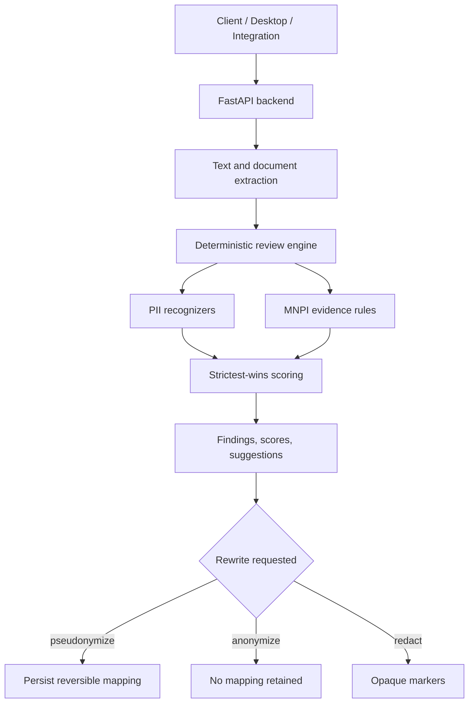

# Kaypoh Architecture Pivot

This is the authoritative product, architecture, and roadmap document. Shorter docs may summarize it, but conflicts should be resolved here or by updating this file and the summaries together.

## Product Boundary

Kaypoh is a pre-send document safety layer for:

- PII/personal-data detection and rewrite.
- MNPI/inside-information review.
- Audit evidence for legal, compliance, and procurement review.

Kaypoh is not a general DLP suite, legal-advice product, or model-training platform. It should integrate with DLP, DMS, Office/browser surfaces, and identity gateways instead of competing with their whole surface area.

## Runtime Architecture

The deterministic review engine is the runtime source of truth.



Active endpoints:

- `POST /review`
- `POST /pseudonymize`
- `POST /anonymize`
- `POST /redact`
- `POST /reidentify`
- `POST /documents/scrub`
- `POST /classify`, `POST /classify/batch` as compatibility wrappers
- `GET /health`, `/ready`, `/diagnostics`, `/metrics`

## Data States

`/pseudonymize` produces pseudonymized personal data while a mapping exists. `/anonymize` produces placeholder-only output without retained mapping, but residual singling-out/linkability/inference risk remains document-context dependent. `/redact` uses opaque markers and avoids original matched text in redaction responses.

Mapping persistence must remain tenant/session scoped, auditable, and erasable through the subject-erasure path.

## Optional Server Layers

Optional layers are disabled by default:

- `public_evidence`: Exa, Tinyfish, Serper, or SerpAPI over PrivacyGuard-sanitized queries.
- `llm_adjudicator`: vLLM, Ollama, OpenAI-compatible, or local distilled provider.
- `llm_defined_term_extractor`: audit-grade preamble-only defined-term extraction.
- `llm_coverage_auditor`: audit-grade structured inverse coverage audit.

These layers require explicit deployer and tenant opt-in. `strict` never invokes LLM helper layers. LLM output cannot suppress deterministic-high findings.

## Statutory Analysis

`docs/statutory-coverage.md` is the procurement-facing detector-to-statute artifact. It maps shipped detector names, jurisdiction packs, endpoint data states, and known gaps to statutory anchors.

Source-code detector changes that affect compliance claims must update:

- `docs/statutory-coverage.md`
- citation/rationale coverage in `src/kaypoh/review/citations.py`
- focused tests covering the detector and documentation drift

## Corpus And Evaluation

Committed recall/precision locks are authoritative for accuracy claims. `docs/accuracy.md` is generated and must not be edited by hand.

Use:

```sh
uv run python scripts/recall_gate.py
uv run python scripts/generate_accuracy_doc.py --check
```

Candidate corpora are useful for gap discovery only until promoted into committed lock files. Procurement-facing accuracy claims require committed locks plus human-reviewed fixture provenance.

## Packaging And Deployment

`kaypoh-local` is the offline-default desktop SKU. It should continue to run without remote providers or heavyweight ML dependencies.

`kaypoh-server` enables opt-in external evidence/LLM paths for approved tenants. Runtime config must fail closed for missing provider keys, invalid opt-ins, or unsafe remote raw-text settings.

## Roadmap

Prioritized work should favor defensibility and corpus realism over adding classifier layers:

1. Keep docs, runtime gates, and generated accuracy/status artifacts synchronized.
2. Make lint/verification policy explicit and reproducible.
3. Expand audit-grade public evidence: issuer calendar lookup, issuer materiality scale, and jurisdiction-specific source-threshold providers.
4. Add hostile ingest corpus coverage for Outlook exports, archives, PDFs with annotations/forms, DOCX comments/track changes, and XLSX hidden sheets/pivot caches.
5. Promote local LLM/distillation baselines only with model-card docs, privacy evaluation, and invariant gates.
6. Add regulatory detector/corpus expansion where statutory hooks are concrete and testable.

## Avoid

- Reintroducing the archived classifier stack.
- Adding remote calls to the local SKU.
- Making broad legal/procurement claims without committed evidence.
- Treating pseudonymized data as anonymized while mappings exist.
- Resolving unclear roadmap items through speculative implementation.
