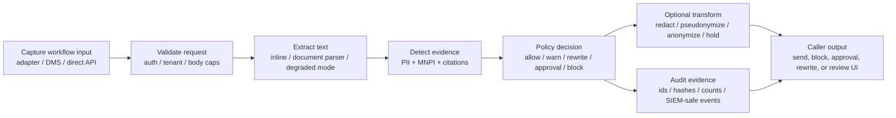

# Junas Architecture

This is the reviewer-facing map of the repo. The longer runtime overview remains in
[`docs/architecture.md`](./docs/architecture.md).

## Core Boundary

Junas is backend-first. The FastAPI service in
[`src/junas/backend/main.py`](./src/junas/backend/main.py) is the trust boundary
for request validation, tenant/auth checks, deterministic review, policy decisions,
rewrite eligibility, review sessions, audit events, and privacy-safe observability.

Adapters under [`integrations/`](./integrations/) are activation surfaces. Outlook,
browser, Word, desktop, DMS, and direct API callers collect workflow context and call
the backend contract; they should not fork detection, policy, or audit behavior into
parallel enforcement engines.

## Pipeline Diagram

Current Junas is a pre-send text/document review pipeline, not the legacy Aki
screen-redaction pipeline. It does not implement FrameDiff grids, frame
backpressure, transform crossfades, OBS sources, virtual cameras, or live video
output in this repo.

## Request Lifecycle

1. A caller sends text or a supported document payload to `/review` or a rewrite
   endpoint with source/destination jurisdiction and workflow context.
2. [`src/junas/backend/main.py`](./src/junas/backend/main.py) resolves auth,
   request IDs, local-daemon protections, document extraction, degraded modes, and
   response shaping.
3. [`PreSendReviewEngine.review`](./src/junas/review/engine.py) resolves
   jurisdiction packs, extracts defined terms, parses document structure, runs PII
   and MNPI detectors, scores risk, attaches citations, and returns findings,
   suggestions, public-evidence state, LLM-advisory state, privacy-ledger entries,
   coverage warnings, and degraded modes.
4. [`src/junas/policy/engine.py`](./src/junas/policy/engine.py) evaluates findings
   plus workflow context into `allow`, `warn`, `rewrite_required`,
   `approval_required`, or `block`, with required/recommended actions and blocking
   finding IDs.
5. The backend returns a `ReviewResponse` or rewrite response containing findings,
   scores, `policy_decision`, `action_catalog`, `review_expires_at`, timings, and
   document metadata.
6. The caller applies the decision: allow/warn the user, block send, request
   approval, redact PII, safe-rewrite, hold until public, cite a public source, or
   persist audit evidence when configured.

## Deterministic Core

The deterministic engine is the runtime source of truth. It owns:

- jurisdiction TOML packs and strictest-wins jurisdiction resolution;
- PII, personal-data, quasi-identifier, special-category, and privacy-event rules;
- MNPI, inside-information, public-disclosure, blackout, sector, cyber, ESG,
  crypto, conjunctive, and defined-term logic;
- statute-cited rationale strings and finding metadata;
- scoring, degraded-mode reporting, and local suggestions.

The policy engine is separate from detection on purpose. Detection answers "what
evidence exists"; policy answers "what should this workflow do with that evidence."
That split lets the same `/review` result drive Outlook send, GenAI prompt review,
DMS upload, direct API gateway checks, and reviewer approval without changing the
detectors.

## Advisory Layers

Optional public-evidence and LLM helpers are disabled by default. They require
runtime configuration, deployer/tenant opt-in where applicable, privacy-ledger
evidence, and an eligible `audit_grade` request path. `strict` is deterministic.

The advisory split exists because regulated review needs inspectable baseline
evidence and predictable latency. Retrieval and LLM paths can add context for
ambiguous cases, but they are not the default authority for risk decisions.

Current helper classes and gates live around
[`PreSendReviewEngine._llm_tier_engaged`](./src/junas/review/engine.py) and the
optional helper calls in [`PreSendReviewEngine.review`](./src/junas/review/engine.py).

## Latency And Backpressure

The low-latency path is deterministic and local: `review_profile=strict` avoids
public evidence and LLM calls, so adapters can use it for pre-send decisions without
network-bound helper latency. Backpressure is request-level rather than frame-level:
the backend enforces request body caps, parser/degraded-mode boundaries, rate-limit
configuration, auth failures, and adapter timeouts. When coverage is degraded, the
response carries degraded metadata and policy can fail open, warn, or block according
to deployment config.

Adapters should hold completion only for the workflow they captured, then release,
warn, block, request approval, or apply a transform based on the backend response.
They should not queue unbounded user content, retry validation failures blindly, or
store raw prompts/documents while waiting for reviewer or network state.

## Non-Suppression Invariant

Deterministic-high findings stay in the review and policy path. LLM, public
evidence, adapter UI, and policy softening must not erase deterministic-high
evidence.

Evidence in the current repo:

- [`PreSendReviewEngine._llm_tier_engaged`](./src/junas/review/engine.py) only routes
  `audit_grade` documents in the ambiguous MNPI band to optional helper layers.
- [`test/test_llm_coverage_audit.py`](./test/test_llm_coverage_audit.py) checks that
  strict profile never calls the LLM coverage auditor and LLM-raised warning severity
  is capped at medium.
- [`test/test_source_verification.py`](./test/test_source_verification.py) checks
  strict public-language-only MNPI does not soften without an in-document URL and
  audit-grade retrieval marks source-verification state instead of deleting findings.
- [`test/test_policy_engine.py`](./test/test_policy_engine.py) checks high MNPI blocks
  without public evidence or approval, and that public evidence changes policy to a
  warning rather than hiding the finding.

## Primary Files

- [`src/junas/backend/main.py`](./src/junas/backend/main.py): FastAPI app, endpoint
  wiring, auth integration, document extraction orchestration, policy response
  shaping, rewrite actions, review sessions, local pairing, SIEM/audit hooks.
- [`src/junas/review/engine.py`](./src/junas/review/engine.py): deterministic review
  engine, jurisdiction resolution, PII/MNPI detectors, citations, scoring, optional
  advisory layer invocation, and result assembly.
- [`src/junas/policy/engine.py`](./src/junas/policy/engine.py): workflow-context policy
  decisions, action catalog, blocking finding IDs, and allow/warn/block precedence.
- [`docs/adr/0001-backend-first-adapters-second.md`](./docs/adr/0001-backend-first-adapters-second.md):
  accepted ADR for backend-first/adapters-second deployment posture.
- [`docs/threat-model.md`](./docs/threat-model.md): trust boundaries, controls, and
  residual risk.
- [`docs/llm-governance.md`](./docs/llm-governance.md): optional LLM promotion and
  privacy-evidence gates.
