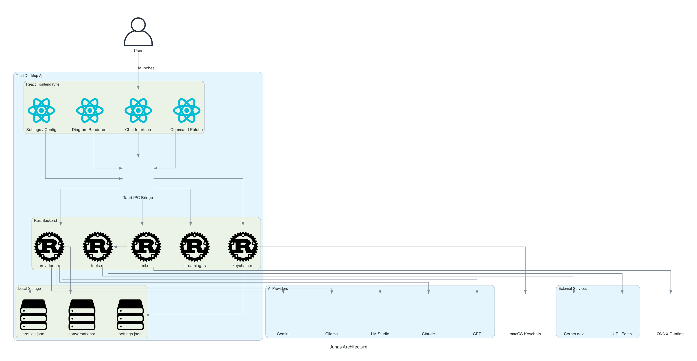

[](https://github.com/gongahkia/junas/releases/tag/1.0.0)
[](https://github.com/gongahkia/junas/releases/tag/2.0.0)


# `Junas`

`Junas` is a [BYOK](https://en.wikipedia.org/wiki/Bring_your_own_encryption) Web App that [automates](#architecture) away legal [busy work](https://en.wikipedia.org/wiki/Busy_work) in mind.

## Stack

- _Frontend_: [Next.js 16](https://nextjs.org/), [React 19](https://react.dev/), [Tailwind CSS 3](https://tailwindcss.com/) + [Radix UI](https://www.radix-ui.com/), [TypeScript 5](https://www.typescriptlang.org/)
- _State Management_: [Zustand](https://zustand.docs.pmnd.rs/)
- _Validation_: [Zod](https://zod.dev/)
- _AI Providers_: [Anthropic SDK](https://www.anthropic.com/) (Claude), [Google Generative AI](https://ai.google.dev/) (Gemini), [OpenAI](https://platform.openai.com/) (GPT), [HuggingFace](https://huggingface.co/)
- _Markdown Rendering_: [react-markdown](https://remarkjs.github.io/react-markdown/), [remark-gfm](https://github.com/remarkjs/remark-gfm), [remark-math](https://github.com/remarkjs/remark-math), [rehype-katex](https://github.com/remarkjs/remark-math/tree/main/packages/rehype-katex), [KaTeX](https://katex.org/)
- _Session Management_: [iron-session](https://github.com/vvo/iron-session)
- _Rate Limiting_: [Upstash Redis](https://upstash.com/), [Upstash Ratelimit](https://github.com/upstash/ratelimit)
- _Monitoring_: [Sentry](https://sentry.io/)
- _Utils_: [Lucide React](https://lucide.dev/), [clsx](https://github.com/lukeed/clsx), [tailwind-merge](https://github.com/dcastil/tailwind-merge)

## Screenshots

...

## Usage

> [!IMPORTANT]  
> Read the [legal disclaimer](#legal-disclaimer) before using `Junas`.

The easiest way to access `Junas` is through the live website at [**junas.vercel.app**](https://junas.vercel.app/).

## Local Usage

For those interested, the below instructions are for locally hosting `Junas`.

1. First run the below.

```console
$ git clone https://github.com/gongahkia/junas && cd junas
$ npm install
```

2. Then execute the following to run the local dev server or build for production.

```console
$ npm run dev
$ npm run build
$ npm start
```

## Architecture



## Legal Disclaimer

### For Informational Purposes Only

The information provided on Junas is for general informational purposes only. While we strive to ensure the accuracy and reliability of the legal analysis workflows and templates provided, Junas makes no guarantees, representations, or warranties of any kind, express or implied, about the completeness, accuracy, reliability, suitability, or availability of the information. Users should independently verify any information before making decisions based on it.

### No Professional Advice

Junas does not provide professional legal advice or consultation services. The legal analysis tools, document drafting templates, and case law analysis features should not be considered as a substitute for professional advice from qualified legal practitioners or attorneys. Users are encouraged to consult with appropriate legal professionals regarding their specific legal matters and requirements.

### No Endorsement

The inclusion of any legal templates, analysis methodologies, or reference to any legal principles on Junas does not constitute an endorsement or recommendation of specific legal strategies or approaches. Junas is not affiliated with any law firms, legal institutions, or bar associations unless explicitly stated otherwise.

### AI-Generated Content

Junas utilizes artificial intelligence models to generate legal analysis and drafts. AI-generated content may contain errors, omissions, or inaccuracies. The quality of AI outputs depends on various factors including the quality of input, the limitations of the underlying AI models, and the complexity of legal issues. We do not control or guarantee the accuracy of AI-generated content. Using AI-generated legal analysis and documents is at your own risk, and Junas is not responsible for any errors, misinterpretations, or damages resulting from their use.

### Use at Your Own Risk

Users access, use, and rely on legal analysis and documents generated by Junas at their own risk. Legal information may become outdated or inaccurate without notice, and legal landscapes may change rapidly. Junas disclaims all liability for any loss, injury, or damage, direct or indirect, arising from reliance on the information provided on this platform. This includes but is not limited to legal misinformation, outdated legal precedents, incorrect interpretations, AI hallucinations, or decisions made based on the content generated.

### Limitation of Liability

To the fullest extent permitted by law:

- Junas shall not be liable for any direct, indirect, incidental, consequential, or punitive damages arising out of your use of this web app or reliance on any legal analysis or documents generated by it.
- Junas disclaims all liability for errors or omissions in the content provided.
- Our total liability under any circumstances shall not exceed the amount paid by you (if any) for using Junas.

### User Responsibility

Users are solely responsible for:

- Verifying the accuracy and currency of any legal information generated through Junas.
- Seeking appropriate professional legal advice for their specific circumstances.
- Complying with all applicable laws, regulations, and professional conduct rules.
- Understanding that AI-generated legal analysis and documents are not substitutes for formal legal counsel.
- Exercising independent judgment when interpreting legal information and using generated content.
- Reviewing and editing all AI-generated documents before use in any legal proceedings or official capacity.

### Copyright and Intellectual Property

Junas respects intellectual property rights. The legal templates and analysis methodologies provided are for general use. If you believe your copyrighted work has been inappropriately used or displayed on Junas, please contact us to request its removal.

### Data Collection and Privacy

Junas may collect user data to improve service functionality. By using Junas, you consent to our data collection practices. Your API keys remain private and are stored locally on your device as part of the BYOK (Bring Your Own Key) model. We do not have access to your API keys or the content you process through the platform.

### Changes to Content

Junas reserves the right to modify, update, or remove any content on this platform at any time without prior notice. Legal analysis tools, templates, and methodologies may change without notice due to various factors including updates to legal standards, improvements to AI models, or changes in best practices.

### Jurisdiction

This disclaimer and your use of Junas shall be governed by and construed in accordance with the laws of Singapore. Any disputes arising out of or in connection with this disclaimer shall be subject to the exclusive jurisdiction of the courts in Singapore.
