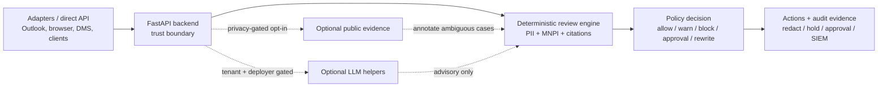
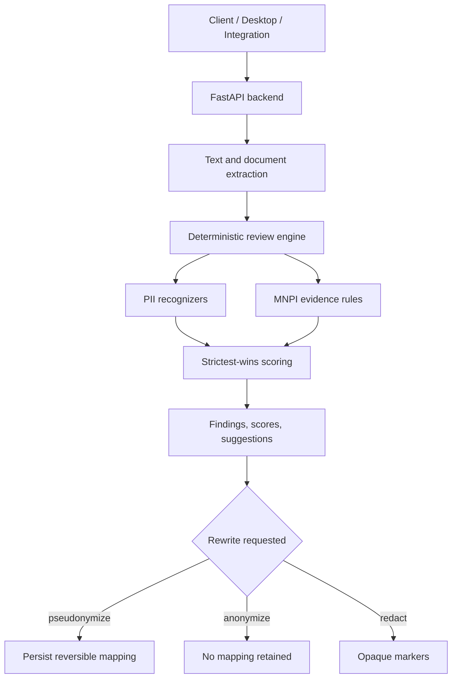

# Junas

<p align="center">
  
</p>

<p align="center">
  <a href="https://github.com/gongahkia/junas/actions/workflows/ci.yml"></a>
  
  
  
</p>

Pre-send review, safe rewrite, and audit evidence for GenAI, email, and document sharing.

Junas is not a DOM-only blur overlay. It reviews submitted text and supported documents before users paste prompts, send email, upload matter files, or share drafts externally; image/OCR paths can inspect image-backed content when OCR is configured. The deterministic review engine is the runtime source of truth: it detects personal data and material non-public information, returns statute-cited findings, records audit-ready evidence, and routes users toward safe rewrite, redaction, pseudonymization, approval, or hold actions.

Project status: pre-production / portfolio-stage. The deterministic core, policy contract, demo artifacts, and supported-target adapter evidence are present; production hardening, independent eval expansion, hosted demo, and rollout tasks remain tracked in GitHub issues, including [#84](https://github.com/gongahkia/junas/issues/84) and [#85](https://github.com/gongahkia/junas/issues/85).

## Install Locally

Primary first-run path from a checkout:

```bash
uv sync --extra dev
uv run python -m spacy download en_core_web_sm
uv run python scripts/preflight.py --strict
./scripts/demo.sh
```

Start the local API after the demo:

```bash
./scripts/launch/run_backend_only.sh
curl http://127.0.0.1:8000/ready
```

Packaged DMG, Homebrew, Nix, and signed desktop install paths are not the default README path yet. Developer verification and packaging commands live under [Development & Evaluation](#development--evaluation) and [Packaging & Deployment](#packaging--deployment).

<!-- JUNAS_REVIEW_HERO_START -->
## 60-second verdict

Generated by `python3 scripts/export_openapi_examples.py` from a real local `/review` run. Full artifacts: [`request`](./docs/api/review_hero_request.json), [`response`](./docs/api/review_hero_response.json).

| Confidential input | Junas verdict |
|---|---|
| <pre>Subject: Project Raven draft<br><br>Before Monday's announcement, send Dr Jane Tan S1234567D the draft SPA. Project Raven will acquire GlobalTech for USD 2.5 billion; keep this off ChatGPT unless redacted.</pre> | **`send_allowed: false`**<br>`policy_decision: block`<br>`overall_risk: HIGH_RISK`<br>`pii_score: 88.0` / `mnpi_score: 100.0`<br>`required_actions: hold_until_public, redact_pii, request_approval, safe_rewrite` |

| Finding | Generated legal basis | Generated citation string |
|---|---|---|
| `PII:sg_nric_fin` on `S1234567D` | `SG_PDPA_PERSONAL_DATA, SG_PDPA_SENSITIVE_CONTEXT, US_PRIVACY_BASELINE` | "S1234567D" detected => PDPA s13 and PDPC NRIC Advisory (effective 31 Dec 2026): NRIC/FIN must not be collected, used, or disclosed without explicit purpose and consent. Mask before send. Reference: Personal Data Protection Act 2012. Reference: applicable U... |
| `MNPI:transaction_codename` on `Project Raven` | `SG_SFA_INSIDE_INFORMATION, SG_SFA_GENERALLY_AVAILABLE, US_MNPI_INSIDER_TRADING, US_REG_FD_PUBLIC_DISCLOSURE` | "Project Raven" detected => Internal deal codename detected. Treat as MNPI until the underlying transaction is publicly announced; do not reference the codename in external communications. Reference: Securities and Futures Act 2001 ss215, 218, 219 (insider... |

`blocking_findings: mnpi:definitive_agreement:97:100:3, mnpi:transaction_codename:102:115:2, mnpi:transaction_codename:9:22:1, pii:sg_nric_fin:77:86:0`
<!-- JUNAS_REVIEW_HERO_END -->

<p align="center">
  <a href="https://github.com/gongahkia/junas/releases/download/readme-demo-assets-2026-06-30/junas-demo.gif"></a>
</p>
<p align="center">
  <sub><a href="./asset/video/junas-60s-demo.mp4">60-second narrated video</a> · <a href="https://github.com/gongahkia/junas/releases/download/readme-demo-assets-2026-06-30/junas-demo-fallback.png">Static fallback PNG</a> for readers who disable animation · <a href="./docs/assets/demo/README.md">Regenerate the capture</a></sub>
</p>

## Table of Contents

- [Install Locally](#install-locally)
- [Why Junas](#why-junas)
- [What This Is / What This Is NOT](#what-this-is--what-this-is-not)
- [Default Privacy Posture](#default-privacy-posture)
- [Demo](#demo)
- [Quick Start](#quick-start)
- [Troubleshooting](#troubleshooting)
- [What Junas Does](#what-junas-does)
- [Primary Product Spine](#primary-product-spine)
- [Design Principles](#design-principles)
- [Adapter Maturity](#adapter-maturity)
- [Experimental Local Fallback](#experimental-local-fallback)
- [API Surface](#api-surface)
- [Examples](#examples)
- [How It Works](#how-it-works)
- [Jurisdiction Coverage](#jurisdiction-coverage)
- [Known Limitations](#known-limitations)
- [Accuracy & Evaluation](#accuracy--evaluation)
- [Runtime Modes](#runtime-modes)
- [Documentation](#documentation)
- [Development & Evaluation](#development--evaluation)
- [Contributing](#contributing)
- [Packaging & Deployment](#packaging--deployment)
- [Screenshots](#screenshots)
- [License](#license)

## Why Junas

A paralegal asks a public GenAI tool to turn a draft Project Raven term sheet into a client update. The prompt includes an SG NRIC, a deal codename, draft SPA language, and an acquisition price that has not been announced. A normal paste box treats that as text; a reviewer sees personal data, MNPI, cross-border context, and audit exposure after the fact. Junas moves that check to pre-send and pre-paste time: the workflow calls `/review`, gets deterministic findings and policy actions, then redacts, holds, or routes for approval before content leaves the trusted boundary. See [`docs/product/positioning.md`](./docs/product/positioning.md) for canonical positioning and non-goals.

## What This Is / What This Is NOT

| What this is | What this is NOT |
|---|---|
| Junas reviews explicit workflow submissions and can feed decisions/evidence into DLP-led programs. | Junas does not replace DLP policy, network inspection, endpoint discovery, SaaS storage scanning, or enterprise data classification. |
| Junas surfaces findings, policy reasons, and reviewer workflow evidence for qualified reviewers. | Junas does not provide legal advice, privilege calls, matter strategy, or external counsel review. |
| Junas can retain audit evidence about pre-send review decisions when configured. | Junas does not replace legal hold, collection, processing, review platforms, production, or chain-of-custody systems. |
| Junas desktop features are local fallback surfaces, not enterprise endpoint enforcement. | Junas does not replace device management, USB controls, clipboard governance, screen capture controls, file-system policy, or EDR. |
| Junas browser/DMS/API integrations target specific workflows and should coexist with CASB controls. | Junas does not replace cloud-app discovery, sanctioning, session control, or cross-SaaS activity policy. |
| Junas consumes tenant/auth context from trusted identity infrastructure and rejects caller-supplied tenant authority. | Junas does not replace SSO, MFA, conditional access, group policy, or identity lifecycle management. |

See [`docs/product/non-goals.md`](./docs/product/non-goals.md) for the canonical boundaries.

## Default Privacy Posture

Junas collects no product telemetry in default local or deterministic demo use. There is no Junas cloud account, sync service, upsell flow, or Sponsor prompt required to run the local backend, demo, browser extension, Office add-ins, desktop watcher, or direct API examples from this repo.

Operator-configured SIEM, Prometheus, adapter telemetry, journals, mappings, and audit packs are customer-controlled deployment surfaces. They stay optional, must avoid raw content, and are documented under [`docs/admin-security.md`](./docs/admin-security.md), [`docs/observability-metrics.md`](./docs/observability-metrics.md), [`docs/integrations/telemetry.md`](./docs/integrations/telemetry.md), and [`docs/security/data-retention.md`](./docs/security/data-retention.md).

## Demo

Run the deterministic demo:

```bash
./scripts/demo.sh
```

It starts a local backend, disables public-evidence and LLM paths, and prints three statute-cited verdicts: SG NRIC PII, M&A MNPI, and clean internal text. It does not require provider keys or a spaCy model download. CI runs this script from checkout under a 120-second timeout after Python and `uv` setup.

Render fake-only reproduction text without starting the backend:

```bash
uv run aki demo
uv run aki demo --case browser-prompt --frames 1
```

`aki demo` prints deterministic FAKE/DEMO secret and PII-shaped examples for screenshots, tweets, and bug reports. The values are synthetic and intentionally avoid real credential shapes.

Docker equivalent:

```bash
docker compose -f docker-compose.demo.yml up --build --abort-on-container-exit --exit-code-from demo
```

The demo uses the same `/review` contract as adapters and CI:

- SG NRIC in a GenAI prompt: expects `send_allowed: false` with a rewrite/redact path.
- M&A MNPI before announcement: expects `send_allowed: false` with hold/approval actions.
- Clean internal text: expects `send_allowed: true`.

The CI `One-command demo` job runs `./scripts/demo.sh` headlessly and fails if those decisions drift.

## Quick Start

After [Install Locally](#install-locally), start the deterministic backend:

```bash
./scripts/launch/run_backend_only.sh
```

Check readiness:

```bash
curl http://127.0.0.1:8000/ready
```

Review a document before sending:

```bash
curl -X POST http://127.0.0.1:8000/review \
  -H "Content-Type: application/json" \
  -d '{
    "text": "Send Dr Jane Tan S1234567D the confidential draft.",
    "source_jurisdiction": "SG",
    "destination_jurisdiction": "US",
    "document_type": "SPA"
  }'
```

Use follow-on actions when the review result requires content changes:

```bash
curl -X POST http://127.0.0.1:8000/pseudonymize -H "Content-Type: application/json" -d '{"text":"Send Dr Jane Tan S1234567D the confidential draft."}'
curl -X POST http://127.0.0.1:8000/redact-pii -H "Content-Type: application/json" -d '{"text":"Send Dr Jane Tan S1234567D the confidential draft."}'
curl -X POST http://127.0.0.1:8000/hold-until-public -H "Content-Type: application/json" -d '{"text":"Acme Corp will acquire GlobalTech before announcement."}'
curl -X POST http://127.0.0.1:8000/cite-public-source -H "Content-Type: application/json" -d '{"text":"Acme Corp will acquire GlobalTech before announcement.","entity_id":"Acme Corp"}'
curl -X POST http://127.0.0.1:8000/redact -H "Content-Type: application/json" -d '{"text":"Send Dr Jane Tan S1234567D the confidential draft."}'
DOC_B64="$(base64 -i draft.docx | tr -d '\n')"
curl -X POST http://127.0.0.1:8000/documents/scrub -H "Content-Type: application/json" -d "{\"document_base64\":\"${DOC_B64}\",\"document_filename\":\"draft.docx\"}"
```

## Troubleshooting

Check local capture/OCR setup without telemetry:

```bash
uv run aki doctor
```

`aki doctor` reports pass/warn/fail diagnostics for ScreenCaptureKit permissions, CoreMediaIO DAL plugins, virtual-camera setup, optional OBS reachability, and Tesseract data paths. It prints local remediation steps and does not collect or transmit telemetry.

## What Junas Does

- Detects PII and personal data across universal identifiers, jurisdiction-specific IDs, special-category data, quasi-identifiers, and privacy-handling events.
- Detects MNPI and inside-information signals such as material events, non-public markers, deal codenames, tipping language, selective disclosure risk, blackout windows, ESG/cyber/crypto pre-disclosure, sector MNPI, and conjunctive MNPI evidence.
- Applies source and destination jurisdictions with strictest-wins scoring.
- Returns findings, scores, suggestions, statutory rationales, timings, degraded-mode metadata, and optional audit evidence.
- Rewrites text through distinct data states:
  - `/pseudonymize`: reversible deterministic placeholders plus mapping.
  - `/anonymize`: irreversible placeholder-only output with no retained mapping.
  - `/redact`: opaque markers without original matched text in the redaction response.
  - `/redact-pii`: deterministic PII-only replacement while MNPI remains visible and flagged.
  - `/hold-until-public`: high-severity MNPI hold text with display-safe and audit-ready reasons.
  - `/cite-public-source`: audit-grade public-source citations with privacy-ledger evidence.
  - `/request-approval`: pending approval journal entry plus reviewer-role requirements.
- Restores reversible pseudonymized text through `/reidentify` when the caller supplies a mapping or a persisted document hash.
- Scrubs supported document metadata leakage through `/documents/scrub`.
- Keeps optional public evidence and LLM helper layers disabled unless explicitly enabled by deployer and tenant gates.

Junas is not a general DLP suite, legal-advice product, or model-training platform. It is a pre-send safety layer intended to integrate with DLP, DMS, Office/browser surfaces, and identity gateways.

## Primary Product Spine

The FastAPI backend is the trust boundary for Junas deployments. It owns review input validation, tenant/auth checks, deterministic findings, policy decisions, rewrite actions, audit events, and privacy-safe observability. Adapters are not required to integrate Junas: direct HTTP/OpenAPI clients remain the baseline path and can integrate with this boundary without installing a UI adapter.

Adapters are workflow activation points. Outlook Smart Alerts, browser GenAI capture, Word taskpanes, desktop watching, DMS hooks, and future surfaces should collect workflow context, call the backend contract, display the decision, and avoid storing raw content outside their runtime unless a documented policy allows it.

## Design Principles

- **Deterministic first:** rules, jurisdiction packs, scoring, and policy decide the baseline before helpers run, giving regulated buyers inspectable evidence instead of a black-box verdict; see [`ARCHITECTURE.md`](./ARCHITECTURE.md), [`docs/architecture.md`](./docs/architecture.md), and [`src/junas/review/engine.py`](./src/junas/review/engine.py).
- **Backend trust boundary:** adapters collect workflow context, but FastAPI owns auth, validation, findings, policy, rewrite actions, and audit events, so UI surfaces do not become parallel enforcement engines; see [`docs/adr/0001-backend-first-adapters-second.md`](./docs/adr/0001-backend-first-adapters-second.md) and [`docs/threat-model.md`](./docs/threat-model.md).
- **LLM strictly advisory and gated:** `strict` stays deterministic, while remote/helper paths require deployer and tenant opt-ins plus privacy-ledger evidence; see [`docs/llm-governance.md`](./docs/llm-governance.md), [`docs/running.md`](./docs/running.md), and [`test/test_llm_coverage_audit.py`](./test/test_llm_coverage_audit.py).
- **Deterministic-high non-suppression:** helper layers route only eligible ambiguous cases, so deterministic-high findings stay in the review evidence path instead of being erased by LLM, public-evidence, adapter, or policy softening; see [`src/junas/review/engine.py#L4317`](./src/junas/review/engine.py#L4317), [`test/test_source_verification.py`](./test/test_source_verification.py), and [`test/test_policy_engine.py`](./test/test_policy_engine.py).
- **Statute-cited findings:** review output carries legal-basis codes and generated rationales for PII/MNPI findings, making the first response useful to counsel and compliance reviewers; see [`docs/statutory-coverage.md`](./docs/statutory-coverage.md) and [`test/test_citations.py`](./test/test_citations.py).
- **Privacy-gated external calls:** optional provider calls are disabled by default, sanitized through PrivacyGuard, and recorded as privacy-ledger/SIEM evidence when used; see [`src/junas/external/privacy_guard.py`](./src/junas/external/privacy_guard.py), [`docs/threat-model.md`](./docs/threat-model.md), and [`test/test_siem_export.py`](./test/test_siem_export.py).
- **Audit evidence by default:** decisions, required actions, IDs, hashes/counts, SIEM events, and audit packs are first-class outputs so reviewers can reconstruct what happened without putting raw payloads in observability streams; see [`docs/admin-security.md`](./docs/admin-security.md), [`test/test_siem_export.py`](./test/test_siem_export.py), and [`test/test_audit_pack_smoke.py`](./test/test_audit_pack_smoke.py).

Compact runtime spine; see [`ARCHITECTURE.md`](./ARCHITECTURE.md) for the reviewer map and [`docs/architecture.md`](./docs/architecture.md) for the longer runtime overview.


```mermaid
flowchart LR
    Adapters[Adapters / direct API<br/>Outlook, browser, DMS, clients] --> Boundary[FastAPI backend<br/>trust boundary]
    Boundary --> Engine[Deterministic review engine<br/>PII + MNPI + citations]
    Engine --> Policy[Policy decision<br/>allow / warn / block / approval / rewrite]
    Policy --> Evidence[Actions + audit evidence<br/>redact / hold / approval / SIEM]
    Boundary -. privacy-gated opt-in .-> PublicEvidence[Optional public evidence]
    Boundary -. tenant + deployer gated .-> LLM[Optional LLM helpers]
    PublicEvidence -. annotate ambiguous cases .-> Engine
    LLM -. advisory only .-> Engine
```

## Adapter Maturity

| Surface | Maturity | Role | Evidence |
|---|---|---|---|
| API/client | `core` | Baseline HTTP/OpenAPI integration path. | OpenAPI and backend contract tests. |
| Outlook Smart Alerts | `supported-target` | First-class pre-send email review target. | [`test/test_adapter_smoke.py`](./test/test_adapter_smoke.py), [`test/test_outlook_manifest_validate.py`](./test/test_outlook_manifest_validate.py). |
| Browser GenAI extension | `supported-target` | First-class prompt review target for managed browser pilots. | [`test/test_adapter_smoke.py`](./test/test_adapter_smoke.py), [`test/test_browser_extension.py`](./test/test_browser_extension.py). |
| Word taskpane | `experimental` | Document review surface, not send-time enforcement. | Fixture smoke in [`test/test_adapter_smoke.py`](./test/test_adapter_smoke.py). |
| Desktop watcher | `experimental-local-fallback` | Opt-in local fallback for demos, offline review, and power users. | Local watcher tests in [`test/test_desktop_watch.py`](./test/test_desktop_watch.py). |

Browser GenAI screenshots: [`warn confirm`](./docs/assets/browser-extension/browser-extension-warn-confirm.png) and [`policy block`](./docs/assets/browser-extension/browser-extension-policy-block.png). They use a synthetic `chatgpt.com` fixture with the real MV3 extension and local backend; see [`docs/integrations/genai-browser.md`](./docs/integrations/genai-browser.md) for the DOM-stability caveat.

Outlook Smart Alert renderings: [`allow`](./docs/assets/outlook/outlook-smart-alert-allow.png), [`warn`](./docs/assets/outlook/outlook-smart-alert-warn.png), [`block`](./docs/assets/outlook/outlook-smart-alert-block.png), and [`approval required`](./docs/assets/outlook/outlook-smart-alert-approval_required.png). They render the real fixture strings from [`test/fixtures/outlook_smart_alert_messages.json`](./test/fixtures/outlook_smart_alert_messages.json); see [`docs/integrations/outlook.md`](./docs/integrations/outlook.md) for client-validation limits.

## Experimental Local Fallback

The desktop watcher is intentionally outside the primary Quick Start. The `junas-watch` console script remains installed for explicit opt-in file, folder, or clipboard review against a local daemon, but it is `experimental-local-fallback`, not production enforcement.

```bash
uv run junas-watch ./draft.txt --base-url http://127.0.0.1:8765
uv run junas-watch --watch-folder ./drop --once --base-url http://127.0.0.1:8765
uv run junas-watch --clipboard --once --base-url http://127.0.0.1:8765
```

See [`docs/integrations/desktop-watcher.md`](./docs/integrations/desktop-watcher.md) for the security model and limitations.

## API Surface

Runtime:

- `GET /health`
- `GET /ready`
- `GET /diagnostics`
- `GET /metrics`

Review and rewrite endpoints:

- `POST /review`
- `POST /pseudonymize`
- `POST /anonymize`
- `POST /redact`
- `POST /redact-pii`
- `POST /hold-until-public`
- `POST /cite-public-source`
- `POST /request-approval`
- `POST /safe-rewrite`
- `POST /reidentify`
- `POST /documents/scrub`

Compatibility:

- `POST /classify`
- `POST /classify/batch`

Review-session and local desktop support:

- `POST /review/{review_id}/decision`
- `GET /review/{review_id}`
- `GET /local/pairing/status`
- `POST /local/pairing/start`
- `POST /local/pairing/approve`
- `POST /local/pairing/claim`

Generated integration artifacts live in [`docs/api/`](./docs/api/):

- [`junas.postman_collection.json`](./docs/api/junas.postman_collection.json)
- [`curl_snippets.sh`](./docs/api/curl_snippets.sh)
- [`python_client.md`](./docs/api/python_client.md)

## Examples

Review without rewriting:

```bash
curl -X POST http://127.0.0.1:8000/review \
  -H "Content-Type: application/json" \
  -d '{
    "text": "Project Raven will acquire GlobalTech for USD 2.5 billion before announcement.",
    "source_jurisdiction": "SG",
    "destination_jurisdiction": "US",
    "document_type": "SPA"
  }'
```

Review and rewrite with irreversible anonymization:

```bash
curl -X POST http://127.0.0.1:8000/anonymize \
  -H "Content-Type: application/json" \
  -d '{
    "text": "Dr Jane Tan, passport E1234567, will receive the memo.",
    "source_jurisdiction": "SG",
    "destination_jurisdiction": "EU"
  }'
```

Use the Python client:

```python
from junas import JunasClient

with JunasClient("http://127.0.0.1:8000") as client:
    result = client.classify(
        text="Acme Corp is acquiring GlobalTech for $2.5 billion next quarter.",
        entity_id="acme-corp",
        include_offending_spans=True,
    )
    print(result.classification)
    print(result.findings)
```

Run included client examples:

```bash
python scripts/examples/sync_client_example.py \
  "Acme Corp is acquiring GlobalTech for $2.5 billion next quarter." \
  --include-offending-spans

python scripts/examples/async_client_example.py \
  "Acme Corp is acquiring GlobalTech for $2.5 billion next quarter." \
  --include-offending-spans
```

Regenerate API examples from the live OpenAPI contract:

```bash
python3 scripts/export_openapi_examples.py
```

## How It Works

Junas has five main runtime pieces:

1. The FastAPI backend in [`src/junas/backend/`](./src/junas/backend/) exposes review, rewrite, document, auth, local pairing, observability, and audit endpoints.
2. The deterministic review engine in [`src/junas/review/`](./src/junas/review/) runs universal recognizers, jurisdiction TOML packs, MNPI evidence rules, citations, defined terms, document structure, and strictest-wins scoring.
3. The rewrite layer in [`src/junas/anonymize/`](./src/junas/anonymize/) builds deterministic placeholders, reversible mappings, opaque redactions, and reidentification.
4. Privacy-gated external helpers in [`src/junas/external/`](./src/junas/external/) sanitize outbound queries and optionally fetch public evidence.
5. Advisory helpers in [`src/junas/advisory/`](./src/junas/advisory/) provide optional LLM adjudication, defined-term extraction, and coverage audit paths. These layers are advisory unless explicitly documented otherwise and cannot suppress deterministic-high findings.

Core flow:


```mermaid
flowchart TD
    Client[Client / Desktop / Integration] --> API[FastAPI backend]
    API --> Extract[Text and document extraction]
    Extract --> Engine[Deterministic review engine]
    Engine --> PII[PII recognizers]
    Engine --> MNPI[MNPI evidence rules]
    PII --> Score[Strictest-wins scoring]
    MNPI --> Score
    Score --> Response[Findings, scores, suggestions]
    Response --> Rewrite{Rewrite requested}
    Rewrite -->|pseudonymize| Map[Persist reversible mapping]
    Rewrite -->|anonymize| Placeholders[No mapping retained]
    Rewrite -->|redact| Opaque[Opaque markers]
```

## Jurisdiction Coverage

Junas ships curated jurisdiction packs for:

🇸🇬 SG, 🇲🇾 MY, 🇮🇩 ID, 🇹🇭 TH, 🇵🇭 PH, 🇻🇳 VN, 🇭🇰 HK, 🇦🇺 AU, 🇯🇵 JP, 🇰🇷 KR, 🇺🇸 US, 🇬🇧 UK, 🇪🇺 EU, 🌏 SEA, 🇮🇳 IN, 🇨🇳 CN, 🇦🇪 AE, 🇸🇦 SA

Each pack lives under [`src/junas/review/jurisdictions_data/`](./src/junas/review/jurisdictions_data/) and is mapped to statutory coverage in [`docs/statutory-coverage.md`](./docs/statutory-coverage.md).

### Statutory Anchors

| Code | Jurisdiction | PII statute | MNPI / inside-information statute |
|---|---|---|---|
| 🇸🇬 **SG** | Singapore | [Personal Data Protection Act 2012][sg-pdpa] (PDPA s2, s13, s18) | [Securities and Futures Act 2001][sg-sfa] ss215, 218, 219 |
| 🇲🇾 **MY** | Malaysia | [Personal Data Protection Act 2010][my-pdpa] (PDPA Malaysia ss6-7) | [Capital Markets and Services Act 2007][my-cmsa] ss188-189 |
| 🇮🇩 **ID** | Indonesia | [UU Pelindungan Data Pribadi No. 27/2022][id-pdp] | [OJK Regulation 31/POJK.04/2015][id-ojk-material] + [UU Pasar Modal No. 8/1995][id-pasar-modal] |
| 🇹🇭 **TH** | Thailand | [PDPA B.E. 2562 (2019)][th-pdpa] s26 | [Securities and Exchange Act B.E. 2535][th-sea] ss241-243 |
| 🇵🇭 **PH** | Philippines | [Data Privacy Act 2012 (RA 10173)][ph-dpa] s3(g)/(h)/(l) | [Securities Regulation Code (RA 8799)][ph-src] s27 |
| 🇻🇳 **VN** | Vietnam | [Decree 13/2023/ND-CP][vn-decree13] arts 2-3 | [Law on Securities 2019 (Law No. 54/2019/QH14)][vn-securities] art 12 |
| 🇭🇰 **HK** | Hong Kong | [Personal Data (Privacy) Ordinance Cap. 486][hk-pdpo] s2 | [Securities and Futures Ordinance Cap. 571][hk-sfo] Part XIV ss270-281 |
| 🇦🇺 **AU** | Australia | [Privacy Act 1988 (Cth)][au-privacy] + Australian Privacy Principles | [Corporations Act 2001 (Cth)][au-corp] ss1042A-1043O |
| 🇯🇵 **JP** | Japan | [APPI][jp-appi] Art 2 + [My Number Act][jp-my-number] | [Financial Instruments and Exchange Act][jp-fiea] Arts 166-167 |
| 🇰🇷 **KR** | South Korea | [PIPA][kr-pipa] Art 2 + Art 24-2 | [Financial Investment Services and Capital Markets Act][kr-fscma] Arts 174-179 |
| 🇺🇸 **US** | United States | [CCPA/CPRA Cal. Civ. Code §1798.140(v)][us-ccpa]; [HIPAA 45 CFR §164.514][us-hipaa]; [GLBA NPI][us-glba] | [Securities Exchange Act 1934 s10(b)][us-10b]; [SEC Rule 10b-5][us-10b5]; [Reg FD 17 CFR 243.100][us-regfd]; [Basic v. Levinson][us-basic] |
| 🇬🇧 **UK** | United Kingdom | [UK GDPR Art 4(1)][uk-gdpr]; [Data Protection Act 2018 s3(2)][uk-dpa] | [UK Market Abuse Regulation (UK MAR) Art 7][uk-mar] |
| 🇪🇺 **EU** | European Union | [GDPR Art 4(1), Recital 26, Art 9][eu-gdpr] | [EU Market Abuse Regulation 596/2014 Art 7][eu-mar] |
| 🌏 **SEA** | Southeast Asia baseline | [ASEAN privacy baseline][sea-pdp] | [ASEAN capital-markets baseline][sea-acmf] (regional baseline, not a single statute) |
| 🇮🇳 **IN** | India | [Digital Personal Data Protection Act 2023][in-dpdpa] (DPDPA ss2(t), 9, 10, 16) | [SEBI (Prohibition of Insider Trading) Regulations 2015][in-sebi-pit] |
| 🇨🇳 **CN** | China | [Personal Information Protection Law 2021][cn-pipl] Arts 4, 28, 31, 38; [Cybersecurity Law 2016][cn-csl]; [Data Security Law 2021][cn-dsl] | [China Securities Law][cn-securities] Arts 50-54 |
| 🇦🇪 **AE** | United Arab Emirates | [UAE Federal Decree-Law 45/2021 (PDPL)][ae-pdpl] Arts 1, 15, 22; [DIFC DPL 2020][ae-difc-dpl]; [ADGM Data Protection Regulations 2021][ae-adgm-dpr] | [UAE SCA regulations][ae-sca] |
| 🇸🇦 **SA** | Saudi Arabia | [KSA Personal Data Protection Law 2023][sa-pdpl] (Royal Decree M/19) + [SDAIA Implementing Regulations 2024][sa-pdpl-regs]; Art 29 cross-border | [Saudi CMA Market Conduct Regulations][sa-cma-mcr] |

[sg-pdpa]: https://sso.agc.gov.sg/Act/PDPA2012
[sg-sfa]: https://sso.agc.gov.sg/Act/SFA2001
[my-pdpa]: https://lom.agc.gov.my/act-detail.php?type=principal&lang=BI&act=709
[my-cmsa]: https://lom.agc.gov.my/act-detail.php?type=principal&lang=BI&act=671
[id-pdp]: https://peraturan.bpk.go.id/Details/229798/uu-no-27-tahun-2022
[id-ojk-material]: https://www.ojk.go.id/id/regulasi/Pages/POJK-tentang-Keterbukaan-Atas-Informasi-Atau-Fakta-Material-Oleh-Emiten-Atau-Perusahaan-Publik.aspx
[id-pasar-modal]: https://peraturan.bpk.go.id/Details/46197/uu-no-8-tahun-1995
[th-pdpa]: https://www.pdpc.or.th/en/content/7825/personal-data-protection-act-be-2562-2019
[th-sea]: https://www.sec.or.th/EN/Pages/LawandRegulations/SecuritiesExchangeAct.aspx
[ph-dpa]: https://www.officialgazette.gov.ph/2012/08/15/republic-act-no-10173/
[ph-src]: https://www.officialgazette.gov.ph/2000/07/19/republic-act-no-8799/
[vn-decree13]: https://vanban.chinhphu.vn/?pageid=27160&docid=207858
[vn-securities]: https://vanban.chinhphu.vn/?pageid=27160&docid=198828
[hk-pdpo]: https://www.elegislation.gov.hk/hk/cap486!en
[hk-sfo]: https://www.elegislation.gov.hk/hk/cap571!en
[au-privacy]: https://www.legislation.gov.au/C2004A03712/latest/text
[au-corp]: https://www.legislation.gov.au/C2004A00818/latest/text
[jp-appi]: https://laws.e-gov.go.jp/law/415AC0000000057
[jp-my-number]: https://laws.e-gov.go.jp/law/425AC0000000027
[jp-fiea]: https://laws.e-gov.go.jp/law/323AC0000000025
[kr-pipa]: https://www.law.go.kr/%EB%B2%95%EB%A0%B9/%EA%B0%9C%EC%9D%B8%EC%A0%95%EB%B3%B4%EB%B3%B4%ED%98%B8%EB%B2%95
[kr-fscma]: https://www.law.go.kr/%EB%B2%95%EB%A0%B9/%EC%9E%90%EB%B3%B8%EC%8B%9C%EC%9E%A5%EA%B3%BC%EA%B8%88%EC%9C%B5%ED%88%AC%EC%9E%90%EC%97%85%EC%97%90%EA%B4%80%ED%95%9C%EB%B2%95%EB%A5%A0
[us-ccpa]: https://leginfo.legislature.ca.gov/faces/codes_displaySection.xhtml?lawCode=CIV&sectionNum=1798.140
[us-hipaa]: https://www.ecfr.gov/current/title-45/subtitle-A/subchapter-C/part-164/subpart-E/section-164.514
[us-glba]: https://uscode.house.gov/view.xhtml?path=/prelim@title15/chapter94/subchapter1&edition=prelim
[us-10b]: https://uscode.house.gov/view.xhtml?req=granuleid:USC-prelim-title15-section78j&num=0&edition=prelim
[us-10b5]: https://www.ecfr.gov/current/title-17/chapter-II/part-240/subpart-A/section-240.10b-5
[us-regfd]: https://www.ecfr.gov/current/title-17/chapter-II/part-243/section-243.100
[us-basic]: https://supreme.justia.com/cases/federal/us/485/224/
[uk-gdpr]: https://www.legislation.gov.uk/eur/2016/679/article/4
[uk-dpa]: https://www.legislation.gov.uk/ukpga/2018/12/section/3
[uk-mar]: https://www.legislation.gov.uk/eur/2014/596/article/7
[eu-gdpr]: https://eur-lex.europa.eu/eli/reg/2016/679/oj
[eu-mar]: https://eur-lex.europa.eu/eli/reg/2014/596/oj
[sea-pdp]: https://asean.org/wp-content/uploads/2012/05/10-ASEAN-Framework-on-PDP.pdf
[sea-acmf]: https://www.theacmf.org/
[in-dpdpa]: https://www.indiacode.nic.in/handle/123456789/20027
[in-sebi-pit]: https://www.sebi.gov.in/section-search.html?searchval=prohibition%20of%20insider%20trading&searchcontext=Regulations
[cn-pipl]: https://flk.npc.gov.cn/detail2.html?ZmY4MDgxODE3YjY0NzJhMzAxN2I2NTZjYzIwNDAwNDQ
[cn-csl]: https://flk.npc.gov.cn/detail2.html?MmM5MDlmZGQ2NzhiZjE3OTAxNjc4YmY4Mjc2ZjA5M2Q%3D
[cn-dsl]: https://flk.npc.gov.cn/detail2.html?ZmY4MDgxODE3OWY1ZTA4MDAxNzlmODg1YzdlNzAzOTI
[cn-securities]: https://flk.npc.gov.cn/detail2.html?ZmY4MDgwODE3MWU5ZTE4MTAxNzI3ZTMyYjk0ZDdkZTY%3D
[ae-pdpl]: https://uaelegislation.gov.ae/en/legislations/1526
[ae-difc-dpl]: https://www.difc.com/business/laws-and-regulations
[ae-adgm-dpr]: https://en.adgm.thomsonreuters.com/rulebook/data-protection-regulations-2021
[ae-sca]: https://www.sca.gov.ae/en/regulations.aspx
[sa-pdpl]: https://sdaia.gov.sa/en/SDAIA/about/Pages/RegulationsAndPolicies.aspx
[sa-pdpl-regs]: https://sdaia.gov.sa/en/SDAIA/about/Pages/RegulationsAndPolicies.aspx
[sa-cma-mcr]: https://cma.gov.sa/en/RulesRegulations/Regulations/Pages/default.aspx

### Coverage Matrix

| Coverage family | Applies to | Examples |
|---|---|---|
| Universal PII | All jurisdiction modes | Email, phone, passport, bank account, DOB, age, postal address, IP address, MAC address, IMEI, named person, linkable internal ID, quasi-identifier cluster, special-category PII, minor data |
| Jurisdiction-specific PII | Curated TOML packs in `src/junas/review/jurisdictions_data/` | National IDs, tax IDs, company IDs, address formats, financial/account references, local legal references, registry references |
| Privacy events | Jurisdiction-resolved citation path | Cross-border transfer, consent withdrawal, data minimisation, safeguards, breach notification |
| Universal MNPI | All jurisdiction modes | Deal events, non-public markers, financial scalars, contingent language, tipping/selective disclosure, insider-list markers, information barriers, blackout windows, conjunctive MNPI |
| Sector/event MNPI | Evidence rules across supported packs | Cybersecurity incidents, ESG/climate events, digital-asset listing or protocol events, pharma events, financial-services events, energy/mining events, legal proceedings |
| Optional advisory enrichment | Server/audit-grade opt-in paths | Public evidence, LLM adjudication, defined-term extraction, coverage audit; advisory only, deterministic-high findings remain controlling |
| Optional secret rule packs | Local opt-in Gitleaks TOML import | Credential/API-token regexes from a local rule-pack file; no cloud dependency or provider calls |

The README keeps the jurisdiction table readable. The exhaustive detector-level tables live in [`docs/statutory-coverage.md`](./docs/statutory-coverage.md), including universal PII rules and jurisdiction-specific recognizers.

### Optional Secret Rule Packs

Junas can import local Gitleaks TOML rule packs when `JUNAS_GITLEAKS_RULE_PACKS`
points to one or more files. The import is disabled by default, runs locally,
does not call Gitleaks, TruffleHog, or any cloud service, and bounds file size,
rule count, regex length, and findings per review. Secret matches surface as
high-severity redaction findings under `EXTERNAL_SECRET_RULE_PACK`.

See [`docs/secret-rule-packs.md`](./docs/secret-rule-packs.md) for supported
fields, TruffleHog evaluation notes, and performance bounds.

Accuracy and corpus notes:

- Generated detector accuracy disclosure: [`docs/accuracy.md`](./docs/accuracy.md)
- Candidate corpus status: [`docs/candidate_corpus_status.md`](./docs/candidate_corpus_status.md)
- Committed evaluation reports: [`reports/layer-attribution/`](./reports/layer-attribution/)
- Known limitations: [`docs/known-limitations.md`](./docs/known-limitations.md)

## Known Limitations

Junas reduces review risk before content leaves a trusted workflow; it does not prevent every leak, replace legal judgment, or provide universal DLP/endpoint enforcement. Practical limits:

- Document extraction can degrade on unsupported or partially unreadable formats such as native `.msg`, `7z`, macro-enabled Office files, signatures, forms, annotations, embedded files, and nested attachments; operators can set fail-closed modes when best-effort review is not acceptable.
- Image OCR is optional, so image-only text is not reviewed unless OCR dependencies are enabled; small, low-contrast, rotated, or compressed text can still be missed by OCR.
- Browser and Office adapters depend on vendor runtimes, tenant deployment, DOM/editor structure, permissions, CORS, and client versions; they are workflow activation layers, not universal capture across every app or browser surface.
- Deterministic rules are strongest on committed PII/MNPI fixture coverage and statute-backed patterns; ambiguous context, novel formats, and public-evidence questions may still need reviewer judgment or explicitly enabled advisory layers.
- Public evidence and LLM helper paths are disabled by default; enabling them changes deployment risk and requires the opt-in, privacy, retention, and egress controls documented in the deployment guides.

See [`docs/known-limitations.md`](./docs/known-limitations.md) for the full limitations list.

## Accuracy & Evaluation

Current evidence is in-domain regression evidence over committed fixtures, not a claim about general-world accuracy. [`docs/accuracy.md`](./docs/accuracy.md) is generated from committed recall and precision locks and reports detector-level span evidence; for PII-style detector evaluation, Junas follows the Presidio guidance that recall often matters more than precision and uses `F-beta=2` when a recall-weighted combined score is needed ([Presidio evaluation](https://microsoft.github.io/presidio/evaluation/), [presidio-research](https://github.com/microsoft/presidio-research)).

The promoted strict candidate report is [`20260608-strict-item70v2_strict_candidate_eval.json`](./reports/layer-attribution/20260608-strict-item70v2_strict_candidate_eval.json): 1,428 approved legal/cross-jurisdiction documents, 17,552 strict expected labels, strict recall `1.0000`, and strict precision `0.9269`. Treat this as an in-repo legal fixture benchmark and regression gate, not an independent market benchmark. [`docs/candidate_corpus_status.md`](./docs/candidate_corpus_status.md) tracks jurisdiction stage, approval state, and report links.

Independent PII/anonymization benchmarks such as [TAB](https://aclanthology.org/2022.cl-4.19/) and [ai4privacy](https://huggingface.co/datasets/ai4privacy/pii-masking-300k) are named here as future comparison targets only; no Junas score on those datasets is claimed until an eval report is committed. There is no public MNPI benchmark in this repo comparable to TAB or ai4privacy, so MNPI evidence currently comes from in-domain legal fixtures, statutory coverage, and review examples. Public-evidence matching and LLM adjudication accuracy are outside the deterministic detector locks.

## Runtime Modes

### Local SKU

`junas-local` is offline-default. It includes the deterministic engine, Presidio, spaCy, FastAPI, document extraction, local mappings, and packaging.

It must not require:

```text
torch, transformers, sentence-transformers, redis, xgboost, scikit-learn, pandas, external HTTP
```

Build the desktop package:

```bash
uv sync --extra local --extra packaging
uv run python -m spacy download en_core_web_sm
uv run pyinstaller packaging/junas-local.spec
./dist/junas-local/junas-local
```

### Server SKU

`junas-server` enables optional public evidence and LLM helper paths for approved tenants.

Public evidence:

```bash
JUNAS_PUBLIC_EVIDENCE_ENABLED=1 \
JUNAS_PUBLIC_EVIDENCE_PROVIDER=serper \
SERPER_API_KEY=... \
PIPELINE_LAYERS=public_evidence \
uv run uvicorn junas.backend.main:app --host 0.0.0.0 --port 8000
```

LLM adjudication with remote structured tokens:

```bash
JUNAS_LLM_ENABLED=1 \
JUNAS_LLM_PROVIDER=openai \
JUNAS_LLM_API_KEY=... \
JUNAS_LLM_BASE_URL=https://api.openai.com/v1 \
JUNAS_LLM_ALLOW_REMOTE_BASE_URL=1 \
JUNAS_LLM_TENANT_OPT_IN_OPENAI=1 \
JUNAS_LLM_INPUT_MODE=structured_tokens \
PIPELINE_LAYERS=llm_adjudicator \
uv run uvicorn junas.backend.main:app --host 0.0.0.0 --port 8000
```

Remote raw text requires an additional explicit opt-in:

```text
JUNAS_LLM_ALLOW_REMOTE_RAW_TEXT=1
```

`review_profile=strict` never invokes LLM helper layers.

### Docker

```bash
docker compose up --build
curl http://localhost:8000/ready
```

Production Docker baseline:

```bash
docker compose -f docker-compose.production.example.yml up --build
curl -fsS http://localhost:8000/ready
```

This example turns on tenant auth, policy config, journal keys, no body logs, and readiness checks. Replace the sample files under `deploy/docker/` before use.

Managed LLM deployment:

```bash
JUNAS_LLM_API_KEY=... \
JUNAS_LLM_TENANT_OPT_IN_OPENAI=1 \
SERPER_API_KEY=... \
docker compose -f docker-compose.yml -f docker-compose.managed-llm.yml up --build
```

## Documentation

- [`INTEGRATIONS.md`](./INTEGRATIONS.md): root index for direct API, Outlook, browser, Word, desktop, DMS, and future surfaces.
- [`ARCHITECTURE.md`](./ARCHITECTURE.md): reviewer-facing request lifecycle, trust boundary, and invariants.
- [`BENCHMARKS.md`](./BENCHMARKS.md): reproducible latency, SLO, and corpus benchmark evidence.
- [`CHANGELOG.md`](./CHANGELOG.md): tagged install-release notes and artifact links.
- [`CONTRIBUTING.md`](./CONTRIBUTING.md): development setup, verification commands, invariants, and good first issues.
- [`SECURITY.md`](./SECURITY.md): private reporting path and security-scope expectations.
- [`docs/roadmap.md`](./docs/roadmap.md): Now/Next/Later issue triage and promotion gates.
- [`docs/release-process.md`](./docs/release-process.md): release tag convention and artifact checklist.
- [`docs/distribution.md`](./docs/distribution.md): current wheel/sdist path plus Cargo, Nix, Homebrew, and DMG status.
- [`docs/blog/engineering-pre-send-review.md`](./docs/blog/engineering-pre-send-review.md): draft technical companion post backed by benchmark artifacts.
- [`docs/architecture.md`](./docs/architecture.md): runtime architecture and core flow.
- [`docs/statutory-coverage.md`](./docs/statutory-coverage.md): detector-to-statute coverage map.
- [`docs/known-limitations.md`](./docs/known-limitations.md): unsupported ingest, deployment, and legal/accuracy caveats.
- [`docs/running.md`](./docs/running.md): launch commands and optional layer setup.
- [`docs/install.md`](./docs/install.md): desktop, browser extension, Office add-in, and server install flow.
- [`docs/admin-security.md`](./docs/admin-security.md): tenancy, API keys, JWT, SIEM, and local pairing controls.
- [`docs/threat-model.md`](./docs/threat-model.md): data flow, trust boundaries, threats, controls, and residual risk.
- [`docs/deployment-hardening.md`](./docs/deployment-hardening.md): production filesystem, transport, secrets, Kubernetes, SIEM guidance, and deployment-mode comparison.
- [`docs/mapping-store-hardening.md`](./docs/mapping-store-hardening.md): key-gated mapping encryption, retention, erasure, and mapping-store controls.
- [`docs/llm-governance.md`](./docs/llm-governance.md): LLM promotion, privacy evaluation, and invariant gates.
- [`docs/schema.md`](./docs/schema.md): API and artifact contracts.
- [`docs/api/`](./docs/api/): Postman, cURL, and Python client integration artifacts.
- [`docs/faq/developer.md`](./docs/faq/developer.md): endpoint-choice FAQ for review, rewrite, scrub, reidentify, and classify flows.
- [`docs/faq/operator.md`](./docs/faq/operator.md): DLP/CASB/endpoint-control coexistence FAQ for operators.

## Development & Evaluation

Install development dependencies:

```bash
uv sync --extra dev
uv run python -m spacy download en_core_web_sm
```

Run lint and focused runtime checks:

```bash
uv run ruff check
./scripts/verify_runtime.sh
```

Run the full test suite:

```bash
uv run pytest
```

Run recall and generated-doc gates:

```bash
uv run python scripts/recall_gate.py
uv run python scripts/generate_accuracy_doc.py --check
```

Run latency checks:

```bash
./scripts/benchmark_latency_corpus.sh
uv run python scripts/check_latency_slo.py --write-report
```

Candidate and audit tooling:

```bash
uv run python scripts/run_layer_attribution_eval.py
uv run python scripts/export_audit_pack.py "$REVIEW_ID" --output ./out/audit.zip
uv run python scripts/verify_audit_pack.py ./out/audit.zip
uv run python scripts/verify_journal.py
```

Training and optional local-student LLM work lives in [`training/distillation/`](./training/distillation/). It is not part of the offline-default local SKU.

## Contributing

Use [`CONTRIBUTING.md`](./CONTRIBUTING.md) for setup, verification commands, deterministic-local invariants, and scoped good first issues.

## Packaging & Deployment

Version source: Python package metadata in [`pyproject.toml`](./pyproject.toml) is currently `0.1.0`. Current install release: [`v0.1.0`](https://github.com/gongahkia/junas/releases/tag/v0.1.0), with [`junas-0.1.0-py3-none-any.whl`](https://github.com/gongahkia/junas/releases/download/v0.1.0/junas-0.1.0-py3-none-any.whl) and [`junas-0.1.0.tar.gz`](https://github.com/gongahkia/junas/releases/download/v0.1.0/junas-0.1.0.tar.gz). The top CI badge points at `.github/workflows/ci.yml`. The `readme-demo-assets-2026-06-30` release is media-only and not an install-version badge. Cargo, Nix, Homebrew, and signed-DMG status lives in [`docs/distribution.md`](./docs/distribution.md).

Build the macOS desktop bundle:

```bash
uv sync --extra local --extra packaging
uv run python -m spacy download en_core_web_sm
./scripts/package_macos_desktop.sh
```

Optional release signing:

```bash
JUNAS_CODESIGN_IDENTITY="Developer ID Application: Example Pte Ltd (TEAMID)" \
JUNAS_NOTARYTOOL_PROFILE=junas-notary \
./scripts/package_macos_desktop.sh
```

Optional admin-controlled LaunchAgent lifecycle; not a default developer quickstart:

```bash
packaging/macos/install.sh
packaging/macos/update.sh
packaging/macos/uninstall.sh
```

Package browser extension:

```bash
./scripts/package_browser_extension.sh
```

Package surfaces:

- [`integrations/browser_extension/`](./integrations/browser_extension/): MV3 browser thin client.
- [`integrations/outlook_addin/`](./integrations/outlook_addin/): Outlook taskpane and Smart Alerts pre-send hook.
- [`integrations/word_addin/`](./integrations/word_addin/): Word taskpane review surface.
- [`packaging/macos/`](./packaging/macos/): LaunchAgent install, update, uninstall scripts.
- [`packaging/windows/`](./packaging/windows/): Windows packaging notes; Windows desktop packaging is not shipped by default.

## Screenshots

No screenshot assets are currently tracked for README embedding beyond the logo.

Useful screenshots to add under `asset/screenshots/`:

- FastAPI `/docs` showing the active Junas API surface.
- Example `/review` or `/pseudonymize` response with sensitive values redacted.
- macOS local daemon or tray/terminal run state.
- Browser extension pre-send review surface.
- Outlook or Word add-in review surface.
- Audit-pack or diagnostics view if there is a stable UI for it.

Once those files exist, this section can embed them with relative links.

## License

No `LICENSE` file is currently checked in.
