[](https://github.com/gongahkia/caipng/releases/tag/1.0.0)
[](https://github.com/gongahkia/caipng/releases/tag/2.0.0)
[](https://github.com/gongahkia/caipng/releases/tag/3.0.0)

# `cAIpng`

[Cai Fan](https://en.wikipedia.org/wiki/Economy_rice) [Macros](https://www.calculator.net/macro-calculator.html) Estimation Web App, [built](#architecture) atop dual [Classification](https://www.ibm.com/think/topics/classification-models) and [Computer Vision](https://www.ibm.com/think/topics/computer-vision) Engines.

<div align="center">
  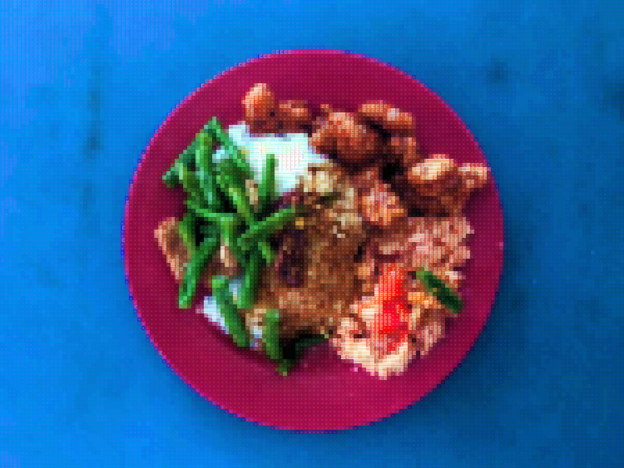
</div>

## Stack

* *Frontend*: [React](https://react.dev), [Vite](https://vitejs.dev) 
* *Backend*: [Node.js](https://nodejs.org), [Express.js](https://expressjs.com), [Mongoose](https://mongoosejs.com)
* *Database*: [MongoDB](https://www.mongodb.com) 
* *Dataset*: [Food 101](https://www.kaggle.com/datasets/dansbecker/food-101)
* *Computer Vision*: [Sharp](https://sharp.pixelplumbing.com) 
* *LLM*: [Gemini](https://ai.google.dev) 
* *Training*: [PyTorch](https://pytorch.org), [ONNX Runtime](https://onnxruntime.ai)

## Screenshot

### Classification Model Training (TUI)

<div align="center">
  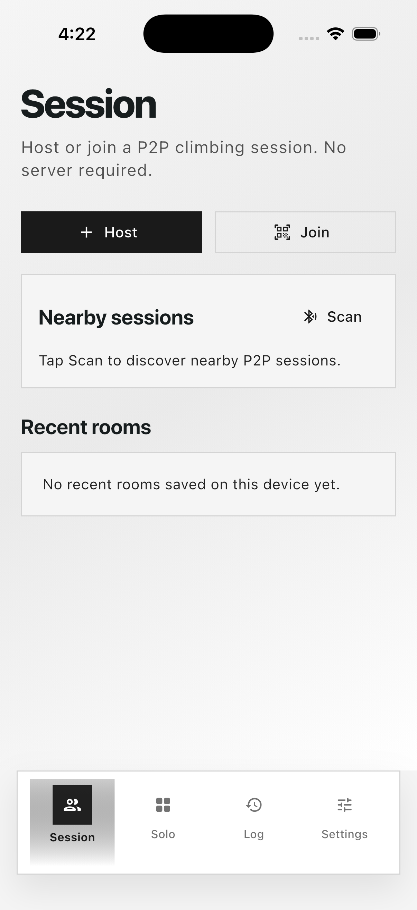
  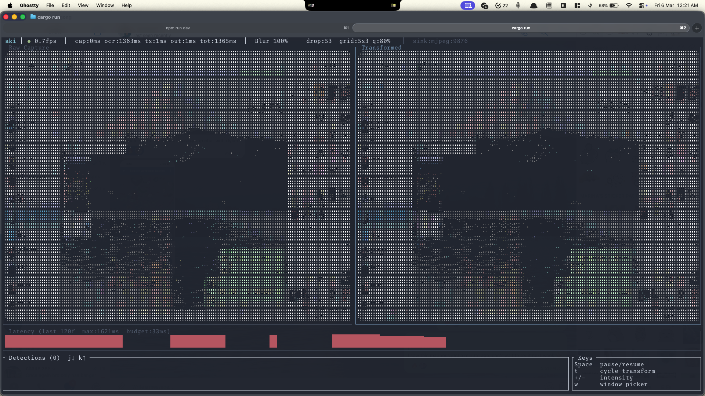
  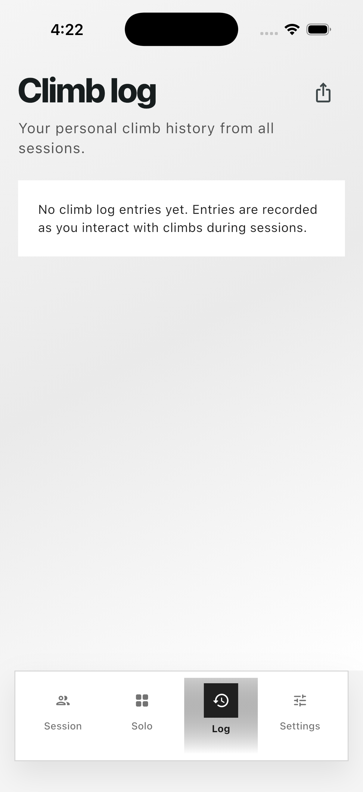
</div>

<div align="center">
  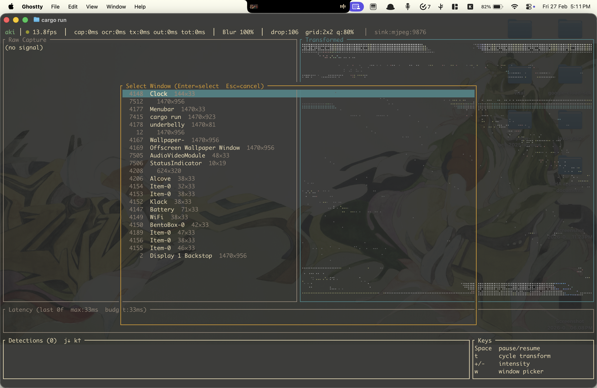
  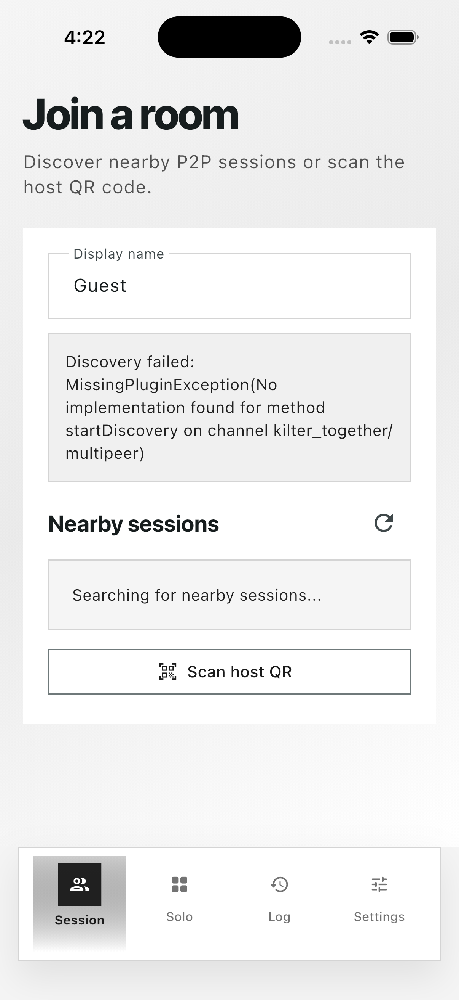
  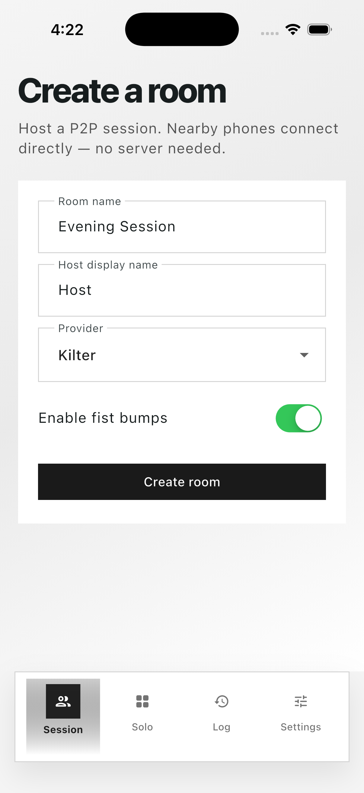
</div>

### Macros Estimation Frontend (Web App)

<div align="center">
  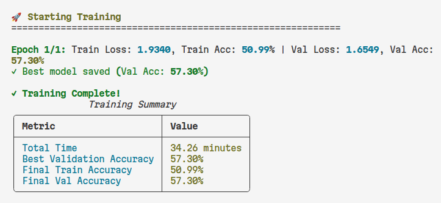
  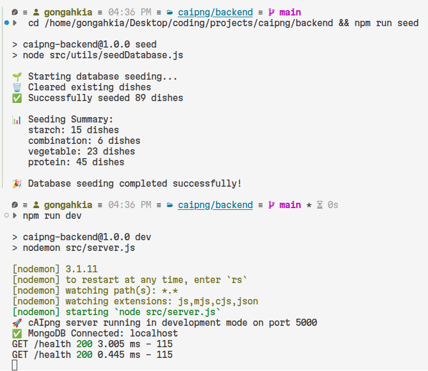
</div>

<div align="center">
  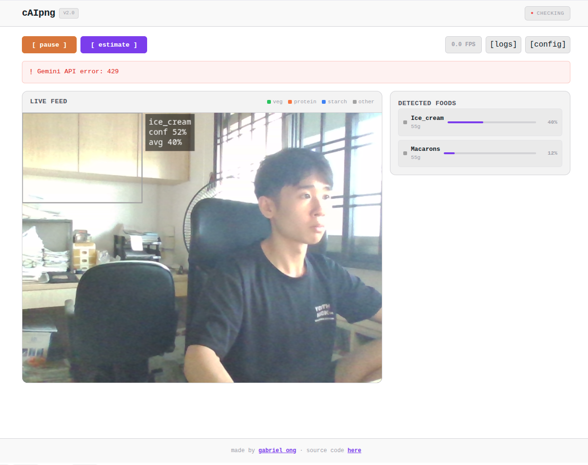
  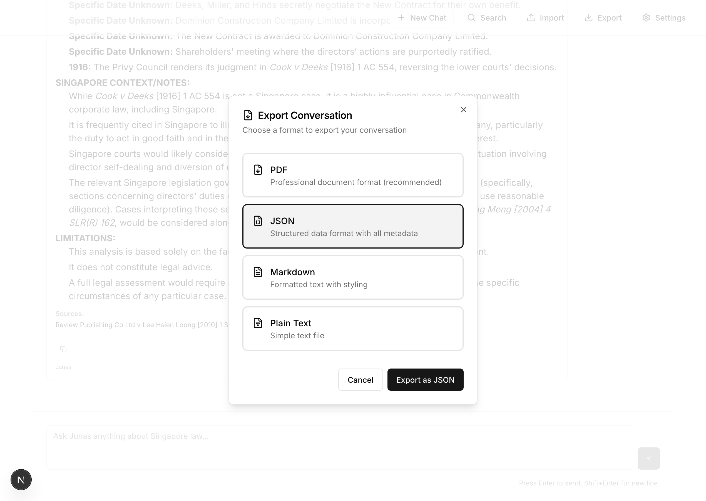
</div>

<div align="center">
  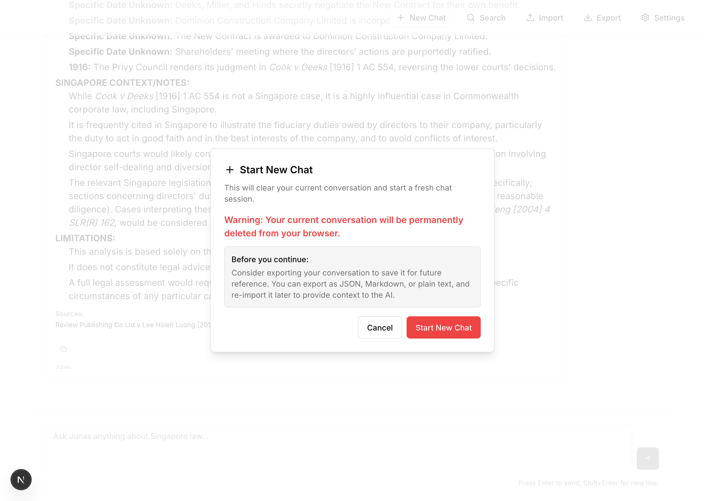
  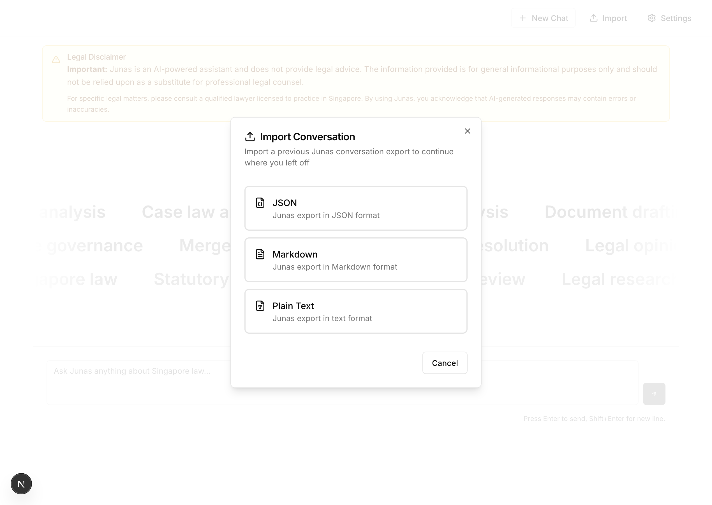
</div>

## Usage

The below instructions are for locally hosting `cAIpng`.

1. First execute the below.

```console
$ git clone https://github.com/gongahkia/caipng.git && cd caipng
```

2. Set up MongoDB [locally](https://www.mongodb.com/docs/manual/tutorial/install-mongodb-on-ubuntu/) or via [MongoDB Atlas](https://www.mongodb.com/cloud/atlas).

3. Create and fill up `backend/.env`.

```env
NODE_ENV=development
PORT=5000
MONGODB_URI=mongodb://localhost:27017/caipng
GEMINI_API_KEY=your_gemini_api_key
GEMINI_MODEL=gemini-1.5-flash
MAX_FILE_SIZE=10485760
UPLOAD_PATH=./uploads
CORS_ORIGIN=http://localhost:3000
```

4. Create and fill up `frontend/.env`.

```env
VITE_API_URL=http://localhost:5000/api
VITE_MAX_IMAGE_SIZE=10485760
```

4. Install dependencies and seed database:

```console
$ cd backend && npm install
$ npm run seed
$ cd ../frontend && npm install
$ cd ..
```

5. Run in separate terminals.

```console
$ cd backend && npm run dev
$ cd frontend && npm run dev
```

* Frontend: http://localhost:3000
* Backend API: http://localhost:5000
* Health Check: http://localhost:5000/health

## Architecture

* Browser captures frames
* Backend runs neural network inference and returns bounding boxes with confidences at ~5–10 FPS
* Derived text summary is sent to Gemini to estimate macros
* No images are sent to the LLM

<image src="./asset/reference/architecture.png" width="90%">

## API Reference

### Base URL
- **Development**: `http://localhost:5000`
- **Production**: `https://api.caipng.example.com`

### Endpoints

#### Health Check
```http
GET /health
```

**Response**:
```json
{
  "success": true,
  "message": "cAIpng server is running",
  "timestamp": "2024-01-01T12:00:00.000Z"
}
```

#### Live Analyze Frame
```http
POST /api/live/analyze
Content-Type: application/json

{
  "imageBase64": "data:image/jpeg;base64,..."
}
```

Response:
```json
{
  "success": true,
  "detections": [
    { "label": "vegetable", "confidence": 0.76, "box": { "x": 100, "y": 60, "width": 180, "height": 140 } }
  ]
}
```

#### Estimate Macros (LLM)
```http
POST /api/live/macros
Content-Type: application/json

{
  "derivedText": "Detected items (rolling):\nvegetable: avgConfidence=78%\nprotein: avgConfidence=65%\n"
}
```

Response:
```json
{
  "success": true,
  "macros": { "calories": 640, "protein": 28, "carbs": 70, "fat": 20 },
  "narrative": "Estimated based on detected categories and common portions."
}
```
