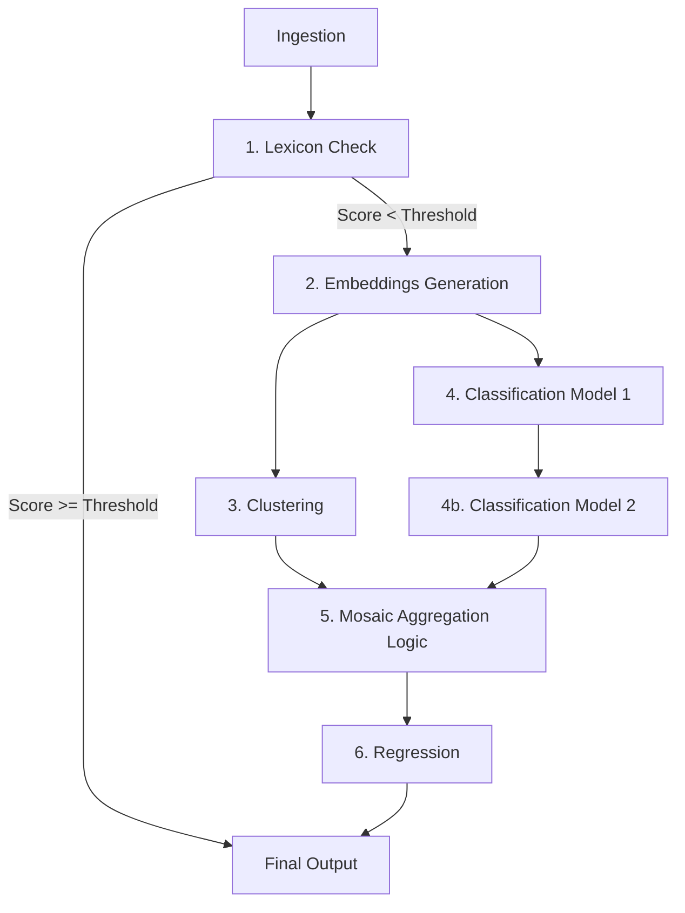

# Noupe

## Architecture


```mermaid
flowchart TD
    In[Ingestion] --> L1[1. Lexicon Check]

    L1 -->|"Score < Threshold"| L2[2. Embeddings Generation]
    L1 -->|"Score >= Threshold"| Out2

    %% Parallel processing
    L2 --> L3[3. Clustering]
    L2 --> L4[4. Classification Model 1]

    %% Sequential from Model 1
    L4 --> L4b[4b. Classification Model 2]

    %% Convergence to Mosaic
    L3 --> L5[5. Mosaic Aggregation Logic]
    L4b --> L5

    %% Convergence to Regression
    L5 --> Reg[6. Regression]

    Reg --> Out2["Final Output"]
```

## Ingestion schema (for training data)

```json
{
    document_id: UID,
    document_sentence_array: [
        "sentence 1": {
            "text": String,
            "label": String,
        },
        "sentence 2": {
            "text": String,
            "label": String,
        },
        "sentence 3": {
            "text": String,
            "label": String,
        },
        // ... 
    ]
}
```

## Ingestion schema (for test set)

```json
{
    document_creation: DateTime,
    document_id: UID,
    document_name: String,
    document_file_type: String,
    document_num_pages: int,
    document_num_sentences: int,
    document_token_count: int,
    document_permissions: String|null,
    document_raw_text: String,
    document_sentence_array: [
        "sentence 1": {
            "start": int,
            "end": int,
            "text": String,
            "label": String,
        },
        "sentence 2": {
            "start": int,
            "end": int,
            "text": String,
            "label": String,
        },
        "sentence 3": {
            "start": int,
            "end": int,
            "text": String,
            "label": String,
        },
        // ... 
    ],
}
```

## Output schema (for test set)

```json
{
    // backend metadat
    transaction_id: UID,

    // document metadata
    document_creation: DateTime,
    document_id: UID,
    document_name: String,
    document_file_type: String,
    document_num_pages: int,
    document_num_sentences: int,
    document_token_count: int,
    document_permissions: String|null,
    document_id: UID,

    // layer 1
    document_lexicon_check: Boolean,
    document_lexicon_score: Double,
    document_lexicon_blacklist: Null|[String],

    // layer 2
    document_clustering_anomaly_check: Boolean,
    document_clustering_anomalous_cluster_score: Null|Double,
    document_clustering_path_length: Int,

    // layer 3
    document_classification_model_1_check: Boolean,
    document_classification_model_1_classification_score: Double,

    // layer 4
    document_classification_model_2_check: Boolean,
    document_classification_model_2_classification_score: Double,

    // layer 5
    document_mosaic_aggregation_check: Boolean,
    document_mosaic_aggregation_score: Null|Double,

    // layer 6
    document_risk_probability: Double,
    document_feature_importance_tree: [feature_1, feature_2, feature_3],

    document_sentence_array: [
        "sentence 1": {
            "start": int,
            "end": int,
            "text": String,
            "label": String,
        },
        "sentence 2": {
            "start": int,
            "end": int,
            "text": String,
            "label": String,
        },
        "sentence 3": {
            "start": int,
            "end": int,
            "text": String,
            "label": String,
        },
        // ... 
    ]
}

```
