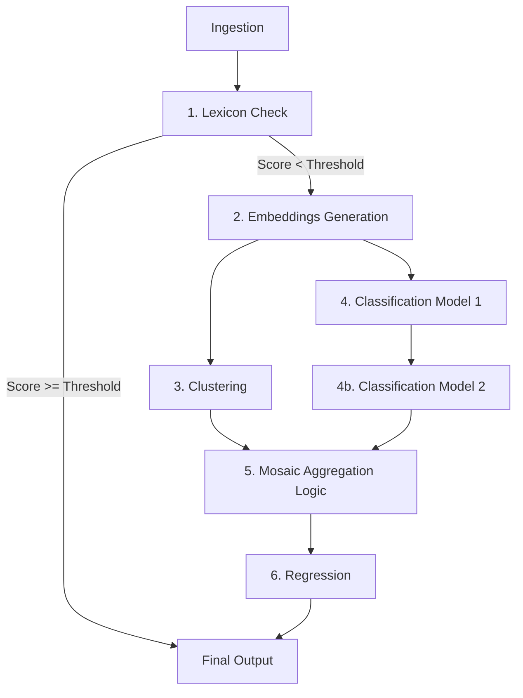

# Noupe

## Architecture


```mermaid
flowchart TD
    In[Ingestion] --> L1[1. Lexicon Check]

    L1 -->|"Score < Threshold"| L2[2. Embeddings Generation]
    L1 -->|"Score >= Threshold"| Out2

    %% Parallel processing
    L2 --> L3[3. Clustering]
    L2 --> L4[4. Classification Model 1]

    %% Sequential from Model 1
    L4 --> L4b[4b. Classification Model 2]

    %% Convergence to Mosaic
    L3 --> L5[5. Mosaic Aggregation Logic]
    L4b --> L5

    %% Convergence to Regression
    L5 --> Reg[6. Regression]

    Reg --> Out2["Final Output"]
```

## Ingestion schema (for training data batches)

```json
{
    batch_name: String,
    batch_creation: DateTime,
    documents: [
        {
            "document_creation": DateTime,
            "document_name": String,
            "document_sentence_array": [
                {
                    "text": String,
                    "label": String
                }
                // ...
            ]
        }
    ]
}
```

## Ingestion schema (for test set)

Canonical request/response and diagnostics contracts live in `docs/schema.md`.

## Output schema (for test set)

Canonical API output fields live in `docs/schema.md`.
