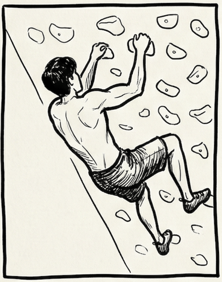
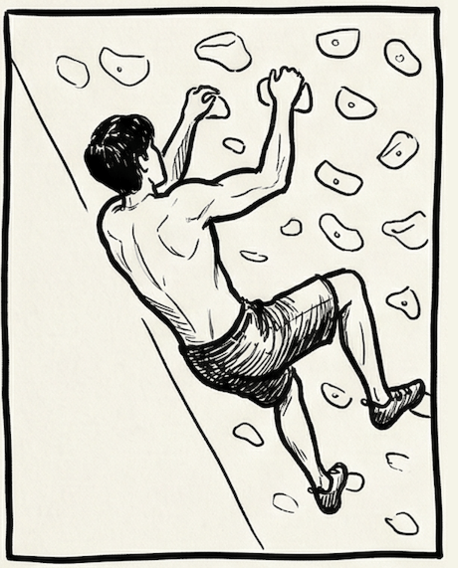

[](https://github.com/gongahkia/kilter-together/releases/tag/1.0.0)


# `Kilter Together`

[Collaborative](#features) [P2P](#other-nerd-stuff) [Sessioning app](#architecture) for the climbing community.

***Currently supports [Kilter & Crux boards](#supported-boards)!!!***

<div align="center">
  
</div>

## Stack

* *Frontend, Backend*: [Dart](https://dart.dev), [Riverpod](https://riverpod.dev), [GoRouter](https://pub.dev/packages/go_router), [qr_flutter](https://pub.dev/packages/qr_flutter), [mobile_scanner](https://pub.dev/packages/mobile_scanner), [app_links](https://pub.dev/packages/app_links)
* *Framework*: [Flutter](https://flutter.dev)
* *DB*: [SQLite](https://pub.dev/packages/sqflite), [SharedPreferences](https://pub.dev/packages/shared_preferences), [Flutter Secure Storage](https://pub.dev/packages/flutter_secure_storage)
* *P2P Transport Layer*: [Google Nearby Connections](https://developers.google.com/nearby/connections/overview), [Apple Multipeer Connectivity](https://developer.apple.com/documentation/multipeerconnectivity)
* *Native Bridges*: [Kotlin](https://kotlinlang.org), [Swift](https://developer.apple.com/swift/)
* *Networking*: [Dio](https://pub.dev/packages/dio)
* *Package*: [pub](https://pub.dev)
* *CI/CD*: [GitHub Actions](https://github.com/features/actions)

## Usage

The below instructions are for building `Kilter Together` from source.

1. First run the below to install `Kilter Together` on your local machine.

```console
$ git clone https://github.com/gongahkia/kilter-together && cd kilter-together-mobile
```

2. Then run the below to build `Kilter Together` on [your device](#supported-platforms).

```
$ flutter pub get
$ flutter run
```

3. See [here](#other-nerd-stuff) for more nerd details.

## Features

* Create and host collaborative climbing sessions *(Kilter Board, Crux-supported boards)*
* Join sessions via QR scan, deep link, or nearby discovery
* Vote on climbs with real-time sync
* Manage climb queue and finalists
* Solo catalog browsing with grade filtering
* Session recap with local history
* Offline-first Kilter dataset
* Plan sharing between sessions

## Screenshots

<div align="center">
  
  
  
</div>

<div align="center">
  
  
  
</div>

## Architecture


## Supported platforms

| Platform | P2P Sessions | Solo Browsing | Notes |
|----------|:------------:|:-------------:|-------|
| Android  | Yes | Yes | [Google Nearby Connections](https://developers.google.com/nearby/connections/overview) via `P2P_STAR` strategy |
| iOS      | Yes | Yes | [Apple Multipeer Connectivity](https://developer.apple.com/documentation/multipeerconnectivity) with required encryption |

## Supported boards

| Board | Room Mode | Solo Mode | Angles | Notes |
|-------|:---------:|:---------:|--------|-------|
| [Kilter Board](https://settercloset.com/pages/kilter-board) | Yes | Yes | 5° to 70° *(14 settings, 5° increments)* | Full offline catalog with climb grades, hold positions, setter info and ascend counts |
| [Crux](https://cruxclimbing.com) | Yes | Yes | Gym-specific | Integrated via provider-agnostic `ProviderClimb` model; requires gym slug + wall ID |

## Other nerd stuff

### P2P, not WebRTC

Kilter Together does **not** use [WebRTC](https://webrtc.org). WebRTC is designed for browser-based real-time media streaming (audio, video, data channels) and requires a **signaling server** to negotiate connections via [ICE](https://developer.mozilla.org/en-US/docs/Web/API/WebRTC_API/Protocols#ice)/[STUN](https://developer.mozilla.org/en-US/docs/Web/API/WebRTC_API/Protocols#stun)/[TURN](https://developer.mozilla.org/en-US/docs/Web/API/WebRTC_API/Protocols#turn).

Instead, we use **platform-native P2P** frameworks that discover and connect peers directly over local Wi-Fi and Bluetooth without any server at all:

* **Android**: [Google Nearby Connections API](https://developers.google.com/nearby/connections/overview) with the `P2P_STAR` topology. The host advertises a service ID derived from the room slug; guests discover nearby hosts and call `requestConnection()`. Payloads are exchanged as raw bytes over the Nearby Connections byte channel.
* **iOS**: [Apple Multipeer Connectivity](https://developer.apple.com/documentation/multipeerconnectivity) via a native [Swift plugin](kilter-together-mobile/ios/Runner/MultipeerPlugin.swift) bridged to Dart through `MethodChannel` + `EventChannel`. The plugin uses `MCNearbyServiceAdvertiser` / `MCNearbyServiceBrowser` for discovery and `MCSession` for data transfer. Encryption is set to `.required`. The service type is sanitised to Apple's 15-character limit.

Both transports implement the same abstract [`P2pTransport`](kilter-together-mobile/lib/core/p2p/p2p_transport.dart) interface: `startAdvertising`, `startDiscovery`, `connectToPeer`, `send`, `broadcast`, and reactive streams for `messages`, `discoveredPeers`, and `connectionChanges`. A [`StubTransport`](kilter-together-mobile/lib/core/p2p/stub_transport.dart) throws `UnsupportedError` on desktop/web so the app still compiles but clearly surfaces that P2P is unavailable. Platform selection happens at the Riverpod provider level in [`p2p_provider.dart`](kilter-together-mobile/lib/core/p2p/p2p_provider.dart).

### Why P2P over server-client?

An earlier version of this app used a [Go](https://go.dev) backend to relay all session traffic. It was removed in favour of direct peer-to-peer for the following reasons:

1. **No infrastructure to maintain**: Zero servers, zero cloud bills, zero uptime obligations. The host's phone *is* the server.
2. **Offline-capable**: Sessions work wherever peers share a local network (gym Wi-Fi, Bluetooth). No internet required.
3. **Lower latency**: Messages travel directly between devices instead of bouncing through a remote server.
4. **Horizontal scaling for free**: Every session is an independent peer group. There is no central bottleneck regardless of how many concurrent sessions exist worldwide.
5. **User data stays local**: No session data ever leaves the participants' devices. Privacy by architecture.

### Host-Guest architecture

Every P2P session follows a **host-guest** model:

* The **host** owns the authoritative room state ([`HostRoomService`](kilter-together-mobile/lib/core/p2p/host_room_service.dart)): participants, queue, finalists, votes, current climb and settings. The host serialises this state to `SharedPreferences` after every mutation for crash recovery.
* **Guests** are thin clients ([`GuestRoomService`](kilter-together-mobile/lib/core/p2p/guest_room_service.dart)) that send action messages (vote, add to queue, update status) and receive the full room state back via `roomStateUpdate` broadcasts.
* All messages are UTF-8 JSON encoded with `{type, payload, senderId}`.
* A role-based permission system (host, co-host, participant) gates privileged actions like managing participants, changing surfaces, or closing the room.

### How boards are loaded

1. **Bootstrap**: On first launch (or after a cache wipe), the app downloads the full Kilter climb catalog from a remote API in paginated 200-climb pages and writes it into a local [SQLite database](kilter-together-mobile/lib/core/storage/offline_kilter_catalog_repository.dart) (`catalog.db`). Board metadata (`BoardOption` contains id, name, kilter name, preview image, climb count) is stored alongside climb data.
2. **Delta sync**: On subsequent launches and app resumes, only new or updated climbs are fetched using a `syncToken`, keeping the local catalog current without re-downloading everything.
3. **Querying**: Climbs are queried entirely offline from SQLite with filters for board ID, angle, grade range, setter, search text and sort order (popular/newest). Results are paginated.
4. **Catalog relay**: In a P2P session, guests don't need their own catalog. The [`CatalogRelayService`](kilter-together-mobile/lib/core/p2p/catalog_relay_service.dart) on the host phone intercepts `catalogQuery` messages from guests, queries the host's local SQLite, and sends back paginated climb results over the P2P channel (10-second timeout per query).
5. **Crux boards**: Loaded via a provider-agnostic model (`ProviderClimb`) that supports any board manufacturer. Crux boards are identified by gym slug and wall ID, with climbs fetched through provider-specific API endpoints.

<div align="center">
  
</div>