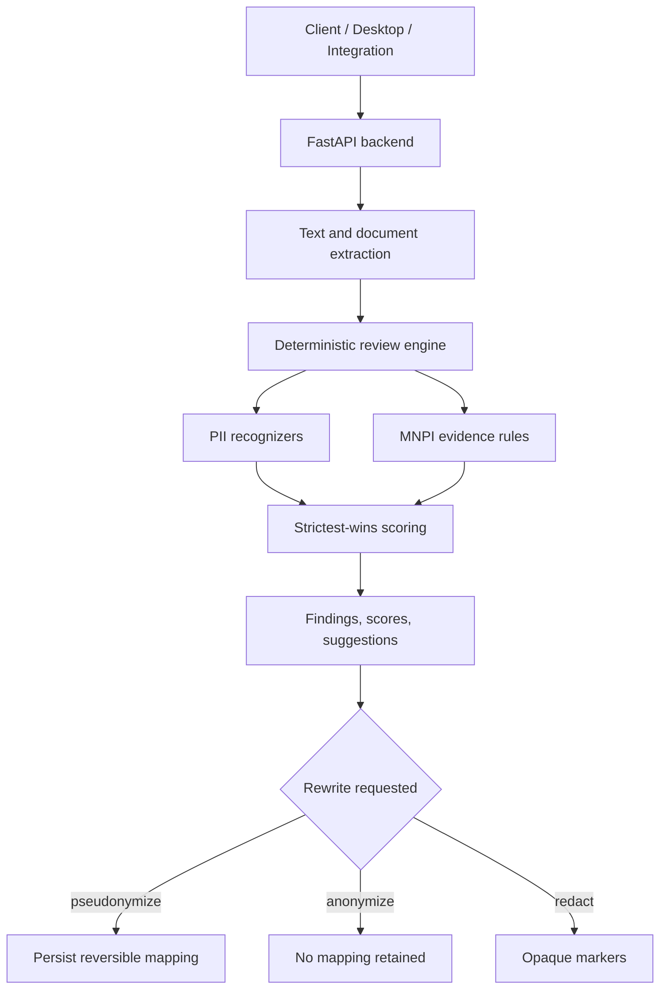

# Kaypoh

<p align="center">
  
</p>

<p align="center">
  <a href="https://github.com/gongahkia/kaypoh/actions/workflows/ci.yml"></a>
  
  
  
</p>

API-first pre-send safety for PII anonymization and MNPI review.

Kaypoh reviews text and documents before they are sent to GenAI tools, email, browser surfaces, Office add-ins, or external counterparties. The deterministic review engine is the runtime source of truth: it detects personal data and material non-public information, returns statute-cited findings, and can pseudonymize, anonymize, redact, or later reidentify approved reversible mappings.

## Table of Contents

- [Quick Start](#quick-start)
- [What Kaypoh Does](#what-kaypoh-does)
- [API Surface](#api-surface)
- [Examples](#examples)
- [How It Works](#how-it-works)
- [Jurisdiction Coverage](#jurisdiction-coverage)
- [Runtime Modes](#runtime-modes)
- [Documentation](#documentation)
- [Development & Evaluation](#development--evaluation)
- [Packaging & Deployment](#packaging--deployment)
- [Screenshots](#screenshots)
- [License](#license)

## Quick Start

Install dependencies and the local spaCy model:

```bash
uv sync --extra dev
uv run python -m spacy download en_core_web_sm
```

Run preflight:

```bash
uv run python scripts/preflight.py --strict
```

Start the deterministic backend:

```bash
./scripts/launch/run_backend_only.sh
```

Check readiness:

```bash
curl http://127.0.0.1:8000/ready
```

Review and pseudonymize a document:

```bash
curl -X POST http://127.0.0.1:8000/pseudonymize \
  -H "Content-Type: application/json" \
  -d '{
    "text": "Send Dr Jane Tan S1234567D the confidential draft.",
    "source_jurisdiction": "SG",
    "destination_jurisdiction": "US",
    "document_type": "SPA"
  }'
```

Run the standard verification gate:

```bash
./scripts/verify_runtime.sh
```

## What Kaypoh Does

- Detects PII and personal data across universal identifiers, jurisdiction-specific IDs, special-category data, quasi-identifiers, and privacy-handling events.
- Detects MNPI and inside-information signals such as material events, non-public markers, deal codenames, tipping language, selective disclosure risk, blackout windows, ESG/cyber/crypto pre-disclosure, sector MNPI, and conjunctive MNPI evidence.
- Applies source and destination jurisdictions with strictest-wins scoring.
- Returns findings, scores, suggestions, statutory rationales, timings, degraded-mode metadata, and optional audit evidence.
- Rewrites text through three distinct data states:
  - `/pseudonymize`: reversible deterministic placeholders plus mapping.
  - `/anonymize`: irreversible placeholder-only output with no retained mapping.
  - `/redact`: opaque markers without original matched text in the redaction response.
- Restores reversible pseudonymized text through `/reidentify` when the caller supplies a mapping or a persisted document hash.
- Scrubs supported document metadata leakage through `/documents/scrub`.
- Keeps optional public evidence and LLM helper layers disabled unless explicitly enabled by deployer and tenant gates.

Kaypoh is not a general DLP suite, legal-advice product, or model-training platform. It is a pre-send safety layer intended to integrate with DLP, DMS, Office/browser surfaces, and identity gateways.

## API Surface

Runtime:

- `GET /health`
- `GET /ready`
- `GET /diagnostics`
- `GET /metrics`

Review and rewrite:

- `POST /review`
- `POST /pseudonymize`
- `POST /anonymize`
- `POST /redact`
- `POST /reidentify`
- `POST /documents/scrub`

Compatibility:

- `POST /classify`
- `POST /classify/batch`

Review-session and local desktop support:

- `POST /review/{review_id}/decision`
- `GET /review/{review_id}`
- `GET /local/pairing/status`
- `POST /local/pairing/start`
- `POST /local/pairing/approve`
- `POST /local/pairing/claim`

Generated integration artifacts live in [`docs/api/`](./docs/api/):

- [`kaypoh.postman_collection.json`](./docs/api/kaypoh.postman_collection.json)
- [`curl_snippets.sh`](./docs/api/curl_snippets.sh)
- [`python_client.md`](./docs/api/python_client.md)

## Examples

Review without rewriting:

```bash
curl -X POST http://127.0.0.1:8000/review \
  -H "Content-Type: application/json" \
  -d '{
    "text": "Project Raven will acquire GlobalTech for USD 2.5 billion before announcement.",
    "source_jurisdiction": "SG",
    "destination_jurisdiction": "US",
    "document_type": "SPA"
  }'
```

Anonymize irreversibly:

```bash
curl -X POST http://127.0.0.1:8000/anonymize \
  -H "Content-Type: application/json" \
  -d '{
    "text": "Dr Jane Tan, passport E1234567, will receive the memo.",
    "source_jurisdiction": "SG",
    "destination_jurisdiction": "EU"
  }'
```

Use the Python client:

```python
from kaypoh import KaypohClient

with KaypohClient("http://127.0.0.1:8000") as client:
    result = client.classify(
        text="Acme Corp is acquiring GlobalTech for $2.5 billion next quarter.",
        entity_id="acme-corp",
        include_offending_spans=True,
    )
    print(result.classification)
    print(result.findings)
```

Run included client examples:

```bash
python scripts/examples/sync_client_example.py \
  "Acme Corp is acquiring GlobalTech for $2.5 billion next quarter." \
  --include-offending-spans

python scripts/examples/async_client_example.py \
  "Acme Corp is acquiring GlobalTech for $2.5 billion next quarter." \
  --include-offending-spans
```

Regenerate API examples from the live OpenAPI contract:

```bash
python3 scripts/export_openapi_examples.py
```

## How It Works

Kaypoh has five main runtime pieces:

1. The FastAPI backend in [`src/kaypoh/backend/`](./src/kaypoh/backend/) exposes review, rewrite, document, auth, local pairing, observability, and audit endpoints.
2. The deterministic review engine in [`src/kaypoh/review/`](./src/kaypoh/review/) runs universal recognizers, jurisdiction TOML packs, MNPI evidence rules, citations, defined terms, document structure, and strictest-wins scoring.
3. The rewrite layer in [`src/kaypoh/anonymize/`](./src/kaypoh/anonymize/) builds deterministic placeholders, reversible mappings, opaque redactions, and reidentification.
4. Privacy-gated external helpers in [`src/kaypoh/external/`](./src/kaypoh/external/) sanitize outbound queries and optionally fetch public evidence.
5. Advisory helpers in [`src/kaypoh/advisory/`](./src/kaypoh/advisory/) provide optional LLM adjudication, defined-term extraction, and coverage audit paths. These layers are advisory unless explicitly documented otherwise and cannot suppress deterministic-high findings.

Core flow:


```mermaid
flowchart TD
    Client[Client / Desktop / Integration] --> API[FastAPI backend]
    API --> Extract[Text and document extraction]
    Extract --> Engine[Deterministic review engine]
    Engine --> PII[PII recognizers]
    Engine --> MNPI[MNPI evidence rules]
    PII --> Score[Strictest-wins scoring]
    MNPI --> Score
    Score --> Response[Findings, scores, suggestions]
    Response --> Rewrite{Rewrite requested}
    Rewrite -->|pseudonymize| Map[Persist reversible mapping]
    Rewrite -->|anonymize| Placeholders[No mapping retained]
    Rewrite -->|redact| Opaque[Opaque markers]
```

## Jurisdiction Coverage

Kaypoh ships curated jurisdiction packs for:

```text
SG, MY, ID, TH, PH, VN, HK, AU, JP, KR, US, UK, EU, SEA, IN, CN, AE, SA
```

Each pack lives under [`src/kaypoh/review/jurisdictions_data/`](./src/kaypoh/review/jurisdictions_data/) and is mapped to statutory coverage in [`docs/statutory-coverage.md`](./docs/statutory-coverage.md).

Current coverage includes:

- Universal PII detectors: email, phone, passport, bank account, DOB, age, postal address, IP, MAC, IMEI, names, linkable internal IDs, quasi-identifier clusters, and special-category PII.
- Jurisdiction-specific direct identifiers: national IDs, tax IDs, corporate IDs, financial/account references, address formats, and local legal/registry references.
- Privacy event detectors: cross-border transfer, consent withdrawal, data minimisation, personal-data safeguards, and breach notification markers.
- MNPI detectors: deal events, non-public status, financial scalars, contingent language, tipping/selective disclosure, insider-list and information-barrier markers, blackout windows, cyber/ESG/crypto/sector events, and conjunctive MNPI.

Accuracy and corpus notes:

- Generated detector accuracy disclosure: [`docs/accuracy.md`](./docs/accuracy.md)
- Candidate corpus status: [`docs/candidate_corpus_status.md`](./docs/candidate_corpus_status.md)
- Committed evaluation reports: [`reports/layer-attribution/`](./reports/layer-attribution/)
- Known limitations: [`docs/known-limitations.md`](./docs/known-limitations.md)

## Runtime Modes

### Local SKU

`kaypoh-local` is offline-default. It includes the deterministic engine, Presidio, spaCy, FastAPI, document extraction, local mappings, and packaging.

It must not require:

```text
torch, transformers, sentence-transformers, redis, xgboost, scikit-learn, pandas, external HTTP
```

Build the desktop package:

```bash
uv sync --extra local --extra packaging
uv run python -m spacy download en_core_web_sm
uv run pyinstaller packaging/kaypoh-local.spec
./dist/kaypoh-local/kaypoh-local
```

### Server SKU

`kaypoh-server` enables optional public evidence and LLM helper paths for approved tenants.

Public evidence:

```bash
KAYPOH_PUBLIC_EVIDENCE_ENABLED=1 \
KAYPOH_PUBLIC_EVIDENCE_PROVIDER=serper \
SERPER_API_KEY=... \
PIPELINE_LAYERS=public_evidence \
uv run uvicorn kaypoh.backend.main:app --host 0.0.0.0 --port 8000
```

LLM adjudication with remote structured tokens:

```bash
KAYPOH_LLM_ENABLED=1 \
KAYPOH_LLM_PROVIDER=openai \
KAYPOH_LLM_API_KEY=... \
KAYPOH_LLM_BASE_URL=https://api.openai.com/v1 \
KAYPOH_LLM_ALLOW_REMOTE_BASE_URL=1 \
KAYPOH_LLM_TENANT_OPT_IN_OPENAI=1 \
KAYPOH_LLM_INPUT_MODE=structured_tokens \
PIPELINE_LAYERS=llm_adjudicator \
uv run uvicorn kaypoh.backend.main:app --host 0.0.0.0 --port 8000
```

Remote raw text requires an additional explicit opt-in:

```text
KAYPOH_LLM_ALLOW_REMOTE_RAW_TEXT=1
```

`review_profile=strict` never invokes LLM helper layers.

### Docker

```bash
docker compose up --build
curl http://localhost:8000/ready
```

Managed LLM deployment:

```bash
KAYPOH_LLM_API_KEY=... \
KAYPOH_LLM_TENANT_OPT_IN_OPENAI=1 \
SERPER_API_KEY=... \
docker compose -f docker-compose.yml -f docker-compose.managed-llm.yml up --build
```

## Documentation

- [`docs/architecture.md`](./docs/architecture.md): runtime architecture and core flow.
- [`docs/statutory-coverage.md`](./docs/statutory-coverage.md): detector-to-statute coverage map.
- [`docs/known-limitations.md`](./docs/known-limitations.md): unsupported ingest, deployment, and legal/accuracy caveats.
- [`docs/running.md`](./docs/running.md): launch commands and optional layer setup.
- [`docs/install.md`](./docs/install.md): desktop, browser extension, Office add-in, and server install flow.
- [`docs/admin-security.md`](./docs/admin-security.md): tenancy, API keys, JWT, SIEM, and local pairing controls.
- [`docs/threat-model.md`](./docs/threat-model.md): data flow, trust boundaries, threats, controls, and residual risk.
- [`docs/deployment-hardening.md`](./docs/deployment-hardening.md): production filesystem, transport, secrets, Kubernetes, and SIEM guidance.
- [`docs/mapping-store-hardening.md`](./docs/mapping-store-hardening.md): encryption, retention, erasure, and mapping-store controls.
- [`docs/llm-governance.md`](./docs/llm-governance.md): LLM promotion, privacy evaluation, and invariant gates.
- [`docs/schema.md`](./docs/schema.md): API and artifact contracts.
- [`docs/api/`](./docs/api/): Postman, cURL, and Python client integration artifacts.

## Development & Evaluation

Install development dependencies:

```bash
uv sync --extra dev
uv run python -m spacy download en_core_web_sm
```

Run lint and focused runtime checks:

```bash
uv run ruff check
./scripts/verify_runtime.sh
```

Run the full test suite:

```bash
uv run pytest
```

Run recall and generated-doc gates:

```bash
uv run python scripts/recall_gate.py
uv run python scripts/generate_accuracy_doc.py --check
```

Run latency checks:

```bash
./scripts/benchmark_latency_corpus.sh
uv run python scripts/check_latency_slo.py --write-report
```

Candidate and audit tooling:

```bash
uv run python scripts/run_layer_attribution_eval.py
uv run python scripts/export_audit_pack.py "$REVIEW_ID" --output ./out/audit.zip
uv run python scripts/verify_audit_pack.py ./out/audit.zip
uv run python scripts/verify_journal.py
```

Training and optional local-student LLM work lives in [`training/distillation/`](./training/distillation/). It is not part of the offline-default local SKU.

## Packaging & Deployment

Build the macOS desktop bundle:

```bash
uv sync --extra local --extra packaging
uv run python -m spacy download en_core_web_sm
./scripts/package_macos_desktop.sh
```

Optional release signing:

```bash
KAYPOH_CODESIGN_IDENTITY="Developer ID Application: Example Pte Ltd (TEAMID)" \
KAYPOH_NOTARYTOOL_PROFILE=kaypoh-notary \
./scripts/package_macos_desktop.sh
```

Install, update, uninstall:

```bash
packaging/macos/install.sh
packaging/macos/update.sh
packaging/macos/uninstall.sh
```

Package browser extension:

```bash
./scripts/package_browser_extension.sh
```

Package surfaces:

- [`packaging/browser_extension/`](./packaging/browser_extension/): MV3 browser thin client.
- [`packaging/office_addin/`](./packaging/office_addin/): Outlook taskpane and Smart Alerts pre-send hook.
- [`packaging/word_addin/`](./packaging/word_addin/): Word taskpane review surface.
- [`packaging/macos/`](./packaging/macos/): LaunchAgent install, update, uninstall scripts.
- [`packaging/windows/`](./packaging/windows/): Windows packaging notes; Windows desktop packaging is not shipped by default.

## Screenshots

No screenshot assets are currently tracked for README embedding beyond the logo.

Useful screenshots to add under `asset/screenshots/`:

- FastAPI `/docs` showing the active Kaypoh API surface.
- Example `/review` or `/pseudonymize` response with sensitive values redacted.
- macOS local daemon or tray/terminal run state.
- Browser extension pre-send review surface.
- Outlook or Word add-in review surface.
- Audit-pack or diagnostics view if there is a stable UI for it.

Once those files exist, this section can embed them with relative links.

## License

No `LICENSE` file is currently checked in.
