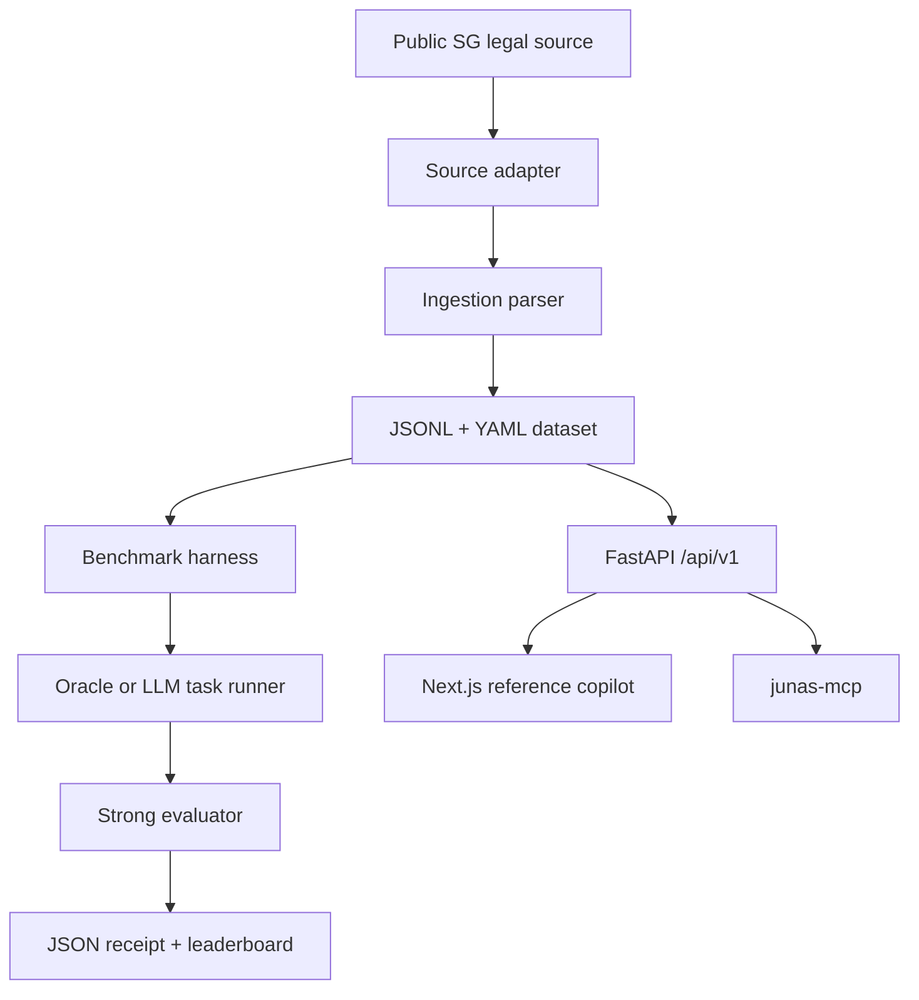
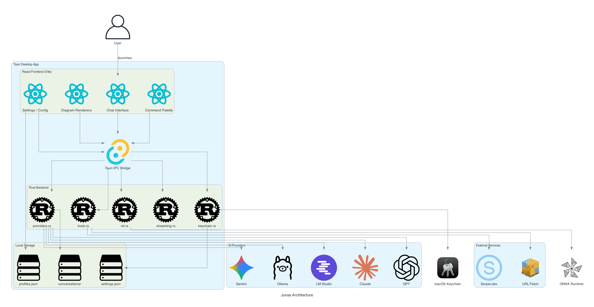
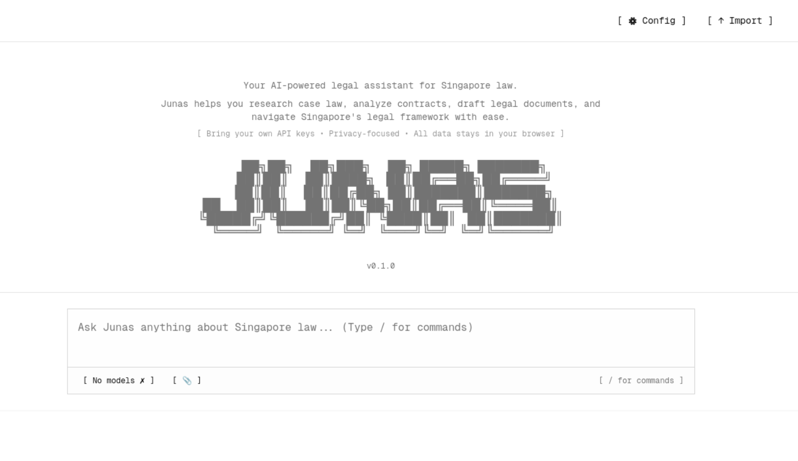
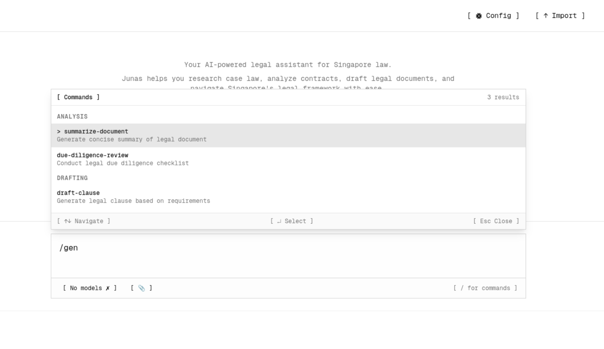
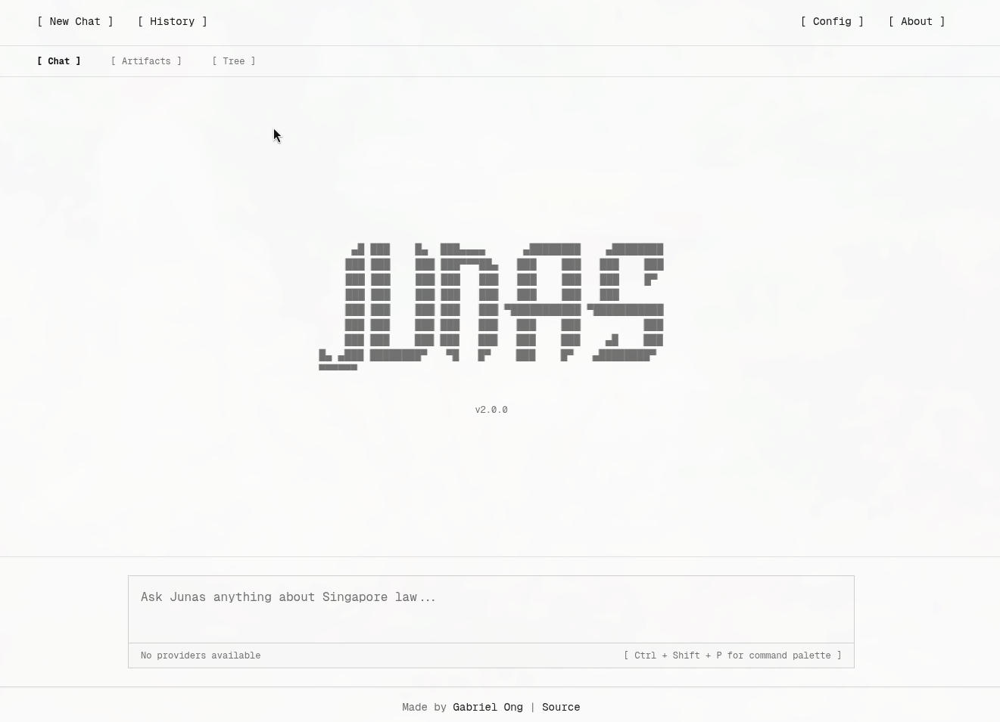
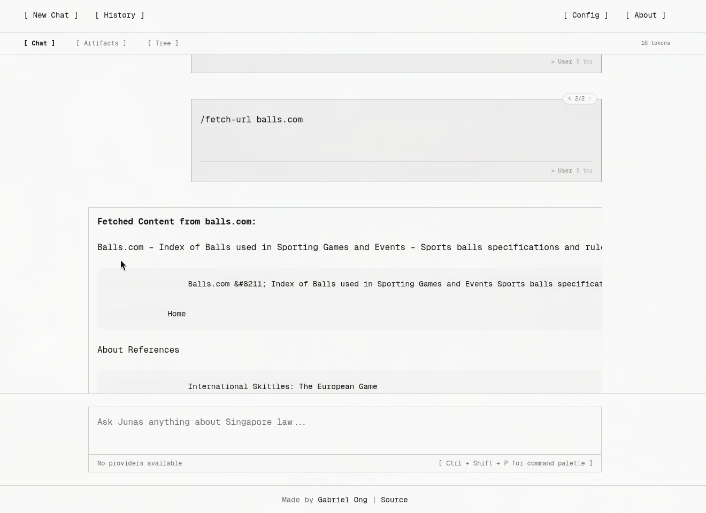
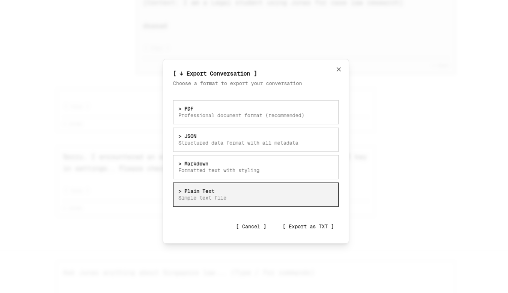
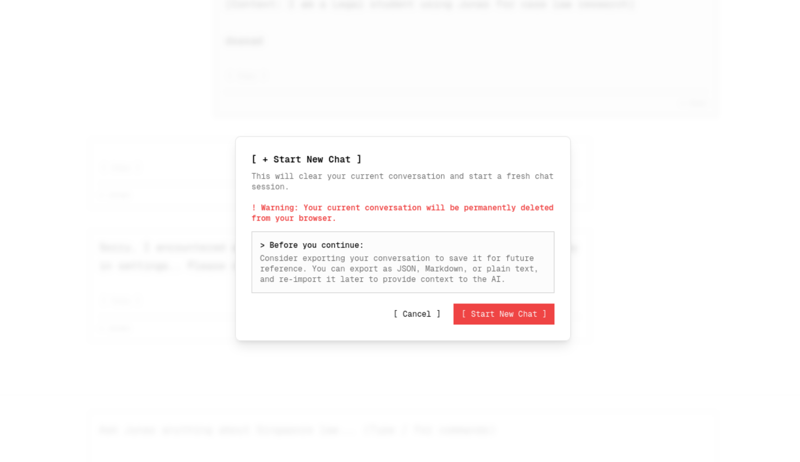
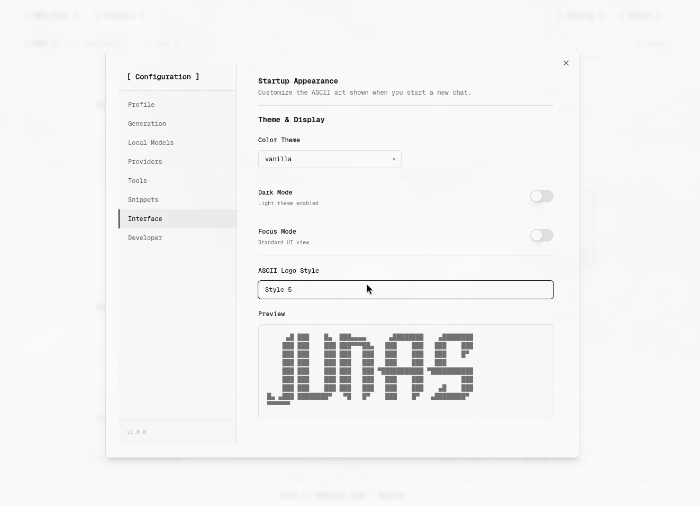

# Junas

<p align="center">
  
</p>

<p align="center">
  <a href="https://github.com/gongahkia/junas/actions/workflows/unified-platform.yml"></a>
  
  
  
  
  
</p>

Singapore legal AI benchmark infrastructure plus a reference copilot.

Junas contains SG-LegalBench, a Singapore-focused legal LLM evaluation suite, and a minimal copilot built on the same backend. The benchmark turns public Singapore legal sources into reproducible tasks with disclosed source provenance, strong evaluators, and JSON receipts for baseline runs. The copilot exposes the surrounding retrieval, citation, statute, glossary, document, NER, contract, compliance, clause, and template utilities through a Next.js UI and FastAPI API.

Junas is research infrastructure, not legal advice.

## Table of Contents

- [Quick Start](#quick-start)
- [What Junas Does](#what-junas-does)
- [API Surface](#api-surface)
- [Examples](#examples)
- [How It Works](#how-it-works)
- [Benchmark Coverage](#benchmark-coverage)
- [Runtime Modes](#runtime-modes)
- [Documentation](#documentation)
- [Development & Evaluation](#development--evaluation)
- [Packaging & Deployment](#packaging--deployment)
- [Screenshots](#screenshots)
- [License](#license)
- [Disclaimer](#disclaimer)

## Quick Start

Install backend dependencies:

```bash
python3.11 -m venv .venv
. .venv/bin/activate
python -m pip install -e backend
python -m pip install pytest pytest-asyncio ruff mypy
```

Install frontend dependencies:

```bash
cd frontend
npm ci
cd ..
```

Create local configuration:

```bash
cp .env.example .env
```

Start local infra:

```bash
docker compose up -d postgres elasticsearch qdrant redis
```

Run migrations:

```bash
make migrate
```

Start backend and frontend:

```bash
make dev
```

Check readiness:

```bash
curl http://127.0.0.1:8000/api/v1/ready
```

Open the frontend:

```text
http://127.0.0.1:3000
```

Run the benchmark harness smoke listing:

```bash
cd backend
../.venv/bin/python -m benchmark.cli list
```

## What Junas Does

- Ships SG-LegalBench task specs under [`docs/sglb_specs/`](./docs/sglb_specs/) and runnable benchmark datasets under [`backend/benchmark/datasets/`](./backend/benchmark/datasets/).
- Evaluates Singapore legal AI behaviours such as PDPC outcome prediction, statute QA, citation verification, ROC 2021 procedural routing, citation hallucination detection, counterfactual outcome checks, and review red-flag recall.
- Uses public-source adapters for benchmark material: PDPC, Singapore Statutes Online, MOM, CommonLII SG, AustLII SG, IRAS, Hansard, and eLitigation stubs with eligibility gates.
- Keeps paywalled sources in `user_credentialed` adapters for copilot-only use; benchmark rows must pass the public-adapter gate.
- Provides a FastAPI backend for chat, research, retrieval, statutes, glossary search, NER, contract classification, ToS scanning, compliance checks, document parsing, templates, clauses, benchmarks, and DOCX exports.
- Provides a Next.js frontend with pages for the landing task table, leaderboard/runs, BYOK chat, research, case search, statutes, glossary, legal sources, contracts, NER, compliance, clauses, templates, settings, and batch analysis.
- Supports BYOK chat providers: Anthropic Claude, OpenAI, Google Gemini, Ollama, and LM Studio.
- Exposes a local MCP server (`junas-mcp`) with health, benchmark, citation, statute, retrieval, and compliance tools.
- Publishes a dependency-light [`sglb-tools`](./packages/sglb-tools/) package for citation validation, section normalisation, and source-adapter data envelopes.

Junas is not a practice-advice product, a lawyer-credentialed authority, a case-prediction product, or a multi-jurisdiction legal platform. Benchmark labels are intended to be mechanically derived from public regulator, statute, court, or fixture outputs and reported with limitations.

## API Surface

All HTTP routes are mounted under `/api/v1`.

Runtime:

- `GET /health`
- `GET /ready`
- `GET /metrics`

Chat and research:

- `POST /chat/stream`
- `POST /chat/send`
- `GET /chat/providers`
- `POST /research/ask`
- `GET /research/conversations/{conversation_id}`
- `DELETE /research/conversations/{conversation_id}`
- `GET /research/config`

Search and source lookup:

- `GET /glossary/search`
- `GET /glossary/term/{phrase}`
- `GET /glossary/compare`
- `GET /glossary/suggest`
- `GET /glossary/jurisdictions`
- `GET /statutes/search`
- `GET /statutes/section/{number}`
- `GET /statutes/chapters`
- `GET /statutes/chapter/{chapter_number}`
- `POST /search/cases`
- `GET /search/cases/{case_id}`
- `GET /search/charges`
- `GET /search/metrics`
- `GET /legal-sources/sso`
- `GET /legal-sources/commonlii`
- `GET /jurisdictions`
- `GET /jurisdictions/{jurisdiction_id}`

Legal utilities:

- `POST /ner/extract`
- `POST /ner/batch`
- `GET /ner/entity-types`
- `POST /contracts/classify`
- `POST /contracts/scan-tos`
- `GET /compliance/rules`
- `POST /compliance/check`
- `POST /documents/parse`
- `GET /clauses`
- `GET /clauses/{clause_id}`
- `GET /clauses/{clause_id}/tone/{tone}`
- `GET /templates`
- `GET /templates/{template_id}`
- `POST /templates/{template_id}/render`

Benchmarks and exports:

- `GET /benchmarks/tasks`
- `GET /benchmarks/evaluators`
- `POST /benchmarks/run`
- `GET /benchmarks/leaderboard`
- `GET /benchmarks/runs/{run_id}`
- `GET /exports/receipt/{run_id}.docx`
- `POST /exports/session/{session_id}.docx`

Generated OpenAPI docs are available at:

```text
http://127.0.0.1:8000/docs
http://127.0.0.1:8000/redoc
```

## Examples

List benchmark tasks and evaluators:

```bash
cd backend
../.venv/bin/python -m benchmark.cli list
```

Run the SGLB-04 citation-verification smoke dataset:

```bash
cd backend
../.venv/bin/python -m benchmark.cli run \
  --workflow sglb_04 \
  --dataset benchmark/datasets/sglb_04_citation_verify_smoke.yaml \
  --evaluator multi_label_f1 \
  --strict
```

Run a benchmark through HTTP:

```bash
curl -X POST http://127.0.0.1:8000/api/v1/benchmarks/run \
  -H "Content-Type: application/json" \
  -d '{
    "workflow": "sglb_04",
    "dataset": "benchmark/datasets/sglb_04_citation_verify_smoke.yaml",
    "evaluators": ["multi_label_f1"],
    "strict": true
  }'
```

List BYOK chat providers:

```bash
curl http://127.0.0.1:8000/api/v1/chat/providers
```

Ask the research endpoint:

```bash
curl -X POST http://127.0.0.1:8000/api/v1/research/ask \
  -H "Content-Type: application/json" \
  -d '{
    "question": "What obligations does the PDPA impose on organisations?",
    "sources": ["statute", "glossary"],
    "top_k": 8
  }'
```

Run the MCP server:

```bash
make mcp
make mcp MCP_HTTP=1
```

## How It Works

Junas has six main runtime pieces:

1. The FastAPI backend in [`backend/api/`](./backend/api/) owns HTTP routing, auth/rate-limit middleware, CORS, health checks, service wiring, and optional Logfire instrumentation.
2. The benchmark harness in [`backend/benchmark/`](./backend/benchmark/) loads YAML datasets, runs registered oracle or LLM-backed tasks, applies evaluator registries, and writes JSON receipts.
3. The ingestion layer in [`backend/data/`](./backend/data/) converts public SG legal sources into structured JSONL and benchmark-ready case files.
4. The source-adapter layer in [`backend/api/adapters/`](./backend/api/adapters/) enforces public-vs-credentialed source separation and provenance envelopes.
5. The Next.js frontend in [`frontend/`](./frontend/) calls one browser API boundary, renders chat/research/benchmark/tool pages, stores chat history locally, and supports BYOK provider keys.
6. The MCP server in [`backend/mcp/`](./backend/mcp/) exposes selected benchmark and legal utilities to MCP-compatible clients.

Core flow:


```mermaid
flowchart TD
    Source[Public SG legal source] --> Adapter[Source adapter]
    Adapter --> Ingest[Ingestion parser]
    Ingest --> Dataset[JSONL + YAML dataset]
    Dataset --> Harness[Benchmark harness]
    Harness --> Task[Oracle or LLM task runner]
    Task --> Evaluator[Strong evaluator]
    Evaluator --> Receipt[JSON receipt + leaderboard]
    Dataset --> API[FastAPI /api/v1]
    API --> UI[Next.js reference copilot]
    API --> MCP[junas-mcp]
```

Architecture reference:

<p align="center">
  
</p>

## Benchmark Coverage

Current repository state:

| ID | Task | Current repo state | Primary data or fixture |
|---|---|---|---|
| SGLB-01 | PDPA-Outcome | shipped, registered, leaderboard-eligible | 211 JSONL/YAML cases |
| SGLB-02 | Statute-QA | shipped, registered, leaderboard-eligible | 78-case PDPA smoke, 500-case full YAML |
| SGLB-03 | Case-Holding | spec/deferred | no runner or dataset |
| SGLB-04 | Citation-Verify | shipped, registered, leaderboard-eligible | 30-case smoke, 1080-case full YAML |
| SGLB-05 | Employment-Issue | code-shipped, not leaderboard-eligible | builder/runner only; live MOM data pending |
| SGLB-06 | Rules-of-Court-2021 | shipped, registered, leaderboard-eligible | 150-case ROC2021 YAML |
| SGLB-07 | Jurisdiction-Routing | code-shipped, not leaderboard-eligible | builder/runner only; CommonLII data pending |
| SGLB-08 | Clause-Tone | shipped but provisional, registered | 400 reviewed synthetic YAML cases |
| SGLB-09 | Summary-Faithfulness | spec-only | no runner or dataset |
| SGLB-10 | Citation-Generation | spec-only | no runner or dataset |
| SGLB-11 | Citation-Hallucination | shipped smoke, registered | 40-passage smoke YAML |
| SGLB-12 | Multi-Issue-Spotting | synthetic scaffold registered | candidate directory only |
| SGLB-13 | Counterfactual-Outcome | draft/data present, not leaderboard-eligible | 159 JSONL/YAML cases |
| SGLB-14 | Statutory-Entailment | code-shipped, not leaderboard-eligible | fixture smoke; no promoted production dataset |
| SGLB-15 | Draft-Constraint-Sat | synthetic scaffold registered | candidate directory only |
| SGLB-16 | Review-Redflag-Recall | smoke dataset present, not leaderboard-eligible | 30-case smoke YAML |

Committed baseline receipts currently live under [`runs/baselines/`](./runs/baselines/) for Ollama runs on SGLB-01, SGLB-02, and SGLB-04.

Core evaluator families include exact match, multi-label F1, SAL citation grammar validation, SG statute citation checks, SAL style sequence checks, compliance presence, citation-hallucination F1, ROC order/rule F1 and top-3 accuracy, SGLB-specific PDPA/statute/counterfactual/entailment/redflag scorers, constraint satisfaction, and weak smoke evaluators that strict mode rejects.

## Runtime Modes

### Local development

Use local Python and Node processes with Docker-backed Postgres, Elasticsearch, Qdrant, and Redis:

```bash
docker compose up -d postgres elasticsearch qdrant redis
make migrate
make dev
```

Backend: `http://127.0.0.1:8000`

Frontend: `http://127.0.0.1:3000`

### Docker Compose

Run the complete stack:

```bash
cp .env.example .env
docker compose up --build
```

Services:

- `postgres` on `5432`
- `elasticsearch` on `9200`
- `qdrant` on `6333`
- `redis` on `6379`
- `api` on `8000`
- `frontend` on `3000`
- `celery_worker`

### Benchmark CLI

Run local deterministic or LLM-backed benchmark workflows from `backend`:

```bash
../.venv/bin/python -m benchmark.cli list
../.venv/bin/python -m benchmark.cli run \
  --workflow sglb_04 \
  --dataset benchmark/datasets/sglb_04_citation_verify_smoke.yaml \
  --evaluator multi_label_f1 \
  --strict
```

LLM-backed runs should register through [`backend/benchmark/llm_runner.py`](./backend/benchmark/llm_runner.py) so receipts include `prompt_version`, `prompt_sha`, `provider_label`, and `max_tokens`.

### MCP

Run stdio transport:

```bash
make mcp
```

Run streamable HTTP on `127.0.0.1:3344`:

```bash
make mcp MCP_HTTP=1
```

See [`docs/mcp/setup.md`](./docs/mcp/setup.md) for Claude Desktop config and expected tools.

### Synthetic generation

Synthetic generation is limited to SGLB-08, SGLB-12, and SGLB-15:

```bash
make synth-gen TASK=sglb_08 N=20 DRY_RUN=1
make synth-gen TASK=sglb_08 N=50 PROVIDERS="anthropic,openai,google" MAX_COST_USD=5
```

Candidates must be reviewed and promoted before benchmark use. See [`backend/benchmark/synthetic/README.md`](./backend/benchmark/synthetic/README.md).

## Documentation

- [`docs/coverage-matrix.md`](./docs/coverage-matrix.md): methodology, capability surface, evaluator-strength rules, contamination policy, and anti-overclaiming checklist.
- [`docs/sglb_specs/`](./docs/sglb_specs/): task specifications for SGLB-01 through SGLB-16.
- [`CONTRIBUTING.md`](./CONTRIBUTING.md): contribution flow, task layout, adapter rules, and methodology bar.
- [`backend/benchmark/README.md`](./backend/benchmark/README.md): benchmark harness commands and receipt shape.
- [`backend/benchmark/LLM_RUNNER.md`](./backend/benchmark/LLM_RUNNER.md): LLM-backed task registration and receipt provenance.
- [`backend/benchmark/synthetic/README.md`](./backend/benchmark/synthetic/README.md): synthetic candidate generation, review, validation, and promotion.
- [`backend/api/adapters/README.md`](./backend/api/adapters/README.md): public and credentialed adapter architecture.
- [`docs/dataset-license.md`](./docs/dataset-license.md): CC-BY-4.0 dataset scope and attribution.
- [`docs/dispute-process.md`](./docs/dispute-process.md): label dispute and methodology concern process.
- [`docs/methodology/contamination.md`](./docs/methodology/contamination.md): contamination probe methodology.
- [`docs/versioning.md`](./docs/versioning.md): dataset and benchmark versioning policy.
- [`docs/mcp/`](./docs/mcp/): MCP setup, troubleshooting, and example prompts.
- [`docs/retrieval-audit.md`](./docs/retrieval-audit.md): retrieval audit notes.
- [`docs/audit/`](./docs/audit/): UX and architecture audit workstreams.

## Development & Evaluation

Backend checks:

```bash
cd backend
../.venv/bin/python -m pytest tests/ -q --ignore=tests/integration
../.venv/bin/python -m ruff check .
../.venv/bin/python -m mypy api ml data
```

Frontend checks:

```bash
cd frontend
npm run test
npm run build
npm run lint
```

Dataset and benchmark commands:

```bash
make eval-list
make eval WORKFLOW=sglb_04 DATASET=benchmark/datasets/sglb_04_citation_verify_smoke.yaml EVALUATORS="multi_label_f1"
make ingest-pdpc
make ingest-sso
make ingest-sso SSO_CODE=ROC2021
make ingest-mom DRY_RUN=1
make ingest-commonlii-sg DRY_RUN=1
make build-sglb-02
make build-sglb-05
make build-sglb-06
make build-sglb-07
make build-sglb-14
make build-sglb-16
```

Reusable package checks:

```bash
cd packages/sglb-tools
python -m pip install -e .
python -m pytest
```

## Packaging & Deployment

Backend image:

```bash
docker build -t junas-api ./backend
docker run --rm -p 8000:8000 --env-file .env junas-api
```

Frontend image:

```bash
docker build -t junas-frontend ./frontend
docker run --rm -p 3000:3000 -e NEXT_PUBLIC_API_URL=http://localhost:8000 junas-frontend
```

Full local stack:

```bash
docker compose up --build
```

The current source tree is Python/Next.js-first. Historical Tauri desktop assets and screenshots remain under `asset/reference/`, but no `src-tauri` application is present in the current repo state.

## Screenshots

Legacy UI reference screenshots are retained under [`asset/reference/v2/`](./asset/reference/v2/):

<p align="center">
  
  
</p>

<p align="center">
  
  
</p>

<p align="center">
  
  
</p>

<p align="center">
  
</p>

## License

- Code: MIT. See [`LICENSE`](./LICENSE).
- Benchmark datasets and baseline receipts: CC-BY-4.0. See [`docs/dataset-license.md`](./docs/dataset-license.md).
- Reusable package: [`packages/sglb-tools`](./packages/sglb-tools/) is MIT-licensed.

When citing the benchmark or reusing datasets:

```text
SG-LegalBench (Junas), CC-BY-4.0, https://github.com/gongahkia/junas, accessed YYYY-MM-DD.
```

## Disclaimer

Junas and SG-LegalBench are research and developer infrastructure. They do not provide legal advice, legal representation, professional opinions, or lawyer-validated answers. AI-generated outputs, benchmark baselines, retrieval results, labels, citations, templates, and compliance checks may be incomplete, outdated, wrong, or unsuitable for any real matter.

Users are responsible for independently verifying all outputs, checking current law and source documents, complying with applicable professional duties, protecting confidential information, and consulting qualified Singapore counsel where appropriate.
