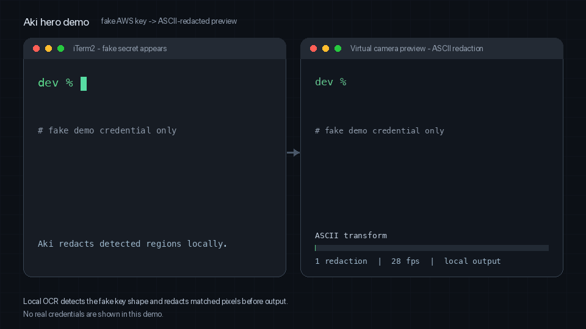
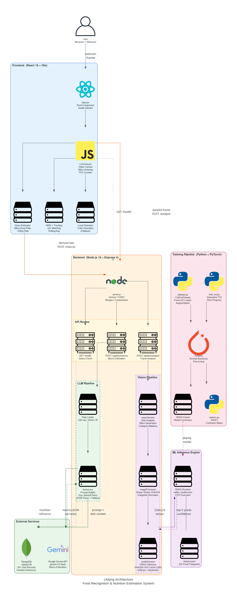
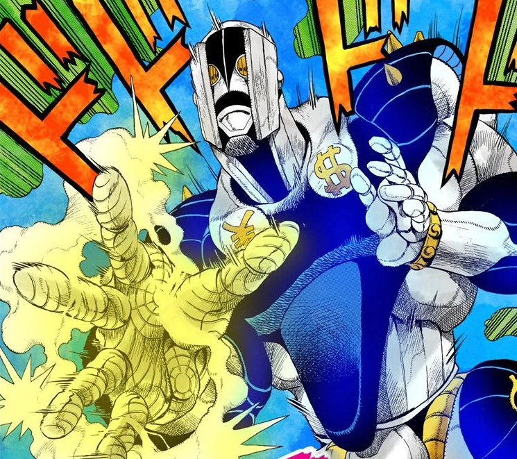

[](./Cargo.toml)
[](https://github.com/gongahkia/aki/actions/workflows/ci.yml)

# `Aki`

`Aki` is a macOS-first, local-first, real-time privacy filter for screen sharing and livestreaming. It reads screen pixels, uses OCR and pattern matching to detect secrets or PII, then redacts detected regions before frames leave through a virtual camera or MJPEG output.

Because `Aki` works on pixels instead of browser DOM nodes, it can cover terminals, editors, design tools, documents, and other app surfaces where DOM-based blur extensions cannot reliably inspect content.

`Aki` reduces leak risk; it is not a guarantee that every sensitive value will be caught. OCR can miss tiny, low-contrast, or newly appeared text, and pattern rules only cover the secret shapes they know about.



## Known limitations

`Aki` reduces accidental leak risk; it does not prevent every leak.

* **OCR race window**: detection happens after pixels are captured. Newly appearing sensitive text can be visible for one or more frames before OCR and redaction catch up.
* **Small or low-contrast text**: Tesseract can miss tiny, blurry, animated, partially occluded, or low-contrast text. Use larger high-contrast text for demos where redaction matters.
* **Pattern coverage**: the default rules favor recognizable secret and PII shapes. Random high-entropy strings without known prefixes may be missed, while broader entropy rules can create noisy false positives.
* **Operational fallback**: treat `Aki` as a last-mile privacy filter, not as a replacement for closing sensitive windows, using demo credentials, rotating exposed secrets, or limiting what appears on screen.

## We collect nothing

`Aki` v1 has no cloud account, sync backend, telemetry endpoint, product analytics, crash reporting, upsell flow, or in-app Sponsor prompt.

Screen pixels, OCR text, detections, config, and runtime logs stay on your machine. Local logs are written under `~/.config/ascii-privacy/logs/aki.log`; `Aki` does not upload them.

Network activity is limited to actions you request: Homebrew or GitHub release downloads during install/update, the optional neural model download when the Neural transform is used without a cached model, optional Twitch chat integration if configured, the opt-in local LLM classifier endpoint if configured, and local OBS/MJPEG endpoints. These paths are not telemetry.

Future uploaded counters or diagnostics are out of scope for v1 unless they are explicit opt-in before any data leaves the machine. The local `aki doctor` command prints setup checks without uploading anything.

The TUI includes a local in-memory redaction log, with explicit export only. Its retention and privacy tradeoffs are documented in [`docs/redaction-log.md`](./docs/redaction-log.md).

## Install

### macOS App

The primary macOS release install path is the Homebrew cask:

```console
$ brew tap gongahkia/aki
$ brew install --cask aki
```

The cask installs the signed app bundle once the GitHub Release DMG exists for the current version.

### Rust CLI From Source

The CLI binary is named `aki`, but the workspace package is currently `privacy-tui`. `cargo install aki` from crates.io is not available until a crate is published, so install the package from Git:

```console
$ brew install rust tesseract ffmpeg
$ cargo install --git https://github.com/gongahkia/aki privacy-tui --locked
$ aki self-test
$ aki run
```

For a local checkout, use the path install:

```console
$ git clone https://github.com/gongahkia/aki
$ cd aki
$ cargo install --path privacy-tui --locked
$ aki self-test
$ aki run
```

`ffmpeg` is only required for `aki redact` and direct MP4 output, but installing it up front keeps those commands available.

### Nix CLI

Nix users can run or install the CLI package from the flake:

```console
$ nix run github:gongahkia/aki#aki -- doctor
$ nix profile install github:gongahkia/aki#aki
```

The Nix path is documented in [`docs/nix-install.md`](./docs/nix-install.md). It builds the Rust CLI from source and does not replace the signed macOS app cask.

### Developer Workspace

If you do not want to install the binary, run the TUI directly from the workspace:

```console
$ cargo run -p privacy-tui -- run
```

### macOS Menu-Bar Shell

`Aki` also includes a SwiftUI menu-bar shell that controls the Rust binary as a sidecar. Build the Rust sidecar first, then launch the menu-bar app:

```console
$ cargo build -p privacy-tui
$ AKI_BINARY="$PWD/target/debug/aki" swift run --package-path macos/AkiMenuBar
```

The menu-bar shell can start and stop the headless redaction pipeline, pause or resume it, switch transforms, choose the capture/output mode used on restart, show redaction/FPS/CPU stats, and open the TUI in Terminal. The v1 sidecar protocol is documented in [`docs/sidecar-protocol.md`](./docs/sidecar-protocol.md), and Shortcuts/AppleScript automation is documented in [`docs/apple-shortcuts.md`](./docs/apple-shortcuts.md).

macOS DMG release packaging is documented in [`docs/macos-release.md`](./docs/macos-release.md), and the cask path is documented in [`docs/homebrew-cask.md`](./docs/homebrew-cask.md). The Show HN launch gate is tracked in [`docs/show-hn-readiness.md`](./docs/show-hn-readiness.md); do not advertise a Show HN launch until that checklist is complete.

The engineering architecture is documented in [`ARCHITECTURE.md`](./ARCHITECTURE.md).

Performance baselines and the synthetic redaction fixture corpus are tracked in [`BENCHMARKS.md`](./BENCHMARKS.md).

Release history and the next release notes are tracked in [`CHANGELOG.md`](./CHANGELOG.md).

The companion engineering blog draft is tracked in [`docs/engineering-blog-draft.md`](./docs/engineering-blog-draft.md).

The public roadmap is tracked in [`docs/roadmap.md`](./docs/roadmap.md).

Contributor setup and pull request expectations are documented in [`CONTRIBUTING.md`](./CONTRIBUTING.md).

Security reporting scope and contact details are documented in [`SECURITY.md`](./SECURITY.md).

## Quick Commands

```console
$ aki list-windows
$ aki list-displays
$ aki doctor
$ aki test-patterns "SECRET_KEY=abc123"
$ aki demo --frames 1 --no-clear
$ aki redact ./recording.mov --output ./recording.redacted.mov
$ aki --headless --source screen --record-output ./recording.redacted.mp4
$ aki check-output
$ aki --headless --source screen
```

### Troubleshooting

Run `aki doctor` before filing setup bugs or debugging a failed install:

```console
$ aki doctor
$ aki doctor --obs
```

The command reports local `PASS`, `WARN`, or `FAIL` statuses for Tesseract data, screen-capture permission, CoreMediaIO DAL state, virtual-camera installation, and OBS WebSocket reachability when requested or configured. It includes remediation text for each warning or failure and does not collect or transmit telemetry, screenshots, OCR text, or logs.

### Fake-Secret Demo

Use `aki demo` when you need a safe screen-share source, screenshot, tweet, or issue reproduction without exposing real secrets:

```console
$ aki demo
$ aki demo --frames 1 --no-clear
```

The demo prints deterministic rolling examples marked with `DEMO_`, `AKI_FAKE_`, and `DO_NOT_USE`, plus reserved documentation email and IP-shaped values. It is designed to be captured by the live pipeline and to be pasted into bug reports without containing real credentials.

### Offline Video Redaction

Use `aki redact` to process an existing screen recording without real-time capture or a virtual camera:

```console
$ aki redact ./recording.mov
$ aki redact ./recording.mov --output ./recording.redacted.mov --transform ascii --intensity 0.9
```

The command decodes the first video stream with `ffmpeg`, runs the same local OCR, pattern detection, and transform logic used by the live pipeline on each frame, then writes a redacted video through `ffmpeg`. Install `ffmpeg` and `ffprobe` before using it.

When `--output` is omitted, `Aki` writes next to the input as `<name>.redacted.<ext>`. Existing output files are refused unless `--overwrite` is passed, and the input file is never used as the output path.

The recording-only time-machine buffer prototype is documented in [`docs/time-machine-buffer.md`](./docs/time-machine-buffer.md). It can re-render buffered local-recording frames before finalization, but it cannot unsend live-stream or screen-share pixels.

### Direct MP4 Recording

Use direct MP4 output when you want a local redacted screen recording without OBS, a virtual camera, or a separate screen-recording app:

```console
$ aki --headless --source screen --record-output ./recording.redacted.mp4
$ aki --headless --source screen --output mp4 --record-output ./recording.redacted.mp4 --transform ascii
```

Recording starts when the first transformed frame is produced. Press `Ctrl-C` to stop capture, flush ffmpeg, and finalize the MP4. The output path must be explicit and end in `.mp4`; existing files are refused unless `--record-overwrite` is passed.

Use the virtual camera, OBS, or MJPEG outputs for live streams and screen-share calls. Use direct MP4 when the final deliverable is a local recording file.

### Multi-Display Capture

Use `aki list-displays` to find display indexes, then pass `--display` once for a specific display or more than once for side-by-side multi-display capture:

```console
$ aki list-displays
$ aki --headless --source screen --display 1
$ aki --headless --source screen --display 0 --display 1 --record-output ./multi-display.redacted.mp4
```

The behavior, hot-plug expectations, and performance costs are documented in [`docs/multi-display-capture.md`](./docs/multi-display-capture.md).

### Opt-In Local Classifier

The optional local LLM detector can ask a localhost Ollama model to classify ambiguous low-confidence OCR text as secret-shaped or safe. It is off by default, does not download models, and does not change the lightweight install path unless you enable it.

Setup, privacy boundaries, and latency/accuracy tradeoffs are documented in [`docs/local-llm-detector.md`](./docs/local-llm-detector.md).

## Power-User / Developer Commands

```console
$ cargo run -p privacy-tui -- run
$ cargo run -p privacy-tui -- --pty
$ cargo run -p privacy-tui -- test-screen
$ cargo run -p privacy-tui -- self-test
```

## Screenshots


## Stack

* *Script*: [Rust](https://www.rust-lang.org/), [Ratatui](https://ratatui.rs/), [Crossterm](https://github.com/crossterm-rs/crossterm), [toml](https://github.com/toml-rs/toml)
* *Screen Capture*: [screencapturekit-rs](https://github.com/svtlabs/screencapturekit-rs), [ashpd](https://github.com/bilelmoussaoui/ashpd)
* *OCR*: [Tesseract](https://github.com/tesseract-ocr/tesseract) via [leptess](https://github.com/houqp/leptess)
* *Virtual Camera*: [v4l2loopback](https://github.com/umlaeute/v4l2loopback), [CoreMediaIO DAL](https://developer.apple.com/documentation/coremediaio)
* *Output*: [HTTP MJPEG](https://en.wikipedia.org/wiki/Motion_JPEG), [OBS WebSocket](https://github.com/obsproject/obs-websocket)
* *Channels*: [crossbeam-channel](https://github.com/crossbeam-rs/crossbeam)

## Usage

Once inside `Aki`'s TUI, use the below keybinds.

| Key | Action |
|-----|--------|
| `w` | open window picker, select a source to capture |
| `Space` | pause / resume capture |
| `t` | cycle transform (Blur → Pixelate → Cartoon → ASCII) |
| `+` / `-` | increase / decrease effect intensity |
| `q` / `Ctrl+C` | quit |

### Debug Logging

`Aki` now writes persistent logs to:

```console
~/.config/ascii-privacy/logs/aki.log
```

Set `AKI_LOG_LEVEL` to control file verbosity (`trace`, `debug`, `info`, `warn`, `error`).
Set `AKI_LOG_STDERR=1` only when you explicitly want mirror logs in terminal output.

On startup, `Aki` also auto-selects a likely app window source (instead of full-display capture)
to reduce self-capture feedback artifacts. Press `w` anytime to override.

## Detected List

Currently `Aki` looks for the patterns below by default and redacts matched regions.

**API Keys & Tokens**
* AWS access keys (`AKIA...`) and secret access keys
* Stripe secret/publishable keys (`sk_live_`, `pk_test_`, ...)
* GitHub personal access tokens (`ghp_`, `gho_`)
* GitLab personal access tokens (`glpat-`)
* Slack tokens (`xoxb-`, `xoxs-`, `xoxp-`)
* Hugging Face API tokens (`hf_`)
* Anthropic API keys (`sk-ant-`)
* Generic API key prefixes (`sk-`, `pk-`, and similar)
* JWT tokens (`eyJ...`)
* SSH private keys (RSA, EC, DSA, OpenSSH)

**Secrets & Credentials**
* Secret keyword assignments (`api_key:`, `token=`, `secret=`, `password=`, `passwd=`, `credential=`)
* Environment variable assignments (`UPPER_CASE=<value>`)

**PII**
* Email addresses
* IPv4 and IPv6 addresses
* Credit card numbers (Visa, Mastercard, Amex, Discover, JCB)

## Nerd stuff

### Pipeline

Four threads communicate via bounded `crossbeam` channels (capacity 3). Full channels drop incoming frames rather than block — backpressure is shed, not accumulated.

| Thread | Responsibility |
|--------|---------------|
| `aki-capture` | Pulls frames from ScreenCaptureKit / XCB / PipeWire; optionally crops to a sub-region |
| `aki-detect` | Runs incremental OCR → regex pattern scan → region expansion + merge |
| `aki-transform` | Applies the active transform (with 10-frame pixel-blend crossfade on mode switch) |
| `aki-output` | Forwards transformed frames to the selected `OutputSink` |

### Transformations

Currently `Aki` supports the below morphs.

<table>
<thead>
<tr><th>Transform</th><th>Description</th></tr>
</thead>
<tbody>
<tr>
<td><strong>Blur</strong></td>
<td><ul>
<li>Separable Gaussian blur (σ=15 default)</li>
<li>Two-pass horizontal + vertical for O(n) performance</li>
</ul></td>
</tr>
<tr>
<td><strong>Pixelate</strong></td>
<td><ul>
<li>Block-averaging at 2px–dim/8 block size</li>
<li>Block size scales linearly with intensity</li>
<li>Nearest-neighbour upscale back to original dimensions</li>
</ul></td>
</tr>
<tr>
<td><strong>Cartoon</strong></td>
<td><ul>
<li>Bilateral filter approximation (smoothing)</li>
<li>Sobel edge detection overlay</li>
<li>k-means colour quantization (k=8 colours)</li>
<li>Destroys text readability while preserving approximate colour</li>
</ul></td>
</tr>
<tr>
<td><strong>ASCII</strong></td>
<td><ul>
<li>Pixel luminance mapped to a 15-level density ramp (<code> .,:;i1tfLCG08@</code>)</li>
<li>Each 8×16 pixel block averaged to a single luminance value</li>
<li>Block re-rendered as uniform grey matching density level</li>
</ul></td>
</tr>
<tr>
<td><strong>Neural</strong></td>
<td><ul>
<li>ONNX Runtime inference</li>
<li>Accelerator selection: CUDA / CoreML / CPU (auto-detected)</li>
<li>Falls back to Cartoon if inference exceeds latency guard (default 100ms)</li>
</ul></td>
</tr>
</tbody>
</table>

### Output support

Currently `Aki` supports the following 4 outputs.

| Sink | Platform | Status |
|------|----------|--------|
| v4l2loopback virtual camera | Linux | Available |
| CoreMediaIO DAL virtual camera | macOS | Available |
| HTTP MJPEG stream | All | Available *(default fallback)* |
| OBS WebSocket v5 *(Browser Source → MJPEG)* | All | Available *(falls back to MJPEG if OBS unreachable)* |

The native OBS source/filter plugin design is documented in [`docs/obs-source-plugin.md`](./docs/obs-source-plugin.md). The current implementation keeps the virtual-camera and MJPEG paths intact while the OBS plugin remains a tested prototype adapter plus packaging plan.

### Architecture



### Incremental OCR

The frame is divided into an 8×6 grid of cells. Between frames, a pixel-threshold diff (`FrameDiff`) marks only changed cells as dirty. Only dirty cells are sent to Tesseract — typically ~70% of OCR work is skipped per frame.

If detection takes longer than the 33ms frame budget, the grid is shrunk (down to 2×2) and transform intensity is reduced to 0.8× to recover headroom. The grid recovers back toward 8×6 when load drops below half-budget.

### Config

`~/.config/ascii-privacy/config.toml` is created with defaults on first run.

```toml
[capture]
fps = 30
region = "0,0,1920,1080"   # optional crop "x,y,w,h"

[detection]
min_confidence = 40         # tesseract confidence threshold (0–100)
grid_cells_x = 8
grid_cells_y = 6
safe_zones = ["0,0,200,50"] # regions never redacted
always_redact_zones = []    # regions always redacted
external_rules_path = ""    # optional local gitleaks TOML path
external_rules_format = "gitleaks"
max_external_patterns = 128 # startup cap for imported regex rules

[transform]
mode = "blur"               # blur | pixelate | cartoon | ascii | neural
intensity = 1.0
accelerator = "auto"        # auto | cuda | coreml | cpu (for neural mode)

[output]
sink = "auto"               # auto | v4l2 | coremedia | mjpeg
http_port = 9876

[foreground_profiles]
enabled = true              # auto-select detector profile from foreground app
override_profile = ""       # broad | secrets | pii | browser, or empty for auto
update_interval_ms = 1000
```

Automatic foreground detector profiles are macOS-first and use the frontmost app name when available. Terminals use the `secrets` detector profile, Slack/Discord/Messages use `pii`, VS Code/Cursor/Xcode use `broad`, and browsers use a broad OCR-based `browser` profile. Browser DOM inspection is not used in v1 because Aki stays pixel-first.

Set `foreground_profiles.enabled = false` to disable automatic detector profile selection, or set `foreground_profiles.override_profile` to force one detector profile.

Named transform profiles (e.g. `[profiles.streaming]`) can override transform mode and intensity for different contexts.

### Optional external detector rules

`Aki` can import gitleaks-style TOML rules from a local file. This is opt-in and local-only; `Aki` does not fetch rule packs or depend on a cloud scanner. Details are documented in [`docs/external-rule-packs.md`](./docs/external-rule-packs.md), and community rule-pack contribution conventions are documented in [`docs/community-rule-packs.md`](./docs/community-rule-packs.md).

```toml
[detection]
external_rules_path = "/path/to/gitleaks.toml"
external_rules_format = "gitleaks"
max_external_patterns = 128
```

Imported gitleaks rules are compiled once at startup and appended to the default detector registry. The import is bounded to `max_external_patterns`, capped at 128, to keep scan cost predictable. Trufflehog's detectors are not imported in v1 because they are code/entropy based rather than a simple regex rule file.

## Reference

The name `Aki` is in reference to the Japanese 空き (*aki*) which roughly means *empty*, *vacant*, or *a gap*, as seen in 空き容量 (*aki yōryō*, free disk space).

<div align="center">
    
</div>
