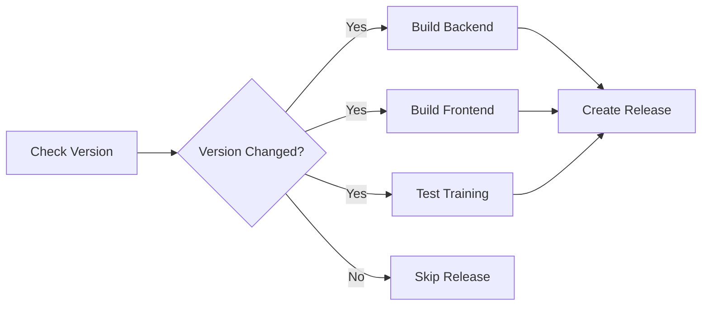

# GitHub Actions Release Workflow

This document explains the automated release workflow for cAI-png.

## Overview

The release workflow automatically creates GitHub releases when you push version changes to the main branch.

## Workflow Files

### `.github/workflows/release.yml`
Main release workflow that:
- ✅ Checks if package.json versions changed
- ✅ Builds and tests backend
- ✅ Builds and tests frontend  
- ✅ Tests training scripts
- ✅ Creates GitHub release with artifacts
- ✅ Generates changelog from commits

### `.github/workflows/ci.yml`
Continuous integration workflow for all pushes and PRs

## How It Works

### 1. Automatic Trigger

The workflow triggers when:
- Pushing to `main` branch
- Version in `backend/package.json` or `frontend/package.json` changes
- Excludes: markdown files, docs, .gitignore, LICENSE

### 2. Build & Test Pipeline



### 3. Jobs Executed

**check-version**
- Detects version changes in package.json files
- Outputs: should_release, version, frontend_version, backend_version

**backend**
- Installs dependencies
- Runs linter
- Runs tests
- Verifies build readiness

**frontend**
- Installs dependencies
- Runs linter
- Builds production bundle
- Uploads build artifacts

**training**
- Sets up Python environment
- Runs ruff linter
- Runs pytest tests

**release** (only if version changed)
- Downloads frontend build
- Generates changelog from git commits
- Creates release archives (source + build)
- Creates GitHub release with tag
- Uploads artifacts

**notify**
- Provides workflow summary
- Reports success/failure

## Creating a Release

### Method 1: Using the Version Bump Script (Recommended)

```bash
# Patch version (1.0.0 -> 1.0.1)
./scripts/bump-version.sh patch

# Minor version (1.0.1 -> 1.1.0)
./scripts/bump-version.sh minor

# Major version (1.1.0 -> 2.0.0)
./scripts/bump-version.sh major

# With custom commit message
./scripts/bump-version.sh minor -m "feat: add new food detection model"

# Without committing
./scripts/bump-version.sh patch --no-commit
```

The script will:
1. ✅ Show current versions
2. ✅ Update both package.json files
3. ✅ Create git commit
4. ✅ Ask if you want to push
5. ✅ Push triggers GitHub Actions
6. ✅ Workflow creates release automatically

### Method 2: Manual Version Bump

```bash
# Edit version in both files
vim backend/package.json   # "version": "1.0.1"
vim frontend/package.json  # "version": "1.0.1"

# Commit and push
git add backend/package.json frontend/package.json
git commit -m "chore(release): bump version to v1.0.1"
git push origin main

# GitHub Actions creates release automatically
```

### Method 3: Using npm version

```bash
# Update both packages
cd backend && npm version patch && cd ..
cd frontend && npm version patch && cd ..

# Commit and push
git add backend/package.json frontend/package.json
git commit -m "chore(release): bump version to v1.0.1"
git push origin main
```

## Release Artifacts

Each release includes:

### 📦 Source Archives
- `caipng-vX.Y.Z-source.tar.gz` - Full source code (compressed)
- `caipng-vX.Y.Z-source.zip` - Full source code (zip)

### 🏗️ Build Artifacts
- `caipng-vX.Y.Z-frontend-build.tar.gz` - Production frontend build

### 📄 Release Notes
Auto-generated with:
- Version numbers (backend + frontend)
- Commit messages since last release
- Installation instructions
- Quick start guide
- Documentation links

## Workflow Configuration

### Environment Variables
```yaml
NODE_VERSION: '18'
PYTHON_VERSION: '3.12'
```

### Permissions Required
```yaml
permissions:
  contents: write  # For creating releases
```

### Secrets Used
```yaml
GITHUB_TOKEN  # Auto-provided by GitHub Actions
```

## Monitoring Releases

### GitHub Actions
1. Go to: https://github.com/YOUR_USERNAME/caipng/actions
2. Click on "Release on Push to Main" workflow
3. View workflow runs and logs

### Releases Page
1. Go to: https://github.com/YOUR_USERNAME/caipng/releases
2. View all published releases
3. Download release artifacts

## Troubleshooting

### Release Not Created

**Problem:** Version bumped but no release created

**Solutions:**
1. Check if version actually changed in package.json
2. View Actions tab for workflow errors
3. Ensure branch is `main` (not `master` or other)
4. Check paths-ignore filters

### Build Failure

**Problem:** Frontend/backend build fails

**Solutions:**
1. Run `npm run build` locally first
2. Check dependency versions
3. Review error logs in Actions tab
4. Fix issues and push again

### Test Failure

**Problem:** Tests fail during workflow

**Solutions:**
1. Run tests locally: `npm test`
2. Fix failing tests
3. Push fix to trigger new workflow

## Customization

### Change Version Check Behavior

Edit `.github/workflows/release.yml`:

```yaml
# Skip release for specific paths
paths-ignore:
  - '**.md'
  - 'docs/**'
  - 'examples/**'  # Add more patterns
```

### Modify Changelog Format

Edit the `Generate changelog` step:

```yaml
- name: Generate changelog
  run: |
    # Customize format here
    git log --pretty=format:"- %s (%h)" --no-merges
```

### Add Deployment Step

Add after `release` job:

```yaml
deploy:
  needs: [release]
  runs-on: ubuntu-latest
  steps:
    - name: Deploy to production
      run: |
        # Your deployment commands
```

## Best Practices

### Versioning Strategy

- **Patch (0.0.X)**: Bug fixes, minor tweaks
- **Minor (0.X.0)**: New features, backward compatible
- **Major (X.0.0)**: Breaking changes, API changes

### Commit Messages

Use conventional commits for better changelogs:

```bash
feat: add new feature
fix: fix bug
docs: update documentation
chore: update dependencies
refactor: refactor code
test: add tests
```

### Pre-Release Checklist

Before bumping version:
- [ ] All tests passing locally
- [ ] Documentation updated
- [ ] CHANGELOG.md updated (if exists)
- [ ] Breaking changes noted
- [ ] Dependencies up to date

### Release Frequency

- **Patch**: As needed for bugs
- **Minor**: Every 1-2 weeks for features
- **Major**: Quarterly or when breaking changes necessary

## Examples

### Example 1: Bug Fix Release

```bash
# Fix a bug
git add src/bugfix.js
git commit -m "fix: resolve camera initialization issue"
git push

# Bump patch version
./scripts/bump-version.sh patch
# Follow prompts to push

# Result: v1.0.0 -> v1.0.1
```

### Example 2: Feature Release

```bash
# Add new feature
git add src/new-feature.js
git commit -m "feat: add dark mode support"
git push

# Bump minor version
./scripts/bump-version.sh minor
# Follow prompts to push

# Result: v1.0.1 -> v1.1.0
```

### Example 3: Breaking Change Release

```bash
# Make breaking changes
git add src/api-v2.js
git commit -m "feat!: migrate to API v2

BREAKING CHANGE: API endpoints changed from /v1/ to /v2/"
git push

# Bump major version
./scripts/bump-version.sh major -m "feat!: API v2 migration"
# Follow prompts to push

# Result: v1.1.0 -> v2.0.0
```

## FAQ

**Q: Can I skip CI/CD and create manual releases?**
A: Yes, go to GitHub Releases page and click "Draft a new release"

**Q: How do I delete a bad release?**
A: Go to Releases page, click release, click "Delete" button

**Q: Can I create pre-releases or beta versions?**
A: Yes, use version like `1.0.0-beta.1` and mark as pre-release

**Q: What if frontend and backend have different versions?**
A: The workflow uses backend version as the main version for releases

**Q: How do I add release notes manually?**
A: Edit the release after it's created on GitHub Releases page

## Related Files

- `.github/workflows/release.yml` - Release workflow
- `.github/workflows/ci.yml` - CI workflow  
- `scripts/bump-version.sh` - Version bump script
- `backend/package.json` - Backend version
- `frontend/package.json` - Frontend version

## Support

For issues with the release workflow:
1. Check GitHub Actions logs
2. Review this documentation
3. Open an issue with workflow run URL
4. Tag with `ci/cd` label
