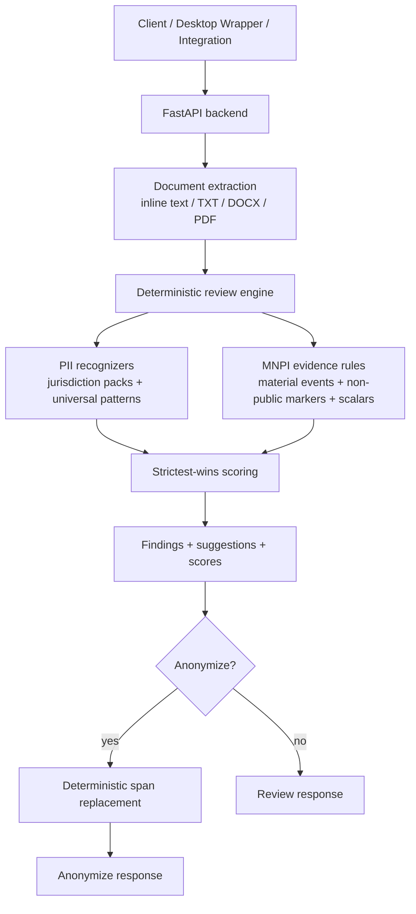

# Kaypoh Architecture

Kaypoh is an API-first pre-send safety engine for PII anonymization and MNPI review. `ARCHITECTURE-PIVOT-24-MAY.md` is authoritative; this file is a short operational summary.

## Active API Surface

- `POST /anonymize`: review plus deterministic placeholder replacement.
- `POST /review`: deterministic PII/MNPI review without rewriting text.
- `POST /reidentify`: restore placeholders from a mapping or persisted document hash.
- `POST /documents/scrub`: remove supported metadata leakage.
- `POST /classify`, `POST /classify/batch`: compatibility wrappers over `engine.review()`.
- `GET /health`, `/ready`, `/diagnostics`, `/metrics`: runtime health and observability.

## Core Flow

## Optional Server Layers

Public evidence and LLM adjudication are disabled by default. When enabled, they are advisory, privacy-gated, and tenant/deployer opted in:

- `public_evidence`: Exa, Tinyfish, Serper, or SerpAPI over sanitized queries.
- `llm_adjudicator`: vLLM, Ollama, OpenAI-compatible, or local distilled provider.

The deterministic engine remains the source of truth. LLM output can soften eligible ambiguous cases with supporting public evidence; it cannot suppress deterministic-high findings.
