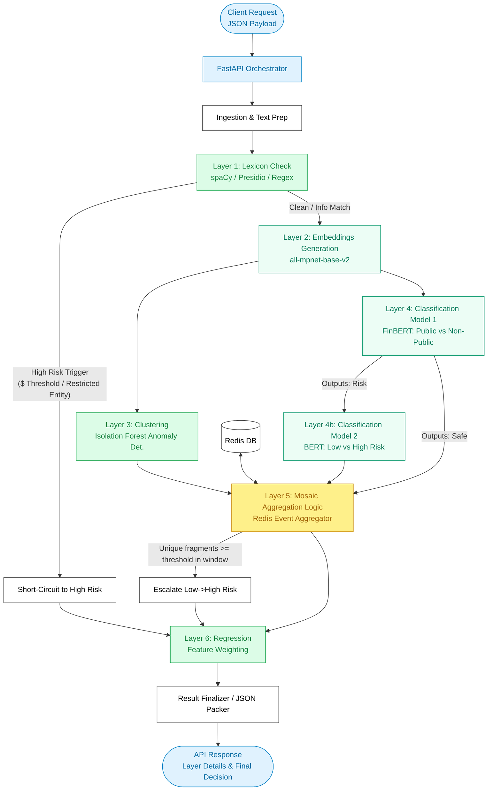

# Noupe Architecture

## System Overview

Noupe is a multi-layered Material Non-Public Information (MNPI) classification engine. The system is orchestrated by a FastAPI backend that conditionally loads and executes a sequence of analytical layers in a pipeline to predict sensitivity.

### Key Technologies
- **API & Orchestration:** FastAPI, Uvicorn, Pydantic (Python 3.10+)
- **Lexicon & Rules:** spaCy (NER), Presidio (PII detection), Regular Expressions for financial figures
- **Embeddings:** Sentence-BERT (`all-mpnet-base-v2`) via HuggingFace `sentence-transformers`
- **Machine Learning & NLP Frameworks:** PyTorch, HuggingFace `transformers`
  - FinBERT (binary risk classification over overlapping sliding windows)
  - BERT base uncased (severity classification over overlapping sliding windows)
- **Anomaly Detection:** Scikit-Learn (Isolation Forest for clustering unknown unknowns)
- **State Tracking (Mosaic Layer):** Redis rolling-window event aggregation with per-entity ZSETs and per-event metadata
- **Regression / Final Scoring:** Optional XGBoost layer loaded only when a trained checkpoint is available
- **Interface Surfaces:** Archived HTML/JS demo frontends under `archive/frontend-demos/`, served separately by `scripts/launch/run_dev.sh` and `scripts/launch/run_prod.sh`

### Runtime Layout

- The active runtime is backend-only and is exposed through the compatibility shim `backend.main:app`.
- The canonical stage code now lives under `src/noupe/workflow/`.
- FastAPI no longer mounts chat/email/slack UI routes directly.
- The legacy analyzer plus chat/email/slack demos are static archived demo surfaces that call the backend API over HTTP.
- Swagger and ReDoc are served directly from the FastAPI backend at `/docs` and `/redoc`.

## Data Flow & Pipeline Diagram

The overall pipeline executes a series of sequential and conditional steps upon receiving a text payload.

### Flowchart

### Detailed Data Flow

1. **Ingestion (API Route)**
   A `POST /classify` request carrying a JSON payload (`text`, an optional `entity_id`, and optional flags such as `include_offending_spans`) is received by the FastAPI runtime.
2. **Layer 1: Lexicon Filter**
   The incoming text is processed against regex rules, spaCy Named Entity Recognition, and Microsoft Presidio's PII recognizers. 
   - **Short-Circuit:** If critical elements like restricted entities (from a configuration list) are identified, or high absolute money values are crossed, the flow is instantly flagged `HIGH_RISK`, bypassing the Transformer models.
3. **Layer 2: Embedding Generation**
   The runtime embeds the normalized request text into a dense 768-dimensional vector using the `all-mpnet-base-v2` encoder. Sentence-level embedding generation still exists in the offline training workflow, but inference-time embedding is document-level.
4. **Layer 3: Clustering (Anomaly Detection)**
   An Isolation Forest clustering model ingests the document embedding to compute an anomaly score. This identifies significant divergences against the typical data distribution the models were trained on.
5. **Layer 4 & 4b: Text Classification Models**
   - **Model 1:** The FinBERT checkpoint runs first to act as a primary gate. Inference now uses overlapping token windows so the API can return the top approximate model window without changing the external request shape. If the content is deemed 'public/safe', the second model is skipped.
   - **Model 2:** A severity-checking BERT model evaluates the same sliding-window pattern for text flagged by Model 1, determining if the MNPI risk is `LOW_RISK` or `HIGH_RISK`.
6. **Layer 5: Mosaic Aggregation**
   - Data labeled as `LOW_RISK` proceeds into the Mosaic Tracker. The pipeline connects to a **Redis** instance using the requested `entity_id` (or one inferred from the lexicon).
   - Redis stores a rolling event history for that entity, trims expired events, and deduplicates fragments by normalized fragment hash inside the active time window.
   - If the entity reaches the configured threshold of unique `LOW_RISK` fragments within the active window, the fragmented pieces of context invoke the "Mosaic Theory" and escalate the label to `HIGH_RISK`.
7. **Layer 6: Regression & Final Scoring (Optional)**
   When a trained regression checkpoint exists, scores across upstream models (lexicon score, anomaly float, Transformer risk probabilities, and mosaic unique-fragment counts) are synthesized into an aggregate risk probability.
8. **Response Return**
   The FastAPI structure maps metadata from all layers and encapsulates the final, enumerated decision parameter (`SAFE | LOW_RISK | HIGH_RISK`) into a JSON response. The response can optionally include:
   - per-request observability metadata (`cache_status`, `executed_layers`, `skipped_layers`, `layer_errors`)
   - exact lexicon spans
   - approximate classifier-window spans derived from sliding-window inference
