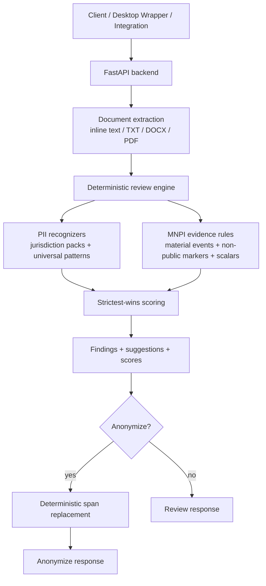

# Kaypoh Architecture

Kaypoh is an API-first pre-send safety engine for PII anonymization and MNPI review. `ARCHITECTURE-PIVOT-24-MAY.md` is authoritative; this file is a short operational summary.

## Active API Surface

- `POST /anonymize`: review plus deterministic placeholder replacement.
- `POST /review`: deterministic PII/MNPI review without rewriting text.
- `POST /reidentify`: restore placeholders from a mapping or persisted document hash.
- `POST /documents/scrub`: remove supported metadata leakage.
- `POST /classify`, `POST /classify/batch`: compatibility wrappers over `engine.review()`.
- `GET /health`, `/ready`, `/diagnostics`, `/metrics`: runtime health and observability.

## Core Flow

## Optional Server Layers

Public evidence and LLM adjudication are disabled by default. When enabled, they are advisory, privacy-gated, and tenant/deployer opted in:

- `public_evidence`: Exa, Tinyfish, Serper, or SerpAPI over sanitized queries.
- `llm_adjudicator`: vLLM, Ollama, OpenAI-compatible, or local distilled provider.
- `llm_defined_term_extractor`: audit-grade preamble-only defined-term extraction.
- `llm_coverage_auditor`: audit-grade structured inverse coverage audit.

The deterministic engine remains the source of truth. LLM output can soften eligible ambiguous cases with supporting public evidence; it cannot suppress deterministic-high findings.
The helper layers are configurable under `[llm_helpers]`, surfaced by `/ready` and `/diagnostics`, and log privacy-ledger events when invoked. `strict` never calls them.

## Evaluation Corpus

`ARCHITECTURE-PIVOT-24-MAY.md` owns the detailed corpus plan. As of 2026-06-01, Stage A candidate coverage is reviewed for all 17 in-scope jurisdiction packs under `test/fixtures/legal-corpus-candidates/`: 357 candidate docs / 4,295 strict labels at strict recall 1.0 and strict precision 1.0 in `/tmp/kaypoh-candidates-after-eu-reviewed.json`. Those candidates are approved for internal benchmarking and gap discovery only; locked recall baselines and procurement-facing accuracy claims still require explicit promotion.
