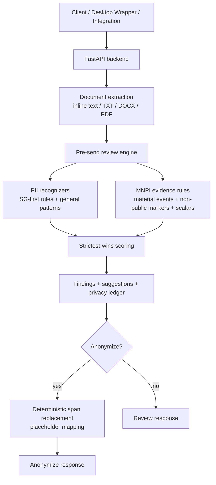

# Kaypoh Architecture

Kaypoh is an API-first pre-send safety engine for PII anonymization and MNPI review. The active product surface is the FastAPI backend exposed through `backend.main:app`, with canonical code under `src/kaypoh/`.

## Active API Surface

- `POST /anonymize`: extracts inline text or base64 text/DOCX/PDF payloads, runs the PII/MNPI review engine, and returns `anonymized_text`, deterministic placeholders, a local mapping table, findings, suggestions, and scores.
- `POST /review`: runs the same evidence stack without rewriting text.
- `POST /classify`: legacy single-document MNPI classifier.
- `POST /classify/batch`: bounded-concurrency legacy batch classifier.
- `GET /health`, `GET /ready`, `GET /diagnostics`, `GET /metrics`: runtime health and observability.

## Core Flow

## Detection Stack

The current review engine is deterministic and jurisdiction-aware:

- Source and destination jurisdictions resolve to rule packs with a strictest-wins policy.
- SG-specific PII includes NRIC/FIN-like identifiers and Singapore postal-address signals.
- General PII includes email, phone, passport-like identifiers, bank/account references, and titled person-name patterns.
- MNPI evidence includes material corporate-event language, non-public markers, financial amounts, percentages, and large numbers.
- Suggestions are generated from finding category and severity.

The older classification pipeline still exists for compatibility and experimentation:

- Lexicon filter
- Embeddings
- Clustering
- Model-1 classifier
- Model-2 severity classifier
- Mosaic aggregation
- Optional regression

These layers are no longer the only product story; they are supporting evidence for document safety.

## Anonymization

`src/kaypoh/anonymize/engine.py` converts accepted review findings into deterministic replacements:

- PII findings are replaced by default.
- Exact MNPI scalar findings, such as monetary values and percentages, can also be replaced.
- Broad material-event passages remain review findings because they are contextual and too destructive for automatic replacement.
- Replacements are applied from the end of the document toward the start to preserve offsets.
- Mapping keys use normalized entity type plus canonical original text, so repeated emails or identifiers receive the same placeholder.

## Optional External and LLM Layers

Kaypoh may use public-source retrieval and local LLM adjudication, subject to privacy boundaries:

- External retrieval receives only sanitized queries.
- Private document text, exact offending spans, PII, and exact private financial values must not be sent to external providers.
- Local LLM adjudication can inspect private document text only when configured for loopback/private infrastructure or explicitly allowed.
- Responses expose chain-of-evidence fields, not raw chain-of-thought.

## Runtime Guarantees

- The backend is the active runtime; there is no active bundled frontend in this repository.
- Compatibility shims under `api/`, `backend/`, and `configs/` support older imports.
- Runtime artifacts are checked through `artifacts/manifest.json`.
- Missing optional layers should degrade explicitly through readiness, diagnostics, and response observability rather than silently changing behavior.
