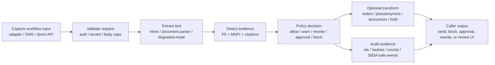

# Engineering Draft: Deterministic Pre-send Review Without A Second Policy Engine

Draft status: repo draft for a technical launch companion post.

Repo: <https://github.com/gongahkia/junas>

Demo artifacts: [`README.md#60-second-verdict`](../../README.md#60-second-verdict), [`docs/assets/demo/README.md`](../assets/demo/README.md), and [`asset/video/junas-60s-demo.mp4`](../../asset/video/junas-60s-demo.mp4). Hosted demo launch remains gated by [#84](https://github.com/gongahkia/junas/issues/84) and [#85](https://github.com/gongahkia/junas/issues/85).

## Hook

The failure mode Junas targets is not generic model quality. It is that risky text often leaves the trusted workflow before anyone has a structured decision to inspect. A paralegal pastes a deal memo into a GenAI tool, an associate sends an external email, or a DMS upload promotes a draft. By the time normal review happens, the text may already be outside the boundary.

Junas is a deterministic pre-send review backend for those moments. A caller sends text or a supported document to `/review`; the backend returns findings, legal-basis codes, policy decision, required actions, audit ids, and rewrite options. The adapter then allows, warns, blocks, requests approval, redacts, pseudonymizes, or holds the content.

This is not a Rust screen-redaction or OCR-frame-diff post. The older Junas wording around 30 FPS OCR, FrameDiff grids, crossfades, OBS, and virtual cameras does not describe this repo. Current Junas is Python/FastAPI text and document review; the benchmark doc explicitly avoids FPS and video-redaction claims.

## Pipeline

The important engineering choice is the trust boundary. Adapters are activation surfaces, not policy engines.

The FastAPI backend owns request validation, tenant/auth context, document extraction, deterministic detection, policy evaluation, rewrite actions, journal events, and privacy-safe observability. Outlook, browser, Word, DMS, desktop watcher, or direct API clients collect workflow context and render the returned decision. They must not fork the detection or policy logic.

## Latency Evidence

The deterministic path is designed for pre-send decisions because it does not need provider calls. `review_profile=strict` avoids public evidence and LLM helpers.

Fresh local benchmark context from [`BENCHMARKS.md`](../../BENCHMARKS.md):

- Date: 2026-07-04
- Machine: Apple M3, 16 GB RAM, macOS 26.5.1
- Text latency command: `./scripts/benchmark_latency_corpus.sh --repetitions 1 --warmups 0 --port 8131`
- SLO command: `uv run python scripts/check_latency_slo.py --write-report`

Selected latency results:

| Fixture | Chars | p95 ms | Mean server ms |
|---|---:|---:|---:|
| `outlook-short-email.txt` | 493 | 3.963 | 2.199 |
| `browser-prompt.txt` | 818 | 5.478 | 3.098 |
| `legal-memo.txt` | 3,855 | 15.993 | 13.871 |
| `1k.txt` | 8,728 | 36.406 | 34.330 |
| `10k.txt` | 76,943 | 329.086 | 318.816 |

Those corpus numbers are single-run smoke evidence. They are useful for regression orientation, not statistically stable p95 claims.

The p95 SLO gate ran five repetitions against the 8.5 KB fixture:

| Case | p95 ms | Budget ms | Status |
|---|---:|---:|---|
| `review.strict` | 33.981 | 500 | PASS |
| `review.audit_grade` | 32.530 | 3000 | PASS |
| `anonymize.strict` | 32.404 | 800 | PASS |
| `anonymize.audit_grade` | 32.947 | 4000 | PASS |

The `anonymize.*` cases are the current rewrite/redaction latency proxy. They transform detected spans into deterministic placeholders or redacted document artifacts. They are not live video redaction numbers.

## Corpus Evidence

The promoted strict candidate report is [`reports/layer-attribution/20260608-strict-item70v2_strict_candidate_eval.json`](../../reports/layer-attribution/20260608-strict-item70v2_strict_candidate_eval.json):

- 1,428 reviewed candidate documents across 17 jurisdictions.
- 17,552 strict expected labels.
- 17,552 strict matched labels.
- Strict missed labels: 0.
- Candidate recall: 1.0000.
- Candidate precision: 0.9269.
- Must-not-detect violations: 0.

That is in-repo fixture evidence, not a claim of general-world accuracy. The ai4privacy proxy breadth report covers 2,965 documents and 9,958 gold spans, with much lower recall on external English US/UK proxy slices. That gap is useful because it prevents launch copy from pretending the internal legal corpus is an independent market benchmark.

## Backpressure And Failure Behavior

Junas backpressure is request-level, not frame-level:

- request body caps reject oversized payloads before schema work;
- parser degraded modes surface partial coverage instead of hiding it;
- policy can allow, warn, or block on degraded coverage depending on deployment config;
- adapters should hold only the captured workflow and avoid unbounded local queues;
- retries should preserve user intent and content, not blindly replay validation/auth failures.

The backend response carries `request_id`, `review_id`, `policy_decision`, findings, required actions, `review_expires_at`, timings, and degraded metadata so callers can make a bounded workflow decision.

## What This Post Should Not Claim

Do not claim:

- universal DLP, endpoint control, or browser capture;
- legal advice or counsel replacement;
- hosted demo readiness before [#84](https://github.com/gongahkia/junas/issues/84) and [#85](https://github.com/gongahkia/junas/issues/85) are complete;
- independent MNPI benchmark performance;
- FPS, RSS, OCR cell hit-rate, FrameDiff, MP4, OBS, virtual-camera, or live video redaction metrics.

Current honest positioning: deterministic pre-send review, safe rewrite actions, and audit evidence for text/document workflows, with explicit deployment and coverage limits.
