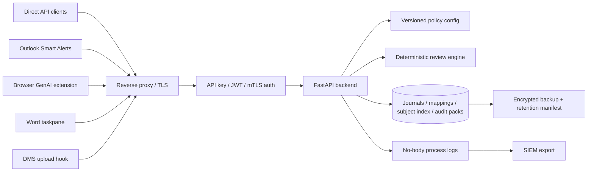

# Deployment Hardening

This guide covers the controls expected around a production Junas deployment. It
does not replace a formal SOC 2 / ISO 27001 control set; it gives operators concrete
defaults for filesystem protection, transport hardening, secrets handling, and SIEM
export.

## Backend-First Reference Architecture

Junas production deployments should put the FastAPI backend at the policy, audit, and
trust boundary. Direct API clients and optional adapters activate workflows, but they do
not own final policy decisions or audit evidence.



Reference layers:

| Layer | Production requirement |
|---|---|
| Reverse proxy/TLS | Terminate TLS at Nginx, Envoy, ingress, or equivalent; disable request-body logs on Junas routes. |
| Auth | Enable `JUNAS_API_KEY` for simple deployments or tenant auth with API-key registry/JWT/mTLS context for multi-tenant deployments. |
| Policy config | Load a versioned TOML policy profile and tenant overrides before serving traffic; fail startup on invalid production policy. |
| Logs | Emit request id, route, status, latency, policy id/version, and counts only; never log raw document text, matched spans, mappings, or auth headers. |
| SIEM | Enable privacy-safe JSON-over-syslog events only after the downstream index retention and access policy are configured. |
| Persistence | Put `JUNAS_JOURNAL_DIR`, mapping store files, subject index, audit packs, and matter/session sidecars on a service-owned encrypted volume. |
| Backup | Back up persistent state with customer-held keys, retention manifest coverage, restore testing, and subject-erasure tombstone handling. |
| Optional adapters | Deploy Outlook, browser, Word, DMS, desktop, or direct API surfaces separately; an adapter outage must follow its documented failure policy. |

Do not start with every adapter. Production pilots should run direct API plus one supported workflow adapter, then add more surfaces only after auth, policy, telemetry, retention, and failure behavior have been verified for the current surface.

## Deployment Mode Comparison

| Mode | Primary use | Backend boundary | Persistence and secrets | Adapter posture | Main cautions |
|---|---|---|---|---|---|
| Hosted server | Central Junas service for multiple teams or tenants. | FastAPI behind reverse proxy/TLS, tenant auth, versioned policy config, no-body logs, SIEM export. | Service-owned encrypted volume; customer-held `JUNAS_JOURNAL_KEY`, `JUNAS_MAPPING_STORE_KEY`, and `JUNAS_SUBJECT_INDEX_KEY` where customer policy requires it; retention manifest covers journals, mappings, SIEM, and backups. | Direct API plus one supported workflow adapter first; Outlook, browser, DMS, and Word point at the hosted endpoint. | Requires tenant isolation, external auth, SIEM retention, backup/restore, and raw-text egress review before production. |
| Customer-managed Docker | Customer runs the backend in its own VM, container host, or orchestrator. | Docker or Kubernetes service behind customer reverse proxy/TLS; customer auth and network controls wrap the API. | Customer-managed volumes, secrets manager, KMS, retention manifest, backup, and restore test. | Adapters route to the customer endpoint; local daemon is optional only for offline fallback. | Operator owns patching, image provenance, volume encryption, body-log suppression, and policy rollout. |
| Offline local daemon | Single-user or small-team local review without a hosted backend. | `junas-local` listens on loopback with local pairing token; no shared tenant control plane. | FileVault/BitLocker/LUKS plus local mapping/journal keys; LaunchAgent is optional and admin-controlled. | Browser, Word, Outlook taskpane, and desktop watcher may point at `http://127.0.0.1:8765`; enterprise enforcement claims do not apply. | No central SIEM, fleet policy, cross-device audit, or guaranteed adapter coverage; use for offline fallback, demos, and power users. |
| Hybrid local-plus-server | Managed pilots needing server audit/policy plus offline local fallback for selected workflows. | Server remains the policy/audit source for managed workflows; local daemon handles explicitly scoped offline review. | Server state follows hosted/customer-managed controls; local state has separate local keys, retention, and uninstall path. | Adapters must declare whether each request uses hosted server or local daemon and must not mix approval state across them. | Define conflict rules, retry behavior, and audit export boundaries before rollout; changed content or context requires a fresh `/review`. |

Use `docs/install.md` for install commands. Use this table for deployment selection and control ownership.

## Filesystem Boundaries

Run Junas as a dedicated service account and keep runtime state out of user-writable
directories.

```sh
sudo install -d -o junas -g junas -m 0700 /var/lib/junas
sudo install -d -o junas -g junas -m 0700 /var/lib/junas/journal
sudo install -d -o junas -g junas -m 0750 /etc/junas
```

Recommended ownership:

| Path | Owner | Mode | Contents |
|---|---|---:|---|
| `/etc/junas/config.toml` | `root:junas` | `0640` | Runtime config without raw secrets |
| `/var/lib/junas/journal` | `junas:junas` | `0700` | HMAC journal, mapping store, audit packs |
| `/var/log/junas` | `junas:adm` | `0750` | Process logs when not shipping directly |

When `JUNAS_TENANCY_ENABLED=1`, Junas partitions journals, mappings, and defined-term
session sidecars under `${JUNAS_JOURNAL_DIR}/tenants/{tenant_id}/`. Tenant IDs are
derived from configured API-key credentials or validated JWT claims, never from
caller-supplied tenant headers. Keep the base journal directory private to the Junas
service account.

## At-Rest Encryption

Use host or volume encryption even when `JUNAS_MAPPING_STORE_KEY` is enabled. The
mapping key protects mapping files; it does not encrypt the HMAC journal, process logs,
or audit-pack exports.

- macOS: FileVault for desktop deployments.
- Linux VM / bare metal: LUKS-backed volume for `/var/lib/junas`.
- Windows: BitLocker on the service volume.
- Cloud: encrypted block volumes with customer-managed KMS keys where available.

Set `JUNAS_MAPPING_STORE_KEY` from a secret manager for persisted mapping
confidentiality. See `docs/mapping-store-hardening.md` for key generation and purge
commands.

## Reverse Proxy

Terminate public TLS at a reverse proxy and keep the app bound to loopback or a private
pod/service network.

Minimal Nginx shape:

```nginx
server {
    listen 443 ssl http2;
    server_name junas.internal.example;

    ssl_certificate     /etc/nginx/certs/junas.crt;
    ssl_certificate_key /etc/nginx/certs/junas.key;

    location / {
        proxy_pass http://127.0.0.1:8000;
        proxy_set_header Host $host;
        proxy_set_header X-Forwarded-Proto https;
        proxy_set_header X-Request-ID $request_id;
    }
}
```

For mTLS, require a client CA at the proxy layer:

```nginx
ssl_client_certificate /etc/nginx/certs/client-ca.crt;
ssl_verify_client on;
proxy_set_header X-Client-Cert-Subject $ssl_client_s_dn;
```

Minimal Envoy listener shape:

```yaml
filter_chains:
  - transport_socket:
      name: envoy.transport_sockets.tls
      typed_config:
        "@type": type.googleapis.com/envoy.extensions.transport_sockets.tls.v3.DownstreamTlsContext
        common_tls_context:
          tls_certificates:
            - certificate_chain: { filename: /etc/envoy/certs/junas.crt }
              private_key: { filename: /etc/envoy/certs/junas.key }
          validation_context:
            trusted_ca: { filename: /etc/envoy/certs/client-ca.crt }
    filters:
      - name: envoy.filters.network.http_connection_manager
```

Keep `JUNAS_API_KEY` enabled behind the proxy unless an upstream identity layer already
performs authenticated, authorized routing.

## Secrets

Keep these values out of checked-in config and shell history:

| Secret | Purpose |
|---|---|
| `JUNAS_API_KEY` | API access gate for local/server endpoints |
| `JUNAS_JOURNAL_KEY` or `JUNAS_JOURNAL_KEYS_FILE` | HMAC journal sealing when supplied |
| `JUNAS_MAPPING_STORE_KEY` | Fernet encryption for persisted mappings when supplied |
| `JUNAS_SUBJECT_INDEX_KEY` | HMAC key for subject-erasure reverse-index lookups |
| `JUNAS_EXA_API_KEY`, `JUNAS_TINYFISH_API_KEY`, `JUNAS_LLM_API_KEY` | External providers |

Recommended sources:

- AWS Secrets Manager or SSM Parameter Store with instance/pod IAM.
- HashiCorp Vault with short-lived leases.
- Kubernetes Secrets encrypted at rest with KMS and mounted as files or environment
  variables.
- macOS Keychain for desktop SKU operators.

## Kubernetes Baseline

Use read-only images and writable volumes only where Junas must persist state.

```yaml
securityContext:
  runAsNonRoot: true
  runAsUser: 10001
  allowPrivilegeEscalation: false
  readOnlyRootFilesystem: true
volumes:
  - name: journal
    persistentVolumeClaim:
      claimName: junas-journal
containers:
  - name: junas
    image: ghcr.io/example/junas:latest
    ports:
      - containerPort: 8000
    volumeMounts:
      - name: journal
        mountPath: /var/lib/junas/journal
    env:
      - name: JUNAS_JOURNAL_DIR
        value: /var/lib/junas/journal
```

Add network policies so only the ingress/proxy namespace can reach the Junas service.
If public evidence or remote LLM providers are disabled, block outbound internet egress.

## Tenant Auth And RBAC

Legacy single-tenant deployments can keep using `JUNAS_API_KEY`. Multi-tenant server
deployments should enable tenancy and choose API-key registry mode, JWT mode, or both:

```sh
export JUNAS_TENANCY_ENABLED=1
export JUNAS_TENANCY_AUTH_MODES=api_key,jwt
export JUNAS_TENANT_CREDENTIALS_JSON='{"tenant-a-key":{"tenant_id":"tenant-a","subject":"svc-a","roles":["reviewer","maker","auditor"]}}'
export JUNAS_JWT_JWKS_URL=https://idp.example/.well-known/jwks.json
export JUNAS_JWT_ISSUER=https://idp.example/
export JUNAS_JWT_AUDIENCE=junas-api
```

Supported roles are `reviewer`, `maker`, `checker`, `admin`, and `auditor`. Review,
pseudonymize, anonymize, redact, reidentify, and scrub routes accept `reviewer|maker|checker|admin`; decision
recording requires `maker|checker|admin`; review-session reads require
`auditor|checker|admin`.

Decision attribution is bound to the authenticated principal: JWT deployments record the
token subject, API-key deployments record the configured credential subject, and
`X-Reviewer-ID` is accepted only for local development with `JUNAS_DEV_AUTH=1`.

## Subject Erasure Runbook

Subject erasure uses the HMAC reverse index under
`${JUNAS_JOURNAL_DIR}/subject_index/` or the tenant-scoped equivalent. The index stores
only HMACs and persisted reference metadata; it does not store raw PII. Operators must
set the same `JUNAS_SUBJECT_INDEX_KEY` used when the data was indexed.
See `docs/security/subject-erasure.md` for the artifact disposition table.

Before handling a request, rebuild the index if the deployment predates subject-index
enforcement or if mappings/journals were restored from backup:

```sh
export JUNAS_JOURNAL_DIR=/var/lib/junas/journal
export JUNAS_JOURNAL_KEY=...
export JUNAS_SUBJECT_INDEX_KEY=...

uv run python scripts/erase_subject.py --tenant tenant-a --backfill --json
```

Use dry-run first and attach the ticket, DSAR, or legal citation to the real erase:

```sh
uv run python scripts/erase_subject.py \
  --tenant tenant-a \
  --value "jane@example.com" \
  --dry-run \
  --json

uv run python scripts/erase_subject.py \
  --tenant tenant-a \
  --value "jane@example.com" \
  --citation "DSR-2026-05-28-001" \
  --json
```

Verify the result by repeating the dry-run and checking journal integrity:

```sh
uv run python scripts/erase_subject.py --tenant tenant-a --value "jane@example.com" --dry-run --json
uv run python scripts/verify_journal.py --tenant tenant-a
```

This is not universal deletion. Reversible mapping files are deleted, and prior review
journal references receive `subject_erasure_recorded` tombstones. The journal HMAC
chain is tamper-evident when an external journal key is supplied, but Junas does not
provide OS-level append-only storage. Application logs, SIEM exports, backups, cold
archives, and records created before the subject index existed remain governed by the
customer's retention and legal-hold policy.
The operator must separately expire or tombstone those systems according to policy.

## Retention Manifest

Production strict preflight checks for an operator-maintained retention manifest. The
manifest records whether artifact-specific retention controls are configured; it does
not perform deletion by itself. See `docs/security/data-retention.md` for the full
matrix.

Point Junas at the manifest with `JUNAS_RETENTION_MANIFEST`, or keep
`retention_manifest.json` at the repository/deployment root:

```json
{
  "schema_version": "junas.retention_manifest.v1",
  "controls": {
    "journal": { "retention_days": 2555 },
    "mapping_store": { "delete_after_days": 90 },
    "subject_index": { "delete_after_days": 90 },
    "review_sessions": { "retention_days": 2555 },
    "matter_terms": { "policy": "matter-lifecycle-retention" },
    "adapter_telemetry": { "retention_days": 90 },
    "siem": { "external_policy_ref": "splunk-index-retention" },
    "audit_packs": { "retention_days": 2555 },
    "fixtures": { "policy": "synthetic-fixtures-only" },
    "reports": { "retention_days": 90 },
    "logs": { "policy": "log-platform-policy-123" },
    "backups": { "retain_for_days": 365 }
  }
}
```

Required controls are listed in `docs/security/data-retention.md`.
Each control is configured when it has one of:

| Evidence key | Use |
|---|---|
| `retention_days` | Local or platform retention window in days |
| `delete_after_days` | Deletion window in days |
| `retain_for_days` | Backup/archive retention window in days |
| `policy` | Internal policy identifier or runbook reference |
| `external_policy_ref` | External system policy, such as SIEM index retention |

Set `"configured": false` or `"enabled": false` only to make production preflight fail
intentionally until that control is fixed. `indefinite` and `permanent` are accepted
retention-window values, but should be reserved for legal-hold or immutable-audit systems
with a separately documented erasure/tombstone process.

Validate it before production deploys:

```sh
uv run python scripts/check_retention_manifest.py --manifest /etc/junas/retention_manifest.json --strict
uv run python scripts/check_retention_manifest.py --manifest /etc/junas/retention_manifest.json --json
JUNAS_RETENTION_MANIFEST=/etc/junas/retention_manifest.json uv run python scripts/preflight.py --deployment production --strict
```

## Document Ingest And Metadata

PDF review fails open by default when the extracted text layer is missing, too sparse,
or image-only. Set `JUNAS_DOCUMENT_FAIL_CLOSED=1` or `document_ingest.fail_closed=true`
to reject these payloads instead of returning degraded best-effort responses.

`/review`, `/pseudonymize`, `/anonymize`, and `/redact` report DOCX/PDF/image container metadata under
`document.metadata_findings`. `/documents/scrub` removes supported DOCX properties,
comments, track-change author/date attributes, PDF info metadata, and JPEG/PNG EXIF where
the installed dependencies support that file type.

## SIEM Export

Junas can emit JSON-over-syslog events for security and audit correlation. It is off by
default.

```toml
[siem]
enabled = true
sink = "syslog"
syslog_address = "udp://127.0.0.1:5514"
facility = "local4"
app_name = "junas"
```

Equivalent environment variables:

```sh
export JUNAS_SIEM_ENABLED=1
export JUNAS_SIEM_SINK=syslog
export JUNAS_SIEM_SYSLOG_ADDRESS=udp://127.0.0.1:5514
export JUNAS_SIEM_FACILITY=local4
export JUNAS_SIEM_APP_NAME=junas
```

Emitted events use `schema_version="junas.siem.v1"` and include:

| Event type | Source |
|---|---|
| `privacy_ledger` | External retrieval and LLM adjudication privacy decisions |
| `journal_event` | HMAC-sealed journal appends, summarized by payload hash |
| `security_event` | API-key denials, HTTP errors, mapping-store persistence/decrypt failures |

SIEM payloads do not include raw document text, matched finding text, mapping originals,
public-evidence query strings, reviewer rationales, or API secrets. Sensitive fields are
hashed or summarized with counts.
