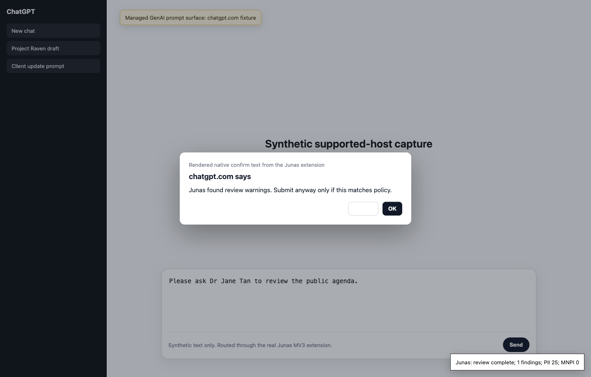
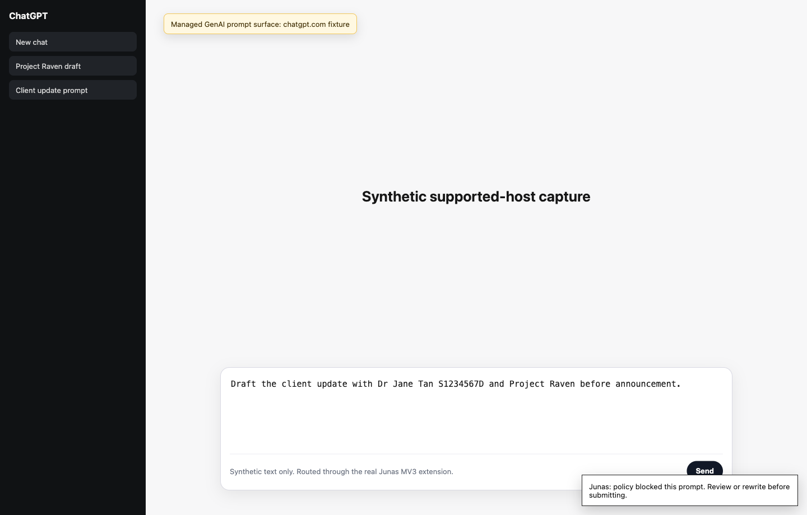

# GenAI Browser Capture

Source: `integrations/browser_extension/`

Maturity: `supported-target`

The browser adapter is a managed Chromium MV3 extension for selected GenAI web surfaces. It is not universal browser DLP and must not promise coverage when a target app changes DOM structure, editor behavior, CSP, extension permissions, or submit flow.

## Current Target Hosts

The current manifest injects the content script on:

- `https://chatgpt.com/*`
- `https://claude.ai/*`
- `https://gemini.google.com/*`

These host matches only mean the script is present on those origins. They do not guarantee that every prompt box, compose surface, upload widget, or future UI variant is captured.

## Capture Paths

- Context menu: user selects text and chooses "Review selection with Junas".
- Opt-in paste interception: when enabled in extension settings, pasted plain text in editable elements is reviewed or rewritten.
- Generic editable fallback: `textarea`, text-like `input`, and `contenteditable` elements are treated as editable targets.

The adapter does not capture keystrokes continuously, does not scrape full pages, and does not persist prompt text in extension storage.

## Visual Capture

These screenshots were captured against a synthetic `chatgpt.com` fixture routed through Playwright while loading the real MV3 extension from `integrations/browser_extension/` and a deterministic local backend. They are illustrative; coverage still depends on third-party DOM stability, target editor behavior, CSP, extension permissions, and submit flow.

| Warn-confirm flow | Policy-blocked panel |
|---|---|
|  |  |

The warn-confirm screenshot renders the native confirm text in-page so the artifact remains reproducible and does not capture the operator desktop. The policy-block screenshot shows the real fixed bottom-right `#junas-review-result` panel emitted by `content.js`.

## Target Assumptions

| Target | Assumption | Known limitation |
|---|---|---|
| ChatGPT | Text entry occurs in an editable browser element on `chatgpt.com`. | UI/editor changes can bypass generic editable detection or insertion. |
| Claude | Prompt entry exposes selected text or paste events to the extension on `claude.ai`. | File uploads, artifacts, and non-text editor state are not covered by the generic path. |
| Gemini | Prompt entry exposes selected text or paste events to the extension on `gemini.google.com`. | Multimodal upload surfaces and generated-content actions are outside current capture. |
| Generic textarea | Text is pasted into `textarea`, text-like `input`, or `contenteditable`. | Shadow DOM, canvas editors, isolated frames, and custom editors may not be visible. |

## Backend Contract

The service worker calls the configured endpoint with `review`, `pseudonymize`, `anonymize`, or `redact`. The default endpoint is `http://127.0.0.1:8765`; production pilots should use enterprise extension policy and backend/local-token auth appropriate to the deployment.

For managed GenAI review, callers should use `surface="browser_genai"` and `workflow="prompt_submit"` when the adapter has enough context to submit those fields. The current local extension keeps a minimal strict review payload and should be treated as a pilot surface until target-specific submit interception and selector tests exist.

Sequence diagram: `docs/integrations/sequence-diagrams.md#browser-genai-prompt-review-and-safe-rewrite`.

## Local Launch And Packaging

Start the backend or packaged local daemon separately, then load or package the extension:

```sh
./scripts/launch/run_backend_only.sh
./scripts/package_browser_extension.sh
```

For manual browser testing, load `integrations/browser_extension/` as an unpacked MV3 extension in a managed test profile. The backend launcher does not start Chrome or install the extension.

Managed Chrome/Edge rollout uses `docs/integrations/browser-enterprise-deployment.md`.

## Failure Behavior

- Backend error or timeout: show a visible Junas error panel; do not silently replace text.
- Rewrite failure: restore the original pasted text.
- Degraded review: display degraded coverage and `send_allowed` status from the response.
- Target DOM mismatch after submit detection: show a selector-unavailable panel and do not block submit because no backend policy was evaluated.
- Unrecognized submit controls: fail as no capture rather than claiming enforcement; the extension cannot block a submit path it did not detect.

## Telemetry Events

`content.js` emits sanitized browser adapter telemetry to an optional
`globalThis.junasTelemetrySink(event)` hook and a `junas:telemetry` DOM event when the
runtime supports it. There is no backend telemetry transport endpoint in this repo yet.

Event schema: `junas.browser.telemetry.v1`.

| Event | When emitted |
|---|---|
| `browser_prompt_review_started` | A paste or submit review request is about to call the backend. |
| `browser_policy_decision_received` | The backend returns a parseable review/policy response. |
| `browser_user_canceled` | The user declines a warn-confirm prompt. |
| `browser_user_rewrote` | The extension applies a replacement returned by a rewrite/redaction operation. |
| `browser_user_proceeded_after_warning` | The user accepts a warn-confirm prompt. |
| `browser_selector_failure` | A prompt or submit selector required for submit review is missing. |
| `browser_backend_timeout` | The service worker reports `backend_timeout`. |

Telemetry may include operation, decision, send flag, review/request ids, policy
id/version, finding count, degraded count, action names, selector kind, and timeout.
Telemetry must not include raw prompt text, rewritten text, matched spans, auth tokens,
endpoint URLs, policy reasons, or page text.

## QA Requirements Before Expanding Claims

- Selector or event tests per target surface: ChatGPT, Claude, Gemini, and generic textarea.
- Playwright smoke test against local fixture DOM changes: `test/test_browser_extension_playwright.py`.
- Manual Chrome/Edge matrix for managed install, local-token auth, context menu, paste review, and rewrite flows.
- No raw prompt text in extension storage, console logs, or telemetry.
- Explicit docs for unsupported target UI changes and degraded behavior.

## References

- [`docs/integrations/browser-extension.md`](./browser-extension.md)
- [`docs/integrations/browser-enterprise-deployment.md`](./browser-enterprise-deployment.md)
- [`docs/policy/decision-contract.md`](../policy/decision-contract.md)
- [`docs/api/idempotency.md`](../api/idempotency.md)
