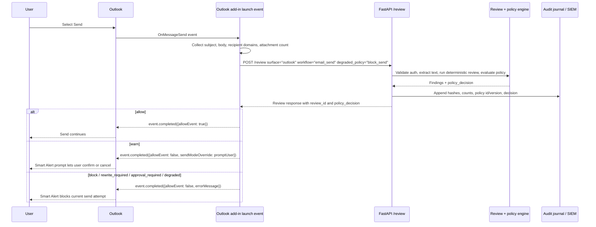

# Integration Sequence Diagrams

These diagrams show adapter control flow at the backend contract boundary. They are operational flow docs, not a claim that adapters cover every vendor client or UI variant.

## Outlook Smart Alerts Send Review

Outlook Smart Alerts calls `/review` from the `OnMessageSend` launch event, receives a backend policy decision, then completes the send event according to the decision and Outlook send-mode support.

The add-in sends message text only inside the `/review` request. Journal and SIEM records must contain hashes, counts, policy metadata, and decision metadata only; no message body, subject, recipient address, attachment name, or matched text belongs in those records.
