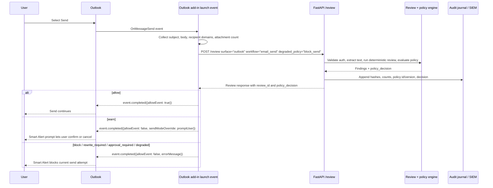

# Integration Sequence Diagrams

These diagrams show adapter control flow at the backend contract boundary. They are operational flow docs, not a claim that adapters cover every vendor client or UI variant.

## Outlook Smart Alerts Send Review

Outlook Smart Alerts calls `/review` from the `OnMessageSend` launch event, receives a backend policy decision, then completes the send event according to the decision and Outlook send-mode support.



The add-in sends message text only inside the `/review` request. Journal and SIEM records must contain hashes, counts, policy metadata, and decision metadata only; no message body, subject, recipient address, attachment name, or matched text belongs in those records.

## Browser GenAI Prompt Review And Safe Rewrite

This is the target sequence for a managed browser adapter when submit interception and safe rewrite are enabled. If the content script cannot resolve the prompt composer and submit control, this sequence does not run and the adapter must not silently block submit because no policy decision was evaluated.

```mermaid
sequenceDiagram
    participant User
    participant Page as GenAI page
    participant Content as Content script
    participant Worker as MV3 service worker
    participant Review as FastAPI /review
    participant Rewrite as FastAPI /safe-rewrite

    User->>Page: Click submit or press Enter
    Content->>Content: Resolve prompt composer and submit control
    Content->>Worker: Review prompt text
    Worker->>Review: POST /review surface="browser_genai" workflow="prompt_submit"
    Review-->>Worker: review_id, findings, policy_decision, action_catalog
    Worker-->>Content: Policy result
    alt allow
        Content->>Page: Let submit continue
    else warn
        Content->>User: Prompt user to proceed or cancel
        User-->>Content: Confirm proceed
        Content->>Page: Submit only after confirmation
    else rewrite_required and safe_rewrite offered
        Content->>User: Offer safe rewrite or cancel
        User-->>Content: Choose safe rewrite
        Content->>Worker: Request safe_rewrite for allowed finding ids
        Worker->>Rewrite: POST /safe-rewrite surface="browser_genai" workflow="prompt_submit"
        Rewrite-->>Worker: rewritten_text, replacements, skipped_findings
        Worker-->>Content: Safe rewrite result
        Content->>Page: Replace composer text with rewritten_text
        Content->>User: Show rewrite applied; user may review and submit
    else block / degraded / backend failure
        Content->>User: Show policy block or review unavailable message
        Content-->>Page: Do not trigger submit
    end
```

The browser adapter may hold prompt text in memory long enough to review or rewrite it. It must not save prompt text, rewritten text, matched spans, auth tokens, or endpoint secrets in extension storage or console logs.
